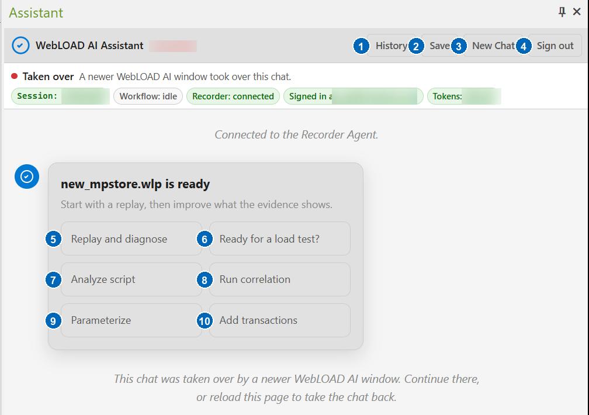
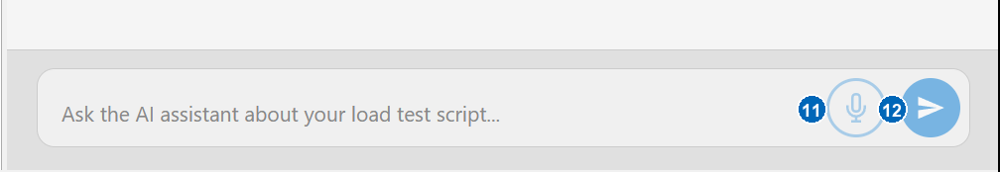

# Getting Started

## Prerequisites

Before you begin, make sure that:

- WebLOAD 14.0 or later is installed, including the WebLOAD Recorder.
- The **WebLOAD AI Recorder Agent** is installed on the same machine. The
  agent is delivered as its own installer (`WebLOAD-AI-Setup-<version>.exe`)
  and runs as a Windows service in the background. Run the installer as an
  administrator.
- Your organization has purchased a WebLOAD AI Assistant package. The AI
  Assistant is a paid add-on, licensed separately from WebLOAD — see
  [Introduction](introduction.md).
- You have a WebLOAD AI account — an email and password provided by your
  administrator from your organization's purchased seats — and the machine
  has internet access.

## Opening the chat

Open the WebLOAD Recorder. The assistant lives in the **AI Assistant**
docking pane inside the Recorder window. If the pane is not visible, enable
it from the Recorder's **View** menu.

## Main window controls

The buttons in the Assistant pane change with the active script and workflow.
The example below shows the actions offered when a recorded script is open.
Account-specific values in the status row have been obscured.

1. **History** — opens the local revision history for the active script. You
  can compare revisions, rename a revision label, or restore an earlier
  revision after confirmation.
2. **Save** — downloads troubleshooting information; it is not the command for
  saving the Recorder project. The preferred download is a diagnostic package
  containing the chat transcript, logs, current script, pending changes,
  replay information, and environment details. If that package cannot be
  created, the assistant downloads the chat transcript instead. An empty chat
  has nothing to save. Share either download only through approved support or
  QA channels.
3. **New Chat** — starts a fresh conversation and requests removal of the
  previous chat's local script history.
4. **Sign out** — signs out of WebLOAD AI and clears the saved cloud session
  and tokens from the local Recorder Agent.
5. **Replay and diagnose** — runs the current script, collects replay evidence,
  and explains the first failure. A proposed repair still requires approval.
6. **Ready for a load test?** — performs a read-only readiness assessment and
  lists verified strengths, missing evidence, and recommended next steps.
7. **Analyze script** — summarizes the current script's requests, flow, and
  relevant structure without changing it.
8. **Run correlation** — searches recorded evidence for dynamic values and
  proposes supported correlation rules for review.
9. **Parameterize** — audits hardcoded and repeated values. When suitable
  changes are needed, it may propose parameters and data sources.
10. **Add transactions** — audits the current transaction boundaries and
  reports missing or misplaced coverage. Ask it to apply a specific
  recommendation to receive a proposal for review.

The status chips above the conversation are indicators, not buttons. They show
the current chat session, active workflow, Recorder connection, signed-in user,
and available token balance. **Taken over** means that a newer Assistant window
now owns the chat. Continue in that window, or reload the older pane to take the
chat back.

The **Pin** icon in the pane's top-right corner controls whether the Recorder
keeps the pane docked or allows it to auto-hide. The **X** closes the pane; open
it again from the Recorder's **View** menu.

11. **Microphone** — starts voice input when speech recognition is available.
12. **Send** — sends the typed request. While the assistant is working, this
   button becomes **Stop**, which requests cancellation of the current work.

## Signing in

Click **Sign in** in the chat panel and enter your WebLOAD AI credentials.
Sign-in is per user: use your own account rather than a shared one, so that
sessions and usage are attributed correctly.

If your administrator gave you a temporary password, the sign-in panel asks
you to choose a new password before continuing. If you cannot remember your
password, click **Forgot Password?**. Use the link in the recovery email or
enter the one-time code manually. Contact your administrator if no recovery
message arrives.

Click **Sign out** in the header to clear the saved WebLOAD AI session and
tokens from the local Recorder Agent.

Once signed in, the status chips at the top of the panel show your session,
the Recorder connection, the cloud connection, and your organization's token
balance.

## Your first conversation

Type what you want in plain language. Good first prompts:

- *Record a new script* — the assistant asks for the URL and starts a
  recording session in a capture browser. Walk through your business flow,
  then tell the assistant to stop recording (or press Stop in the Recorder).
- *Open an existing script* — open a `.wlp` project and work on it.
- *Analyze the current script* — get a summary of what the script does.
- *Is the script ready for a load test?* — get a readiness assessment with
  concrete next steps.

The assistant also offers quick-start buttons that match your current state —
for example **Record a new script** when no script is open, or **Replay and
diagnose** when one is.

While the assistant is working, the **Send** button becomes **Stop**. Click it
to request cancellation of the current operation. Queued work is removed, but
an approved change that is already being applied may finish so the Recorder is
not left partially updated. Stopping does not undo an applied change.

## How changes are applied

When you ask for a change — correlation, parameterization, validations,
transactions, or a script edit — the assistant first shows a **proposal
card** describing exactly what it wants to change. Nothing is written to
your script until you click **Approve**. Click **Reject** to discard the
proposal.

You can undo an applied change by typing *undo* (and restore it with
*redo*). Undo history is kept for the current agent session.

For a saved project, click **History** to inspect the local revision history,
view changes side by side, rename a revision label, or restore an earlier
revision after confirmation. This history is stored only on the Recorder
machine and is scoped to the current chat. Starting a new chat requests removal
of the previous chat's local history. If the cleanup cannot be completed, the
assistant warns you that old local history remains.

## The script panel

When a script is loaded, the script panel on the right side of the chat
shows its current content. From the panel you can copy the script to the
Recorder or download it as JavaScript or as a `.wlp` project.
