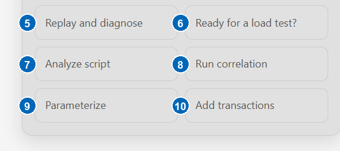

# Checking Script Readiness

Before a script goes into a load test, it should replay cleanly, handle
dynamic values, vary its data, validate its responses, and report per-step
timings. The readiness check reviews all of that in one question.

Ask:

- *Is the script ready for a load test?*
- *What is missing in this script?*
- *Review this script*
- *What should be improved before I use this script?*

When a script is open, the same assessment is available from the
**Ready for a load test?** quick action:

The assistant inspects the script and the last replay and reports:

- what the script already covers — recorded flow, transactions,
  validations, parameters, correlation;
- what is missing or weak — for example, no validations, hardcoded
  credentials, or an uncorrelated session value;
- the recommended next steps, in order.

A readiness result is evidence-based. If no replay evidence is available, the
assistant distinguishes what it can verify from the script structure from
what still needs a replay. A structural review alone is not proof that the
script runs successfully.

## Interpreting the result

| Overall status | Meaning |
| --- | --- |
| **Ready** | The inspected areas pass and sufficient execution evidence supports the conclusion. |
| **Ready with minor improvements** | No load-test blocker was found, but small maintainability or measurement improvements remain. |
| **Not ready** | At least one important or critical gap must be addressed before a load test. |
| **Cannot determine fully** | The available script or replay evidence is incomplete, so readiness cannot be proven yet. |

The evidence basis explains how strong the result is:

- **Static only** — based on script structure; replay behavior is still unknown.
- **Execution evidence** — based on a replay and its diagnostics.
- **Mixed** — combines the current script with available replay evidence.

Findings are ordered by impact. **Critical** findings block readiness;
**important** findings materially affect correctness or measurement; **minor**
findings improve quality without blocking a run; and **informational** findings
provide context. An area marked **unknown** needs more evidence rather than an
assumed pass or failure.

The readiness check is an assessment — it does not change the script. When
it recommends an improvement, ask for it explicitly (for example, *run
correlation* or *parameterize the login fields*) and the assistant starts
the matching workflow with a proposal for your approval.

## Read-only questions

The same workflow answers any inspection question, at any time:

- *Which script is open?*
- *List the transactions, validations, and parameters*
- *What URLs were recorded?*
- *Show the recorder options*
- *Did the last replay pass?*

Read-only questions never record, replay, or modify anything.
