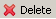

# Working with Portfolios

WebLOAD Analytics enables you to create a portfolio of templates that you can open in a single action. Use portfolios to group together commonly used templates to speed up your work.  

> **Note:** Generating, printing, and publishing individual charts within a portfolio or entire portfolios is identical to generating, printing, and publishing charts. For more information, see[` `*Generating Charts* ](#_page20_x54.00_y155.04)on page[ 21.](#_page20_x54.00_y155.04) 

## Creating a Portfolio

When you create a new portfolio, you assign the templates you wish to include by dragging them into your portfolio in the Templates Gallery tree. The assigned templates appear as links within the portfolio. 

> **Note:** If a template is deleted from the Templates Gallery and the portfolio links associated with it are not deleted, unresolved template links appear in the tree marked with a red x. When publishing the portfolio, templates with unresolved links are not published. 

**To create a portfolio:** 

1. In the Navigation area, click the **Gallery** tab. The Templates Gallery opens [(Figure 9)](#_page27_x54.00_y564.04). 

1. In the Templates Gallery Right-click in the Templates Gallery and select **New Portfolio**.  

   The New Portfolio window opens. 

   

   

1. Enter a name for the portfolio and click **OK**. The new portfolio appears under the Portfolios folder in the Templates Gallery tree. 

1. In the Templates Galley, drag-and-drop the templates you want to include in your portfolio. 

1. Your portfolio is created. 

   

> **Note:** To remove a template from your portfolio, select the template link from the  Templates Gallery tree and click . Removing a template link from your portfolio does not delete it from the Templates Gallery. 

## Opening a Portfolio

**To open a portfolio:** 

1. In the Templates Gallery, open the Portfolios node. 
1. Double-click the portfolio you wish to open.  

   The charts created by the portfolio open in the Charts area [(Figure 32)](#_page65_x54.00_y451.04). 

> **Note:** Any charts that were already open in the Charts area remain open. 

You can now generate, print, or publish a report based on the open charts. For more information, see 

- [*Creating New Reports* ](#_page44_x54.00_y329.04)on page[ 45.](#_page44_x54.00_y329.04) 
- [*Printing a Report* ](#_page46_x54.00_y78.04)on page[ 47.](#_page46_x54.00_y78.04) 
- [*Publishing Reports* ](#_page46_x54.00_y243.04)on page[ 47.](#_page46_x54.00_y243.04) 

**To rename a portfolio:**  

1. In the Navigation area, click the **Gallery** tab. The Templates Gallery opens [(Figure 9)](#_page27_x54.00_y564.04). 
1. Right-click a portfolio and select **Rename**. The Rename window appears. Enter the new portfolio name and click **OK**. The portfolio is renamed.

