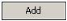
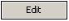
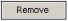

# Changing Chart Settings

The Settings tab of a chart enables you to modify the chart by changing various chart settings. 

- You can filter your Load Session data results in various ways. You can filter the results displayed in your chart by selecting specific scripts or measurements within your Load Session, by applying time or statistics-based time filters. For example, you can focus your chart on a specific script or time segment within the Load Session data and/or specify a threshold for one or more of the statistics used in the selected Load Session (such as Hits per second > 50). This enables you to produce charts that contain only the information you wish to present. 
- You can also modify various chart parameters such as the time format, tolerance range, etc. 

After you modify a chart’s settings, click  or  to regenerate the chart. 

**To change the settings of a chart:** 

1. Select the chart in the Charts area. 
1. Click the **Settings** tab located above the chart. 

   The Settings tab appears in the Charts area. 
   
   

3. In the **Name** field, optionally edit the name of the chart. 
3. Optionally specify a different Load Session by clicking Open. The Select Sessions window appears. See[*Specifying a Load Session* ](generating_charts.md#specifying-a-load-session) for instructions. 
3. Optionally specify scripts or measurements.  
   - For a static chart, specify scripts in the Script Selection section. See[*Selecting scripts – Static Chart* ](#selecting-scripts-for-static-chart). 
   - In an interactive chart, specify measurements in the Measurement Selection section. See[*Selecting Measurements – Interactive Chart* ](#selecting-measurements-for-interactive-chart).
4. Optionally set time filter settings. See[*Filtering by Time* ](#filtering-by-time). 
5. Optionally set statistics-based time filter settings. See[Filtering by Statistics-based time](#filtering-by-statistics-based-time).
6. Optionally change parameter settings. See[*Modifying Chart Parameters* ](#modifying-chart-parameters). 

## Selecting scripts for Static Chart

In a static chart, you can select specific scripts to include in your chart. The generated chart will include a separate graph and table for each script. By Default, charts are generated for all the scripts of a Load Session. 

**To select scripts:** 

1. Select the chart in the Charts area. 

2. Click the **Settings** tab of the chart.  

3. Click the **Script Selection** section. The Script Selection area appears. 

   

   

   > **Note:** If any changes are made to the script selection, an asterisk (\*) is displayed besides Script Selection in the section’s title. 

4. Select the scripts to include in your chart. **Total** is the script selected by default and indicates that the chart will be generated for all the Load Session’s scripts.  

The selected scripts are added to your chart settings. To regenerate the chart with the new settings, click .

## Selecting Measurements for Interactive Chart

In an interactive chart, you can select specific measurements from all or specific scripts. By default, charts are generated for all the measurements of a Load Session. 

**To select measurements:** 

1. Select the chart in the Charts area. 

2. Click the **Settings** tab of the chart.  

3. Click the **Measurement Selection** section. The Measurement Selection area appears.

   > **Note:** If any changes are made to the measurements selection, an asterisk (\*) is  displayed besides Measurement Selection in the section’s title. 

4. Select the measurements to include in your chart. **Total** is selected by default and indicates that the report will be generated for all the Load Session’s scripts.  
4. Select a value for the X-axis of the graph: 
- **Time** – Shows the selected measurements over time. In the Parameters section described in[Modifying Chart Parameters](#modifying-chart-parameters), you can edit the Time Format parameter and set it to one of the following values:  
  - **Relative seconds** – Shows the selected measurements over time. The time is displayed as the number of seconds that elapsed from the beginning of the test (20, 40, 60, 80, 120, etc.). 
  - **Relative time** – Shows the selected measurements over time. The time is displayed as the time that passed from the beginning of the test (00:20, 00:40, 01:00, 01:20, etc.). 
  - **Absolute time** – Shows the real time, starting from the time at the beginning of the test (17:31:40, 17:32:00, 17:32:20, …). 
- **Load Size** – Shows the change in selected measurements over the Load Size measurement. For example, if you select the 'Response Time’ measurement, then Response Time over Load Size shows the response times in different load sizes, regardless of when the measurement was received. 
- **Percentile** – Shows all the percentile values of the selected measurement(s). For example, the 90th percentile means that 90% of measurements are smaller than this value, and 10% are larger than this value. 
- **Summary** – Shows the sum (such as the average value) of the selected measurements.  
- **Other** – Shows the selected measurement(s) over any measurement of your choice. For example, 'Response Time over Content Size' shows the variations in the response time, based on the size of the response, regardless of time/load size. 

The selected measurements are added to your chart settings. To regenerate the chart with the new settings, click .

## Filtering by Time

Reports are generated for the entire Load Session by default. Use the Time Filter to remove the beginning or end of a Load Session or focus on a specific window of Load Session time. If the template you are using does not support this filter, the Time Filter section is disabled. 

**To change the Load Session time range:** 

1. Select the chart in the Charts area. 

2. Click the **Settings** tab of the chart.  

3. Click the **Time Filter** section. The Time Filter appears. 

4. 

   > **Notes:** 
   >
   > - If any changes are made to this filter, an asterisk (\*) is displayed besides Time  Filter in the section’s title.
   > - You can enable or disable the Time Filter by selecting or clearing the **Filter Enabled** checkbox. When this checkbox is cleared, “(Disabled)” is displayed in the Time Filter section. 

5. Use the slider to change the Load Session start and end times. The number of seconds and the actual dates and times are displayed as you move the slider. 

Only the Load Session data from the time specified is used to generate the report. 

**To clear the Time Filter:** 

- In the Time Filter area, click . The Time Filter defaults are restored in the From and To fields. By default, the entire duration of the Load Session is displayed. 

To regenerate the chart with the new settings, click . 

## Filtering by Statistics based Time

The statistics-based time filter enables you to specify a numeric filter for each of the statistics in the Load Session. This filter filters out segments of a chart based on their time. However, in contrast to the time filter, data is only filtered if it matches the specified condition. You can specify a numeric filter for multiple statistics and connect them using logical connectors, such as match all or any of the conditions. If the template you are using does not support this filter, the Statistics-based Time Filter section is disabled.  

> **Note:** The actual statistics are not filtered by this filter. For example, if your Load Session contains the following statistics and you filter by Load Size being greater than or equal to five, your chart will display the last three time segments only (from 40 to 80): 
>
> | Time | Load Size |
> | ---- | --------- |
> | 20   | 1         |
> | 40   | 5         |
> | 60   | 10        |
> | 80   | 15        |
>
> 

**Note:** For an explanation of the statistics and their meanings, see the *WebLOAD Console User Guide*. 

**To add a filter to a specific statistic:** 

1. Select the chart in the Charts area. 

2. Click the **Settings** tab of the chart. 

3. Click the **Statistics-based Time Filter** section. The Statistics-based Time Filter area appears. 

   

   > **Notes:** 
   >
   > - If any changes are made to this filter, an asterisk (*) is displayed beside Statistics-based Time Filter in the section’s title.
   > - You can enable or disable the Statistics-based Time Filter by selecting or clearing the **Filter Enabled** checkbox. When this checkbox is cleared, “(Disabled)” is displayed in the Time Filter section. 

4. Click . The Measurement Selection for Statistics-based Time Filter window appears. 

   

5. Select the measurement that you wish to filter from the top list. 

5. In the Operator column, select an operator from the drop-down list (`≤, <, =, >, or ≥`). 

5. Enter a value in the Value field. 

   **Note:** The range of values recorded during the selected Load Session for the selected  measurement is displayed in the Value range field.  

8. Click **OK**. The statistic is added to the Statistics-based Time Filter area. 
8. Repeat steps[ 5 ] through[ 8 ] for each statistic that you wish to add to the filter. 
8. If you added multiple statistics, select a connector (**Match all conditions** or **Match any of the conditions**) in the Statistics-based Time Filter area. 

> **Note:** The Match all conditions and Match any of the conditions connectors apply to all statistics. For example, defining multiple measurements connected by Match all conditions filters according to all the statistics.

**To edit the statistics listed in the Statistics-based Time Filter area:** 

1. In the Statistics-based Time Filter area, double-click a statistic. 

   -Or- 

   Select a statistic and click .  

   The Measurement Selection for Statistics-based Time Filter window appears. 

2. Edit the statistic as necessary and click **OK**. The statistic is updated. 

   

**To remove a statistic from the Statistics-based Time Filter area:** 

- In the Statistics-based Time Filter area, select a statistic and click . The statistic is removed from the Statistics-based Time Filter area. 

  

**To clear the Statistics-based Time Filter area of all statistics:** 

1. In the Statistics-based Time Filter area, click . A confirmation message appears. 
2. Click **Yes** to confirm. The Statistics-based Time Filter area is cleared of all entries. To regenerate the chart with the new settings, click .

## Modifying Chart Parameters

The Chart Master template is used together with the individual template to create a chart. The master templates contain global parameters that can be modified to change your chart’s appearance, such as whether to show tables and graphs, or show only graphs.  

Chart templates contain local parameters. You can change the values for these parameters in the Parameters section of the chart. This will only affect the current chart. The parameters that appear in the Parameters section can also be modified in the Preferences window, setting new default values for all templates using them. For a full list of parameters, see[Defining Your Parameter Preferences](defining_preferences.md#defining-your-parameter-preferences).

> **Note:** You can change the chart master template being used by specifying a different  chart master template in the Analytics tab of the Preferences window. See[Defining Your Analytics Preferences](defining_preferences.md#defining-your-analytics-preferences). 

**To modify your chart parameters:** 

1. Select the chart in the Charts area. 

2. Click the **Settings** tab of the chart.  

3. Click the **Parameters** section. A list of available parameters appears.  

   > **Note:** The values displayed for the available parameters are the global values defined in the Parameters tab of the Preferences window

   

   

   > **Note:** If any changes are made to any of the parameters, an asterisk (*) is displayed besides Parameters in the section’s title.

1. Select a parameter and click  to edit the parameters of your choice. Only parameters relevant to the selected template are displayed.  

To regenerate the chart using the modified parameters, click .

