# Generating Charts

WebLOAD Analytics enables you to quickly and easily generate your charts in various formats. Using WebLOAD Analytics, you can create and view charts that are tailor made for your needs. You can then publish the charts in various formats, or create a report compiled of various charts, and publish the report. 

## Creating New Charts

To create a new chart, double-click a template in the Gallery tab. The chart is displayed in the Preview tab for a static chart, or in the Chart View tab for an interactive chart. 

> **Note:** If you did not open WebLOAD Analytics from WebLOAD Console, the Select sessions dialog appears and you are prompted to specify a Load Session (see[*Specifying a Load Session* ](#specifying-a-load-session).

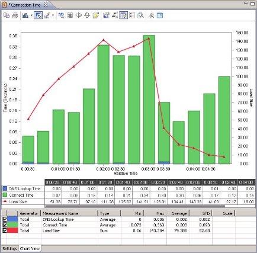

You can now: 

- Modify the chart by editing chart settings and then regenerating the chart (see [*Changing Chart Settings* ](changing_chart_settings.md)).  
- Print the chart (see [*Printing a Chart* ](#printing-a-chart)). 
- Publish the chart to various formats (see [*Publishing Charts* ](#publishing-charts)). 
- For an interactive chart, you can analyze the chart data in various ways (see [*Customizing Interactive Charts* ](#customizing-interactive-charts)).  
- Create a report that will include the chart, as well as other open charts of your choice (see [*Generating Reports* ](generating_reports.md)). 

### Specifying a Load Session

If you did not open WebLOAD Analytics from WebLOAD Console, the Select Session window appears the first time you double-click a template to create a chart. 

**To select a session:**  

1. Browse to the location of the Load Session file in the From File area, and click **Open**. 

      -Or- 

    Select the session in the From Repository area, and click **OK**.  

    > **Note:**  You can search for Load Sessions (see[Searching for Load Sessions](load_sessions.md#searching-for-load-sessions).

## Creating a Regression Chart

A regression chart compares one selected "Main" session to all additional sessions you specify. Regression charts are the only kind of chart that require you to specify multiple sessions for the generation of the chart. 

**To create a regression chart:** 

1. In the Templates Gallery, open the Session Comparison node located under the Templates node. 
1. Double-click a regression template. The Select Sessions window appears. 

    

1. Optionally browse to the location of a Load Session file in the From File area, and click **Open**. 

    The Load Session file appears in the From Repository area.  

1. Optionally search for Load Sessions (see [Searching for Load Sessions](load_sessions.md#searching-for-load-sessions)). 

1. In the From Repository area, select a Load Session you wish to use, and click . 

    The Load Session moves to the Selected Sessions area. Repeat this step to include all the Load Sessions you wish to compare. 

    The first session you select is set as the main Load Session. The main session appears in red. The main session is the session to which all other Load Sessions are compared.  

1. To specify a different session as the main session, select the Load Session in the Selected Sessions area and click .

   

**To remove a Load Session from a regression chart:**  

1. Select the regression chart in the Charts area. 
1. Click the **Settings** tab. 
1. Click . The Select Sessions window appears. 

    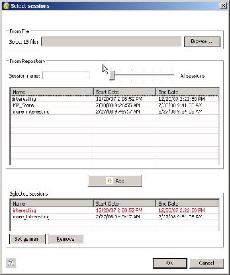

1. Select the Load Session you wish to remove from the Selected Sessions area. 
1. Click 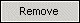. The selected Load Session is removed from the Selected Sessions area. It is still available for use in WebLOAD Analytics, and remains listed in the From Repository area. 

## Creating a Statistical Correlation Chart

Statistical correlation charts are used to identify measurements that have high correlation with a specified leading measurement, and are therefore suspect causes for the behavior of the leading measurement.

There are four predefined statistical correlation templates. They differ in the leading measurement (Response Time, Throughput), and in the graphical representation (over time or over the leading measurement). However, you can specify any measurement in any script to be the leading measurement, and you can view its correlation to all other measurements either over time or over the leading measurement.  

The below image shows a sample statistical correlation chart. 

Note that you can specify which measurements to display in the graph, by selecting or deselecting them in the in the table at the bottom of the Chart view tab.  

The table in the statistical correlation chart displays correlation information in two columns – Correlation and Direction.  

- Correlation is the linear correlation coefficient. It is a number between 0 and 1, with 1 being the highest possible correlation.  

    The measurements are listed in order of correlation, with the highest first. 

- Direction indicates whether correlation is positive (the measurement goes up when the leading measurement goes up, or down when the leading measurement goes down) or negative (the measurement goes up when the leading measurement goes down, or down when the leading measurement goes up). 

***Example*** 

Suppose you notice a time frame in which throughput suddenly decreases. Generate a Throughput Correlation chart, use the Time Filter to view the relevant time period, and look for measurements with a high correlation  

- If HTTP Response 200 has also decreased correspondingly (positive Direction), which means the server is sending less OK results with requested data, while HTTP Response 500 has increased correspondingly, meaning the server is sending more short ‘internal error’ responses, then the increased inability to fill requests for data is probably what is causing decreased throughput. 

### Specifying the Leading Measurement in a Statistical Correlation Chart

**To change the leading measurement in a statistical correlation chart:** 

1. Generate a statistical correlation chart. 
1. Click the **Settings** tab. 
1. Click . The Custom X Axis Correlation window appears. 
1. Select a measurement in a script. 
1. Click **OK**.  
1. Select a value for the X Axis. For example, select Time, or select Other and then specify the leading measurement. 
1. Click 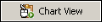. A correlation chart is generated for the measurement you selected. 

> **Note:**   You may wish to apply a Time Filter that restricts the correlation calculation to a specific time frame, to better focus on a certain behavior of the leading measurement. However, note that filtering a time period which is too short may harm accuracy. 

## Printing a Chart

You can print an open WebLOAD Analytics chart. 

**To print a chart:** 

1. In the Charts area, click the **Chart View** tab or **Preview** tab of an open chart. 

1. Click . The Print window opens.  

1. Specify the options you require, and click **OK**. The report is printed. 

   

## Creating an Interactive Chart from the Blank Template

You can create a new interactive chart based on the Blank Template. This template can be modified or you can use it to create additional custom interactive templates, as described in[*Creating an Interactive Template from the Blank Template* ](#creating-an-interactive-chart-from-the-blank-template) 

Although you can modify any template to create your own custom chart, the Blank Template is unique in that its Measurement Selection area is empty. 

**To generate a chart based on the Blank Template:** 

1. In the Navigation area, click the **Gallery** tab. The Templates Gallery appears. 

    

1. Select **User Defined** > **Blank Template**. The Settings tab of the Blank Template opens in the Charts area. 
1. Edit the Settings of the template as desired. See [`*Changing Chart Settings* ](changing_chart_settings.md) Note that you must specify at least one measurement in order to generate a chart. 
1. Click . A progress window appears while the chart is generated. The chart is displayed in the Preview tab.  

You can now analyze, print, or publish the chart.

- For information about analyzing the chart, see[*Customizing Interactive Charts* ](#customizing-interactive-charts)  

- For information about printing your chart, see[*Printing a Chart* ](#printing-a-chart)  

- For information about publishing your chart, see[*Publishing Charts* ](#publishing-charts) 

  

## Creating a Regression Chart from the Blank Regression Template

You can create a new interactive regression chart based on the Blank Regression Template. An interactive regression chart is both interactive, which means it enables you to analyze and customize the graph; and it is also a regression chart which means that it compares one selected session to all other specified session. 

The Blank Regression Template can be modified or you can use it to create additional custom interactive regression templates, as described in[Creating an Interactive Regression Template from the Blank Regression Template](#creating-a-regression-chart-from-the-blank-regression-template). Although you can modify any regression template to create your own custom regression template, the Blank Regression Template is unique in that it is interactive. 

**To generate a regression chart based on the Blank Regression Template:** 

1. In the Navigation area, click the **Gallery** tab. The Templates Gallery appears. 

    

   
1. Select **User Defined** > **Blank Regression Template**. The Select Sessions window appears. 
1. Optionally browse to the location of a Load Session file in the From File area, and click **Open**. 

    The Load Session file appears in the From Repository area.  

1. Optionally search for Load Sessions (see [*Searching for Load Sessions* ](load_sessions.md#searching-for-load-sessions)). 
1. In the From Repository area, select a Load Session you wish to use, and click . 

    The Load Session moves to the Selected Sessions area. Repeat this step to include all the Load Sessions you wish to compare. 

    The first session you select is set as the main Load Session. The main session appears in red. The main session is the session to which all other Load Sessions are compared.  

1. To specify a different session as the main session, select the Load Session in the Selected Sessions area and click . 
1. Edit the Settings of the template as desired. See [*Changing Chart Settings* ](changing_chart_settings.md) Note that you must specify at least one measurement in order to create a template. 
1. Click . A progress window appears while the chart is generated. The chart is displayed in the Preview tab.  

You can now analyze, print, or publish the chart.  

- For information about analyzing the chart, see [*Customizing Interactive Charts* ](#customizing-interactive-charts)  
- For information about printing your chart, see [*Printing a Chart* ](#printing-a-chart)  
- For information about publishing your chart, see [*Publishing Charts* ](#publishing-charts) 

## Navigating through a Chart

You can view and navigate through a chart in the Preview tab.  

**To view and navigate through a chart:** 

1. Click the **Preview** tab. 

    **Note:** If the chart is an interactive chart and a preview has not yet been generated, click the Chart View tab, then click  . A Preview tab appears.

1. Click the appropriate navigation button to navigate through your report, according to the information in the following tables.

    | Button | Description                             |
    | ------ | --------------------------------------- |
    || Scroll to the beginning of your report. |
    || Scroll back one page.                   |
    || Scroll forward one page.                |
    || Scroll to the end of your report.       |
    || Show the actual page size.              |
    | 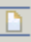|Fit the page to the window               |
    || Fit the page width to the window.       |
    |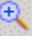| Zoom in.                                |
    |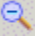| Zoom out.                               |

   

## Customizing Interactive Charts

The  icon displayed adjacent to a template in the gallery indicates that a chart created with this template is an interactive chart. An interactive chart contains a toolbar, which provides a variety of tools for analyzing and presenting the data in the chart.  

**To use the tools of an interactive chart:** 

1. Click the **Chart View** tab. 

      **Note:** If the chart has not yet been generated, double-click the template. The chart is generated and displayed in the Chart View tab.

    

1. Click the appropriate button in the interactive toolbar. 

1. To preserve the modifications you made to the chart display, click . The modified chart appears in the Preview tab. 

| Button | Function          | Description                                                  |
| ------ | ----------------- | ------------------------------------------------------------ |
|| Copy To Clipboard | Copy the chart or data to the clipboard. It can then be pasted (using Ctrl+V) into another application in any of the following formats: - Bitmap – A raster graphic, which can be pasted into applications such as Microsoft Paint. - Metafile – A vector graphic which can be pasted into applications such as Microsoft Word.  - Text – Data only, which can be pasted into applications such as Microsoft Excel. |
|| Gallery           | Change the line type to any type found in the gallery, such as bar-chart, area, etc. |
|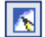| Anti Aliasing     | Smooth jagged edges.                                         |
|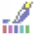| Palette           | Change all colors to a predefined palette from the list of palettes. |
|| 2D/3D             | Switch between 2D mode and 3D mode with depth.               |
|| Rotated View      | Rotate the chart. Only applicable in 3D mode.                |
|| Rotate X Axis     | Rotate the chart around the X axis. Only applicable in Rotated View mode. |
| | Rotate Y Axis     | Rotate the chart around the Y axis. Only applicable in Rotated View mode. |
|| Clustered         | If there are several series, place them behind each other, instead of next to each other. Only applicable in 3D mode. |
|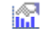| Axes Settings     | Control aspects of the X Axis and Y Axis. **Note**: In WebLOAD Analytics there is often more than one Y Axis, so the Y Axis setting has no effect. Instead, right- click the Y Axis you wish to change. |
|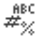| Point Label       | Add labels with the numeric value of each point.             |
|| Data Editor       | Show the data as a list.                                     |
|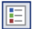| Legend Box        | Display a legend listing the series names, their color, and their marker shape. |
|| Zoom              | Enlarge image. Click Zoom again to zoom out.                 |
|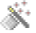| Properties        | Set the various chart settings.                              |

## Publishing Charts

WebLOAD Analytics enables you to publish a chart in the following formats: 

- Doc (Microsoft Word). 
- PDF (Adobe Reader). 
- XLSX (Excel). Please note the following: 
    - The summary table (below the graph) is exported if it is displayed. To ensure that the summary table is displayed, set the SHOW\_TABLES parameter to True . 
    - To work with the data more conveniently, change the Chart Preview master template to *Raw*. 
- XSL (Excel 97-2003). Note that it is preferable to use XSLX format whenever possible. 
- HTML (Browser, Internet Explorer). 
- RTF (Rich Text Format). Note that it is preferable to use Doc format whenever possible. 
- ODT (Open Office). 

**To publish a chart:** 

1. In the Charts area, click the **Preview** tab.  

    **Note:** If the chart is an interactive chart and a preview has not yet been generated, click the Chart View tab, then click  . A Preview tab appears. 

1. Click  to publish your chart as the default format specified in the Preferences window, 

    -Or- 

    Click the adjacent arrow to select a different format.  

    The Save As window opens to the location specified in the Preferences window. 

1. Select a location and name for your chart and click **Save**. The chart is published in the chosen format and saved to the location you specified.
