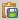

# Generating Reports

WebLOAD Analytics enables you to quickly and easily generate reports in various formats. A report is a concatenation of all open charts, or of a subset of your choice. You can then publish the report in various formats. 

> **Note:** Whether or not a title page is displayed depends on the master template in use. For more information about modifying the master template, see Defining Your Analytics Preferences.

## Creating New Reports

A report is a compilation of all or some of the charts open in the Charts area. A prerequisite to generating a report is to create the charts you wish to include in the report. 

**To generate a WebLOAD Analytics report:** 

1. Select **File** > **Generate Report** or click 

    The Generate Report: Report Settings window appears, listing all open charts.
   
    

1. Specify a name for the report. 

1. Select the charts to include in the generated report. 

1. Optionally, change the order in which the charts will be displayed by selecting a chart and clicking **Up** or **Down**. 

1. Click . 

A Preview of the report appears. You can: 

- Navigate the report using the navigation bar. 
- Print the report (see[*Printing a Report* ](#printing-a-report)). 
- Publish the report to various formats (see[ *Publishing Reports* ](#publishing-reports)). 
- Save the report to file (see[*Saving Reports* ](#saving-reports)).  
- Modify global report parameters (see[*Defining Your Preferences* ](defining_preferences.md)). 

## Printing a Report 

**To print a WebLOAD Analytics report:**  

1. Open the report you wish to publish. For more information see[` `*Opening Saved Reports* ](#opening-saved-reports)  
1. Click  to generate a report preview. 
1. In the report preview, click . The Print window opens.  
1. Select the print options you require and click **OK**. The report is printed. 

## Publishing Reports

WebLOAD Analytics enables you to publish a report in the following formats: 

- Doc (Microsoft Word). 
- PDF (Adobe Reader). 
- XLS (Excel). Note the following: 
     - Summary tables (below the graph) are exported if they are displayed. To ensure that summary tables are displayed, set the SHOW\_TABLES parameter to True in the charts you want displayed (as described in[*Modifying Chart Parameters* ](changing_chart_settings.md#modifying-chart-parameters)). 
     - To work with the data more conveniently, change the Reports master template to *Raw* (as described in[*Defining Your Analytics Preferences* ](defining_preferences.md#defining-your-analytics-preferences)). 
- XSL (Excel 97-2003). Note that it is preferable to use XSLX format whenever possible. 
- HTML (Browser, Internet Explorer). 
- RTF (Rich Text Format). Note that it is preferable to use Doc format whenever possible. 

**To publish a report:** 

1. Open the report you wish to publish. For more information see[` `*Opening Saved Reports* ](#opening-saved-reports)  

2. Click  to generate a report preview. 

3. Click  in the report preview toolbar to publish your report as the default format specified in the Preferences window, 

    -Or- 

    Click the adjacent arrow to select a different report format.  

    The Save As window opens to the location specified in the Preferences window. 

4. Select a location and name for your report and click **Save**. The report is published in the format chosen and saved to the location you specified. 

   

## Saving Reports

When you save your report, it is saved to a default location, unless you specify a different location in the Save to field. To change the default location, see[` `*Defining Your Analytics Preferences* ](defining_preferences.md#defining-your-analytics-preferences) 

**To save your report:**  

1. Select **File** > **Save** or click . 

    If this is the first time you are saving your report, the Save As window opens. If you have already specified a location in the Save As window, your file is saved to the default save location. 

    

1. Enter the path to which you wish to save the report, or click **Browse** to navigate to the location. 

1. Click **OK**. The report is saved to the specified location.

   

## Opening Saved Reports

WebLOAD Analytics reports are by default saved to the location specified in the Analytics tab of the Preferences window. You can open a previously saved report from the Recent Reports tab, or you can retrieve your report directly from your file system. For information about changing the default location for saved reports, see[`*Defining Your Analytics Preferences* ](defining_preferences.md#defining-your-analytics-preferences)  

## Opening Reports from the Recent Reports Tab 

**To open a report from the Recent Reports window:** 

1. Click the **Recent** **Reports** tab. The Recent Reports window opens. 

    

    > **Note:** The number of reports listed in this window is defined in the Preferences  window (see[*Defining Your Preferences* ](defining_preferences.md). By default, the 20 most recent reports are listed chronologically, with the most recent listed first. 

2. Click the Name column header to toggle between the following sorting options: 

    - Sort alphabetically (A-Z). 
    - Sort alphabetically (Z-A). 
    - Display the most recently used reports first. 

1. Double-click the report you wish to open. You can simultaneously open multiple reports by holding down **Ctrl** or **Shift**, clicking the reports, and pressing **Enter**. 

    The charts comprising the report are displayed in the Charts area. All previously opened charts are closed.  

**Note:** To publish or print the report, you must first click   to generate a report preview, and then use the publish and print options in the report preview toolbar. 

## Opening a Report From the File System

**To open a report from the file system:** 

1. Select **File** > **Open Report** or click . The Select Report File window appears.  
1. Browse to the report you wish to open and click **Open**. Note that WebLOAD Analytics reports have a `.report` extension. 

    The charts comprising the report are displayed in the Charts area. All previously opened charts are closed.  

> **Note:** To publish or print the report, you must first click   to generate a report preview, and then use the publish and print options in the report preview toolbar.

## Modifying Report Appearance

The general appearance of the report is determined by the reports master template being used. You can influence the report appearance in the following ways: 

- You can specify a different report master template, as described in[` `*Defining Your Analytics Preferences* ](defining_preferences.md#defining-your-analytics-preferences)  
- You can change the default values of some master template parameters, as described in[` `*Defining Your Parameter Preferences* ](defining_preferences.md#defining-your-parameter-preferences) 

> **Note:** The appearance of each chart in the report is determined by the reports master template, not the chart master template.