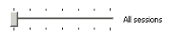
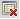

# Working with Load Sessions

WebLOAD Console generates the Load Session files (.ls, .sdb, .mdb, .isd, and .dat) that contain all the results collected during the execution of a Load Test. When you import a Load Session file (.ls) for use in WebLOAD Analytics, all the other files are also imported with it. All the imported Load Session files are stored in a separate WebLOAD Analytics Load Session Repository.  

WebLOAD Analytics enables you to import Load Sessions you wish to use to generate your reports, search the database for the Load Sessions you require, and delete redundant Load Sessions.  

## Importing Load Sessions

You can import a single or multiple Load Sessions into the WebLOAD Analytics Load Session Repository. The Load Session’s name is automatically derived from the selected .ls file’s name. 

**To import a Load Session:** 

1. Select **File** > **Import Sessions**, or click. The Open window appears. 
1. Browse to the Load Session (`.ls` file) you wish to import and click **Open**. The Load Session is imported and saved in the WebLOAD Analytics Load Session Repository, as defined in your Preferences. The Load Session is listed in the From Repository area of the Select Session window.

> **Notes:** When you import a Load Session from WebLOAD Console into the WebLOAD  Analytics Load Session Repository, the Summary Portfolio is automatically generated for the Load Session. For information about changing this default behavior, see [*Defining Your Analytics Preferences* ](#_page66_x54.00_y392.04)on page[ 67.](#_page66_x54.00_y392.04) 

A Load Session that is currently open in WebLOAD Console cannot be imported. Unless you launch WebLOAD Analytics from within WebLOAD Console, close the Load Session before importing it. For more information about launching WebLOAD Analytics from WebLOAD Console, see[` `*Launching WebLOAD Analytics* ](#_page15_x54.00_y294.04)on page[ 16.](#_page15_x54.00_y294.04) 

## Searching for Load Sessions

You can search the WebLOAD Analytics Repository for Load Sessions by date, or using keywords. 

### Searching by Date

You can narrow your search for the Load Session you require by displaying Load Sessions that fall within a certain date range only. 

**To search for a range of the most recent Load Sessions:** 

1. Select **File** > **Select Sessions**, or click . The Select Session window appears [(Figure 5)](#_page22_x54.00_y334.04). 
1. In the From Repository area, click and drag the slider to the right to display more recent Load Sessions. Click and drag to the left to display progressively older Load Sessions. 

   By default, the slider is set to display all sessions that appear in the WebLOAD Analytics Repository. As you move the slider to the left, it displays sessions from the last year, last three months, last month, last week, last three days, and last day, respectively. 

> **Note:** You can also open the Select Session window by clicking  in the Settings tab.

### Searching by Session Name

You can search for the Load Session you require by specifying part of the name, or the full name, of the Load Session you require. 

**To search for a Load Session by session name:** 

1. Select **File** > **Select Sessions**, or click  . The Select Session window appears [(Figure 5)](#_page22_x54.00_y334.04). 
1. In the **Session name** field, enter the Load Session name, or part of the name that you wish to find. Load Sessions matching the search name or part of the name, are displayed in the From Repository area, as you type. \

## Deleting Load Sessions

You can delete Load Sessions that you no longer require from the WebLOAD Analytics Load Session Repository. Deleting Load Sessions removes them from the repository. Any references to them in WebLOAD Analytics are also removed.  

> **Note:** When a Load Session is imported from WebLOAD Console, a copy of the Load  Session is saved in the WebLOAD Analytics Load Session Repository. Deleting a Load Session from the WebLOAD Analytics Load Session Repository does not delete it from WebLOAD Console. 

**To delete a Load Session from WebLOAD Analytics:** 

1. Select **File** > **Delete Sessions**, or click . The Select Sessions to Delete window appears. 
1. Select the Load Session or Sessions you wish to delete in the From Repository area, and click . The Load Session or Sessions are moved to the Selected Sessions area. 
1. Select the Load Session(s) from the Selected Sessions area and click . A warning message appears, asking if you are sure you wish to delete the selected Load Session(s). 
1. Click **Yes**. The selected Load Session(s) are deleted from the WebLOAD Analytics Load Session Repository.

