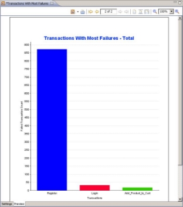

# WebLOAD Analytics System Overview

WebLOAD accurately simulates Internet users’ behavior and models real-life demands on your Web application to predict capacity requirements, report bottlenecks, and detect weak links in your application before deployment. An important phase of the performance testing process is the analysis and reporting of test results. WebLOAD Analytics provides you with a simple yet comprehensive method of producing and publishing reports to fulfill all your analysis and reporting requirements. 

Using WebLOAD Analytics, you can create clear, accurate, and meaningful reports that enable you to analyze Load Session results and identify peaks, trends, and anomalies in your data. WebLOAD Analytics provides you with a variety of predefined chart templates that enable you to produce focused reports on specific topics. You can edit these templates, and create new templates. 

## The WebLOAD Analytics Workflow

WebLOAD Analytics provides an easy to use, task oriented interface for the production and publication of Load Session reports. In a typical workflow, you create several charts of interest. Each is created simply by double-clicking a template. You then generate a Report, which is a compilation of the open charts.  

The building blocks of the charts are:

- **Load Sessions** – WebLOAD Analytics uses Load Session data as the raw material for producing WebLOAD reports. Using WebLOAD Analytics, you can present Load Session results, compare various statistics, and highlight important results and conclusions, based on your load test results. For more information about Load Sessions, see[` `*Working with Load Sessions* ](load_sessions.md). 
- **Templates** – A template specifies the design of a chart, including the visual layout, chart elements, and the way the data is structured. WebLOAD Analytics provides a wide range of predefined templates, based on RadView’s extensive knowledge and experience in the load testing and performance analysis fields. Predefined templates enable you to produce charts that focus on specific aspects of the Load Session data.

A basic chart consists of the following elements: 

- **Tabular Data** – Provides a tabular representation of the Load Session data. 
- **Graphs** – Provides a graphical representation of the Load Session data. 

Each chart is either static or interactive.  

- A static chart, indicated by, is a regular chart.  
- An interactive chart is indicated by . It has the additional capability of enabling you to analyze and present the chart data in various ways using tools provided in its interactive toolbar. 

Once you create all the charts necessary for your report, you can generate the report simply by clicking . You then specify which of the open charts will be included in the report. 

Reports can be saved for later use, with the defined Load Session data, template, and any optional settings you choose (see[` `*Saving Reports* ](generating_reports.md#saving-reports). 

In addition, you can: 

- **Apply filters to the Load Session data** – You can apply time and statistics-based filters to the Load Session data before the chart is produced. Time filters focus the chart on a specific part of the Load Session. Statistics-based time filters enable you to focus on time segments which meet defined criteria. For information about filtering your chart, see[` `*Changing Chart Settings* ](changing_chart_settings.md) 
- **Customize your graphs** – You can customize the graphs of interactive charts (denoted by the  icon): change colors, line type, hide/show measurement, zoom and more. You can even add any other measurement from the session to the graphs. 
- **Change the chart’s parameters** – each chart has different parameters that can be changed to control its behavior. Depending on the chart, you may add threshold values, control whether to show detailed data table or not, change titles and logos. For more information, see[` `*Modifying Chart Parameters* ](changing_chart_settings.md#modifying-chart-parameters)  
- **Reuse your customizations** – You can change the settings of a template and then save it as a new template. 
- **Create regression charts** – Adding multiple Load Sessions to a chart compares one selected session to all additional sessions included in the regression chart. This option is very useful for comparing two sessions that were run on the same Load Template. The purpose is to gauge whether a small change in the System Under Test has degraded the performance. For more information, see[` `*Generating Charts* ](generating_charts.md) 
- **Create statistical correlation charts** – You can use these charts to identify measurements that have a high correlation with a certain measurement that is behaving in an unusual fashion, and are therefore possibly causing the unusual behavior of that measurement. 
- **Print or Publish the chart or report** – Both charts and reports can be printed or published in a variety of formats, including DOC, ODT, PDF, HTML, RTF and XLSX. For information about printing charts and reports, see[` `*Printing a Chart* ](generating_charts.md#printing-a-chart)and[` `*Printing a Report* ](generating_reports.md). For information about publishing charts and Reports, see[` `*Publishing Charts* ](generating_charts.md#publishing-charts)and[` `*Publishing Reports* ](generating_reports.md#publishing-reports) 
- **Group frequently used templates in a portfolio** – You can create a portfolio of templates that you use frequently. Opening the portfolio will open all its included templates. For information about how to set up a portfolio, see[` `*Working with Portfolios* ](portfolios.md)  
- **Manage your charts** – You can group your templates into different categories by creating your own folders and moving the templates you wish to use into those folders. You can also rename folders to create logical categories in which to group your templates. For information about managing your templates, see[` `*Managing Template Categories* ](templates.md#managing-template-categories) 

- **Assign and modify master templates** – WebLOAD Analytics contains three master templates: *Raw*, *WebLOAD*, and *WebLOAD with background*. Any one of these can be assigned as the master template for reports, and any one of these can be assigned as the master template for charts. By default, the reports master template is the WebLOAD master template, and the default charts master template is the Raw master template. The appearance of a report is determined only by the reports master template. The appearance of each chart is determined both by the chart master template and the settings of the specific template. You can specify which master template to assign to charts and which master template to assign to reports (see[` `*Defining Your Analytics Preferences* ](defining_preferences.md#defining-your-analytics-preferences). You can also change the values of some master template parameters (see[` `*Defining Your Parameter Preferences* ](defining_preferences.md#defining-your-parameter-preferences). 
- **Create and edit static reports** – Although it is possible to dynamically define an interactive report from any measurement set, you can even create and edit the static templates. You can use the freely available iReport tool to edit the supplied templates and create new ones. For more information about JasperSoft iReport, see [*Using JasperSoft iReport* ](templates.md#using-jaspersoft-ireport) 

## The Analytics Repositories

All Load Sessions used with WebLOAD Analytics are stored in a database (PostgreSQL). These Load Sessions are the fundamental data for all reports generated by WebLOAD Analytics. Load Sessions are imported to the database through WebLOAD Analytics. A list of the Load Sessions stored in the database can be viewed from WebLOAD Analytics. For information about importing Load Sessions and selecting the Load Sessions you wish to work with, see[` `*Working with Load Sessions* ](load_sessions.md). 

> **Note:**  You need to import Load Sessions to the database (also called the Load Session Repository) before they can be used by WebLOAD Analytics. 

All chart templates are stored in the following directory, by default: 

`<WebLOAD data>Documents and Settings\All Users\Application Data\RadView\WebLOAD\Gallery`. This directory determines the appearance of the Templates Gallery. When you launch WebLOAD Analytics, the `Gallery` directory is scanned and all the templates therein are presented in the Templates Gallery. For information about modifying the default chart template location, see [*Defining Your Analytics Preferences* ](defining_preferences.md#defining-your-analytics-preferences). For more information about the `Gallery` directory, see[` `*WebLOAD Analytics File System Structure* ](appendix_a.md). 

> **Note:** The `Gallery` directory is not monitored while WebLOAD Analytics is running. RadView recommends not modifying this directory while WebLOAD Analytics is 

