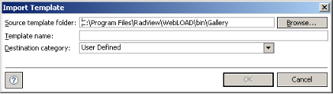

# Working with Templates

The Templates Gallery contains predefined templates, user-defined templates, and portfolios. WebLOAD Analytics enables you to modify and manage your templates, edit existing templates, and import new templates. 

## Template Overview

Chart master templates are used together with individual templates to create a chart. A chart master template contains global parameters that affect all the templates that are generated using it. You can select a default master template for charts as described in [*Defining Your Analytics Preferences* ](#_page66_x54.00_y392.04)on page[ 67.](#_page66_x54.00_y392.04) 

Templates specify the design of a chart, including the visual layout, chart elements, and the way the data is structured. For example, depending on the master template, a template produces a chart with or without tables. 

Templates can include the following elements: 

- **Images** – These include the logos, images, and icons that create the chart template’s look and feel. WebLOAD Analytics provides WebLOAD logos and images by default. You can customize your templates to display your own logos and images. 
- **Tables** – The Load Session data can be represented in tabular format in a chart. At least one table exists in all charts, by default. You can exclude tables from your chart by setting the SHOW\_TABLES parameter to False. For more information about modifying parameters, see[` `*Defining Your Parameter Preferences* ](#_page70_x54.00_y376.04)on page[ 71.](#_page70_x54.00_y376.04) 
- **Graphs** – The Load Session data can be represented in graphical format in a chart. At least one graph exists in almost all charts, by default. You can include only graphs in your chart (excluding tables) by setting the SHOW\_TABLES parameter to False. For more information about modifying parameters, see[` `*Defining Your Parameter Preferences* ](#_page70_x54.00_y376.04)on page[ 71.](#_page70_x54.00_y376.04) 

For more information about the WebLOAD Analytics template file structure, including storage of templates, images, and files, see[` `*WebLOAD Analytics File System Structure* ](#_page77_x54.00_y176.04)on page[ 78.](#_page77_x54.00_y176.04) 

You can define a variety of additional characteristics within the chart, using local and global parameters (in the chart and in the chart master template). For example, you can specify the number of results listed in a chart, customize the look and feel of your chart, and define a threshold value for selected templates.  

For more information about template preferences, see[` `*Defining Your Preferences* ](#_page66_x54.00_y182.04)on page[ 67.](#_page66_x54.00_y182.04) 

## Creating User-defined Templates

You can change the settings of a template and then save it as a new template. This enables you to customize both static and interactive templates. 

Only changes to the following settings enable you to create a new template: 

- Measurements settings in the Measurement Selection area of an interactive chart. 

  > **Note:** Changes in the Script Selection area of a static chart do not enable you to save the template as a new one. 

- Filtering settings in the Statistics-based Time Filter area. 
- Parameter settings in the Parameters area. 

**To create a user-defined template:** 

1. In the Charts area, select a chart. 

1. Select the Settings tab. 

1. Modify the settings of the chart. 

1. Select **File** > **Save Chart As Template.** The Save As Template window appears. 

   

1. Select a name and category for your template, or overwrite the existing template and click **OK**. 

Your user-defined template is created and appears in the Templates Gallery in the location you specified.

## Creating an Interactive Template from the Blank Template

You can create a custom interactive template based on the Blank Template. Although you can modify any template to create your own custom template (as described in [*Creating User-defined Templates* ](#_page54_x54.00_y191.04)on page[ 55)](#_page54_x54.00_y191.04), the Blank Template is unique in that its Measurement Selection area is empty. 

**To create an interactive template based on the Blank Template:** 

1. In the Navigation area, click the **Gallery** tab. The Templates Gallery appears. 

   

   

2. Select **User Defined** > **Blank Template**. The Settings tab of the Blank Template opens in the Charts area, with the Measurement Selection section displayed [(Figure 14)](#_page37_x54.00_y368.04). 

3. Edit the Settings of the template as desired. See[*Changing Chart Settings* ](#_page34_x54.00_y155.04)on page[ 35.](#_page34_x54.00_y155.04) Note that you must specify at least one measurement (see[ Figure 14)](#_page37_x54.00_y368.04) in order to create a template. 

4. Select a value for the X-Axis of the graph and continue defining the chart template options as described in[*Creating User-defined Templates* ](#_page54_x54.00_y191.04)on page[ 55.](#_page54_x54.00_y191.04)

5. Select **File** >  **Save Chart As Template**. The Save As Template window opens. 

   

6. Select a name and category for your template or overwrite the existing template and click **OK**. 

   Your custom interactive template is created and appears in the Templates Gallery. 

   

## Creating an Interactive Regression Template from the Blank Regression Template

You can create a custom interactive regression template based on the Blank Regression Template. Although you can modify any regression template to create your own custom regression template, the Blank Regression Template is unique in that it is interactive. 

**To create a regression template based on the Blank Regression Template:** 

1. In the Navigation area, click the **Gallery** tab. The Templates Gallery appears. 

   

   

2. Select **User Defined** > **Blank Regression Template**. The Select Sessions window appears [(Figure 6)](#_page23_x54.00_y435.04). 

3. Optionally browse to the location of a Load Session file in the From File area, and click **Open**. 

   The Load Session file appears in the From Repository area.  

4. Optionally search for Load Sessions (see[*Searching for Load Sessions* ](#_page51_x54.00_y217.04)on page[ 52)](#_page51_x54.00_y217.04). 

5. In the From Repository area, select a Load Session you wish to use, and click . 

   The Load Session moves to the Selected Sessions area. Repeat this step to include all the Load Sessions you wish to compare. 

   The first session you select is set as the main Load Session. The main session appears in red. The main session is the session to which all other Load Sessions are compared.  

6. To specify a different session as the main session, select the Load Session in the Selected Sessions area and click . 

7. Edit the Settings of the template as desired (see[*Changing Chart Settings* ](#_page34_x54.00_y155.04)on page[ 35)](#_page34_x54.00_y155.04). Note that you must specify at least one measurement (see[ Figure 14)](#_page37_x54.00_y368.04) in order to create a template. 

8. Select a value for the X-Axis of the graph and continue defining the chart template options as described in[*Creating User-defined Templates* ](#_page54_x54.00_y191.04)on page[ 55.](#_page54_x54.00_y191.04)

9. Select **File** > **Save Chart As Template**. The Save As Template window opens. 

   

10. Select a name and category for your template or overwrite the existing template and click **OK**. 

Your custom interactive regression template is created and appears in the Templates Gallery.

## Managing Template Categories

You can manage template categories in various ways: 

- Group your templates into different categories by creating your own categories and moving templates into them.  

- Rename the categories to create logical groups for your templates.  

- Copy or move templates from one category to another, and rename templates. 

  

### Creating New Template Categories

You can create new categories, to enable easy categorization of your templates. **To create a new template category:** 

1. In the Navigation area, click the **Gallery** tab. The Templates Gallery opens [(Figure 9)](#_page27_x54.00_y564.04). 
1. Right-click in the Templates Gallery and select **New Category** from the menu. The New Category window opens. 

3. Enter a name for your new category, and click **OK**. The new category is listed in the Templates Gallery, which is ordered alphabetically. You can now move the templates you require into the new category. 

   

### Copying Templates

WebLOAD Analytics enables you to copy templates from one template category to another.  

**To copy a template to a new location:** 

1. In the Navigation area, click the **Gallery** tab. The Templates Gallery appears [(Figure 9)](#_page27_x54.00_y564.04). 
1. Select the template you wish to copy. Right-click in the Templates Gallery and select **Copy** from the menu.  
1. Click the destination category. 
1. Right-click in the Templates Gallery and select **Paste** from the menu. A copy of the template appears under the selected category. 

> **Note:** To move a template, drag-and-drop the template from one category to another. 

### Renaming Templates and Template Categories

You can easily rename a template or template category. This enables you to create logical groups to categorize and group your templates. 

**To rename a template or template category:** 

1. In the Navigation area, click the **Gallery** tab. The Templates Gallery appears [(Figure 9)](#_page27_x54.00_y564.04). 
1. Select the template or template category you wish to rename. 
1. Right-click the template or template category, and select **Rename** from the menu. 

4. Enter the new name in the Enter a new name field, and click **OK**. The template or template category is renamed.

### Deleting Templates and Template Categories

**To delete a template or template category:** 

1. In the Navigation area, click the **Gallery** tab. The Templates Gallery appears [(Figure 9)](#_page27_x54.00_y564.04). 
1. Select the template or template category that you wish to delete. Right-click in the Templates Gallery and select **Delete** from the menu.  

   A confirmation message appears. 

3. Click **Yes** to delete the template or template category. 

> **Note:** When deleting a template category, all the templates contained within the category are also deleted. 

## Using JasperSoft iReport 

Since you can use interactive reports to create your own reports on any measurement set, you would typically not need to change the supplied static templates. However, you can change a static template if you wish. JasperSoft iReport enables you to create new templates or modify existing templates for use with WebLOAD Analytics. JasperSoft iReport provides a range of functions for the creation and customization of templates. WebLOAD Analytics supports version 2.0.4 of JasperSoft iReport. 

> **Note:** If the path to JasperSoft iReport has been defined in your WebLOAD Preferences, you can launch JasperSoft iReport directly from WebLOAD Analytics.

**To launch JasperSoft iReport from WebLOAD Analytics:** 

1. In the Navigation area, click the **Gallery** tab. The Templates Gallery opens [(Figure 9)](#_page27_x54.00_y564.04). 
1. Select the template that you wish to edit. Right-click in the Templates Gallery and select Edit with iReport. The JasperSoft iReport application opens. 

> **Note:** You can use any JRXML-compatible tool to create or modify templates. RadView  does not provide support for JasperSoft iReport, or other third party tools used to create or modify templates. 

For further information about the use of JasperSoft iReport, see the following Web pages: 

- [http://www.jaspersoft.com/JasperSoft_iReport.html ](http://www.jaspersoft.com/JasperSoft_iReport.html) 

- [http://jasperforge.org/jaspersoft/opensource/business_intelligence/ireport/ ](http://jasperforge.org/jaspersoft/opensource/business_intelligence/ireport/)

- [http://sourceforge.net/projects/ireport/ ](http://sourceforge.net/projects/ireport/)

  

### Importing New Templates

WebLOAD Analytics enables you to import templates created or edited in JasperSoft iReport, or any JRXML-compatible tool. WebLOAD Analytics supports version 2.0.4 of JasperSoft iReport. 

> **Note:** RadView does not provide support for JasperSoft iReport, or other third party tools used to create or modify templates. 

**To import a new template:** 

1. In the Navigation area, click the **Gallery** tab. The Templates Gallery appears [(Figure 9)](#_page27_x54.00_y564.04). 

   Right-click in the Templates Gallery and select **Import Template**. The Import Template window opens. 

   

   

2. Enter the template parameters, according to the information in[ Table 6:](#_page61_x54.00_y518.04) 

   | Template Field         | Description                                                  |
   | ---------------------- | ------------------------------------------------------------ |
   | Source template folder | The path to the template JRXML file that you wish to import. Enter the path to the template, or click Browse to navigate to the JRXML file location. |
   | Template name          | The name of the template.                                    |
   | Destination Category   | A drop-down list of the template categories available in WebLOAD Analytics. |

   

3. Click **OK**. The template is listed in the Gallery tab, under the selected folder. 

   > **Note:** If no template categories are defined when importing a template, the Source  Template Folder field is replaced with the Create Folder field. Define a folder name before importing your template. 
