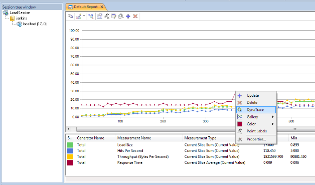
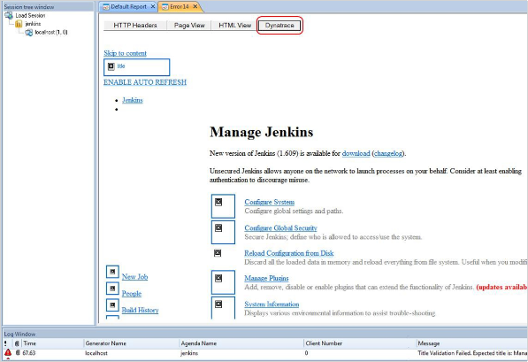

# Integrating with Dynatrace

This section describes how to integrate WebLOAD with Dynatrace.

Dynatrace is a suite of Application Performance Monitoring (APM) tools that enables in-depth real-time application monitoring.

By integrating WebLOAD scripts with Dynatrace you can rapidly resolve and proactively prevent application performance problems. The integration consists of two tasks:

- Installing Dynatrace on your local computer.
- In WebLOAD – [Enabling Dynatrace](set_global_opt.md#the-dynatrace-tab) in the **Dynatrace** tab of the **Global Options** window. When Dynatrace is enabled, WebLOAD adds an identifier in all request headers which identifies them as WebLOAD requests.

After integrating WebLOAD with Dynatrace, you can perform the following:

- [Integrating with Dynatrace](#integrating-with-dynatrace)
  - [Monitoring a WebLOAD Load Session in Dynatrace](#monitoring-a-webload-load-session-in-dynatrace)
  - [Viewing in Dynatrace a WebLOAD Point of Interest](#viewing-in-dynatrace-a-webload-point-of-interest)
    - [Specifying the Dynatrace System Profile](#specifying-the-dynatrace-system-profile)
  - [Viewing in Dynatrace the Transactions Related to WebLOAD Errors](#viewing-in-dynatrace-the-transactions-related-to-webload-errors)

## Monitoring a WebLOAD Load Session in Dynatrace

To monitor a WebLOAD Load Session in Dynatrace:

1. Enable Dynatrace in [*The Dynatrace Tab* ](set_global_opt.md#the-dynatrace-tab).
1. In the Dynatrace **Monitoring** page, click the **Synthetic Request** node.

A dropdown list of options appears, enabling you to access the various monitoring and drill-down options offered by Dynatrace.

## Viewing in Dynatrace a WebLOAD Point of Interest

You can access Dynatrace directly from a WebLOAD’s report window to view in Dynatrace the monitoring data of any point in a WebLOAD graph.

**To view Dynatrace data for a WebLOAD point of interest:**

1. Enable Dynatrace in [*The Dynatrace Tab* ](set_global_opt.md#the-dynatrace-tab).
1. In a WebLOAD report, right-click a point in a graph and select **DynaTrace**.

3. A Dynatrace window appears, showing data for the time period starting from 10 minutes prior to the point of interest, and ending 10 minutes after the point of interest.

### Specifying the Dynatrace System Profile

When you enable Dynatrace in WebLOAD (refer to [*The Dynatrace Tab* ](set_global_opt.md#the-dynatrace-tab), by default WebLOAD specifies that points of interest viewed in Dynatrace will be viewed in the **Monitoring** system profile. If you wish to change this default setting, do the following:

1. Click **Global Options** in the **Tools** tab of the ribbon,

    -Or-

    Select **Global Options** from the Console System button.

1. Select the **Dynatrace** tab.
1. In the **Timestamp** field, change:

    `rest/integration/opendashboard?source=live:Monitoring&filter= tf:CustomTimeframe?`

    To:

    `rest/integration/opendashboard?source=live:<Your-desired- system-profile>&filter=tf:CustomTimeframe?`

Whenever you click a point of interest in WebLOAD and select **DynaTrace**, the point of interest will be displayed in the Dynatrace system profile you specified in the **Timestamp** field.

## Viewing in Dynatrace the Transactions Related to WebLOAD Errors

If an error occurs at any time during a test session, an error message displays in the Log Window. If you installed Dynatrace, you can access Dynatrace directly from WebLOAD’s Log Window to view in Dynatrace the transaction associated with the error.

**To view a transaction in Dynatrace that is associated with a WebLOAD error:**

1. Enable Dynatrace in [*The Dynatrace Tab* ](set_global_opt.md#the-dynatrace-tab).

1. In the Log Window, double-click the paperclip icon adjacent to the error.

    

1. In the Event Viewer that appears, click the **Dynatrace** button

    

1. A Dynatrace window appears, displaying the details of the relevant transaction.

    

