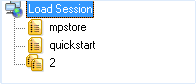

# Configuring a Load Template Manually

This chapter describes the process of manually configuring a Load Template. Load Templates are configured in the Console through a sequential series of dialog boxes. Through these dialog boxes, you can select and schedule the script or Mix files to run during the test, define the number of Load Machines and Probing Clients to run each script and the number of Virtual Clients to run.

> **Note:** You cannot create Load Templates if you have not yet recorded (or otherwise created) any scripts. If you do not have any scripts to work with, you must create them with WebLOAD Recorder.
>

## The Manual Test Configuration Workflow

The following diagram illustrates the workflow for manually configuring a load test.

## Starting a New Template Manually

**To create a new Load Template manually:**

1. Select **Create a new template manually** on the WebLOAD Startup dialog box.

   

2. Click **OK**.

   The WebLOAD Console appears.

3. Click **Scripts Selection** in the **Home** tab of the ribbon,

   -Or-

   Right-click the Load Session item in the Script Tree and select **Modify Script Selection**.

The script/Mix Selection dialog box opens. See [*Selecting a](#_bookmark191)* (on page [166](#_bookmark191)).

## Selecting a Script

Scripts are test scripts that describe user activity and are run during WebLOAD Console test sessions.

WebLOAD Console supports two types of scripts:

- **Single Scripts** – which are lone test-scripts.
- **Mix of Scripts** – which are a combination of existing single scripts. Using a Mix you can simulate different groups of users performing different activities on the system under test (SUT) at the same time.

Select the scripts to run through the script / Mix Selection dialog box.

### Creating Load Templates with One or More Single Scripts

**To create Load Templates with one or more singlescripts:**

1. Click in the **Script Path** field and enter the name and the full path for the script or mix of scripts.

   The path name can be entered manually or through browsing the directory structure.

   To include additional scripts/mix of scripts, click **Add** and repeat step 1.

2. To optionally open and view or edit a selected script, click **View**. WebLOAD Recorder opens displaying the selected script.

3. To optionally open and view or edit a selected mix of scripts, click **View**.

   The Edit Mix dialog box opens (it is essentially identical to the [*Mix Creation Dialog](#_bookmark95) *[Box*](#_bookmark95)*).

4. To optionally configure runtime options exclusive to a selected Script, click **Options**.

   The Script Options dialog box opens enabling you to define the runtime options for the selected script. For more information on Script options, see [*Setting Script](#_bookmark223) *[Options* ](#_bookmark223)*(on page [211](#_bookmark224)).

5. To optionally configure runtime options exclusive to a script in a selected mix, click **View**. In the Edit Mix dialog box that appears, select the script and click **Options**. The Script Options dialog box opens enabling you to define the runtime options for the selected script. For more information on script options, see [*Setting](#_bookmark223)[ Script Options* ](#_bookmark223)(on page [211](#_bookmark224)).

6. Click **OK**.

   The scripts selected to run in the test are displayed in the Session Tree.

   

## Selecting Hosts

Hosts are the computer systems participating in the test session. Each host has an assigned task, acting as either a Load Machine or a Probing Client. Both Load Machines and Probing Clients are configured in the same Host Selection window. Hosts must be defined for each script or Mix file running in the test session.

### Opening the Host Selection Dialog Box

**To open the host selection dialog box:**

- Right-click the script or Mix icon in the Session Tree and select **View Load Machines Selection**,

  -Or-

  Select **Load Machine Selection** in the **Home** tab of the ribbon. The Host Selection dialog box opens.
  
  

In this dialog box, you define the host computers participating in the test. There are three fields in this dialog box. The Host Computers field, lists all of the host computers available for testing. The two fields to the right contain the systems defined as Load Machines and Probing Client Machines. Use the arrow buttons between the fields to change the roles of the host computers, or double-click systems in the Host Computers field to move them to the Load Machines field.

> **Note:** If you are running a script with Perfecto Mobile script, define a single Load Machine or a single Probing Client in order to simulate a single user.

### Defining Host Computers

**To define a host computer:**

1. Click **Add**.

   The Add Host Computer dialog box opens.
   
   

2. Enter the name or IP address of the host computer you want to add.

3. Click **OK**.

   WebLOAD Console adds the machine to the Host Computer list.

## Defining Load Machines

Load Machines are the machines that generate the Virtual Clients and bombard the system under test.

#### Designating a Host Computer as a Load Machine

**To designate a host computer as a Load Machine:**

1. Select the Host from the Host Computer field.
2. Click the single arrow key adjacent to the Load Machine field.

   -Or-

   Double-click the host.

   The selected Host moves to the Load Machine field.
3. Click **OK**.

#### Designating all Host Computers as Load Machines

**To designate all host computers as Load Machines:**

1. Click the double arrow key adjacent to the Load Machine field. All of the Host Computers move to the Load Machine field.
2. Click **OK**.

### Defining Probing Client Machines

Probing Clients act as single Virtual Clients to measure the performance of targeted activities and provide individual performance statistics of the SUT.

#### Designating a Host Computer as a Probing Client Machine

**To designate a host computer as a Probing Client Machine:**

1. Select the **Host** from the Host Computer field.
2. Click the single arrow key adjacent to the Probing Client Machines field. The selected Host moves to the Probing Client Machine field.
3. Click **OK**.

## Deleting a Host Computer

**To delete a host computer:**

1. Select the host name from the Host Computer list.
2. Click **Delete**.

   The host is deleted from the Host Computer list.
   
   

## Scheduling the Test Session

The Schedule dialog box is used to specify the test parameters. Here you specify the size of the load to be generated on each Load Machine throughout the test.

You can create a load schedule by:

- Manually defining time frames and the load to generate over each frame
- Using the Load Profiler
- A combination of both

### Creating a Load Schedule Manually

**To create a load schedule manually:**

1. Double-click a host in the Session Tree,

   -Or-

   Right-click the script the Load Machines are running and select **Modify Load Machine Schedule**.

   The Schedule Manually dialog box opens.
   
   

2. Expand the Load Machine tree using the **+ / -** button adjacent to the Load Machine you want to schedule.

3. Enter the number of days and the starting time to generate the load in the From field.

   The starting time is defined for each particular script relative to the beginning of the test.

   > **Note:** Days are numbered 00 through to 99. Seconds are numbered 1 through 59. To enter one minute, use the 1:00 syntax, not 00:60.

4. Enter the number of days and the ending time to generate the load in the To field.

   The ending time is defined for each particular Script relative to the beginning of the test. If the To field is left blank, WebLOAD Console continues generating the load until the From time in the next entry for this Load Machine, or if this is the last entry, until the test is stopped manually.

5. Enter the number of Virtual Clients to generate during the time frame defined in steps 3 and 4.
6. Schedule additional Virtual Client loads for this Load Machine:
   1. Click **Add** to add a blank line to the schedule grid.
   2. Repeat steps 3 through 5.

7. Repeat steps 3 through 6 for each Load Machine or Probing Client defined in the Session Tree.
8. Click **OK**.

> **Note:** The **Limit run to X rounds** option is disabled because you cannot set or change it for an individual load machine. This option can only be set at the script level.

## Creating a Load Schedule with the Load Profiler

**To create a load schedule with the load profile:**

1. Double-click a host in the Session Tree,

   -Or-

   Right-click the script the hosts are running and select **Modify Load Machine Schedule**.

   The Schedule Manually dialog box opens.
   
   

2. Click the Load Machine you want to schedule.

3. Click the **Load Profiler** button.

   The Load Profiler opens.

   

4. Select a pattern from the Select scheduling model field at the top of the dialog box. For an explanation of each model, see [*Scheduling Models* ](#_bookmark135)(on page [121](#_bookmark136)).

5. Fill in the fields at the bottom of the dialog box.

6. Click **Append** to include the load definition in the schedule,

   -Or-

   Click **Replace** to substitute the load definition for the one appearing in the Schedule Manually dialog box.

## **Completing Your Manual Load Template Configuration**

After configuring the scripts to run, the Load Machines to generate the load, and the test schedule, you are ready to run your Load Session.

**To complete your manual Load Template configuration:**

1. Click **Start Session** in the **Session** tab of the ribbon.

   A message box appears asking if you want to save the current Load Template.

2. Click **Yes** to save the current Load Template as a \*.tpl file.

   Load Templates contain the parameters that you defined for the test, such as the scripts to run, participating hosts, and the test plan. Saving Load Templates saves you the time of reconfiguring the Load Session when repeating tests.

   For more information on running tests, see [*Running a Load Session* ](#_bookmark298)(on page [271](#_bookmark299)).

