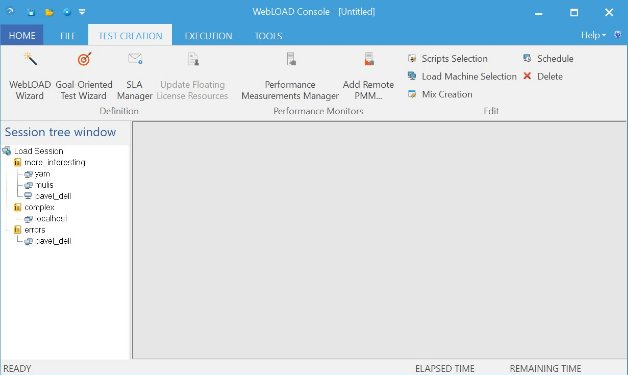
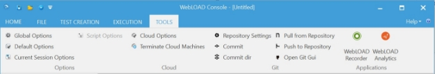

# WebLOAD Console Features

The WebLOAD Console is where you perform the majority of your load / performance testing activities.

## The WebLOAD Console

The Console consists of the following:

- Console System button
- Quick Access toolbar
- Ribbon
- Session Tree
- Results window
- Status bar

The Console manages the Load Session. It also:

- Configures Load Session hosts and scripts.
- Schedules Load Session scripts.
- Monitors the application’s performance and integrity under the generated load.
- Manages the Load Session as it is running, allowing you to pause, stop and continue Load Session components as needed.
- Displays the current performance of the SUT and provides a final performance report for Virtual Clients and Probing Clients.
- Manages exporting of test reports.

The WebLOAD Console component controls your test session. From the Console, you can:

- Specify the program (script) that the test session runs.
- Select the number of Virtual Clients to run.
- Define the hosts participating in the Load Session.
- Schedule tests.
- View performance reports.

### Opening the Console

**To open the Console:**

- Select **Start** > **All Programs** > **RadView** > **WebLOAD** > **WebLOAD Console**,

  -Or-

  From your desktop, click the **Console** icon.

  The WebLOAD Console Startup dialog box appears, displaying a variety of shortcuts to the various WebLOAD Console components. After you select an option and start working, the WebLOAD main screen appears.

  

The Console is operated through its Console System button and ribbon at the top of the screen. Tests are configured through a series of dialog boxes.

## Console Elements

When you first start WebLOAD Console, you see the Console window interface in Edit mode. The Console window displays different components in the two different modes:

- Edit Mode where you create your templates.
- Run Mode where you run your sessions and see the results. The Console window interface consists of the following elements.

### Title Bar

The title bar displays the name and path of the current template or session.

### Console System Button

The Console System button provides access to the most commonly used tasks.

| **Option**          | **Description**                                                                                                                                                                                                                                                                                                                                                                                                                                                                                                                                                                                                                                                                                                                                                                                                |
| :------------------------ | :------------------------------------------------------------------------------------------------------------------------------------------------------------------------------------------------------------------------------------------------------------------------------------------------------------------------------------------------------------------------------------------------------------------------------------------------------------------------------------------------------------------------------------------------------------------------------------------------------------------------------------------------------------------------------------------------------------------------------------------------------------------------------------------------------------------- |
| New                       | Starts a new Load Template. A new empty session Tree appears.                                                                                                                                                                                                                                                                                                                                                                                                                                                                                                                                                                                                                                                                                                                                                        |
| Open                      | 
Enables opening any of the following:

 - A saved Load Session. A Load Session is saved as a file of type \*.ls. The Console displays a Session Tree window initialized to the settings saved in the file. 

 - A Load Template file of the type \*.tpl. A Load Template file contains test configuration, the assigned scripts, the testing schedule, and the report configuration, without the test session results. 
                                                                                                                                                                                                                                                                                                                                                                  |
| Save                      | Saves a Load Template or Load Session. When a Load Session is saved, it includes the Load Template and the data accumulated running the test.                                                                                                                                                                                                                                                                                                                                                                                                                                                                                                                                                                                                                                                                        |
| Save As                   |  
 Enables performing a Save or Save As operation 

 If the session tree is currently displaying a Load Session, the Save operation saves the current Load Session configuration and results to a file of type \*.ls. The following information is saved: 

 - Selected hosts, both Probing Clients and Load Machines 

 - Assigned scripts for each host 

 - Test session schedule 

 - Report configuration 

 - Test session results (Performance Report data) 

 If the session tree is currently displaying a Load Template, the following information is saved: 

 - Selected hosts, both Probing Clients and Load Machines 

 - Assigned scripts for each host 

 - Test session schedule 

 - Report configuration 
  |
| Goal-Oriented Test Wizard | Opens the Goal-Oriented Test wizard. The Goal-Oriented Test wizard enables you to run goal-seeking performance testing.                                                                                                                                                                                                                                                                                                                                                                                                                                                                                                                                                                                                                                                                                              |
| WebLOAD Wizard            | Opens the WebLOAD Wizard. This wizard walks you through the WebLOAD Console configuration process.                                                                                                                                                                                                                                                                                                                                                                                                                                                                                                                                                                                                                                                                                                                   |
| Edit Template             | Switches from Run mode to Edit mode.                                                                                                                                                                                                                                                                                                                                                                                                                                                                                                                                                                                                                                                                                                                                                                                 |
| Global Options            | Opens the Global Options dialog box. Use the global options to customize WebLOAD Console to your specifications, see[*Setting the Global Options* ](set_global_opt.md).                                                                                                                                                                                                                                                                                                                                                                                                                                                                                                                                                                                                            |
| Default Options           | Opens the Default Options dialog box. Use the default settings to customize the script settings to your specifications. When building a new template or session, or editing an existing one, each new single script or script participating in a Mix is automatically assigned these defaults, see[*Setting Script Options](set_script_options.md).                                                                                                                                                                                                                                                                                                                                                                                                                                                |
| Current Session Options   | Opens the Current Session Options dialog box. Use the session settings to customize the current session to your specifications. This option will update the options for all scripts in the current session, see[*Setting Script Options* ](set_script_options.md).                                                                                                                                                                                                                                                                                                                                                                                                                                                                                                                                 |
| Script Options            | Opens the Script Options dialog box. Use the session settings to customize the current script to your specifications, see[*Setting Script Options* ](set_script_options.md).                                                                                                                                                                                                                                                                                                                                                                                                                                                                                                                                                                                                       |
| Print                     | Prints the active chart or grid displayed in the Results window, with all contents and formats.                                                                                                                                                                                                                                                                                                                                                                                                                                                                                                                                                                                                                                                                                                                      |
| Additional Information    | Displays additional information for the active template / Session.                                                                                                                                                                                                                                                                                                                                                                                                                                                                                                                                                                                                                                                                                                                                                   |
| *Recent files*          | Lists the template / Session files you have most recently opened in the WebLOAD Console. To quickly reopen one of these files, click it.                                                                                                                                                                                                                                                                                                                                                                                                                                                                                                                                                                                                                                                                             |
| Exit                      | Closes the Console.                                                                                                                                                                                                                                                                                                                                                                                                                                                                                                                                                                                                                                                                                                                                                                                                  |

### Quick Access Toolbar

The Quick Access toolbar provides shortcuts for your most common tasks. By default, the toolbar provides shortcuts to the Save, Open and Start Session commands. You can customize the toolbar to add any other WebLOAD Console command.

### Ribbon

The ribbon displays the commands you use to work with WebLOAD Console. In addition to the standard File tab, various tabs are provided to access functions specific to template creation and session management, such as the Session tab.

### Right-click Menus

The right-click menus provide shortcuts to frequently performed actions.

The specific list of shortcuts available depends on the area where you click the right mouse button.

For example, the right-click menu displayed when you right-click the Load Session icon in the Session Tree in edit mode enables you to:

- Open the WebLOAD Wizard.
- Modify script selections.
- Delete the Load Template.
- Access the default and current session options.
- Access the SLA Manager.

## Status Bar

At the bottom of the Console window, the status bar displays information about operations in progress.

While a session is running, the status bar displays continually updated information about the Elapsed time since the session started running, and the Remaining time till session end (if known).

## The Session Tree

The Session Tree displays in the left pane of the Console screen, and gives you a complete graphical overview of the test session including the scripts run, and the hosts running each script. The icons adjacent to the tree items enable you to view your test activity at a glance.

During the test configuration phase, the Session Tree is a convenient interface for editing the test session. Clicking the **WebLOAD Wizard** icon in the Home tab of the ribbon starts the WebLOAD Wizard. Double-clicking a tree node opens the dialog box for configuring that tree item. Right-clicking a tree item prompts a menu that enables you to perform a number of functions on the test session. As you change your configuration through the Console configuration dialog boxes, the changes that you make are reflected in the Session Tree.

While your test session is running, the Session Tree displays its progress. The Session Tree displays the scripts configured for running, the participants in the test, and their status. For more information on the status of the test, see [*Status Icons* ](#status-icons).

#### The Session Tree Structure

- The “root” of the tree, in the upper-most line, displays the Load Session icon.
- The first level branches display the scripts to be run during the test session. The scripts may be single scripts or a Mix of scripts. The icons displayed next to the script name indicate its status. For more information on the status of Session components, see [*Status Icons* ](#status-icons).
- The second level branches present the hosts participating in the test session. These hosts can be Load Machines or Probing Clients. A different icon represents each host type. The icons displayed adjacent to the hosts indicate their status. Several hosts can run the same script.

#### Session Tree Icons

WebLOAD Console displays icons on each line of the Session Tree, making it easy to view your test elements and activity.

The Session Tree icons are described in the following table:

| **Icon**                                                      | **Session Component**                                                                    |
| :------------------------------------------------------------------ | :--------------------------------------------------------------------------------------------- |
|  

  
  
                                   | **Load Session** ‒ The root of the Session Tree.                                        |
|  

  
  
  | **Script** ‒ A single test script.                                                      |
|  

  
  
                                   | **Mix of scripts** ‒ A combination of test scripts.                                     |
|  

  
  
                                   | **Load Machine** ‒ A machine used for generating Virtual Clients.                       |
|  

  
  
  | **Cloud Load Machine –** A cloud machine used for generating Virtual Clients.           |
|  

  
  
  | **Probing Client Machine** ‒ A machine used for generating Probing Clients.             |
|  

  
  
  | **Cloud Probing Client Machine –** A cloud machine used for generating Probing Clients. |

#### Status Icons

During runtime, status icons appear adjacent to each Load Session item (hosts, scripts) in the Session Tree, indicating the item’s status.

The status icons are described in the following table.

| **Icons**                                                     | **Cloud Icons**                                               | **Description**                                                     |  |
| :------------------------------------------------------------------ | :------------------------------------------------------------------ | :------------------------------------------------------------------------ | :- |
|  

  
  
  |  

  
  
  | No current activity.                                                      |  |
|  

  
  
  |  

  
  
  | Initialization completed successfully. Ready to run.                      |  |
|  

  
  
  |  

  
  
  | Currently running.                                                        |  |
|  

  
  
  |  

  
  
  | Temporarily paused. Remainder of Load Session continues running as usual. |  |
|  

  
  
  |  

  
  
  | Currently stopped.                                                        |  |
|  

  
  
  |  

  
  
  | An error has occurred.                                                    |  |

#### Navigating the Session Tree

You can move through the Session Tree by expanding and collapsing nodes.

The following table lists the keystrokes you can use to move in the Session Tree:

| **Key**                          | **Result**                                                                                         |
| :------------------------------------- | :------------------------------------------------------------------------------------------------------- |
| Up arrow                               | Moves the selection up one item in the Session Tree.                                                     |
| Down arrow                             | Moves the selection down one item in the Session Tree.                                                   |
| Right arrow                            | Expands the selected item. If the selected item does not contain hidden items, behaves like down arrow.  |
| Left arrow                             | Collapses the selected item. If the selected item does not contain exposed items, behaves like up arrow. |
| Page Up / Home                         | Moves the selection to the first item in the Session Tree.                                               |
| Page Down                              | Moves the selection to the bottom item visible in the pane.                                              |
| End                                    | Moves the selection to the last item in the Session Tree.                                                |
| Plus sign “+” on the numeric keypad  | Expands the selected node.                                                                               |
| Minus sign “-” on the numeric keypad | Collapses the selected node.                                                                             |
| Asterisk “\*” on the numeric keypad  | Expands the entire tree below the selected node.                                                         |

#### The Session Tree in Edit Mode

In edit mode, the Session Tree provides a complete graphical overview of the test session.

The following is a line-by-line explanation of the above Session Tree:

| **Line Num** | **Icon**                                         | **Explanation**                                                                                                                                                                                     |
| :----------------- | :----------------------------------------------------- | :-------------------------------------------------------------------------------------------------------------------------------------------------------------------------------------------------------- |
| 1                  |  Load Session | Indicates a Session Tree.                                                                                                                                                                                 |
| 2                  | Script1                                                | The script file to be run during the Load Session.                                                                                                                                                        |
| 3                  | Windows7x64                                            |  
 Describes the Load Machine for this test session. 

 The Load Machine icon is followed by the host name (Windows7x64). 

 A test session may include multiple Load Machines. 
  |
| 4                  | Script2                                                | The script file to be run during the Load Session.                                                                                                                                                        |
| 5                  | localhost                                              | Describes the Probing Client Machine host for this test session. The Probing Client icon is followed by the Host name (localhost). A test session may include multiple Probing Client hosts.              |
| 6                  | Mix 1         | The Mix file to be run during the Load Session.                                                                                                                                                           |
| 7                  | Windows7x64                                            | Describes the Load Machine for this test session. The Load Machine icon is followed by the host name (Windows7x64).                                                                                       |

#### Right-Click Options in Edit Mode

Using the Session Tree you can define and modify Load Templates.

The following options can be accessed by right-clicking a Session Tree component in edit mode:

*Table: Edit Mode Session Tree Options*

| **Tree Item**                      | **Options**                                                      | **Description**                                                                                                                                                                 |
| :--------------------------------------- | :--------------------------------------------------------------------- | :------------------------------------------------------------------------------------------------------------------------------------------------------------------------------------ |
| Load Session                             | Open Wizard                                                            | Opens the WebLOAD Wizard.                                                                                                                                                             |
|                                          | Modify Scripts Selection                                               | Opens the script / Mix Selection dialog box to modify the selections.                                                                                                                 |
|                                          | Delete                                                                 | Deletes the selected WebLOAD Console component and all sub-components.                                                                                                                |
|                                          | Default Options                                                        | Opens the Default Options dialog box and enables setting new default options for each script added to a Load Session.                                                                 |
|                                          | Current Session Options                                                | Opens the Current Session Options dialog box and enables setting options for each script currently defined in the Load Session.                                                       |
|                                          | SLA Manager                                                            | Opens the SLA Manager dialog box for defining the conditions under which you want to receive log messages and optionally also an email notification.                                  |
| Script/Mix                               | Open Wizard                                                            | Opens the WebLOAD Wizard.                                                                                                                                                             |
|                                          | Modify Load Machine  Selection                                         | Opens the Host Selection  dialog box and modify the Load Machines and Probing Client Machines defined  for the session.                                                               |
| Modify Load Machine  Schedule            | Opens the Schedule Manually  dialog box and  modify the test schedule. |                                                                                                                                                                                       |
| Open                                     | Opens the script in  WebLOAD Recorder for editing.                     |                                                                                                                                                                                       |
|                                          | Delete                                                                 | Deletes the script.                                                                                                                                                                   |
|                                          | Rename                                                                 | Renames the script.                                                                                                                                                                   |
|                                          | View JavaScript                                                        | Opens a window displaying the JavaScript  for the script.                                                                                                                             |
|                                          | Copy Load Machine and Schedule                                         | Available for script only.  Copies the Load Machines and the load schedule defined for this script to the  clipboard.                                                                 |
|                                          | Paste Load Machine and Schedule                                        | Available for script only.  Pastes the Load Machines and the load schedule from the clipboard.                                                                                        |
|                                          | Script Options                                                         | Available for script only. Opens the Script  Options dialog box. For more information on these settings, see[*Setting Script Options* ](set_script_options.md)*.* |
|                                          | Mix Options                                                            | Available for Mix only.  Opens the Mix Creation dialog box, enabling  you to select a script from the Mix for which to change the options.                                            |
| Load Machine and Probing  Client Machine | Modify Schedule                                                        | Opens the Schedule Manually  dialog box enabling you to modify the scheduling parameters.                                                                                             |
|                                          | Replace                                                                | Replaces the host (from  the host list).                                                                                                                                              |
|                                          | Delete                                                                 | Deletes the host.                                                                                                                                                                     |
|                                          | Copy Schedule                                                          | Copies the schedule  defined for the host to the clipboard.                                                                                                                           |
|                                          | Paste Schedule                                                         | Pastes the schedule from  the clipboard.                                                                                                                                              |

#### The Session Tree in Run Mode

The Session Tree displays the complete configuration of the current Load Session. Status icons reflect the status of your Load Session.

Through the Session Tree you can see:

- The scripts running in the test session.
- The hosts running each script.
- Each script and host’s current operating status.

Icons are displayed on each line of the tree, making it easy to view the test activity.

The following is a line-by-line explanation of the above Session Tree:

| **Line Num** | **Icon**                                       | **Explanation**                                                                                                                                                                                                                                                                                                                                                                                                                                                                                                                                                                                                                                                                       |
| :----------------- | :--------------------------------------------------- | :------------------------------------------------------------------------------------------------------------------------------------------------------------------------------------------------------------------------------------------------------------------------------------------------------------------------------------------------------------------------------------------------------------------------------------------------------------------------------------------------------------------------------------------------------------------------------------------------------------------------------------------------------------------------------------------ |
| 1                  | Load Session                                         | Indicates a Session Tree.                                                                                                                                                                                                                                                                                                                                                                                                                                                                                                                                                                                                                                                                   |
| 2                  | Script1                                              | The script file to be run during the Load Session.                                                                                                                                                                                                                                                                                                                                                                                                                                                                                                                                                                                                                                          |
| 3                  | Windows7x64 (100, 100)                               |  
 Describes the Load Machine for this test session. 

 The Load Machine icon, along with its status (currently running), is followed by the host name (Windows7x64). 

 A test session may include multiple Load Machines. 

 Two numbers follow each Load Machine entry: 

 - The first number is the maximum load that script schedules it to generate over the course of a test session. 

 - The second number is the current load being generated. 

 In this example, Windows7x64 is running under Script1, and has a maximum scheduled load of 100 Virtual Clients and is currently generating a load of 100 Virtual Clients. 
  |
| 4                  | Script2                                              | The script file to be run during the Load Session.                                                                                                                                                                                                                                                                                                                                                                                                                                                                                                                                                                                                                                          |
| 5                  |  localhost | Describes the Probing Client Machine host for this test session. The Probing Client icon, along with its status (currently running), is followed by the Host name (localhost). A test session may include multiple Probing Client hosts.                                                                                                                                                                                                                                                                                                                                                                                                                                                    |
| 6                  | Mix 1                                                | The Mix file to be run during the Load Session.                                                                                                                                                                                                                                                                                                                                                                                                                                                                                                                                                                                                                                             |
| 7                  | Windows7x64 (100, 100)                               |  
 Describes the Load Machine for this test session. The Load Machine icon, along with its status (currently running), is followed by the host name (Windows7x64). 

 Two numbers follow each Load Machine entry: 

 - The first number is the maximum load that Mix schedules it to generate over the course of a test session. 

 - The second number is the current load being generated. 

 In this example, Windows7x64is running under Mix1, and has a maximum scheduled load of 100 Virtual Clients and is currently generating a load of 100 Virtual Clients. 
                                                                                |

To the right of each Load Machine two numbers are displayed in parentheses, for example, sharony (25, 45). These display the load size currently being generated; followed by the maximum load size (number of Virtual Clients) the script is scheduled to generate. The current load size number will change according to the load schedule defined in the Schedule dialog box. Before a test session begins, the ‘current’ load size being generated is 0. In most modes of operation, the current load size will never exceed the maximum load size scheduled for that Script listed to the right of the current value.

> **Note:** Using Throttle Control, you can increase the current load size to exceed the maximum load size - but not while running the Goal-Oriented Test Session.

In run mode you can right-click an item in the Session Tree to view the test parameters defined in the session.

#### Right-Click Options in Run Mode

While in run mode, the following options can be accessed through the right mouse button:

| **Tree Item** | **Options**           | **Description**                                                                                                                                                                                             |
| :------------------ | :-------------------------- | :---------------------------------------------------------------------------------------------------------------------------------------------------------------------------------------------------------------- |
| Load Session        | View Scripts Selection      | Opens the script / Mix Selection dialog box.                                                                                                                                                                      |
|                     | Stop All                    | Controls the test in progress.                                                                                                                                                                                    |
|                     | View Goals                  | Opens the View Goals message box (available only during the Goal-Oriented Test Sessions) to display the goals defined in the test session.                                                                        |
|                     | Reset all Load Generators   | Resets the Load Generators.                                                                                                                                                                                       |
|                     |                             | Pause                                                                                                                                                                                                             |
|                     | Resume                      | Resumes execution of tests that have been paused.                                                                                                                                                                 |
|                     | Throttle Control            | Opens the Throttle Control dialog box, enabling you to dynamically change the load generated on the fly. Throttle Control for the Load Session divides the new VC number evenly across all scripts.               |
|                     | Default Options             | Opens the Default Options dialog box enabling you to view the default options for each script added to a Load Session.                                                                                            |
|                     | Current Session Options     | Opens the Default Options dialog box enabling you to view the options for each script currently defined in the Load Session.                                                                                      |
|                     | SLA Manager                 | Opens the SLA Manager dialog box for defining the conditions under which you want to receive log messages and optionally also an email notification.                                                              |
| Script / Mix        | View Load Machine Selection | Opens the Load Machine Selection window.                                                                                                                                                                          |
|                     | View Load Machine Schedule  | Opens the Load Machine Schedule window displaying the schedule defined for the script.                                                                                                                            |
|                     | Stop                        | Controls the test in progress, enabling you to stop running the selected script.                                                                                                                                  |
|                     | Pause                       | Pauses the selected script while the test is in progress.                                                                                                                                                         |
|                     | Resume                      | Resumes execution of the selected Scripts that have been paused.                                                                                                                                                  |
|                     | Throttle Control            | Opens the Throttle Control dialog box, enabling you to dynamically change the load generated on the fly. Throttle Control for the script/Mix divides the new VC number evenly across all Load Generator machines. |
|                     | Open                        | Opens the script in WebLOAD Recorder.                                                                                                                                                                             |
|                     | View Java Script            | Displays the JavaScript code in an external window.                                                                                                                                                               |
|                     | Script / Mix Options        | Opens the View Script / Mix dialog box, enabling you to edit the script options.                                                                                                                                  |
| Load Machine        | View Schedule               | Opens the Load Machine Schedule dialog box displaying the schedule defined for the Load Machine.                                                                                                                  |
|                     | Stop                        | Controls the test in progress, enabling you to stop running the selected Load Machine.                                                                                                                            |
|                     | Pause                       | Pauses the selected Load Machine while the test is in progress.                                                                                                                                                   |
|                     | Resume                      | Resumes execution of the selected Load Machine while the test is in progress.                                                                                                                                     |
|                     | Throttle Control            | Opens the Throttle Control dialog box, enabling you to dynamically change the load generated on the fly. Throttle Control for the Load Machine only changes the number of VCs for this Load Generator machine.    |

> **Note:** In edit mode, the items in the pop-up menus are used to edit the test session configuration. See [*The Session Tree in Edit Mode* ](#the-session-tree-in-edit-mode).

### The Results Window

The Results window displays all of the reports opened during a test session. Use the tabs located at the top and the bottom of the window to view different reports. The following reports are available in the Results window.

| **Report**                           | **Description**                                                                                                                                                                                                                                     |
| :----------------------------------------- | :-------------------------------------------------------------------------------------------------------------------------------------------------------------------------------------------------------------------------------------------------------- |
| Integrated Reports                         | A report that can be configured to combine Performance data from the Load Machines, Probing Clients, Performance data on the SUT gathered from Performance Manager, and existing performance data from previously saved Load Sessions and external files. |
| Statistic Reports                          | A real-time monitor that displays the results of your test while you run it that can be saved and exported.                                                                                                                                               |
|  
 WebLOAD 

 Dashboard 
  | Provides a summary of the performance statistics generated during the test session.                                                                                                                                                                       |
| Transactions Dashboard                     | A real-time monitor that displays the transactions statistics in your test.                                                                                                                                                                               |
| Data Drilling Reports                      | Provides a detailed description of all user-defined and named transactions to the instance level, including all hit failures and the reasons for them.                                                                                                    |
| Viewer                                     | Provides a graphic presentation of event failures displaying the actual events.                                                                                                                                                                           |

#### Integrated Reports

WebLOAD Integrated Reports provide both a graphical and statistical view of the performance of your application as it is being tested. Integrated Reports can be viewed while the test is in progress or saved for later analysis.

#### Statistics Reports

WebLOAD collects approximately 35 different statistics during a test. Statistics Reports display the values for all of them.

#### Dashboard

The Dashboard displays real-time statistical information about the test session including the number of Virtual Clients running, hits per day, pages per day and throughput.

#### Transactions Dashboard

The Transactions Dashboard displays real-time statistical information about the transactions in your test, in graphical format.

#### Data Drilling Reports

Data Drilling provides both a global and detailed account of hit successes and failures allowing you to verify the functional integrity of your Web application at the per- client, per-transactions, and per-instance level. The Data Drilling reports provide an extremely detailed yet easily accessible summary of all the statistical, timing, and performance information collected over the course of the test session.

### Event Viewer

The Event Viewer displays an illustration of each event triggered during the test.

For further information regarding use of the Event Viewer, see [*Viewing Error Information in the Event Viewer* ](func_verifi_test.md#viewing-error-information-in-the-event-viewer).

### Log Window

The Log Window displays a summary of the test including all log messages detected by WebLOAD Console in run time that are generated by the Console, the JavaScript compiler and any user messages programmed in the test script.

For further information regarding use of the Log Window, see [*Viewing Error Information in the Log Window* ](func_verifi_test.md#viewing-error-information-in-the-log-window).

### The WebLOAD Console Startup Dialog Box

When you start WebLOAD Console, the WebLOAD Console Startup dialog box displays at the center of the screen, providing you with direct access to the WebLOAD Wizards, Load Templates and previously run Load Sessions.

| **Item**             | **Description**                                                                                                                        |
| -------------------------- | -------------------------------------------------------------------------------------------------------------------------------------------- |
| WebLOAD  Wizard            | Opens the WebLOAD Wizard for creating a new  Load Template.                                                                                  |
| Goal-Oriented  Test Wizard | Opens the Goal-Oriented Test Wizard for  creating a new Load Template.                                                                       |
| Manual                     | Opens a new blank Session Tree for creating a new template.                                                                                  |
| Load Template              | Opens a saved Load Template (*.tpl). Enter the name of the saved  Load Template in the edit box.                                             |
| Load Session               | Opens a saved Load Session  (*.ls) including template data from a completed test. Enter the name of  the saved Load Session in the edit box. |

Use either the Goal-Oriented Test Wizard to develop a goal-seeking performance test or the WebLOAD Wizard to develop a basic Load Template. Both of these wizards enable you to save your test parameters as a template that you can later edit manually using the Console ribbon.

After developing a test with either of the wizards, you can save the test parameters as a Load Template. After running the test you can save the test parameters and results as a Load Session. You can then edit the test parameters by editing the Load Template or view the Load Session test results. For more information on Load Sessions and Load Templates, see [*Managing Load Templates and Load Sessions* ](manage_load_templates_sessions.md).

## Edit Mode and Run Modes of Operation

When you open a new test, WebLOAD Console is in Edit mode. In edit mode, you can edit the parameters of your test.

When you run your test, WebLOAD Console switches to Run mode. When in run mode, you cannot edit the parameters of the test.

If you are in Run mode and you wish to edit the test parameters, click the **Edit Template** button in the Session tab of the ribbon to switch to edit mode.

### The Console in Edit Mode

In edit mode you can edit the Session Tree parameters. In run mode WebLOAD Console displays the configuration dialog boxes. Change from Run mode to Edit mode using the **Edit Template** button in the Session tab of the ribbon.

**To edit test session parameters:**

- Place the cursor on a node in the Session Tree and click the right mouse button,

  -Or-

  Double-click an item in the Session Tree.

### The Console in Run Mode

When you start running your Load Session, the Results window appears.

The following table describes the segments of the Console in Run mode:

| **Segment**   | **Function**                                                                                                                                                      |
| :------------------ | :---------------------------------------------------------------------------------------------------------------------------------------------------------------------- |
| Session Run Toolbar | Displays only during a test run. It contains buttons for controlling the test session.                                                                                  |
| Session Tree        | Presents a graphic display of your test session.                                                                                                                        |
| Results Window      | Displays all of the reports opened during a test session. Use the tabs located at the top and the bottom of the window to view different reports.                       |
| Log Window          | Displays all of the error messages recorded during a test session. You can toggle the Log Window display on/off through the**Session** tab of the Console ribbon. |
| Status Bar          | Indicates the program status.                                                                                                                                           |

## The Console Ribbon Options

The Console ribbon is located at the top of the screen. This section discusses each of the WebLOAD Console ribbon tabs and their options .

### File Tab

The File tab includes the following functions for WebLOAD Console file management.

| New   |  
 Starts a new test session, creating a new WebLOAD Load Template 

 (\*.tpl) file. 

 When you start a new Load Template an empty Session Tree is displayed on the screen. 
                                                                                                                                                                                                                                                                                                                                                                                                                                                                                                                                                                                                                |
| :---- | :------------------------------------------------------------------------------------------------------------------------------------------------------------------------------------------------------------------------------------------------------------------------------------------------------------------------------------------------------------------------------------------------------------------------------------------------------------------------------------------------------------------------------------------------------------------------------------------------------------------------------------------------------------------------------------------------------------------------------------------------------------------------------------------------------------------- |
| Open  |  
 Enables opening any of the following: 

 - A saved Load Session. A Load Session is saved as a file of type 

 &emsp;\*.ls. The Console displays a Session Tree window initialized to the settings saved in the file. 

 - A Load Template file of the type \*.tpl. A Load Template file contains test configuration, the assigned scripts, the testing schedule, and the report configuration, without the test session results. 
                                                                                                                                                                                                                                                                                                                                                  |
| Save  |  
 Enables performing a Save or Save As operation 

 If the session tree is currently displaying a Load Session, the Save operation saves the current Load Session configuration and results to a file of type \*.ls. The following information is saved: 

 - Selected hosts, both Probing Clients and Load Machines 

 - Assigned scripts for each host 

 - Test session schedule 

 - Report configuration 

 - Test session results (Performance Report data) 

 If the session tree is currently displaying a Load Template, the following information is saved: 

 - Selected hosts, both Probing Clients and Load Machines 

 - Assigned scripts for each host 

 - Test session schedule 

 - Report configuration 
  |
| Print | Prints the report displayed with all contents and formats.                                                                                                                                                                                                                                                                                                                                                                                                                                                                                                                                                                                                                                                                                                                                                           |

### **Home Tab**

The Home tab includes functions for defining a Load Template

|  
 WebLOAD 

 Wizard 
  | Opens the WebLOAD Wizard. This wizard walks you through the WebLOAD Console configuration process.                                                                                                                                                                                                                                                                                                                                                          |
| :-------------------------------------- | :---------------------------------------------------------------------------------------------------------------------------------------------------------------------------------------------------------------------------------------------------------------------------------------------------------------------------------------------------------------------------------------------------------------------------------------------------------- |
| Goal-Oriented Test Wizard               | Opens the Goal-Oriented Test wizard. The Goal-Oriented Test wizard enables you to run goal-seeking performance testing.                                                                                                                                                                                                                                                                                                                                     |
| SLA Manager                             | Opens the SLA Manager dialog box for defining the conditions under which you want to receive log messages and optionally also an email notification.                                                                                                                                                                                                                                                                                                        |
| Update Floating License Resources       | Opens the Update Resources dialog box.                                                                                                                                                                                                                                                                                                                                                                                                                      |
| *Performance Monitors Group*          |                                                                                                                                                                                                                                                                                                                                                                                                                                                             |
| Performance Measurements Manager        | Opens the Performance Measurements Manager dialog box for configuring the statistics parameters to be monitored.                                                                                                                                                                                                                                                                                                                                            |
| Add Remote PMM                          | Open the Add PMM Probing Client dialog box for adding a Remote PMM script to the template.                                                                                                                                                                                                                                                                                                                                                                  |
| *Edit Group*                          |                                                                                                                                                                                                                                                                                                                                                                                                                                                             |
| Scripts Selection                       | Opens the script / Mix Selection dialog box to modify the selections.                                                                                                                                                                                                                                                                                                                                                                                       |
| Load Machine Selection                  | This option is enabled only when a script is selected in the session tree. Opens the Host Selection dialog box to enable modifying the list of Load Machines and Probing Client Machines defined for the selected script or mix.                                                                                                                                                                                                                            |
| Mix Creation                            | Available for Mix only. Opens the Mix Creation dialog box, enabling you to select a script from the Mix for which to change the options.                                                                                                                                                                                                                                                                                                                    |
| Schedule                                |  
 This option is enabled only when a load machine or script are selected in the session tree. 

 - When a script is selected, opens the Schedule Manually dialog box, enabling you to modify the scheduling parameters for all the load machines running the script. 

 - When a single load machine is selected, opens the Schedule Manually dialog box, enabling you to modify the scheduling parameters for the load machine. 
  |
| Delete                                  | Deletes the currently selected component. A message box pops up, asking for confirmation.                                                                                                                                                                                                                                                                                                                                                                   |

### Session Tab

The Session tab is used to manage Load Sessions and view the results.

The Reports group provides options for creating real-time and summary reports showing the performance data gathered by WebLOAD Console. A full description of all WebLOAD reports can be found in [*Running a Load Session* ](running_a_load_session.md).

The Session tab includes the following functions for Load Session management.

| **Tab Option**            | **Description**                                                                                                                                                                                                                                     |
| :------------------------------ | :-------------------------------------------------------------------------------------------------------------------------------------------------------------------------------------------------------------------------------------------------------- |
| *Start Group*                 |                                                                                                                                                                                                                                                           |
| Edit Template                   | Switches from Run mode to Edit mode.                                                                                                                                                                                                                      |
| *Execution Group*             |                                                                                                                                                                                                                                                           |
| Start Session                   | Starts executing the current Load Session.                                                                                                                                                                                                                |
| Stop All                        | Stops all Load Session activities. A  message box pops up, asking for confirmation.                                                                                                                                                                       |
| Throttle Control                | Opens the Throttle Control dialog box. Use  Throttle Control to dynamically change the load while the session is in  progress.                                                                                                                            |
| *Reports Group*               |                                                                                                                                                                                                                                                           |
| Integrated  Report  Manager     | Opens an existing report from the reports list                                                                                                                                                                                                            |
| Transactions  Dashboard  Window | Opens a Transactions  Dashboard tab, which displays real-time updates of transaction statistics in  a graphical display                                                                                                                                   |
| Open Statistics                 | Opens a Statistics tab, which displays real-time updates of the  statistics measurements for Load Machines, Probing Clients, and the  performance measurements                                                                                            |
| Dashboard  Window               | Opens a WebLOAD Dashboard  tab, which displays real-time updates of statistic measurements in a  dashboard-type display.                                                                                                                                  |
| Open Data Drilling              | Opens a Transactions tab, which displays  information on all user- defined and named transactions                                                                                                                                                         |
| *Export Statistics Group*     |                                                                                                                                                                                                                                                           |
| Export Report                   | Provides three options:  Ÿ Export to Excel – Exports  the displayed chart or grid to Microsoft  Excel.  Ÿ Export to Tab File –  Exports the displayed chart or grid to a tab  file  Ÿ Export to HTML– Exports  the displayed chart or grid to HTML. |
| Export All                      | Provides three options:  Ÿ Export All to Excel –  Exports all statistics to Microsoft Excel.  Ÿ Export All to Tab File –  Exports all statistics to a tab file  Ÿ Export All to HTML–  Exports all statistics to HTML.                              |
| Import                          | Opens the Import External Statistics dialog  box to import statistics from an external file.                                                                                                                                                              |
| *Windows Group*               |                                                                                                                                                                                                                                                           |
| Cascade Windows                 | Cascades the windows displayed in the WebLOAD Results window.                                                                                                                                                                                             |
| Tile Horizontally               | Tiles the windows displayed in the WebLOAD Results window  horizontally.                                                                                                                                                                                  |
| Tile Vertically                 | Tiles the windows displayed in the WebLOAD  Results window vertically.                                                                                                                                                                                    |
| *View Group*                  |                                                                                                                                                                                                                                                           |
| Log Window                      | A toggle enabling hiding and displaying the  Log Window. The Log window is both floating and dockable, and can be placed  in any part of the screen.                                                                                                      |

### Tools Tab

The Tools tab provides the following functions.

| **Tab Option**     | **Description**                                                                                                                                                                                                                                                                                                                                                   |
| :----------------------- | :---------------------------------------------------------------------------------------------------------------------------------------------------------------------------------------------------------------------------------------------------------------------------------------------------------------------------------------------------------------------- |
| *Options Group*        |                                                                                                                                                                                                                                                                                                                                                                         |
| Global Options           | Opens the Global Options dialog box. Use the global options to customize WebLOAD Console to your specifications, see[*Setting Global Options* ](set_global_opt.md).                                                                                                                                                               |
| Default Options          | Opens the Default Options dialog box. Use the default settings to customize the script settings to your specifications. When building a new template or session, or editing an existing one, each new single script or script participating in a Mix is automatically assigned these defaults, see[*Setting Script Options* ](set_script_options.md). |
| Current Session Options  | Opens the Current Session Options dialog box. Use the session settings to customize the current session to your specifications. This option will update the options for all scripts in the current session, see[*Setting Script Options* ](set_script_options.md).                                                                    |
| Script Options           | Opens the Script Options dialog box. Use the session settings to customize the current script to your specifications, see[[*Setting Script Options* ](set_script_options.md).                                                                                                                                                          |
| *Cloud Group*          |                                                                                                                                                                                                                                                                                                                                                                         |
| Cloud Options            | Opens the Cloud Accounts dialog box, for creating a WebLOAD cloud account                                                                                                                                                                                                                                                                                               |
| Terminate Cloud Machines | Shuts down the cloud machines.                                                                                                                                                                                                                                                                                                                                          |
| *Git Group*            |                                                                                                                                                                                                                                                                                                                                                                         |
| Repository Settings      | Enables specifying basic Git repository settings, as prerequisites for WebLOAD support of basic Git operations.                                                                                                                                                                                                                                                         |
| Commit                   | Enables saving to the Git local repository any WebLOAD objects you are currently working on.                                                                                                                                                                                                                                                                            |
| Commit dir               | Enables saving to the Git local repository an entire folder with all its descendants.                                                                                                                                                                                                                                                                                   |
| Pull from Repository     | Enables pulling data from the Git remote repository to the Git local repository.                                                                                                                                                                                                                                                                                        |
| Push to Repository       | Enables pushing to the Git remote repository, all Commits you had made to the Git local repository.                                                                                                                                                                                                                                                                     |
| Open Git Gui             | Enables launching your Git UI from within WebLOAD.                                                                                                                                                                                                                                                                                                                      |
| *Applications Group*   |                                                                                                                                                                                                                                                                                                                                                                         |
| WebLOAD  Recorder        | Opens WebLOAD Recorder. Use the WebLOAD  Recorder to record, edit, and debug load test scripts. For more information,  see the*WebLOAD Recorder User’s Guide*.                                                                                                                                                                                                       |
| WebLOAD  Analytics       | Opens WebLOAD Analytics. Use the WebLOAD  Analytics to analyze data and create custom, informative reports after  running a WebLOAD test session. For more information, see the*WebLOAD Analytics User’s Guide.*                                                                                                                                                     |

### Help Drop Down

| **Menu Entry**  | **Description**                                                                           |
| :-------------------- | :---------------------------------------------------------------------------------------------- |
| Contents              | Opens the WebLOAD Console Help screen, displaying the Contents tab.                             |
| Search                | Opens the WebLOAD Console Help screen, displaying the Search tab.                               |
| JavaScript References | Opens the WebLOAD JavaScript Reference Manual Help screen, displaying the Contents tab.         |
| Scripting Guide       | Opens the WebLOAD Scripting Guide Help screen, displaying the Contents tab.                     |
| WebRM Help            | Opens the WebRMUsers Help screen, displaying the Contents tab.                                  |
| License Information   | Opens the RadView License Information dialog box which displays information about your license. |

### About Button

| About WebLOAD Console… | Displays the program information, version number, and copyright. |
| :---------------------- | :--------------------------------------------------------------- |
