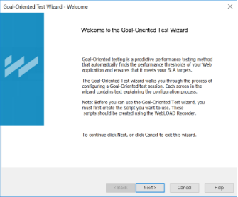
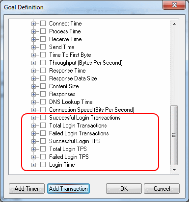
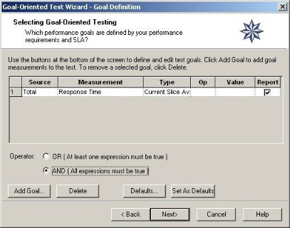
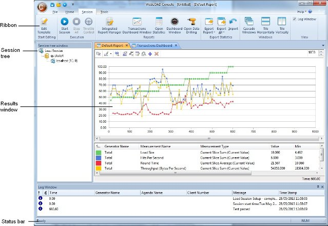
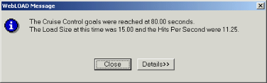
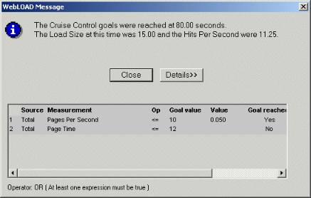

# Creating Load Templates with Goal- Oriented Test

WebLOAD Console offers the Goal-Oriented Test Wizard, a unique feature that enables goal-seeking performance testing.

## Using the Goal-Oriented Test

The Goal-Oriented Test is a predictive feature within WebLOAD Console that identifies the performance threshold of a Web application. You define one or multiple performance parameters and the Goal-Oriented Test automatically creates a schedule and increases the load until your Web application performance falls below the user- defined profile. The Goal-Oriented Test incorporates intelligent, distributed load generation capabilities for virtually unlimited load generation.

Using the Goal-Oriented Test wizard to create a Load Template, you define:

- The script(s) to run
- The Load Machines on which the load is generated
- The performance goals to achieve

You can also specify script options including the type of browser to emulate, connection speed, and playback sleep time options.

> **Note:** You cannot use the Goal-Oriented Test wizard if you have not yet recorded (or otherwise created) any scripts. If you do not have any scripts to work with, you must exit the wizard and create a script using one of the authoring tools, such as WebLOAD Recorder.

## How does the Goal-Oriented Test Work?

When operating WebLOAD Console manually, you specify the number of Virtual Clients that WebLOAD Console should simulate. The evaluation of the SUT’s performance is based on this number. For example, you might configure WebLOAD Console to test the performance of your Web application when 200 Virtual Clients perform a certain function simultaneously. WebLOAD Console runs the test and may report that when 200 Virtual Clients are running, the application Response Time is “x”.

The Goal-Oriented Test is different. The Goal-Oriented Test enables you to specify the performance goals that you want to achieve, and WebLOAD Console generates a Goal- Oriented Test test that automatically schedules a test to achieve the specified goals. For example, if your performance goal is for your application server’s response time not to exceed three seconds, the Goal-Oriented Test devises the test for you. The

Goal-Oriented Test tells you how many users your application server is able to accommodate when your performance goals are met.

The Goal-Oriented Test is a unique WebLOAD Console feature. It enables you to devise your test to reflect the real way that you want to see your application performance. Many times, you do not know the number of clients that will access your site, but you do know the quality of service you want to achieve. Rather than running multiple tests to measure the performance at different loads, you can run the Goal- Oriented Test once, measuring the performance level you desire.

## The Goal-Oriented Test Wizard Workflow

The following diagram illustrates the Goal-Oriented Test Wizard workflow.

## Opening the Goal-Oriented Test Wizard

**To open the Goal-Oriented Test Wizard:**

1. Select **Goal-Oriented Test Wizard** from the Console shortcut dialog box at the system startup,

   -Or-

   Click **Goal-Oriented Test Wizard** in the Home tab of the ribbon. The Goal-Oriented Test Wizard Welcome dialog box opens.

   
2. Click **Next**.

   The Goal-Oriented Test Wizard progresses to the Script Type screen.

## Selecting a Script or Mix

The next step in configuring a Goal-Oriented test is to define the type of script you want to run during your test session. Scripts are test scripts (scenarios) that describe user activity, and are used to test your Web application.

WebLOAD Console supports two types of scripts:

- **Single Scripts** – which are lone test-scripts.
- **Mix of Scripts** – which are a combination of scripts used to simulate groups of users performing different activities on the system under test (SUT) at the same time.

**To run a single script:**

1. Select **Single Script**.
2. Click **Next**.

   WebLOAD Console progresses to the Script Selection screen. See [*Running Single Scripts* ](#running-single-scripts).

**To run a Mix of Scripts:**

1. Select **Mix**.
2. Click **Next**.

   WebLOAD Console progresses to the Mix Selection screen. See [*Running a Mix of Scripts* ](#running-a-mix-of-scripts).

## Running Single Scripts

You must have a script to continue configuring a test with the Goal-Oriented Test Wizard. If you do not have any scripts to work with, you must exit the wizard and go into one of the authoring tools, for example WebLOAD Recorder, and create a script.

**To run a script:**

1. Select the source of the script to be used for this test. Click the button and select an existing script from your system.
2. To optionally open and view or edit the selected script, click **View**. WebLOAD Recorder opens displaying the selected script.
3. To optionally configure runtime options exclusive to this script, click **Options**.

   The Script Options dialog box opens enabling you to define the runtime options for the selected script. For more information on script options, see [*Setting Script Options* ](set_script_options.md).
4. Click **Next**.

   The Goal-Oriented Test Wizard progresses to the PMM Settings screen. See

   [*Selecting Performance Measurements* ](console_performance_reports.md).

## Running a Mix of Scripts

Using the Goal-Oriented Test Wizard you can run your test using a saved Mix or create a new Mix of scripts through the wizard. The following illustration shows the process for selecting a Mix of scripts to be used in a Goal-Oriented Test test.

Using Mix you can prepare a combination of scripts, each performing a specific activity. Then you can tune your testing by changing the combination of scripts, and changing the weight of each script in the Mix.

Combining scripts through a Mix can simulate different groups of users performing different activities on the SUT at the same time. Using a Mix is another way you can create test scenarios emulating real-life behavior.

**To run a Mix of scripts:**

1. Select the source for the Script Mix to be used for this test from the **Mix Selection** dialog box. You can either:

   - Select **Use an Existing Mix** and click the  button to select a \*.mix file from your system.
   - Select **Create a Mix** to configure a new Mix.
2. Click **Next**.

   WebLOAD Console progresses to the Mix Definition dialog box. See [*Defining a Mix*](#defining-a-mix).

### Defining a Mix

A Mix is a set of scripts, each performing different activity, to simulate groups of users performing different activities on the SUT at the same time. If you selected **Use an Existing Mix** on the script / Mix Selection screen, the selected Mix appears on the screen, enabling you to modify the Mix. You can also create a new Mix.

#### Creating a Mix

**To create a Mix:**

1. Enter a descriptive name in the **Mix name** field.
2. Specify whether the relative weights of the script refer to execution time or to number of virtual clients:

   - **Based on the number of virtual clients** – The mix interprets the relative weights in terms of number of virtual users. For example, if the weight of Script A is 25 and of Script B is 75, the mix execution runs script A with 25% of the virtual users and script B with 75% of the users.
   - **Based on the execution time** – The mix interprets the relative weights in terms of time. For example, if the weight of Script A is 25 and of Script B is 75, the mix execution run script A for 25% of the time and script B for 75% of the time.
3. Click **Add**.

   The Open dialog box appears, enabling you to select the script to add to the Mix.
4. Select a script from your file system and click **Open**. The script is added to the Mix.
5. Optionally, select the script and set any of the following parameters:

   1. **Script name** – Specify a name for the script and its particular settings. Keep in mind that in a mix, in addition to running different scripts, you can also run the same script under different settings. For example, a mix can contain two items: Script A running on Chrome, and the same Script A running on Mozilla Firefox. Give a different descriptive name to each of the two mix items.
   2. **Weight** – Specify the relative weight of this script, as a positive whole number. The application will run each script based on its weight in relation to the total of weights. When the total of weights is 100, the weight is equivalent to a percentage; however, this is not required. For example, if you specified a weight of 1 for Script A and a weight of 3 for Script B, then the system assigns script A a relative weight of 1/4, and to Script B the relative weight of 3/4. This is equivalent to a weight of 25 for Script A and 75 for Script B; in both cases, Script A will run 25% of the rounds, and Script B will run 75% of the rounds.
   3. **Browser** and **Version** – Select the browser type and browser version. Alternatively, click the Change button to edit the user agent definition. 
   4. **Bandwidth** – Specify a bandwidth. You can do this in one of two ways:
      - Select a bandwidth from the drop-down list.
      - Enter a number, to specify that number of bits per second.
   5. **Max Connections** – Specify the number of max connections for the load generator.
6. Optionally, click **Options** to set any of the settings available from the Script Options dialog box (such as the browser to emulate, connection settings and playback sleep options). This will change the settings of the currently selected item only.

   The Script Options dialog box opens. For information on setting the Script Options, see [*Setting Script Options* ](set_script_options.md).
7. Repeat steps [3 ] through [6 ] to add additional scripts to the Mix.
8. In the Weight box, type or select the relative weight for the Script. Click **Make Equal** to assign equal weight to all of the Scripts in the Mix.
9. Click **Save**.

   The Mix configuration is saved with the extension \*.mix.
10. Click **Next**.

    WebLOAD Console progresses to the PMM Settings screen. See [*Selecting Performance Measurements* ](#selecting-performance-measurements).

#### Deleting a script from a Mix

**To delete a script from a Mix:**

1. Select the Script you want to delete from the Mix.
2. Click **Remove**.

#### Viewing a script from a Mix

**To view a script from a Mix in the WebLOAD Recorder:**

1. Select the script you want to view.
2. Click **View**.

   The WebLOAD Recorder is launched, and displays the selected script.

#### Selecting Performance Measurements

You can optionally open the Performance Measurements Manager and configure WebLOAD Console to collect performance statistics from your application server, database, and Web server while the test is running.

1. Click **Add Monitors** to the Performance Measurements Manager and configure the performance statistics to monitor and display in real-time during the test.

   The Performance Measurements Manager opens. For more information on configuring the statistics to monitor, see [*Performance Measurements Manager* ](performance_measurements_manager.md).
2. Click **Next**.

   The Goal-Oriented Test Wizard progresses to the Host Selection screen. See

   [*Selecting Host Computers* ](#selecting-host-computers).

## Selecting Host Computers

After selecting the script to use for the test, WebLOAD Console displays the Host Selection dialog box.

Hosts are the computer systems participating in the test session. In this dialog box you define the hosts to participate in the Goal-Oriented test. Host computers can be dedicated, local computers, or they can be computers which are rented on a temporary basis from the Amazon™ Elastic Compute Cloud™ (EC2). Hosts can act as Load Machines or Probing Client Machines.

For more information about setting up EC2 computers as host computers, refer to [*Setting Up Cloud Computers* ](create_template_wizard.md#setting-up-cloud-computers).

**Load Machines:**

By selecting a list of Load Machines, you define a pool of Hosts that WebLOAD Console uses to generate a load until the Goal-Oriented Test goal is reached. To reach your defined goal, WebLOAD Console may need to generate a large number of users accessing the SUT. The number of users that can be generated on each host depends on the power of each host machine. Defining many machines as Load Machines allows for the simulation of more users throughout the Goal-Oriented test.

**Probing Client Machines:**

WebLOAD Console reports exact measurements for single Probing Clients. By defining Probing Client Machines on different hosts, you will receive exact performance measurements for that client, rather than averages calculated for users generated on Load Generators. By defining a list of Probing Client Machines, you can receive accurate measurements at different locations (depending on the location of the host).

Therefore, it is recommended that you define at least one Probing Client Machine in a Goal-Oriented Test Session, see [*Defining Performance Goals* ](performance_measurements_manager.md).

> **Note:** If you are running a script with Perfecto Mobile script, define a single Load Machine or a single Probing Client in order to simulate a single user.

### Adding Host Computers to the Host Computers List

**To add a host computer to the host computers list:**

1. In the Host Selection dialog box, click **Add**. The Add Host Computer dialog box appears.

   
2. To add a local host computer, select **Add by host name or IP address** and enter the host computer name or IP address in the **Address** field.
3. To add cloud host machines:

   1. Select **Add Cloud host**.

      If you have not yet created a WebLOAD cloud account, a dialog box appears. Click **OK** and the Cloud Accounts dialog box appears. Create one or more WebLOAD cloud accounts as described in [*Creating WebLOAD Cloud Accounts* ](create_template_wizard.md#creating-webload-cloud-accounts).
   2. Select a WebLOAD cloud account from the **Name** drop-down box.
   3. In the **Number of Machines** field, enter the number of machines you wish to add from the selected WebLOAD cloud account.
   4. Repeat steps [b]-[c ] to specify machines from another WebLOAD cloud account.

      Optionally, click **Cloud Options** to add or modify WebLOAD cloud accounts. The Cloud Accounts dialog box appears. For information about the available actions, refer to the explanations following.
4. Click **OK**.

   - If you added a local host machine, the machine is added to the Load Machines list in the Host Selection dialog box, and is listed by the host name or IP address you entered.
   - If you added cloud host machines, a list of machines is added to the Load Machines list in the Host Selection dialog box with the names “`<*WebLOAD Cloud Account Name*>`<*X*>” where X is a number that is incremented for each added cloud host machine.

     For defining Host Computers as Load Machines and Probing Clients, see [*Designating a Host Computer as a Load Machine* ](#designating-a-host-computer-as-a-load-machine) and [*Designating a Host Computer as a Probing Client Machine* ](#designating-a-host-computer-as-a-probing-client-machine).

### Designating a Host Computer as a Load Machine

**To designate a host computer as a Load Machine:**

1. Select a host from the Host Computer window.

   To add hosts not yet defined to the Host Computer window, see [*Adding Host Computers to the Host Computers List* ](#adding-host-computers-to-the-host-computers-list).
2. Click the single arrow key adjacent to the Load Machine or Probing Clients window.

   The selected host moves to the Load Machine or Probing Clients window.
3. Repeat steps 1 and 2 to define all of the hosts participating in the test.
4. Click **Next**.

After configuring the hosts participating in the Goal-Oriented test, the Goal- Oriented Test Wizard prompts you for the goals you want to achieve.

The Goal Definition dialog box appears, see [*Defining Performance Goals* ](#defining-performance-goals).

> **Note:** If you define a Probing Client host, the Probing Client Script Selection dialog box appears

### Designating all Host Computers as Load Machines

**To designate all Host Computers as Load Machines:**

- Click the double arrow key adjacent to the Load Machine window. All of the host computers move to the Load Machine window.

> **Note:** At least one system must be configured as a Load Machine to continue working with the wizard.

### Designating a Host Computer as a Probing Client Machine

**To designate a host computer as a Probing Client Machine:**

1. Select the host from the Host Computer window.
2. Click the single arrow key adjacent to the Probing Client Machines window. The selected host moves to the Probing Client Machine window.

### Deleting a Host Computer

**To delete a host computer:**

1. Select the host name from the Host Computer list.
2. Click **Delete**.

   The host is deleted from the Host Computer list.

## Configuring Probing Clients

If you designate a host computer as a Probing Client Machine, you are prompted to assign a script for each Probing Client participating in the test session. The following screen is displayed:

**To assign a script for a Probing Client machine:**

1. Browse your file system for the script by clicking the button next to the Script Path field. The path and the name of the script you select are displayed in the fields.
2. Click **Next**.

## Defining Performance Goals

After defining the host computers participating in your test, the Goal-Oriented Test Wizard prompts you for the performance goals you want to achieve in your test session.

### About the Goal Definition Dialog Box

The Goal Definition dialog box enables you to define the performance goals for the Goal-Oriented test. The defined goals are displayed at the top of the dialog box where you can see at a glance all of the participants in the test, the measurements being tested and the goals to be achieved.

On the bottom of the dialog box define the (OR/AND) conditions of the goals where you specify whether at least one or all of the goals must be met. The buttons on the lower half of the dialog box are used for defining and editing these goals.

#### The Goal Table

The goal table in the center of the dialog box contains the following fields:

| **Field Name** | **Description**                                                                                                                                                                                                                                                                                                                                                                                                                                          |
| :------------------- | :------------------------------------------------------------------------------------------------------------------------------------------------------------------------------------------------------------------------------------------------------------------------------------------------------------------------------------------------------------------------------------------------------------------------------------------------------------- |
| Source               | `
`The source you are tracking to determine when your goal is reached. The source can be either:`

`- A Probing Client Machine`

`- A Load Machine`

`The source for Load Machines is “Total” because your results are the average of all Virtual Clients. The Source for Probing Client Machines is the name of the Probing Client.`
`                                                                                        |
| Measurement          | `
`The measurement or activity that you are testing such as:`

`- Response Time`

`- Hits Per Second`

`- Round Time`
`                                                                                                                                                                                                                                                                                                          |
| Type                 | The type of measurement or activity being tested. This is the current slice average or current slice sum.                                                                                                                                                                                                                                                                                                                                                      |
| Op                   | The operator is the condition of the test. This may be either `>=` or `<=` depending on the measurement being tracked. Here you indicate whether the results should be greater than, or less than the desired value for the goal to be reached. For example, if the measurement being tracked were Response Time, you would select the operator >= to achieve the goal when the time needed to receive a response from the server exceeds the limit for this goal. |
| Value                | The limit that determines when this goal is achieved.                                                                                                                                                                                                                                                                                                                                                                                                          |
| Report               | When this field is checked, the default Integrated Report includes the measurement for which the performance goal is defined. The Report field is selected by default.                                                                                                                                                                                                                                                                                         |

#### Operator

Below the Goal Table are the Operator radio buttons. When more than one goal is defined, the Operator enables you to establish the conditions under which the goal will be achieved.

- Select **OR** to require only one expression to be true for the goal to be achieved.
- Select **AND** to require all expressions to be true for the goal to be achieved.

#### Control Buttons

Below the Operator radio buttons, are the following control buttons:

| **Button** | **Description**                                                                                                                                   |
| :--------------- | :------------------------------------------------------------------------------------------------------------------------------------------------------ |
| Add Goal         | Open the Add Goal dialog box to add a new measurement to the test goals.                                                                                |
| Delete           | Delete a test goal.                                                                                                                                     |
| Defaults         | Open the Default Goals dialog box. For more information on using Defaults, see[*Setting and Using Defaults* ](#setting-and-using-defaults). |
| Set As Defaults  | Set the current goals as default measurements and save them for future use.                                                                             |

### Adding Performance Goals

Goals are configured by defining boundary values for selected WebLOAD Console measurements. Goals define the performance level you expect from the SUT. WebLOAD Console increases the load and runs the test until the defined goals are reached.

**To add performance goals:**

1. Click the **Add Goal** button to add measurements on which to base your goals.

   The Goal Definition dialog box opens. All of the WebLOAD Console built-in measurements are displayed in a tree structure.

   
2. Optionally add a previously-defined custom measurement of type Timer to the tree, as follows:

   1. Click **Add Timer**. A new node appears in the Goal Definition dialog box, with an empty name field.
   2. Enter the timer’s name in the name field.
3. Optionally add to the tree, measurements based on a previously-defined transaction (which you created when editing the script in the WebLOAD Recorder), as follows:

   1. Click **Add Transaction**.
   2. In the Add Transaction dialog box that appears, enter the transaction name.

      Seven measurements, based on the specified transaction, are automatically added to the tree. For example, if you add the previously-defined “Login” transaction, the following seven measurements are added.

      
4. To create rule conditions, select the checkbox adjacent to the measurements to include in the goal definition.

   For example, to define a test goal for the response time not to exceed 5 seconds, select the checkbox adjacent to Response Time.

   > **Note**: A gray circle next to a measurement indicates that no default subcomponents are defined (the upper level component cannot be selected). To select subcomponents, click the + to expand the tree.
   >
5. Click **OK**.

   WebLOAD Console closes the list and opens a row for each of the selected measurements in the Goal Definition dialog box.

   
6. Click in the **Op** field and select an operator from the drop-down list.
7. Click in the **Value** field and type a boundary value for the goal.
8. Ensure that the Report field is checked to include the goal measurement in the Goal-Oriented Test default Integrated Report.
9. Click **Next**.

   WebLOAD Console displays the Acceleration dialog box. For additional information, see [*Defining the Acceleration Rate* ](#defining-the-acceleration-rate).

#### Configuring a Goal - An Example

Suppose your goal is for your Web application server Response Time not to exceed five seconds.

**To configure the goal:**

1. Click **Add Goal**.

   The Goal Definition window is displayed.
2. Select **Response Time** from the list of measurements and click OK.

   This measurement is displayed in the table on the Goal Definition dialog box.
3. Because the goal is for the Response Time not to exceed five seconds, select the operator **>=** and the Goal Value **5** by modifying the Op and Goal Value cells.

When you run the test, WebLOAD Console increases the load on the SUT until the Response Time for each simulated user reaches or exceeds five seconds and then it stops the test.

#### Deleting a Goal

**To delete a goal:**

1. Select the goal to be deleted on the Goal Definition screen by clicking the number to the left of the goal.
2. Click **Delete**.

   The goal is removed from the Goal Definition dialog box.

### Setting and Using Defaults

The Goal-Oriented Test Wizard enables you to save goals that you have defined, and reuse them in subsequent tests. To do this, set your defined goals as the default, and then use the defaults in later tests.

#### Setting Defaults

The Set As Default button sets all of the Goals located on the Goal Definition dialog box as defaults. This operation overrides any previous default configurations.

#### **To set defaults:**

1. Configure the test goals that you want to save as the default.
2. Click **Set As Defaults**.

#### Using Defaults

#### **To use defaults:**

1. On the Goal Definition dialog box, click **Default**. The Goal Defaults dialog box appears.

   
2. Select the goal to be included in the Goal-Oriented Test test session by selecting the number to the left of the goal (use the Ctrl or Shift keys to select more than one goal).
3. Click **OK**.

   The goal(s) are added to the test definition.

## Defining the Acceleration Rate

The Goal-Oriented Test increases the number of Virtual Clients accessing the application until the performance goals are met. The acceleration rate is the rate at which WebLOAD Console increases the number of Virtual Clients accessing the SUT at each acceleration step. Use a large number of clients for a fast acceleration to reach your goals quickly. Set WebLOAD Console to increment the number of Virtual Clients more slowly for fine-tuned results.

**To define the acceleration rate:**

1. Click the slider and move up and down the scale to select an acceleration rate. RadView recommends:

   0. Accelerating at a rate of 15 Virtual Clients to reach your goals quickly.
   1. Accelerating at a rate of 5 Virtual Clients for fine-tuned results.
2. Type or select the initial load to begin the Goal-Oriented Test Session in the Start load with Virtual Clients box.
3. The Goal-Oriented Test automatically optimizes the load distribution of Virtual Clients among the Load Generators participating in the test. To override this feature and distribute the load evenly between the Load Generators select the Distribute load evenly amongst Load Generators checkbox.
4. Click **Next**.

   The wizard progresses to the Goals Achieved dialog box.

   > **Note:** The number of users that WebLOAD Console can generate on any given Load Machine in an efficient manner (so that the addition of users will not reduce the performance on that machine) is dependent on the power of the host machine. When WebLOAD Console estimates that it has reached the maximum output on a specific host, a log message is sent. WebLOAD Console continues to accelerate the load until the end of the Goal-Oriented test session.
   >

## Defining WebLOAD Console’s Action Once the Goals are Reached

After configuring your Goal-Oriented test you must define WebLOAD Console’s response once the test goals are reached.

The Goal-Oriented Test can be set to stop, to continue testing under the same load, or to continue accelerating the number of Virtual Clients.

**To set WebLOAD Console to stop:**

1. Select **Stop**.
2. Click **Next**.

   The wizard progresses to the Finish dialog box.

**To set WebLOAD Console to continue running with the same load:**

1. Select **Continue with the same load**.
2. Type or select the amount of time (in minutes) that WebLOAD Console should continue running with the same load after the test goals are reached.
3. Click **Next**.

   The wizard progresses to the Finish dialog box.

**To set WebLOAD Console to continue accelerating the number of Virtual Clients:**

1. #### Select **Continue with the same acceleration**.
2. Type or select the amount of time (in minutes) that WebLOAD Console should continue accelerating the load after the test goals are reached.
3. Click **Next**.

   The wizard progresses to the Finish dialog box.

## Finishing the Goal-Oriented Test Wizard

The product of your testing is the WebLOAD report, where you can see how your Web application handles the load that you tested. The Goal-Oriented Test Wizard automatically generates a predefined report that measures:

- Load Size (the number of Virtual Clients being generated)
- The WebLOAD Console measurements for which goals are defined

WebLOAD Console saves all of the values for the complete set of measurements. You can decide after the test has run to display the results never before requested.

**To finish the Goal-Oriented Test Wizard:**

1. From the Finish dialog box, click **Finish**.

   A message box appears asking if you want to save the current Load Template.

   
2. Click **Yes** to save the current Load Template as a \*.tpl file.

   Load Templates contain the parameters that you defined for the test, such as the participating hosts in a test and the test plan. Using Load Templates saves you the time of reconfiguring the Load Session when repeating tests.

The Goal-Oriented Test Wizard is finished and the test begins. WebLOAD Console displays the Goal-Oriented Test Default Report.

## Viewing the Goal-Oriented Test Default Report

When running a Goal-Oriented test session, the WebLOAD Goal-Oriented Test Default Report opens automatically in Chart View.

Real-time results are displayed in graphs on the right side of the Console screen. The following elements are displayed on the screen:

| **Elements** | **Description**                                                                                                                                                           |
| :----------------- | :------------------------------------------------------------------------------------------------------------------------------------------------------------------------------ |
| Ribbon             | Contains options for configuring and controlling the Goal-Oriented test session.                                                                                                |
| Session Tree       | Presents a graphical display of your Goal-Oriented test session.                                                                                                                |
| Results Window     | All of the reports opened during the Goal-Oriented test session will appear in this window. Use the tabs located at the top and bottom of the window to view different reports. |
| Status Bar         | Indicates the program status.                                                                                                                                                   |

The Goal-Oriented Test Session continues running until the performance goals are achieved. When the performance goals are reached, WebLOAD Console displays a message box with the test results.

The following is an example of a Test Results message box:

Click **Details** to examine the original goal settings and statistics for them. A complete report displayed as follows:

> **Note:** You can view the Details Report window while the test is running by right- clicking the **Load Session** icon in the Session Tree.
