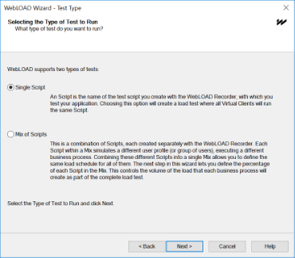
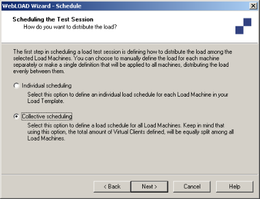
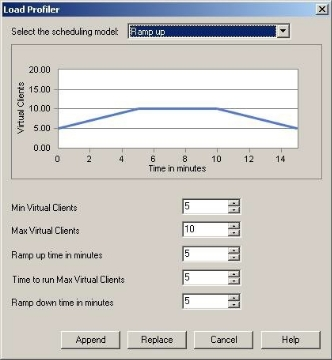

# Creating Load Templates with the WebLOAD Wizard

The easiest way to configure a Load Template is using the WebLOAD Wizard.

## Using the WebLOAD Wizard to Create Load Templates
Using the wizard to create a Load Template, you define the following:

- Script(s) to run
- Load Machines on which the load is generated
- Number of Virtual Clients to run
- Load schedule

You can also specify script options including the type of browser to emulate connection speed, and playback sleep time options.

The WebLOAD Wizard walks you through the configuration process step-by-step. Each screen of the WebLOAD Wizard contains text explaining the configuration process.

After creating a Load Template with the WebLOAD Wizard, you can add functionality, not available in the wizard, through the Console ribbon. The Console allows you access to any part of the configuration process at any time. For details about the Console ribbon, see [*The Console Ribbon Options* ](console_features.md#the-console-ribbon-options).

> **Note:** You cannot use the WebLOAD Wizard if you have not yet recorded (or otherwise created) any scripts. If you do not have any scripts to work with, you must exit the wizard and create a script using one of the authoring tools, such as WebLOAD Recorder.

## The WebLOAD Wizard Workflow

The following diagram illustrates the WebLOAD Wizard workflow:

## Opening the WebLOAD Wizard

**To open the WebLOAD Wizard:**

1. Select **WebLOAD Wizard** from the WebLOAD Startup dialog box,

   -Or-

   Click **WebLOAD Wizard** in the **Home** tab of the ribbon. The WebLOAD Wizard Welcome dialog box opens.

   

   

2. Click **Next**.

   The WebLOAD Wizard progresses to the script/Mix Type dialog box.

   

## Selecting a script or Mix

The next step in a WebLOAD session is to select the type of script you want to run during your test session. A script is the test script used to test your application.

WebLOAD Console supports two types of scripts:

- **Single scripts** ‒ lone test-scripts.
- **Mix of scripts** ‒ a combination of scripts. Use a Mix to simulate different groups of users performing different activities on the SUT at the same time.

**To run a single script:**

1. Select **Single Script**.
1. Click **Next**.

   WebLOAD Console progresses to the [Script Selection dialog box](#selecting-a-script). 

**To run a Mix of scripts:**

1. Select **Mix**.
2. Click **Next**.

   WebLOAD Console progresses to the Mix Selection dialog box. See [*Selecting a Mix*](#selecting-a-mix).

## Selecting a Script

The WebLOAD Wizard enables you to create a test using previously recorded scripts. If you do not have any scripts to work with, you must exit the wizard, and create a script using one of the authoring tools, such as WebLOAD Recorder.

**To select a script:**

1. Click the ![ref28] button to select the source of the script to be used for the test.
1. To optionally open and view or edit the selected Script, click **View**. WebLOAD Recorder opens, displaying the selected script.
1. To optionally configure runtime options exclusive to this script, click **Options**.

   The Script Options dialog box opens enabling you to define the runtime options for the selected script. 

2. Click **Next**.

   The WebLOAD Wizard progresses to the Host Selection dialog box. See [*Selecting Host Computers* ](#selecting-host-computers).
   
   

## Selecting a Mix

The WebLOAD Wizard enables you to run your test using a saved Mix or to create a new Mix of scripts through the wizard. If you do not have any scripts to work with, to create a Mix, you must exit the wizard, and create a script using one of the authoring tools, such as WebLOAD Recorder.

**To select a Mix:**

1. Select the source of the Mix to be used for the test on the Mix Selection screen:

   - Select **Use an Existing Mix** and click the ![ref29] button to select an existing Mix (\*.mix) from your system.

   - Select **Create a Mix** to build a new Mix.

2. Click **Next**.

   WebLOAD Console progresses to the Mix Creation dialog box. 

### Creating a Mix
A Mix is a set of scripts, each performing different activity, to simulate groups of users performing different activities on the SUT at the same time. If you selected **Use an Existing Mix** on the script / Mix Selection screen, the selected Mix appears on the screen, enabling you to modify the Mix. You can also create a new Mix.

**To create a new Mix:**

1. Enter a descriptive name in the **Mix name** field.

1. Specify whether the relative weights of the script refer to execution time or to number of virtual clients:

   - **Based on the number of virtual clients** – The mix interprets the relative weights in terms of number of virtual users. For example, if the weight of Script A is 25 and of Script B is 75, the mix execution runs script A with 25% of the virtual users and script B with 75% of the users.
   - **Based on the execution time** – The mix interprets the relative weights in terms of time. For example, if the weight of Script A is 25 and of Script B is 75, the mix execution run script A for 25% of the time and script B for 75% of the time.

1. Click **Add**.

   The Open dialog box appears, enabling you to select the Script to add to the Mix.

1. Select a script from your file system and click **Open**. The script is added to the Mix.

1. Optionally, select the script and set any of the following parameters:

   - **Script** – Specify a name for the script and its particular settings.

     Keep in mind that in a mix, in addition to running different scripts, you can also run the same script under different settings. For example, a mix can contain two items: Script A running on Chrome, and the same Script A running on Mozilla Firefox. Give a different descriptive name to each of the two mix items.

   - **Weight** – Specify the relative weight of this script, as a positive whole number. The application will run each script based on its weight in relation to the total of weights. When the total of weights is 100, the weight is equivalent to a percentage; however, this is not required. For example, if you specified a weight of 1 for Script A and a weight of 3 for Script B, then the system assigns script A a relative weight of 1/4, and to Script B the relative weight of 3/4. This is equivalent to a weight of 25 for Script A and 75 for Script B; in both cases, Script A will run 25% of the rounds, and Script B will run 75% of the rounds.

   - **Browser** and **Version** – Select the browser type and browser version. Alternatively, click the Change button  to edit the user agent definition. 

   - **Bandwidth** – Specify a bandwidth. You can do this in one of two ways:

     - Select a bandwidth from the drop-down list.
     - Enter a number, to specify that number of bits per second.

   - **Max Connections** – Specify the number of max connections for the load generator.

2. Optionally, click **Options** to set any of the settings available from the Script Options dialog box (such as the browser to emulate, connection settings and playback sleep options). This will change the settings of the currently selected item only.

   The Script Options dialog box opens. For information on setting the Script Options, see [*Setting Script Options* ](set_script_options.md).

3. Repeat steps 2 through 5 to add additional scripts to the Mix.

4. Click **Save**.

   The Mix configuration is saved with the extension \*.mix.

5. Click **Next**.

   The WebLOAD Wizard progresses to the Host Selection dialog box. See [*Selecting Host Computers* ](#selecting-host-computers).

   

#### Deleting a script from a Mix

**To delete a script from a Mix:**

1. Select the Script you want to delete from the Mix.
1. Click **Remove**.

#### Viewing a script from a Mix

**To view a script from a Mix in the WebLOAD Recorder:**

1. Select the script you want to view.
1. Click **View**.

   The WebLOAD Recorder is launched, and displays the selected script.

## Selecting Host Computers

On the Host Selection dialog box you define the host computers participating in the test session. Host computers can be dedicated, local computers, or they can be computers which are rented on a temporary basis from the Amazon™ Elastic Compute Cloud™ (EC2). Host computers are assigned to be either Load Machines or Probing Client Machines.

### Load Machines
By selecting a group of Load Machines, you define the pool of computers WebLOAD Console uses to generate the Virtual Clients. The number of Virtual Clients that can be generated on each host is dependent on the power of each host machine.

### Probing Client Machines
Probing Clients are single instances of Virtual Clients running WebLOAD Console while the Load Machines bombard your Web application. WebLOAD Console reports exact measurements for Probing Clients.

This dialog box has three windows. The large window on the left, entitled Host Computers, displays all the host computers defined for testing. The two windows to the right contain the systems defined as *Load Machines* and *Probing Client Machines*. Use the arrow buttons between the windows to change the roles of the host computers.

Your local system is automatically defined as the default Load Machine.

> **Notes:**
>
> At least one system must be configured as a Load Machine to continue working with the wizard.
>
> After configuring the hosts participating in the test session, the WebLOAD Wizard progresses to the Schedule dialog box. See [*Scheduling the Load Session* ](#scheduling-the-load-session).
>
> If you are running a script with Perfecto Mobile script , define a single Load Machine or a single Probing Client in order to simulate a single user.
>

### Setting Up Cloud Computers

WebLOAD supports using Amazon EC2 Cloud servers as an alternative to acquiring and maintaining physical load-generators.

The workflow for setting up EC2 computers for WebLOAD is as follows:

1. Creating an Amazon EC2 Account. For instructions, refer to[ http://aws.amazon.com/ec2/.](http://aws.amazon.com/ec2/)
1. [*Creating WebLOAD Cloud Accounts*.](#creating-webload-cloud-accounts)

#### Creating WebLOAD Cloud Accounts

After creating an Amazon cloud account, create a WebLOAD cloud account in which you specify your Amazon security credentials, the specific Amazon region where the machines should be located, and the WebLOAD image to install on the Amazon machines.

Note that you can use the same Amazon cloud account to create multiple WebLOAD cloud accounts. For example, to simulate a scenario where some users are located in US East and some in EU West, create two WebLOAD cloud accounts. Enter the same Amazon cloud account credentials in both, but specify a different region for each.

**To create WebLOAD cloud accounts in WebLOAD Console:**

1. Click **Cloud Options** in the **Tools** tab of the ribbon. The Cloud Accounts dialog box appears.

   

2. Click **Add** to define a WebLOAD cloud account.

3. Enter a name describing the account in the **Name** field. For example, Cloud US.

4. Enter the Amazon cloud security credentials in the **Access Key ID** and **Secret Access Key** fields. To determine the security credentials, perform the following:

   1. Log into your EC2 Amazon account and click **Your Account > Security Credentials**. A dialog box appears displaying your Access Key ID. Your Secret Access Key is hidden by default.
   2. Click **Show** to display the Secret Access Key.

   Alternatively, in the Cloud Accounts window, click **here** to open the Amazon AWS Accounts screen. In this screen you can create an Amazon cloud account, or enter your Amazon credentials if you had already created an Amazon cloud account.

5. In the **Region** drop-down box, you can select a specific Amazon data-center for use, by region. In the adjacent field you can optionally enter a specific URL for the cloud end-point. Any end-point which supports the EC2 API is a valid option for this field.

6. In the **AMI ID** drop-down box, select a specific Amazon Machine Image for use. If you have unique requirements, you can select **Other** and contact RadView support for advice.

7. In the **Type** drop-down box, specify the type of Amazon machine. We recommend the C1 High-CPU Medium (this is the default option).

8. Optionally, click **Get Status** to verify the details of the cloud you created.

9. For every additional WebLOAD cloud account you wish to create, repeat steps [2]-[8.].

10. In the **General** section, specify the global policy for shutting-down Cloud Machines. The policy applies to all the WebLOAD cloud accounts you create.

    In the **Stop cloud machines when session end** drop-down box, define whether the Cloud Machines being used during a session are to be automatically shut down upon stopping the session (thereby stopping the timer for payment). The possible options are:

    - **Prompt User**
    - **Stop Always**
    - **Don’t Stop**

    Keep in mind the following:

    - It takes Amazon approximately 15 minutes to prepare the Cloud Machines. If you select **Stop Always**, this process will need to be repeated after every session stop, even if you want to run multiple sessions or if you stopped a session prematurely with the intention of restarting the session immediately.
    - If you select **Don’t Stop**, the Cloud Machines will not be automatically stopped when you end a session. This means that you will continue to be charged for those machines even after a session ends successfully. Click **Terminate Cloud Machines** in the **Tools** tab of the ribbon to manually shut down the Cloud Machines and stop the payment timer.

11. Click **OK**. The credentials are saved and the use of Cloud Machines as host computers is now supported.

### Adding Host Computers

**To add a host computer:**

1. In the Host Selection dialog box, click **Add**. The Add Host Computer dialog box appears.

   

2. To add a local host computer, select **Add by host name or IP address** and enter the host computer name or IP address in the **Address** field.

3. To add cloud host machines:

   Select **Add Cloud host**.

   1. If you have not yet created a WebLOAD cloud account, a dialog box appears. Click **OK** and the Cloud Accounts dialog box appears. Create one or more WebLOAD cloud accounts as described in [*Creating WebLOAD Cloud Accounts* ](#creating-webload-cloud-accounts).

   2. Select a WebLOAD cloud account from the **Name** drop-down box.

   3. In the **Number of Machines** field, enter the number of machines you wish to add from the selected WebLOAD cloud account.

   4. Repeat steps [b] to specify machines from another WebLOAD cloud account.

      Optionally, click **Cloud Options** to add or modify WebLOAD cloud accounts. The Cloud Accounts dialog box appears. For information about the available actions, refer to the explanations following.

4. Click **OK**.

   - If you added a local host machine, the machine is added to the Load Machines list in the Host Selection dialog box, and is listed by the host name or IP address you entered.

   - If you added cloud host machines, a list of machines is added to the Load Machines list in the Host Selection dialog box with the names “<*WebLOAD Cloud Account Name*><*X*>” where X is a number that is incremented for each added cloud host machine.

For defining host computers as Load Machines and Probing Clients, see [*Designating a Host Computer as a Load Machine* ](#designating-a-host-computer-as-a-load-machine), and [*Designating a Host Computer as a Probing Client Machine* ](#designating-a-host-computer-as-a-probing-client-machine).

### Designating a Host Computer as a Load Machine

**To designate a host computer as a Load Machine:**

1. Select the host from the Host Computers window and click the single arrow key ![ref30] adjacent to the Load Machine window.

   -Or-

   Double-click the host.

   The selected host moves to the Load Machines window.

1. To designate additional Load Machines repeat steps 1 and 2.

   After assigning all Load Machines and Probing Client Machines, click **Next**. The wizard progresses to the Schedule dialog box. See [*Scheduling the Load Session* ](#scheduling-the-load-session).

### Designating all Host Computers as Load Machines

**To designate all host computers as Load Machines:**

- Click the double arrow key  adjacent to the Load Machines window. All of the host computers move to the Load Machines window.

### Designating a Host Computer as a Probing Client Machine
Probing Clients act as single Virtual Clients to measure the performance of targeted activities and provide individual performance statistics of the SUT.

> **Note:** Probing Client Machines cannot run Mix scripts.

**To designate a host computer as a Probing Client Machine:**

1. Select the host from the Host Computers window.
1. Click the single arrow key ![ref30] adjacent to the Probing Client Machines window. The selected host moves to the Probing Client Machine window.
1. After assigning all Load Machines and Probing Client Machines, click **Next**.

The wizard progresses to the Schedule screen. See [*Scheduling the Load Session* ](#scheduling-the-load-session).

### Replacing a Load Machine or Probing Client Machine

**To replace a Load Machine or Probing Client Machine:**

1. From the Host Selection dialog box, select the host computer in the Load Machines or Probing Client Machine window and click the left arrow button	.

   -Or-

   In the Load Machines window, double-click the host computer.

   The host computer is moved from the Load Machines or Probing Client Machine window to the Host Computers window.

1. From the Host Computers window, select a host computer.
1. Click the right arrow button ![ref30].

   The host computer is moved from the Host Computers window to the Load Machines or Probing Client Machine window.

### Deleting a Host Computer

**To delete a host computer:**

1. Select the host name from the Host Computers list.
1. Click **Delete**.

   The host is deleted from the Host Computers list.

## Scheduling the Load Session

When you schedule a test session, you define the load to be generated throughout the Load Session.

Use the Schedule dialog box to plan your test session.

**To schedule the Load Session:**

1. Define how you want to distribute the load between the Load Machines running the script.

   - Select **Individual scheduling** to instruct WebLOAD Console how to distribute the load over the Load Machines throughout the test.
   - Select **Collective scheduling** to distribute the load evenly between the Load Machines.

1. Click **Next**.

   - If you selected **Collective scheduling**, the WebLOAD Wizard progresses to the Collective Scheduling screen. 
   - If you selected **Individual scheduling**, the Wizard progresses to the Individual Scheduling screen. 
   

### Collectively Distributing the Load

WebLOAD simplifies the process of scheduling the test session by enabling you to automatically distribute the load between the Load Machines, saving you the time of creating a load schedule for each Load Machine individually.

You can create a load schedule by any combination of the following methods:

- Manually defining time frames and the load to generate over each frame
- Manually limiting the run by number of rounds
- Using the Load Profiler

#### Creating a Collective Load Schedule

**To create a collective load schedule manually:**

1. Enter the number of days and the starting time to generate the load in the From field.

   The starting time is defined for each particular script relative to the beginning of the test session.

   **Note:** Days are numbered 00 through to 99. Following them are hours:minutes:seconds. Seconds are numbered 1 through 59. To enter one minute, use the 1:00 syntax not 00:60.

   

2. Enter the number of days and the ending time to generate the load in the To field.

   The ending time is defined for each particular script relative to the beginning of the test session.

   If the To field is left blank, WebLOAD Console continues generating the load until the From time in the next entry for this script, or, if this is the last entry for this script, until the test session is stopped manually.

3. Under Load Size enter the number of Virtual Clients to generate during the time frame defined in steps 1 and 2. The load is distributed equally among the Load Machines defined for the script.

4. Optionally, schedule additional Virtual Client loads for this script:

   1. Click **Add** to add a blank line to the schedule grid.
   1. Repeat steps 1 through 3.

5. Click **Next**.

   WebLOAD Console displays the Finish dialog box.

The WebLOAD Wizard continues the configuration process with the Finish dialog box. For further instructions, see [*Completing the WebLOAD Wizard* ](#completing-the-webload-wizard).

#### Limiting a Run by Number of Rounds

**To limit a run by the number of rounds**

- Enter the number of rounds in the **Limit Run to** field.

#### Creating a Collective Load Schedule with the Load Profiler

**To create a collective load schedule with the Load Profiler:**

1. Select an entry in the schedule grid by clicking it to enable the Load Profiler button for that entry.

1. Click the Load Profiler button. The Load Profiler opens.

1. Select a schedule pattern from the Scheduling model field at the top of the dialog box. For an explanation of each model, see [*Scheduling Models* ](#scheduling-models).

1. Fill in the fields at the bottom of the dialog box.

1. Click **Append** to include the load definition in the schedule,

   -Or-

   Click **Replace** to substitute the load definition for the one appearing in the Schedule dialog box.

### Individually Scheduling the Load
You can schedule the load to be generated on each Load Machine participating in the test session individually, enabling you to distribute the load based on the strengths of the Load Machines running in the test session.

#### Scheduling the Session Individually

**To schedule the session individually:**

1. Expand the Load Machine tree using the + / - button adjacent to the Load Machine you want to schedule.

1. Limit the run by time, by number of rounds, or both. If you limit the run by setting both a time condition and a number of rounds condition, then the run will stop as soon as one of the conditions is fulfilled

   To limit the run by time, perform the following for each Load Machine or Probing Client Machine defined in the Session Tree.

   1. Enter the number of days and the starting time, to generate the load in the **From** field.

   1. The starting time is defined for each particular script relative to the beginning of the test session.

      **Note:** Days are numbered 00 through to 99. Following the days are the hours, minutes, and seconds in the following format: hours:minutes:seconds. Seconds are numbered 1 through 59. To enter one minute, use the 1:00 syntax not 00:60.

   1. Enter the number of days and the ending time, to generate the load in the **To** field.

   1. The ending time is defined for each particular script relative to the beginning of the test session. If the **To** field is left blank, WebLOAD Console continues generating the load until the From time in the next entry for this Load Machine, or if this is the last entry, until the test session is stopped manually.

   1. In the **Virtual Clients** field enter the number of Virtual Clients to generate during the time frame defined in steps (a) and (b).

   1. You can optionally schedule additional Virtual Client loads for this Load Machine:

      1. Click **Add** to add a blank line to the schedule grid.
      1. Repeat steps (a) through (c).

4. To limit the run by number of rounds, enter the number of rounds in the **Limit Run to** field.

5. Click **Next**.

   The WebLOAD Wizard continues the configuration process with the Finish screen. For further instructions, go to [*Completing the WebLOAD Wizard* ](#completing-the-webload-wizard).

#### Scheduling a Session Individually with the Load Profiler

**To schedule a session individually with the Load Profiler:**

1. Click the **Load Profiler** button.

The Load Profiler opens.

![ref32]

*Figure 58: Load Profiler*

1. Select a pattern from the Scheduling model field at the top of the dialog box. For an explanation of each model, see [*Scheduling Models* ](#scheduling-models).
1. Fill in the fields at the bottom of the dialog box.
1. Click **Append** to include the load definition in the schedule,

   -Or-

   Click **Replace** to substitute the load definition for the setting in the Schedule dialog box.

### Scheduling Models

WebLOAD Console includes numerous scheduling models to provide a wide variety of options and aid you in quickly achieving a schedule that meets you testing goals.

#### Linear Scheduling Model

The linear model increases the load with linearly increasing values. Using this model you need to define:

- **Total time in minutes** ‒ the number of minutes to generate the load using this model.
- **Starting number of Virtual Clients** ‒ the number of Virtual Clients from which to begin.
- **Concluding number of Virtual Clients** ‒ the number of Virtual Clients with which to end.

For example, using this model the load will start at the value defined in the Starting number of Virtual Clients field and increase (automatically calculating the intervals when the load should increase) over the time specified in the Total time in minutes field to the number of Virtual Clients defined in the Concluding number of Virtual Clients field.

#### Random

The random model scatters the load with no discernible pattern. Using this model, you need to define:

- **Total time in minutes** ‒ the number of minutes to generate the load using this model.
- **Starting number of Virtual Clients** ‒ the number of Virtual Clients from which to begin.
- **Min Virtual Clients** ‒ the absolute minimum number of Virtual Clients to generate.
- **Max Virtual Clients** ‒ the absolute maximum number of Virtual Clients to generate.

For example, using this model the load will start at the value defined in the Starting number of Virtual Clients field and randomly increase and decrease the load between the min and max load values with no relationship or trend between each interval until the time defined in the Total time in minutes field has expired.

#### Incrementing Intervals

The incrementing intervals model generates an increasing load in intervals while returning to the base load between intervals.

Using this model, you need to define:

- **Total time in minutes** ‒ the number of minutes to generate the load using this model.
- **Starting number of Virtual Clients** ‒ the number of Virtual Clients to begin from, and to return to between each interval.
- **Time between each interval (T1)** ‒ the amount of time to wait before increasing the load for each interval.
- **Time of each interval (T2)** ‒ the length of time for each interval.
- **Increase in Virtual Clients in each interval** ‒ the number of Virtual Clients to add each interval (over the load generated in the last interval).

For example, using this model the load will start at the base number of Virtual Clients, increase for the time defined as T2, return to the base load and then increase again.

Each subsequent increase will be the number of Virtual Clients from the previous interval plus the increment.

#### Incrementing Intervals (Time Calculate

The incrementing intervals (time calculate) model generates an increasing load in intervals while returning to the base load between intervals. The schedule stops when the concluding number of Virtual Clients is achieved.

Using this model you need to define:

- **Concluding number of Virtual Clients** ‒ the number of Virtual Clients with which to end.
- **Starting number of Virtual Clients** ‒ the number of Virtual Clients to begin from, and to return to between each interval.
- **Time between each interval (T1)** ‒ the amount of time to wait before increasing the load for each interval.
- **Time of each interval (T2)** ‒ the length of time for each interval.
- **Increase in Virtual Clients in each interval** ‒ the number of Virtual Clients to add each interval (over the load generated in the last interval).

For example, using this model the load will start at the base number of Virtual Clients, increase for the time defined as T2, return to the base load and then increase again.

Each subsequent increase will be the number of Virtual Clients from the previous interval plus the increment until the concluding number of Virtual Clients is achieved. The time it takes to complete the task is calculated automatically by WebLOAD Console based on the parameters defined.

#### Step Increments

The step interval model generates an increasing load in intervals. Using this model you need to define:

- **Total time in minutes** ‒ the number of minutes to generate the load using this model.
- **Starting number of Virtual Clients** ‒ the number of Virtual Clients from which to begin.
- **Time of each interval** ‒ the length of time for each interval.
- **Increase in Virtual Clients each interval** ‒ the number of Virtual Clients to increase each interval.

For example, using this model the load will start at the value defined in the Start number of Virtual Clients field, and increase gradually the amount of user defined in the Increase in Virtual Clients each interval field.

#### Step Increments (Time Calculate)

The step interval model generates an increasing load in intervals until a defined load size is reached. The time to complete the scheduled model is calculated automatically by WebLOAD Console based on the parameters defined.

Using this model you need to define:

- **Concluding number of Virtual Clients** ‒ the number of Virtual Clients with which to end.
- **Starting number of Virtual Clients** ‒ the number of Virtual Clients from which to begin.
- **Time of each Interval** ‒ the length of time for each interval.
- **Increase in Virtual Clients in each interval** ‒ the number of Virtual Clients to increase each interval.

For example, using this model the load will start at the value defined in the Starting number of Virtual Clients field, and increase gradually the amount of user defined in the Increase in Virtual Clients each interval field until the concluding number of Virtual Clients is achieved.

#### Ramp Up

The ramp up model generates an increasing load over a set time frame until reaching a defined maximum load size. The maximum load size is then run for a set period and then the load is reduced back to the base load again over a time frame defined by the user. The load increments are calculated automatically by WebLOAD Console based on the parameters defined.

Using this model you need to define:

- **Min Virtual Clients** ‒ the number of Virtual Clients from which to begin.
- **Max Virtual Clients** ‒ the maximum number of Virtual Clients to generate using this model.
- **Ramp up time** ‒ the time interval over which to increase the load in order to reach the max load size.
- **Time to run Max Virtual Clients** ‒ the time frame to run the load at the max number of Virtual Clients.
- **Ramp down time** ‒ the time interval over which to decrease the load in order to return to the minimum number of Virtual Clients.

For example, using this model the load will start at the value defined in the Min Virtual Clients field, and increase over the time frame defined in the Ramp up time field to reach the number of Virtual Clients defined in the Max Virtual Clients field. The test will then continue running with the maximum number of Virtual Clients for the period of time defined in the Time to run Max Virtual Clients field after which, load will return to the base number of Virtual Clients value over the time frame set in the Ramp down time field.

#### User Defined

The user-defined model generates the load based on values extracted from a data file. The time to complete the scheduled model is defined by the user as is the minimum and maximum number of Virtual Clients.

Using this model you need to define:

- **Total time in minutes** ‒ the number of minutes to generate the load using this model.
- **Min Virtual Clients** ‒ the absolute minimum number of Virtual Clients to generate over the schedule. At no point in the schedule should the number of Virtual Clients dip below this value.

- **Max Virtual Clients** ‒ the absolute maximum number of Virtual Clients to generate over the schedule. At no point in the schedule should the number of Virtual Clients rise above this value.
- **Data file name** ‒ the name and location on the data file to read values from for generating the load.
- **Delimiter** ‒ the delimiter used in the data file from which values are read to generate the load size.

Using this model the WebLOAD Scheduler will read values from the assigned data file and generate the load based on the values in the file. The number of Virtual Clients will fluctuate based on the number of values in the file and the time frame for which the schedule is set to run. Although the load values are based on the values in the file, the values you define for the minimum and maximum number of Virtual Clients are used to make sure that, at no time during this schedule, the number of Virtual Clients falls below the minimum value or rises above the maximum values defined. That is, the number of Virtual Clients values from the file are proportionally modified to fit within the minimum and maximum number of Virtual Clients values. For example, if your data file contains the values 50 and 100 over 1 minute and you define the minimum and maximum number of Virtual Clients as 1 and 10, WebLOAD Console automatically adjusts the values in the data file to 5 and 10 over 1 minute.

You can define a text document containing the different numbers of Virtual Clients you want and WebLOAD Console spreads those numbers out evenly during the test. For example, if your test is defined to run for ten minutes and your text file defines five numbers, then the number of Virtual Clients changes every two minutes according to the values in the file.

The following figure displays a sample text document. To use the file for the test, the name of the file is entered in the Data file name field.

## Selecting the Performance Measurements

The WebLOAD Wizard enables you to open the Performance Measurements Manager and configure WebLOAD Console to collect performance statistics from your application server, database, and Web server while the test is running.

- Click **Add Monitors** to configure the performance statistics to monitor and display in real-time during the test session.

  The Performance Measurements Manager opens. For more information on configuring the statistics to monitor, see [*Performance Measurements Manager* ](performance_measurements_manager.md).

## Completing the WebLOAD Wizard

The product of your performance testing is the WebLOAD report. Here you can see how your Web application handles the load that you have tested. The WebLOAD Wizard automatically generates a predefined report that measures:

- Hits per Second
- Round Time (the amount of time required to run one round of the script)
- Number of Virtual Clients
- Throughput (the number of bytes per second transmitted from the SUT)

WebLOAD Console saves all the values for the complete set of measurements. You can decide after the test has run to display the results never before requested.

**To complete the WebLOAD Wizard:**

1. #### Check **To run this Load Template immediately**.

1. Click **Finish**. 

   A message box appears asking if you want to save the current Load Template.

   

1. Click **Yes** to save the current Load Template as a \*.tpl file.

   Load Templates contain the parameters that you defined for the test session, such as scripts to run, participating hosts, and the test plan. Using Load Templates saves you the time of reconfiguring the Load Session when repeating tests. For more information on Load Templates see [*Managing Load Templates* ](manage_load_templates_sessions.md).

The WebLOAD Wizard closes and the load test begins.

## After Completing the WebLOAD Wizard

After you have completed the WebLOAD Wizard you can do the following:

- Run the Wizard to add a new script/mix to the template
- Edit the Load Template
- View the test results
- Modify the host selection
- Modify the load schedule

### Adding a New Script/Mix to the Template
If you want to add an additional combination of script/mix, host selection and load schedule, right click the Load Session and select **Open Wizard**. Complete the wizard.

### Editing the Load Template
After completing the WebLOAD Wizard, a Load Template with one Load Machine is created. You can save this Load Template for future Load Sessions. The Load Template can then be edited through the Console ribbon and button.

### Viewing the WebLOAD Wizard Default Report
The WebLOAD Wizard automatically generates a predefined report that measures:

- Hits per Second
- Round Time (the amount of time required to run one round of the script)

- Load Size (the number of Virtual Clients being generated)
- Throughput (the number of bytes per second transmitted from the SUT)

You can configure your own report through the Console Reports menu. WebLOAD Console saves all of the values for the complete set of measurements. You can display the results never before requested.

### Modifying the Host Selection
After closing the WebLOAD Wizard you can edit the parameters in the Host Selection dialog box.

**To modify the host selection:**

1. Click **Load Machine Selection** in the **Home** tab of the ribbon. The Host Selection dialog box opens.
1. Make the changes as needed.
1. Click **OK**.

   The host selection parameters are changed.

> **Note:** If after closing the WebLOAD Wizard you want to edit parameters in the Host Selection dialog box, click **Load Machine Selection** in the **Home** tab of the ribbon.
>

### Modifying the Load Schedule
After closing the WebLOAD Wizard you can edit the parameters in the load schedule.

**To modify the load schedule:**

1. Click **Schedule** in the **Home** tab of the ribbon. The Schedule Manually screen appears.
1. Make the changes.
1. Click **OK**.

   The load schedule is changed.

