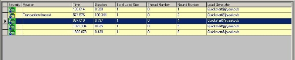

# Data Drilling Reports

The WebLOAD Data Drilling Reports provide a graphic illustration of the problematic tables, making it simple to locate and correct the source of the error.

Data Drilling reports are available after the Load Session has completed.

## Data Drilling Reports

Data Drilling provides both a global and detailed account of hit successes and failures allowing you to verify the functional integrity of your Web application at the per- client, per-transactions and per-instance level. The Data Drilling reports provide an extremely detailed yet easily accessible summary of all the statistical, timing and performance information collected over the course of the test session, which includes:

- A named entry for each HTTP action in the script. Information is automatically saved for all actions tested using the Functional Verification Wizard. Information is also saved for all user-defined or manually named transactions.

  Click a specific entry to zoom in on the detailed information available for that action. For each HTTP action tested and verified by your test script, WebLOAD Console provides a complete breakdown of all relevant information, including:

  - ![ref7]A hierarchical tree of all the ‘sub-steps’ needed to complete the specified action. For example, a single Get of a simple Web page may include multiple ‘sub-Gets’ or hits of the various frames found on that page, each with its own pictures and tables, each of which is also listed with its own ‘sub-sub-Get’.
  
    > **Note:** WebLOAD Console works with the ‘visual set’ of Web page elements associated with each action. Only the targeted frames that were actually accessed during a specific action will be saved as part of the DOM for that action, and not necessarily every single peripheral frame associated with the parent Web page.

- Detailed information about the time required for each action and sub- transaction, including low-performance flags for actions that complete correctly, but take longer than a user-set time threshold to complete.

- A hierarchical tree of all the objects accessed or otherwise associated with the specified action, together with detailed information about the time required to access each object. The timing information is broken down into the time required for each HTTP activity associated with that object, including connect time, send time, wait time (time to first byte), and final receive time.
- Entries for every timer triggered during the test session, including user- defined timers, WebLOAD-defined built-in timers, and automatic timers triggered each time ActiveX or Java object methods are activated. Click a timer entry to bring up detailed information about that timer.
- Entries for every error event triggered during the test session by both WebLOAD Console and user-defined verification functions. Click an event entry to bring up detailed information about that event.

> **Note:** Data Drilling is only available to you if:
>
> - You initiated user-defined transactions in the scripting for functional testing.
> - You configured Automatic data collection in the **Functional Testing** tab of the Script Options dialog box or Default/Current Session Options dialog boxes.
>

### Opening a Data Drilling Report

**To open a Data Drilling report:**

- Select **Open Data Drilling** in the **Session** tab of the ribbon.

  

### Viewing the Transaction Grid

The Transaction Grid is the entry point for accessing the Data Drilling reports provided by WebLOAD Console.

The Transaction Grid displays summary information for all user-defined and named transactions incorporated in the Script including:

|**Attribute**|**Explanation**|
| :- | :- |
|Transaction Name|The name of the transaction.|
|Total Count|The total number of times the transaction was executed.|
|Successful Count|The number of successful executions of the transaction.|
|Failed Count|The number of failed executions of the transaction.|
|Marked Count|The number of times a lower level transaction, meaning a transaction nested within a higher level transaction, failed within the current transaction.|

> **Note:** Some of the transactions include both successes and failures.

### Viewing the Transaction Reason Failure Grid

The Transaction Reason Failure grid lists the reasons for the transaction failure, together with the total failure count for that transaction.

The UpdateAccount transaction is highlighted in the Transaction Grid. The Reason for the UpdateAccount transaction failure, Transfer incomplete displays immediately below the Transaction Grid. The Transaction Failure Reason Grid displays why two of the UpdateAccount transactions failed.

### Viewing the Instance Grid

The Instance Grid lists the individual instances of transaction failure, together with specific details about each instance.

The following information is included for each transaction instance displayed in the grid:

|**Attribute**|**Explanation**|
| :- | :- |
|Severity|The severity level of this Transaction Instance failure, based on the return code set by the script in the Verification function.|
|Reason|The reason that the Transaction Instance failed based on information supplied by the script in the SetFailureReason function.|
|Time|The time that this Transaction Instance began execution, relative to the beginning of the current test session.|
|Duration|The time it took to complete the Transaction Instance. If the Transaction Instance failed, the duration is the time until the transaction failed.|
|Total Load Size|The total number of Virtual Clients running on the Load Generator during this Transaction Instance.|
|Thread Number|The number of the current thread running during this Transaction Instance.|
|Round Number|The number of the current round running during this Transaction Instance.|
|Load Generator|The name of the Load Generator that executed the Transaction Instance.|

The Instance Grid incorporates functional testing with performance testing and provides you with a detailed description of exactly which Transaction Instance failed, why it failed, and what else occurred at that point in the script execution for that Load Generator.

### Viewing the Parent Transaction Instance Tree

The Parent Transaction Instance Tree:

- Provides a graphic presentation of the relationships between all of the parent and children transactions, providing a detailed breakdown of all sub-events that occurred as part of the selected Transaction. For example, a transaction may involve a series of steps, including opening a connection, sending a signal, waiting, receiving a response, etc.
- Lists all of the details about the selected Instance provided in the Instance Grid.

A transaction is selected in the tree at the left. The fact that this transaction triggered an error is indicated by the blue flag icon next to the transaction and the blue color of the transaction itself.

The properties for the selected Transaction Instance are displayed in a table on the right side of the window. The Transaction Instance Tree provides a broad understanding of how the failed Transaction Instance fits into the general script execution.

### Viewing the Child Transaction Instance Tree

Child transactions are selected on the tree at the left. The fact that the transaction triggered an error is indicated by the blue flag on the icon next to the transaction and the blue color of the transaction itself in the tree. Details of the error are provided in the table at the right.

In the image below, the selected child transaction triggered an HTTP ERROR of severity Minor Error. The corresponding error entry in the Log Window is highlighted.

To see more information about the actual event that triggered this error, double-click the child transaction branch in the tree to expand its own sub tree, including its own Events sub-branch. Double-click more entries under the Events sub-branch to display more information about each selected item on the table at the right.

By working your way through the multiple levels of the Data Drilling reports you can achieve a complete picture of the exact point at which your script failed, along with a complete history of the general system and events that led up to the failure. This level of detailed information simplifies your work when testing and debugging your website.
