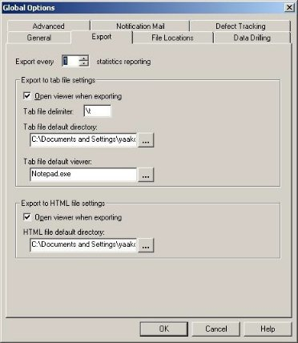

# Exporting Performance Reports

Performance Reports are the product of your test session. Performance Reports enable you to combine several different measurements into a single report. You are able to view the data accumulated in the NT and Unix Performance Monitors together with the performance data from the Load Generators and Probing Clients. All of the data displayed in the Integrated Reports and Statistics can be exported to HTML, Microsoft Excel and to Tab files. Statistics from external files can also be imported to your reports.

## Report Export / Import Options

WebLOAD Console enables you to export the following types of reports, and import external statistics:

- Reports containing only the data specified.
- General reports containing all the data from your test session.

Access the export / import options through the Reports menu in the menu bar. The following table describes each export / import option.

|**Category**|**Description**|
| :- | :- |
|Export|Exports selective WebLOAD Console report data.|
|Export All|Exports all of the statistical data gathered by WebLOAD Console throughout the test session.|
|Import External Statistics|Imports statistical data from an external file into your report.|

## Exporting Selective WebLOAD Report Data

The following is a graphic presentation of an Integrated Report. This report displays the data for Load Size, Hits Per Second, Response Time, and Process Time.

The screen below displays the data for the Response Time in tabular format.

All examples in this section refer to these reports.

### Exporting Performance Reports to Excel

You can view all of the data available in the Performance Reports from a single Excel spreadsheet. After you have exported a Performance Report to Excel, you work with the exported spreadsheet as you would with any other Excel spreadsheet.

**To export Performance Reports to Excel:**

1. Display the Integrated Report you want to export. If there is more than one report open, focus on the report you want to export.
1. Click **Export Report** † **Export to Excel** in the **Session** tab of the ribbon.

   The report is sent to Excel, which opens automatically and displays the Integrated Report.
   
   
   
   **Notes:**
   
   If Excel is not installed, you receive the following error: Cannot Open Excel.
   
   Exporting a large amount of data to Excel may take some time. Wait until the export to Excel has completed before continuing work with the Console.
   
   

3. Save the Excel file.

   The following screen shows an Integrated Report after it is exported to an Excel spreadsheet. This screen shows a tabular presentation for a graphic screen displayed in WebLOAD Console.

   

Features of this report:

- The first column contains the times (in seconds) that the measurement values were recorded.
- The top row contains the name of each measurement in the following format: Script / Measurement / Attribute. The names of the measurements are color-coded to match the measurements in the Chart View of the report.
- Integrated Reports displayed in Chart View are exported to Excel in tabular format.

See [*Customizing the Export File* ](#customizing-the-export-file), for information on configuring the sampling frequency and the delimiters of your exported report.

### Exporting Performance Reports to a Tab File

**To export Performance Reports to a Tab file:**

1. Display the report you want to export. If there is more than one report open, focus on the report you want to export.
1. Click **Export Report † Export to Tab File** in the **Session** tab of the ribbon. The Windows Save As dialog box appears.
1. Enter the name of your new Tab file. The file has a \*.tab extension.
1. Click **Save**.

   Once the file is saved, it is displayed. Configure the viewer and the view options using the Export options dialog box, see [*Customizing the Export File* ](#customizing-the-export-file).

This image shows an Integrated Report after it is exported to a Tab file and opened in Microsoft Word (using tab as a delimiter). You can change the presentation of this file using the Export options dialog box.

Features of this Report:

- The first column contains the times (in seconds) that the measurement values were recorded.
- The top row contains of the name of each measurement in the following format: Script / Measurement / Attribute.
- Integrated Reports displayed in Chart View is exported to Tab files in tabular format.

See [*Customizing the Export File* ](#customizing-the-export-file), for information on configuring the sampling frequency, the delimiters of your exported table, the viewer, and the view options.

### Exporting Performance Reports to HTML

**To export Performance Reports to HTML:**

1. Display the report you want to export. If there is more than one report open, focus on the report you want to export.
1. Click **Export Report † Export to HTML File** in the **Session** tab of the ribbon. The report is displayed in HTML.

Features of this Report:

- The first column contains the times (in seconds) that the measurement values were recorded.
- The top row contains of the name of each measurement in the following format: Script / Measurement / Attribute.
- Integrated Reports displayed in Chart View is exported to HTML in tabular format.

See [*Customizing the Export File* ](#customizing-the-export-file), for information on configuring the sampling frequency, the delimiters of your exported table, the viewer, and the view options.

## Exporting All Statistical Data

WebLOAD Console provides a wealth of statistical information about the performance of the Web system under test. All of the statistical data gathered by WebLOAD Console can be exported to Microsoft Excel, Tab files and HTML. Exporting the WebLOAD Console statistical data allows you to view and manipulate your data and perform cross report comparisons.

### Exporting All Statistics to Excel

**To export all Statistics to Excel:**

- Click **Export All** † **Export All to Excel** in the **Session** tab of the ribbon.

  Excel opens automatically and displays all of the Statistics gathered by WebLOAD Console.

The following screen shows the Statistics as they appear when exported to Excel.

Features of this report:

- The first column contains the times (in seconds) that the measurement values were recorded.
- The top row contains the name of each measurement in the following format: Script / Measurement / Attribute.
- Data is exported to Excel by columns. When the end of a sheet is reached, a new Excel sheet is opened.

See [*Customizing the Export File* ](#customizing-the-export-file), for information on configuring the sampling frequency and the delimiters of your exported table.

### Exporting All Statistics to a Tab File

**To export all statistics to a Tab file:**

1. Click **Export All † Export All to Tab File** in the **Session** tab of the ribbon. The Windows Save As dialog box appears.
1. Enter the name of your new Tab file. The file has a \*.tab extension.
1. Click **Save**.

   Once the file is saved, the data is displayed.

Change the presentation of this file using the Export options dialog box.

- The left column contains the times (in seconds) that the measurement values were recorded.
- The top row contains the name of each measurement in the following format: Script / Measurement / Attribute.

See [*Customizing the Export File* ](#customizing-the-export-file), for information on configuring the sampling frequency, the delimiters of your exported table, the viewer, and the view options.

### Exporting All Statistics to HTML

**To export all statistics to HTML:**

- Click **Export All** † **Export All to HTML File** in the **Session** tab of the ribbon. Change the presentation of this file using the Export options dialog box.
- The left column contains the times (in seconds) that the measurement values were recorded.
- The top row contains the name of each measurement in the following format: Script / Measurement / Attribute.

See [*Customizing the Export File* ](#customizing-the-export-file), for information on configuring the sampling frequency, the delimiters of your exported table, the viewer, and the view options.

### Customizing the Export File

Before data is exported you can define the way the data is displayed in the exported file.

**To customize the export file:**

1. Click **Global Options** in the **Tools** tab of the ribbon,

   -Or-

   Select **Global Options** from the Console System button. The Global Options dialog box opens.

1. Select the **Export** tab.

   The Export tab is displayed.
   
   
   
   The Export tab contains the following fields:
   
   | **Field Name**                    | **Description**                                              |
   | :-------------------------------- | :----------------------------------------------------------- |
   | Export every statistics reporting | The frequency of the number of samples exported. For example, if 1 is entered for this value, WebLOAD Console exports every sample taken. If 2 is entered for this value, WebLOAD Console exports every second sample. When configuring this option, you must consider the setting selected for sampling. If for example, the Statistics Reporting Resolution is set to 20 seconds and Export Every Statistics Reporting is set to 2, the measurement exported reflects a sampling every 40 seconds. The measurements are the measurements taken at the intervals: 20, 60, 100, 140… This option is useful in cases where there is a large amount of data due to a long test session. |
   | Open viewer when exporting        | Select this checkbox to launch the Tab File and HTML Default Viewer after the Tab or HTML file is exported. This is selected by default |
   | Tab File delimiter                | 
Definition of the delimiter used when exporting the statistical data to a tab file. All strings can be used as delimiters by entering the string in the Tab File Delimiter field.

- To use tab characters as delimiters enter \t.

- To use a new line as a delimiter, enter \r or \n.

- To use a space as a delimiter, use \s.
 |
   | Tab\HTML File default directory   | The default directory for saving Tab and HTML files.         |
   | Tab File default viewer           | The default viewer to open after the Tab file is exported.   |
   
   

3. Click **OK**.

