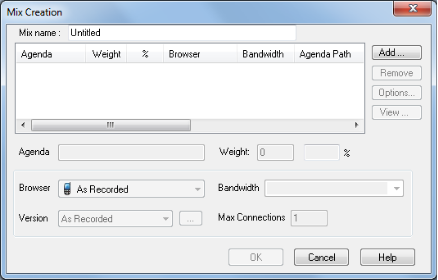

# Managing Load Templates and Load Sessions

Load Templates define the events that occur in the test including:

- The scripts to run
- The hosts participating in a test session
- The test schedule
- The number of Virtual Clients to run

Load Templates save you the time of reconfiguring the test when you are repeating tests. Load Sessions include the test definitions in the Load Template along with test results.

## Managing Load Templates

Load Templates define the events that occur in the test. You create test definitions manually or using one of the WebLOAD Wizards (WebLOAD or Goal-Oriented Test) available with WebLOAD. After creating a test definition, WebLOAD Console prompts you to save the test configuration as a Load Template. Load Templates contain complete test definitions including:

- Scripts
- Information on participating hosts
- Host schedules
- Virtual Clients to run
- Run time configuration options
- Report configurations

Load Templates include all test information except for the test results. Load Template files are saved as \*.tpl files. Load Templates can be edited using the Console ribbon and button. You can then save the Load Template for future test iterations. For example, if you build a test in the WebLOAD Wizard you can call it up in the Console and edit the Load Template manually, changing perhaps the hosts, the number of Virtual Clients and even the script. Use the commands in the **File** tab of the ribbon to create, open and save.

### Creating a New Load Template
When you create a new Load Template, you define the events to occur in the test. A blank Session Tree displays to enable you to begin configuring your test.

**To create a new Load Template:**

1.	Click **New** from the **File** tab of the ribbon. A blank template appears.

For information on creating templates with the WebLOAD Wizard, see [*Creating Load Templates with the WebLOAD Wizard* ](create_template_wizard.md). For information on creating templates with the Goal-Oriented Test Wizard, see [*Creating Load Templates with Goal-Oriented* Test ](create_load_test_goal.md).

### Saving a Load Template

**To save a Load Template:**

1. Click **Save** in the **File** tab of the ribbon and select **Save** or **Save As**.
2. In the **File Name** box, type a name for the Load Template.
3. Click **Save**.

   The file is saved with the extension \*.tpl to the specified location and the Save dialog box closes.

### Opening a Saved Load Template
**To open a saved Load Template:**

1. Click **Open** in the **File** tab of the ribbon and browse your directory structure for the location of the saved Load Template (\*.tpl) file,

   -Or-

   Select the **Open an Existing Template** option from the WebLOAD Console dialog box at system start-up and browse your directory structure for the location of the saved Load Template (\*.tpl)file.

2. Double-click the template you want to open.

3. The file opens and the test configuration displays in the Session Tree.

### Saving Additional Information with the Load Template
The Additional Information dialog box provides details about the Load Template that help identify it. For example:

- Descriptive title
- Author name
- Subject of the test
- System under test
- Other important information about the Load Template

Use the Additional Information dialog box to display information about the Load Template.

#### Setting Additional Information Properties

You can set additional information properties for the active Load Template.

**To set additional information properties:**

1. Select **Additional information** from the Console System button. The Template Additional Information dialog box opens.

   

   

2. Complete the fields to save additional information, useful for later reference, with the Load Template.

   The following fields are available:

   

   | **Field**                                  | **Description**                                              |
   | :----------------------------------------- | :----------------------------------------------------------- |
   | Title                                      | Provides a space for you to type a title for this Load Template. The title can be different then the template file name. |
   | Subject                                    | Provides a space for you to type a description of the subject of the Load Template. Use this property to group similar Load Templates together. |
   | Created by                                 | Provides a space for you to type the name of the person who authored this Load Template. |
   | Test description                           | Provides a space for you to type a description of the test objectives and what the Load Template is designed to test. |
   | Version and build of the System Under Test | Provides a space for you to type the name, version, and build number of the system under test. |
   | Template comments                          | Provides a space for you to type any comments regarding the Load Template. |
   | Custom                                     | Provides a space for you to type any comments you want saved with this Load Template. |

   

3. Click **OK**.

### Creating a Mix

A Mix is a set of scripts, each performing different activity, to simulate groups of users performing different activities on the SUT at the same time. You can create a new Mix to use with your Load Template.

**To create a new Mix:**

- Click **Mix Creation** in the **Home** tab of the ribbon. The Mix Creation dialog box appears.

Continue to one of the following sections for further instructions on creating a Mix. To create a mix with the WebLOAD Wizard, see [*Creating a Mix* ](#creating-a-mix). To create a mix with the Goal-Oriented Test Wizard, see [*Running a Mix of Scripts* ](create_load_test_goal.md#running-a-mix-of-scripts).

## Managing Load Sessions

A Load Session consists of the Load Template and the data accumulated during the test run. Load Sessions cannot be edited.

A saved Load Session includes:

- The test definition including configuration information on scripts, participating hosts, and their schedules ‒ as illustrated in the Session Tree.
- The report configuration.
- All test session results.

Load Sessions are saved in \*.ls (Load Session) files. Load Session results are saved in a \*.dat (Data) file. Saved Load Sessions are useful for viewing results of previously run test sessions.

### Saving a Load Session

**To save a Load Session:**

1. Click **Save** in the **File** tab of the ribbon.
1. Browse to the location to save the file and in the File Name dialog box, type a name for the Load Session.
1. Click **Save**.

   The file is saved with the extension \*.ls.

### Saving Additional Information for the Load Session
The Additional Information dialog box provides details about the Load Session that help identify it. For example:

- Descriptive title
- Author name
- Subject of the test
- System under test
- Other important information about the Load Session

Use the Additional Information dialog box to display information about the Load Session.

#### Setting Additional Information Properties

You can set additional information properties for the active Load Session.

**To set additional information properties:**

1. Select **Additional information** from the Console System button. The Session Additional Information dialog box opens.

   

2. Complete the fields to save additional information, useful for later reference, with the Load Session. Some of the fields, such as title, subject, and system under test, may already be completed if the information was saved with the Load Template.

   The following fields are available:

   | **Field**                                  | **Description**                                              |
   | :----------------------------------------- | :----------------------------------------------------------- |
   | Title                                      | Provides a space for you to type a title for this Load Session. The title can be different from the template file name. |
   | Subject                                    | Provides a space for you to type a description of the subject of the Load Session. Use this property to group similar Load Sessions together. |
   | Created by                                 | Provides a space for you to type the name of the person who authored this Load Session. |
   | Test description                           | Provides a space for you to type a description of the test objectives and what the Load Session is designed to test. |
   | version and build of the System Under Test | Provides a space for you to type the name, version and build number of the system under test. |
   | Results description                        | Provides a space for you to type a description of the test results. |
   | Template comments                          | Provides a space for you to type any comments regarding the Load Session. |
   | Session comments                           | Provides a space for you to type any comments regarding the Load Session. |
   | Custom                                     | Provides a space for you to type any comments you want saved with this Load Session. |

   

3. Click **OK**.

#### Opening Saved Load Sessions Files

**To open a saved Load Session file:**

1. Click **Open** in the **File** tab of the ribbon and browse your directory structure for the location of the saved (\*.ls file),

   -Or-

   Select the **Open an Existing Load Session** option from the WebLOAD Console dialog box at system start-up and browse your directory structure for the location of the saved (\*.ls file).

1. Double-click the session you want to open.

   The file is opened, the test configuration is displayed in the Session Tree and the WebLOAD Default Report is displayed in the Results window.

