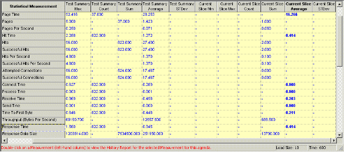

# WebLOAD Statistics Reports

The Statistics Report is both a real-time monitor that displays the results of your test while you run it and a report that you can save and export.

WebLOAD Console collects approximately 30 different statistics during a test. The Statistics Report displays the values for all of them. You can also create Integrated Reports that display only the statistics that you choose. For information about Integrated Reports, see [*WebLOAD Console Performance* Reports ](console_performance_reports.md).

## Statistical Measurements and Their Values

The Statistics Report is presented as a table.

Row headings (the labels in the first column on the left) are the names of the statistical measurements.

Column headings categorize the statistics as follows:

- **Total** ‒ Sums the values for each statistic across all the scripts running during the test.
- **ScriptName::Total** ‒ Sums the values for each statistic across all instances of the specified script running during the test.
- **ScriptName@LoadGenerator** ‒ Sums the values for each statistic across all instances of the specified script running under the specified Load Generator during the test.

The statistics displayed in each row are grouped into the following categories:

- **Per time unit** statistics are ratios that calculate an average value for an action or process. For example: Hits Per Second and Rounds Per Second.
- **Timers** track the amount of time it took the Virtual Clients to complete an action or process and are only measured for successful transactions. For example: Connect Time and Round Time.
- **Counters** track the number of times the Virtual Clients completed an action or process. For example: Hits and Rounds.

By default, WebLOAD Console displays values for its statistics at 20-second intervals. The reported value at each reporting interval is called the *current value*.

### Changing the Length of the Reporting Interval

**To change the length of the reporting interval:**

1. Click **Global Options** in the **Tools** tab of the ribbon,

   -Or-

   Select **Global Options** from the Console System button.

2. Select the **General** tab.
3. Change the value in the Statistics reporting resolution field to any number of seconds between 1 and 3,600.

### **Current Value Computation**

WebLOAD Console calculates the current value as follows:

- For per time unit and timer statistics, WebLOAD Console averages the values collected during the last reporting interval (current slice). If the reporting interval is 20 seconds (the default), the value for Hits Per Second is the average number of hits per second over the last 20 seconds. The value for Hit Time is the average time it took for a successful hit to be completed during the last 20 seconds.
- For counters, WebLOAD Console reports the number of times the item being counted occurred over the last reporting interval. If the reporting interval is 20 seconds, the value for Hits is the actual number of hits that occurred during the last 20 seconds.

### Statistics Definitions

The following list displays the various statistics, by context. The displays the definitions of the per time unit, timer, and counter statistics, alphabetically.

- Load Size
- Throughput (bytes per second)
- Page statistics – A page is an upper level request for information made by a Virtual Client to the system under test (SUT). For example, a Get statement for a URL retrieves a page. Page statistics include:
  - Pages
  - Pages Per Second
  - Page Time
- Hit statistics – A hit is a request for information made by a Virtual Client to the system under test (SUT). In other words, an HTTP request. For example, a Get statement for a URL retrieves a page. The page can include any number of graphics and content files. Each request for a gif, jpeg, html file, etc., is a single hit. Hit statistics include:
  - Hits
  - Successful Hits
  - Failed Hits
  - Hits Per Second
  - Successful Hits Per Second
  - Failed Hits Per Second
  - Hit Time
  

- Rounds statistics – A Round is an entire run of a script. Rounds statistics include:
  - Rounds
  - Successful Rounds
  - Failed Rounds
  - Aborted Rounds
  - Rounds Per Second
  - Successful Rounds Per Second
  - Failed Rounds Per Second
  - Round Time
- Connection statistics – A Connection is a new TCP/IP connection of a Virtual Client to the SUT. The Connection counter increments every time a TCP/IP connection is opened. This number is always less than or equal to hits/requests, because several hits may use the same HTTP connection if the Persistent Connection option is enabled (**Default Options † Browser Parameters**). Connection statistics include:
  - Attempted Connections
  - Successful Connections
  - Failed Connections
  - Connect Time
  - Connection Speed (Bits Per Second)
  - DNS Lookup Time
- Response statistics – A Response is an HTTP message sent from the Web server as a response to an HTTP Request. Response statistics include:
  - Responses
  - Response Data Size
  - Response Time
  - Send Time
  - Process Time
  - Receive Time
  - Time to First Byte
- HTTP Response Status
- Content Size
- Report statistics – The statistics collected by the reportStatistics command in a Selenium script. Refer to the *Navigation Timing Statistics* table in the *Selenium Integration* appendix of the *WebLOAD™ Recorder User’s Guide*.
- `<User-Defined>` statistics:
  - Automatic Data Collection
  - Timer
  - Counters
  - Transaction Timers
  - Total `<transaction name>` TPS
  - Transaction Counters
- Java andActiveX Timers
- Java and ActiveX Counters
- Server Performance Measurements

|**Statistic**|**Type**|**Definition**|
| :- | :- | :- |
|Aborted Rounds|Counter|
The number of times the Virtual Clients started to run a script but did not complete the script, during the last reporting interval.

This might be due to session being stopped either automatically or manually by the user.
|
|Attempted Connections|Counter|The total number of times the Virtual Clients attempted to connect to the SUT during the last reporting interval.|
|<User-Defined> Automatic Data Collection|Timer and counter|
If you have Automatic Data Collection enabled (**Default Options**

> **Functional Testing**), WebLOAD Console creates three counters for each GET and POST statement in the script.

The counters are the total number of times the Get and Post statements occurred, the number of times the statements succeeded, and the number of times the statements failed during the last reporting interval.
|
|Connect Time|Timer|
The time it takes for a Virtual Client to connect to the SUT, in seconds. In other words, the time it takes from the beginning of the HTTP request to the TCP/IP connection.

The value posted in the Current Value column is the average time it took a Virtual Client to connect to the SUT during the last reporting interval.

If the Persistent Connection option is enabled (**Default Options**

> **Browser Parameters**), there may not be a value for Connect Time because the HTTP connection remains open between successive HTTP requests.
|
|Connection Speed (Bits Per Second)|Per-time unit|
The number of bits transmitted back and forth between the Virtual Clients and the SUT divided by the time it took to transmit those bits, in seconds.

You can set the Virtual Clients to emulate a particular connection speed during the test either by using the Variable Connection Speed settings (**Default Options** † **Connection**) or by coding the connection speed in the script.

If a connection speed is specified for the test, WebLOAD Console reports it in the Statistics Report.

The value posted in the Current Value column is the number (sum) of bits passed per second during the last reporting interval. It should match, very closely, the connection speed you specified for the test.

For example, if:

- Reporting interval = 20 sec.

- Number of bits transmitted during last interval = 96,000 Connection Speed = 96,000 / 20 = 4,800 bits per second.
|
|Content Size|Counter|The size of the graphics and content files included in a page.|
|<User-Defined> Counters|Counter|
You can add your own counters to scripts with the SendCounter() and the SendMeasurement() functions (see the *WebLOAD Scripting Guide*). If there is a user-defined counter in the script that you are running, WebLOAD Console reports the counter’s values in the Statistics Report.

The row heading is the name (argument) of the counter, that is, the string in parenthesis in the SendCounter() or SendMeasurement() function call.

The value reported is the number of times the counter was incremented during the last reporting interval.
|
|DNS Lookup Time|Timer|The time it takes to resolve the host name and convert it to an IP by calling the DNS server.|
|Failed Connections|Counter|
The total number of times the Virtual Clients tried to connect to the SUT but were unsuccessful, during the last reporting interval.

This number is always less than or equal to the number of failed hits because hits can fail for reasons other than a failed connection.
|
|Failed Hits|Counter|The total number of times the Virtual Clients made HTTP requests but did not receive the correct HTTP response from the SUT during the last reporting interval. Each request for a gif, jpeg, html file, etc. is a single hit.|
|Failed Hits Per Second|Per-time unit|
The number of times the Virtual Clients did not obtain the correct HTTP response divided by the elapsed time, in seconds.

The value posted in the Current Value column is the number (sum) of unsuccessful HTTP requests per second during the last reporting interval.

For example, if:

- Elapsed time of test = 10 min. (600 sec.)

- Number of hits that fail to return a response = 1,200 Successful Hits Per Second = 1,200 / 600 = 2.
|
|Failed Rounds|Counter|The total number of times the Virtual Clients started but did not complete the script during the last reporting interval.|
|Failed Rounds Per Second|Per-time unit|
The number of times the Virtual Clients started but did not complete an iteration of this script divided by the elapsed time, in seconds.

The value posted in the Current Value column is the number (sum) of failed iterations of the script per second during the last reporting interval.

For example, if:

- Elapsed time of test = 10 min. (600 sec.)

- Number of failed rounds = 20

Failed Rounds Per Second = 20 / 600 = 0.033.
|
|Hit Time|Timer|
The time it takes to complete a successful HTTP request, in seconds. The Hit Time is the sum of the Connect Time, Send Time, Response Time, and Process Time for an individual page hit.

The value posted in the Current Value column is the average time it took to make an HTTP request and process its response during the last reporting interval.
|
|Hits|Counter|The total number of times the Virtual Clients made HTTP requests to the system under test (SUT) during the last reporting interval. Each request for a gif, jpeg, html file, etc. is a single hit.|
|Hits Per Second|Per-time unit|
Hits Per Second is the number of times the Virtual Clients made an HTTP request divided by the elapsed time, in seconds.

The value posted in the Current Value column is the number (sum) of HTTP requests per second during the last reporting interval.

For example, if:

- Elapsed time of test = 10 min.

- Number of hits = 12,600

Hits Per Second = 12,600 / 600 = 21.
|
|HTTP Response Status|Counter|
WebLOAD Console creates a row in the Statistics Report for each kind of HTTP status code it receives as an HTTP response from the SUT (redirection codes, success codes, server error codes or client error codes).

The value posted is the number of times the Virtual Clients received that status code during the last reporting interval.

For example:

The first digit of the Status-Code defines the class of response. The last two digits do not have any categorization role. There are five categories:

- **1xx: Informational** – Not used, but reserved for future use.

- **2xx: Success** – The action was successfully received, understood, and accepted.

- **3xx: Redirection** – Further action must be taken in order to complete the request.

- **4xx: Client Error** – The request contains incorrect syntax or cannot be fulfilled.

- **5xx: Server Error** – The server failed to fulfill an apparently valid request.
|
|Java and ActiveX Counters|Counter|
You can add function calls to your scripts that enable you to instantiate and call methods and properties in Java and ActiveX components (see the *WebLOAD Scripting Guide*). If there are ActiveX or Java function calls in the Script that you are running, WebLOAD Console reports three counters for them in the Statistics Report.

The row heading is the name of the function call. The counters are the total number of times it occurred, the number of times it succeeded, and the number of times it failed during the last reporting interval.
|
|Java and ActiveX Timers|Timer|
You can add function calls to your scripts that enable you to instantiate and call methods and properties in Java and ActiveX components (see the *WebLOAD Scripting Guide*). If there are ActiveX or Java function calls in the script you are running, WebLOAD Console reports timers for them in the Statistics Report.

The row heading is the name of the function call. The value posted is the average amount of time it took to complete the function call, in seconds, during the last reporting interval.
|
|Load Size|Counter|The number of Virtual Clients running during the last reporting interval.|
|Page Time|Timer|
The time it takes to complete a successful upper level request, in seconds. The Page Time is the sum of the Connection Time, Send Time, Response Time, and Process Time for all the hits on a page.

The value posted in the Current Value column is the average time it took the Virtual Clients to make an upper level request and process its response during the last reporting interval.
|
|Pages|Counter|The total number of times the Virtual Client made upper level requests (both successful and unsuccessful) during the last reporting interval.|
|Pages Per Second|Per-time unit|
Pages Per Second is the number of times the Virtual Clients made upper level requests divided by the elapsed time, in seconds.

The value posted in the Current Value column is the number (sum) of requests per second during the last reporting interval.

For example, if:

- Elapsed time of test = 10 min. (600 sec.)

- Number of pages = 750

Pages Per Second = 750 / 600 = 1.25.
|
|Process Time|Timer|
The time it takes WebLOAD Console to parse an HTTP response from the SUT and then populate the DOM, in seconds.

The value posted in the Current Value column is the average time it took WebLOAD Console to parse an HTTP response during the last reporting interval.
|
|Receive Time|Timer|The elapsed time between receiving the first byte and the last byte.|
|Response Data Size|Counter|
The size, in bytes, of all the HTTP responses sent by the SUT during the last reporting interval.

WebLOAD Console uses this value to calculate Throughput (bytes per second).
|
|Response Time|Timer|
The time it takes the SUT to send the object of an HTTP request back to a Virtual Client, in seconds. In other words, the time from the end of the HTTP request until the Virtual Client has received the complete item it requested (Time to first byte + Receive Time - Process Time).

The value posted in the Current Value column is the average time it took the SUT to respond to an HTTP request during the last reporting interval.
|
|Responses|Counter|
The number of times the SUT responded to an HTTP request during the last reporting interval.

This number should match the number of successful hits.
|
|Round Time|Timer|
The time it takes one Virtual Client to complete an entire iteration of a script, in seconds.

The value posted in the Current Value column is the average time it took the Virtual Clients to complete an entire iteration of the script during the last reporting interval.

For example, if:

- Virtual Clients = 2.

- First Virtual Client completes a round in 60 sec.

- Second Virtual Client completes a round in 85 sec.

- Both Virtual Clients complete the rounds within the current reported interval.

Round Time = 72.5 sec.
|
|Rounds|Counter|
The total number of times the Virtual Clients attempted to run the script during the last reporting interval.

For example:

Rounds = Failed Rounds + Successful Rounds + Aborted Rounds.
|
|Rounds Per Second|Per-time unit|
The number of times the Virtual Clients attempted to run the script divided by the elapsed time, in seconds.

The value posted in the Current Value column is the number (sum) of attempts (both successful and unsuccessful) per second during the last reporting interval.

For example, if:

- Elapsed time of test = 10 min. (600 sec.)

- Number of rounds = 200

Rounds Per Second = 200 / 600 = 0.33.
|
|Send Time|Timer|
The time it takes the Virtual Clients to write an HTTP request to the SUT, in seconds.

The value posted in the Current Value column is the average time it took the Virtual Clients to write a request to the SUT during the last reporting interval.
|
|Server Performance Measurements|Timers|
If you selected Performance Monitor statistics for the report, WebLOAD Console creates a row for them and reports their values in the Statistics Report.

For example:

Sessions Errored Out, % Processor Time, Current Disk Queue Length, and so on.

For definitions of the statistics, see the Performance Measurements Manager (click **Edit Template** in the **Session** tab of the ribbon so that you are in edit mode, then click **Performance Measurements Manager**).

Be selective when selecting server performance measurements or the system resources required to manage the data might affect the Console.
|
|Successful Connections|Counter|
The total number of times the Virtual Clients were able to successfully connect to the SUT during the last reporting interval.

This number is always less than or equal to the number of successful hits because several hits might use the same HTTP connection if the Persistent Connection option is enabled (**Default Options** † **Browser Parameters**).
|
|Successful Hits|Counter|The total number of times the Virtual Clients made HTTP requests and received the correct HTTP response from the SUT during the last reporting interval. Each request for a gif, jpeg, html file, etc. is a single hit.|
|Successful Hits Per Second|Per-time unit|
The number of times the Virtual Clients obtained the correct HTTP response to their HTTP requests divided by the elapsed time, in seconds.

The value posted in the Current Value column is the number (sum) of successful HTTP requests per second during the last reporting interval.

For example, if:

- Elapsed time of test = 10 min. (600 sec.)

- Number of hits that return a successful response = 11,400 Successful Hits Per Second = 11,400 / 600 = 19.
|
|Successful Rounds|Counter|The total number of times the Virtual Clients completed one iteration of the script during the last reporting interval.|
|Successful Rounds Per Second|Per-time unit|
The number of times the Virtual Clients completed an entire iteration of the script divided by the elapsed time, in seconds.

The value posted in the Current Value column is the number (sum) of successful iterations of the script per second during the last reporting interval.

For example, if:

- Elapsed time of test = 10 min. (600 sec.)

- Number of successful rounds = 180 Successful Rounds Per Second = 180 / 600 = 0.3.
|
|Throughput (bytes per second)|Per-time unit|
The average number of bytes per second transmitted from the SUT to the Virtual Clients running this script during the last reporting interval.

In other words, this is the amount of the Response Data Size (sum) divided by the number of seconds in the reporting interval.

For example, if:

- Elapsed time of test = 10 min.

- Reporting interval = 20 sec.

- Data size in bytes sent during last interval = 6,000 Throughput = 6,000 / 20 = 300.
|
|Time to First Byte|Timer|The time it takes from when a request is sent until the Virtual Client receives the first byte of data.|
|Total <transaction name> TPS|Per-time unit|
The number of times the Virtual Client encountered the transaction divided by the elapsed time, in seconds.

The value posted in the Current Value column is the number of times the Virtual Client encountered the transaction during the last reporting interval.

For example, if:

- Elapsed time of test = 10 min. (600 sec.)

- Number of times the VC encountered the transaction = 11,400 Total Transactions Per Second = 11,400 / 600 = 19.
|
|Timer|Timer|
You can add timers to scripts to keep track of the amount of time it takes to complete specific actions (see the *WebLOAD Scripting Guide*). If there are any timers in the scripts that you are running, WebLOAD Console reports their values in the Statistics Report.

The row heading is the name (argument) of the timer, that is, the string in parenthesis in the SetTimer() function call. The timer represents the time it takes to complete all the actions between the SetTimer() call and its corresponding SendTimer() call, in seconds.

The value posted is the average time it took a Virtual Client to complete the actions between the pair of timer calls, in seconds, during the last reporting interval.
|
|<User-Defined> Transaction Counters|Counter|
You can add user-defined transaction functions to scripts for functional tests (see the *WebLOAD Scripting Guide*). If there is a user-defined transaction function in the script that you are running, WebLOAD Console reports three counters for it in the Statistics Report.

The row heading is the name (argument) of the user-defined transaction, that is, the string in parenthesis in the BeginTransaction() function call.

The counters are the total number of times the transaction occurred, the number of times the transaction succeeded, and the number of times the transaction failed during the last reporting interval.
|
|<User-Defined> Transaction Timers|Timer|
You can add user-defined transaction functions to scripts for functional tests (see the *WebLOAD Scripting Guide*). If there is a user-defined transaction function in the script that you are running, WebLOAD Console reports a timer for it in the Statistics Report. Transaction timers are only measured for successful transactions.

The row heading is the name (argument) of the user-defined transaction, that is, the string in parentheses in the BeginTransaction() function call.

The timer represents the average time it took to complete all the actions between the BeginTransaction() call and its corresponding EndTransaction() call, in seconds, during the last reporting interva|

### Statistics for Virtual Clients and Probing Clients

There are differences in the statistics reported for Virtual Clients and Probing Clients:

- The values reported for Virtual Clients are average values based on the data reported by the total number of Virtual Clients running that script.
- The values reported for a Probing Client are the specific values for that single, representative user.

By default, Virtual Clients are single-threaded so the Load Machines can support more Virtual Clients overall. Probing Clients run with four threads in order to emulate a single user as closely as possible.

Therefore, you should use the statistics that you obtain from the different types of emulated users in different ways. For example, if you are interested in the exact experience of a typical user of your site, examine the timers like Round Time, Hit Time, Connect Time, and so on from a Probing Client. For performance or load issues, however, examine statistics (such as Successful and Failed hits, Successful and Failed Rounds, Rounds Per Second, Hits Per Second, etc.) from Virtual Clients.

## Summary Reports

Each cell in the Statistics Report is an access point for another report:

- Double-click a row heading to display a Summary by Measurement Report.
- Double-click a column heading to display a Summary by script or Summary by Total Report.
- Double-click a cell to display a summary report for that statistical measurement.

Summary reports provide the following values:

|**Value**|**Definition**|
| :- | :- |
|Current Slice/Current Value|WebLOAD Console displays values for its statistics at 20- second intervals (you can modify this in **Global Options** † **General**, by changing the value in the Statistics reporting resolution field. The reported value at each reporting interval is called the current value.|
|Sum|The aggregate or total value for this statistic (throughout all scripts and Virtual Clients).|
|Min|The lowest value reported for this statistic since the beginning of the test.|
|Max|The highest value reported for this statistic since the beginning of the test.|
|Average|
For per time unit statistics and counters, average is the total of all of the current values divided by the number of reporting intervals.

For timers, average is the total amount of time counted by the timer (not the elapsed time) divided by the Count (the total number of readings). For example, the average for Hit Time is the amount of time it took to complete all the successful hits divided by the number of successful hits (the Count).
|

The Statistics Report displays all of the statistics that WebLOAD Console collects unless there were no readings for a statistic during a test. For example, if there were no unsuccessful rounds during a test, the table would not display a row for Failed Rounds.

Additionally, if a measurement has no meaning for a specific statistic, WebLOAD Console displays a dash (-) in the cell. For example, if there were two scripts running but only one of them returned an HTTP Response Status code, the table would include a row for that Response Status and would display a dash in the cell for the script that did not return the code.

### Using the Statistics Report

Open specific statistical values by double-clicking a cell. You can click any **Script Name** or **Total** in the column headers, any **Measurement Name** in the left-hand column, or any cell at the intersection of any measurement row and script or Total column.

|**Double click**|**To**|
| :- | :- |
|Script Name|Displays a Summary Report table containing all measurement attribute values for the selected script.|
|Total|Displays a Summary Report table containing the sum of all measurement attribute values for all current scripts.|
|Measurement Name|Displays a Summary Report table containing the attribute values for this measurement for all current scripts.|
|Intersection, Measurement & Script|Displays a History Report containing all of the Attribute values recorded from the start of the current test session. These values are specific to the selected measurement and script. The complete History Report can also be accessed via the Summary Reports.|
|Intersection, Measurement & Total|Displays a History Report containing all of the Attribute values recorded for the selected Measurement totaled for all current scripts. The complete History Report can also be accessed via the Summary Reports.|

### **Statistics Report-Summary by Script**

Double-click a specific script name in the Statistics Report main window to call up a summary table. When you select a script, the report contains the values for all the attributes collected for that script.

The following example contains all of the values collected for the script, Quickstart:

The names of all the measurements tracked during the current Load Session are listed in the column at the far left. The names of all the Attributes totaled for the relevant measurements are displayed in the header at the top of the table.

**Example:**

> **Note:** The minimum time needed for the SUT to respond to requests from the script during the current test session is 1.246 seconds. The maximum time needed for the SUT to respond to the script run by Generator1 during the current slice is 0.461 seconds. The average Response Time to the script in the current slice is 1.398 seconds.

**Example:**

Double-click Response Time in the left-hand column to call up a History Report. This History Report lists all of the Response Time Attribute values recorded for the script run by Load Generator1 from the start of the current test session. This History Report can also be accessed from the Statistics Report main window by double-clicking the button located at the intersection of the Response Time row and mix1 column.

### Statistics Report-Summary by Total

Double-click the heading **Total** at the top of the Total column in the Statistics Report main window to call up the Summary by Total Report.

This table displays the sum of all measurement values for all current scripts.

The names of all the measurements tracked during the current Load Session are listed in the column at the far left. The names of all the attributes totaled for the relevant measurements for all current scripts are displayed in the header at the top of the table.

Double-click **Response Time** in the left-hand column to call up a History Report. This History Report lists all of the Response Time Attribute values recorded for all scripts from the start of the current test session. This is the same Summary Report accessed from the Statistics Report main window by double-clicking the button located at the intersection of the Response Time row and Total column.

### Statistics Report-Summary by Measurement

Double-click a specific measurement name in the Statistics Report main window to call up the following summary table.

This table displays all attribute values for the selected measurement for the current scripts.

This image shows the Response Time values for script, Test. The attributes displayed are for Min, Max, Count, Average and Current Slice. The third line displays the total values for these attributes for all running scripts.

**Example:**

Double-click **Test** in the left-hand column to call up a History Report. This History Report lists all of the Response Time Attribute values recorded for all scripts from the start of the current test session. This is the same History Report accessed from the Statistics Report main window by double-clicking the button located at the intersection of the Response Time row and script column.

### Statistics Report-History by Measurement and Script

**To open the History by Measurement and Script Report:**

- Double-click a button located at the intersection of a specific measurement row and script column in the Statistics Report main window.
- Double-click a selected script name in the left hand column of a Summary by Measurement Report.
- Double-click a selected measurement name in the far left column of a Summary by Script Report.

The History by Measurement and Script Report displays all the Attribute values recorded from the start of the current Load Session for the selected measurement and script.

The following table displays all of the Response Time Attribute values for the script, Test.

The times that the attribute values were recorded since the start of the current Load Session are listed in the column at the far left. The names of all the attributes totaled for the selected measurement and script are displayed in the header at the top of the table.

**Example:**

This table displays all Total Load Size, Current Value, Min, Max, Count, and Average values recorded for Response Time for Test. Values were recorded starting at 20 seconds after the Load Session began.

### Statistics Report-History by Measurement and Total

**To open the History by Measurement and Total Report:**

- Double-click a button located at the intersection of a specific measurement row and the Total column in the Statistics Report main window,

  -Or-

  Double-click the specific measurement name in the far left column of a Summary by Total Report.

The History by Measurement and Total Report displays all the Attribute values recorded from the start of the current Load Session for the selected measurement. 

Listed in the far left-hand column are the times that attribute values were recorded since the beginning of the current Load Session. The names of all the attributes totaled for the selected measurement are displayed in the header at the top of the table.

