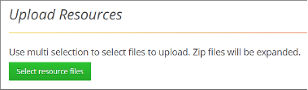

# Managing Resources

The Resources tab enables loading any file type, to the WebLOAD Dashboard’s Resources folder. You can use this functionality to upload the files of tests you created in WebLOAD Console, such as templates, scripts, sessions, etc. and any file used to test your system.

The Resources tab also offers the option of creating sub-folders. If you want the uploaded templates or script to continue working once they are uploaded to WebLOAD Dashboard, you will need to create the same hierarchy as the original hierarchy of the files you are uploading.  

## Viewing Resources

**To view the resources uploaded to WebLOAD Dashboard:** 

1\.  In the menu bar, select **Resources** > **Search**. ![ref8]

The resources can be organized hierarchically in subfolders, or some or all of them can be located in the root of the Resources folder. To view the contents of a subfolder, click the subfolder name.  

The Resources table provides the following information and available actions, for each resource or resource subfolder: 

| **Item**                                              | **Description**                                              |
| ----------------------------------------------------- | ------------------------------------------------------------ |
| **Name**                                              | The name of the resource or folder  containing resources.    |
|  | Instructs  WebLOAD to delete the resource or folder. Refer to  [*Deleting a Resource or Resources   folder* ](#_bookmark39)(on page [34](#_bookmark39)). |
|    | Instructs WebLOAD to  download the resource to the local computer. |
|  | Enables creating a load test based on the  resource. Refer to  [*Creating a Load Test Based on a   Resource* ](#_bookmark38)(on page [34](#_bookmark38)). |

## Uploading Resources

**To upload a resource into WebLOAD Dashboard:** 

1. In the menu bar, select **Resources** > **Search**. The Resources page appears [(Figure 26)](#_page37_x54.00_y429.04). 

1. If you wish to add a resource into the root folder of the WebLOAD Console Resources folder, click **Upload Resources** in the Resources page. 

1. If you wish to add a resource into a subfolder of the WebLOAD Console Resources folder: 

   1. Navigate to the subfolder in the folders tree displayed in the Resources page. If the sub folder does not yet exist, create it as described in[*Creating a Resources subfolder* ](#_page38_x54.00_y556.04)(on page[ 33)](#_page38_x54.00_y556.04) 
   1. Click **Upload Resource**.  

   The Upload Resources page appears. 

   

   

1. In the Upload Resources page, click **Select resource files**. 

1. In the file explorer window that appears, navigate to the files and select them, and then click **Open**.  

1. The files are uploaded to the folder you were in when you clicked **Upload Resource.** 

## Creating a Resources subfolder

**To create a subfolder in the Resources folder:** 

1. In the menu bar, select **Resources** > **Search**. The Resources page appears [(Figure 26)](#_page37_x54.00_y429.04). 

1. If you wish to add a subfolder under the root folder of the WebLOAD Console Resources folder, click **Create Folder** in the Resources page. 

1. If you wish to add a subfolder under a specific subfolder of the WebLOAD Console Resources folder, navigate to the specific subfolder in the folders tree displayed in the Resources page. Then click **Create Folder**. ![ref8]

   The New Resource Folder page appears. 

   

1. Specify the subfolder’s name, and click **Create**.  

## Creating a Load Test Based on a Resource

You can create a load test based on either of the following types of resources: 

- .wlp – a script as well as resources related to the script 
- .tpl – a template file 

**To create a load test based on a resource:** 

1. In the menu bar, select **Resources** > **Search**. 
1. In the Resources table, click  adjacent to a resource of type .wlp or .tpl. 
1. If the resource was a .wlp file, the Create Load Test for a Script-type test appears, with the .wlp already appearing in the **Script** field. See[` `*Creating a Script Load Test* ](#_page22_x54.00_y352.04)(on page [ 17)](#_page22_x54.00_y352.04). Set or edit any of the fields, and click **Create Test**. 
1. If the resource was a .tpl file, the Create Load Test for a template-type test appears, with the .tpl already appearing in the **Template** field. See[` `*Creating a Template Load Test* ](#_page26_x54.00_y407.04)(on page [ 21)](#_page26_x54.00_y407.04). Set or edit any of the fields, and click **Create Test**. 

## Deleting a Resource or Resources folder

1. In the menu bar, click **Resources** > **Search**. 

1. Optionally navigate to a specific subfolder in the folders tree displayed in the Resources page. 

1. Click  adjacent to a resource or subfolder. 

1. You are requested to confirm the delete operation. 

   

1. If the resource is a template, you can select between: 

1. Deleting the template as well as its associated test and sessions 

1. Deleting only the template, but keeping the associated test and sessions. 

   

1. If you specified to delete a resources folder, keep in mind that although the templates located in this folder will be deleted, the tests and sessions from those folders will be kept for review and will be displayed in the Load Tests page and Load Sessions page (but without the ability to run them).  

   

