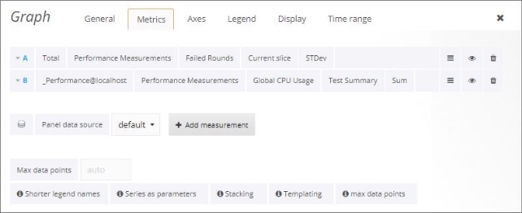
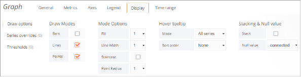
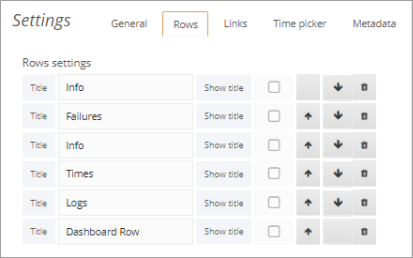

# Customizing a Dashboard

You can customize a dashboard as desired, and then save the customized dashboard if you wish. Note however that two types of changes are not considered customizations and are not saved: the selected sessions and the selected time filter. 

To save your customizations, refer to[` `*Saving your Customized Dashboard* ](./managing_dashboards.md#saving-your-customized-dashboard). 

## Customizing Rows

### Adding a row

To add a new row, click **+ ADD ROW** at the bottom of a dashboard page 

### Editing a Row

To edit a row, click the three grey dots to the left of the row and select the desired option. 

The available options include: 

| **Item**         | **Description**                                              |
| ---------------- | ------------------------------------------------------------ |
| **Collapse**     | Hides the row. To show the row again, press  the  button. |
| **Add  Panel**   | Adds a panel to the row,  of the type you specify: Graph, Singlestat, Table, Text, Alert List,  Dashboard List, or Plugin List. |
| **Row  Options** | Enables  editing a row’s settings. For information, refer to [*Editing a Row’s options* ](#editing-a-rows-options). |
| **Move  Up**     | Moves  the row up.                                           |
| **Move  Down**   | Moves  the row down.                                         |
| **Remove**       | Deletes  the row, following your confirmation.               |

### Editing a Row’s options

To edit a row’s options, click the three grey dots to the left of the row and select **Row Options**. 

A pane appears, for setting the row’s options. Edit the row as desired. 

#### Deleting a Row

To delete a row, click the three grey dots to the left of the row and select **Remove**. Confirm the operation.  

## Customizing Panels

To edit a panel, click the panel title and click **edit** in the box that appears.  

An editing pane appears, with various editing options that depend on the panel type (text, graph, table or singlestat), as described below. ![ref8]

### Editing a Panel’s General Options

Select the **General** tab to edit the panel’s general options.  

 

### Editing a Graph Panel

A graph panel can be customized in various ways, as described below. 

#### Specifying the Metrics

You can specify which metrics to display for which sessions. 

**To specify the metrics:** 

1. Click the panel’s title and select **edit**. 

1. Select the **Metrics** tab. The metrics currently displayed in the graph are displayed in the table. 

   

1. To add a measurement, click **Add Measurement**. A new line appears in the table. 

   

1. Edit the new line:  

   Select metrics for the new line you added. 

1. Optionally edit the selection of a metric in an existing line.  

The following table describes some of the operations available in the **Metrics** tab. ![ref8]

| **Item** | **Description**                                              |
| -------- | ------------------------------------------------------------ |
| 1        | Enables selecting a  category of statistics:   >  **Total** ‒ Sums the values for each statistic across  all the Scripts running during the test.   > **ScriptName::Total** ‒ Sums the values for each  statistic across all  instances  of the specified script running during the test.  > **ScriptName@LoadGenerator** ‒ Sums the values for each  statistic across all instances of the specified script running under the specified Load Generator during the test. |
| 2        | Depending on your choice  in ①,  enables  selecting a sub-category of statistics. |
| 3        | Depending on your choice  in ②,  enables  selecting a sub-category of statistics. |
| 4        | Depending on your choice  in ③,  enables  selecting a sub-category of statistics. |
| 5        | Depending on your choice in ④, enables selecting a statistic. |
| 6        | Enables:  Ÿ Toggling between  Edit mode and Display mode  Ÿ Duplicating a line  Ÿ Moving a line up  Ÿ Moving a line down |
| 7        | Toggles between showing  and hiding the metrics in the graph |
| 8        | Deletes the line.                                            |
| 9        | Adds a new line in the  table for defining a new metric in the graph. |

#### Defining the Axes Display

**To edit a panel’s axes display:** 

1. Click the panel’s title and select **edit**. 
1. Select the **Axes** tab. 

A pane appears, displaying the current axes definitions. You can change any of the definitions, and the graph display changes accordingly.  ![ref10]

#### Defining the Legend

**To edit a panel’s legend:** 

1. Click the panel’s title and select **edit**. 
1. Select the **Legend** tab. 

A pane appears, displaying the legend definitions. You can change any of the definitions, and the graph display changes accordingly.  

#### Defining the Display

**To edit a panel’s display:** 

1. Click the panel’s title and select **edit**. 
1. Select the **Display** tab. 

A pane appears, displaying the display definitions. You can change any of the definitions, and the graph display changes accordingly.  

#### Defining the Time Range

**To edit a panel’s time range:** 

1. Click the panel’s title and select **edit**. 
1. Select the **Time range** tab. 

A pane appears, displaying the time range definitions. You can change any of the definitions, and the graph display changes accordingly.  

### Editing a Singlestat Panel

Working with a singlestat panel is similar to working with a graph panel. A measurement is selected in same way (refer to[` `*Specifying the Metrics*)](#specifying-the-metrics), but you can only select a single measurement for a singlestat panel. Note that this makes singlestat panels unsuitable when working with multiple sessions. ![ref10]

***Defining the Singlestat Display Options*** 

**To edit a singlestat panel’s display:** 

1. Click the panel’s title and select **edit**. 
1. Select the **Options** tab. 

A pane appears, displaying the display definitions. You can change any of the definitions, and the graph display changes accordingly.  

 

### Editing a Table Panel

You can customize a table panel’s display directly in the dashboard.  

 The header of the table panel provides the following options: 

- Sorting the table display – Clicking any column head sorts the table by that column in ascending or descending order. 
- Filtering by severity – By clicking the down arrow in the **Severity** column head, you can select whether to view messages of all severity types, or of a certain type.

### Editing a Text

To edit the text in a Text panel, click the panel’s title and select **edit**, and then select the **Panel** tab. 

You can: 

- Select the mode: 
  - **Text** – Plain text 
  - **Html** – HTML 
  - **Markdown** - Markdown markup syntax  
- Edit the text as desired.  

### Adding Panels

To add a panel in a row, click the three grey dots to the left of the row and select **Add Panel**. Select the panel type: Graph, Singlestat, Table, Text, Alert List, Dashboard List, or Plugin List.. 

A new empty panel of the selected type appears in the row.  

Define the display in the panel by editing the panel, as described above.

### Duplicating a Panel

The duplication feature is useful if you wish to create a panel that is very similar to an existing one, or that is based on an existing panel. 

**To duplicate a panel:** 

1\.  Click the panel’s title and select **Duplicate**. 

A new panel – a duplicate of the original – is created in the dashboard. You can now edit it as desired. 

### Deleting a Panel

**To delete a panel:** 

1. Click the panel’s title and select the **Delete** icon the top right corner.

   

2. Confirm the deletion. 

   

## Customizing General Dashboard Settings 

You can customize various general dashboard settings. 

**To configure general dashboard settings:** 

1. Click the Manage Dashboard Settings icon in the middle of the dashboard header, and select **Settings**. 

   

   A Dashboard **Settings** pane appears, with multiple tabs. 

2. Set the **General** settings as desired.  

   

   

   For example, if you select **Shared Crosshair**, then hovering over one the graphs causes a corresponding crosshairs to appear in all the graphs. 

   

3. Set the **Rows** settings as desired. For example, use the up and down arrows to switch between the locations of rows in the dashboard.  

   

4. Set the **Links** settings as desired. This enables adding links that appear under the Dashboard header. You can add a link to any site, or to a dashboard.  

   

5. Set the **Time picker** settings as desired. For example, you can set the **Auto- refresh** options that appear in the **Refreshing every** dropdown. 

   

6. Click **Metadata** to view the dashboard’s metadata. This includes information about dashboard creation and updating. 

   

### Templating a Dashboard

Templating enables the creation of highly interactive and dynamic dashboards. Instead of hard-coding things like server, application and sensor name in you metric queries you can use variables in their place. Variables are shown as dropdown select boxes at the top of the dashboard. These dropdowns make it easy to change the data being displayed in your dashboard. 

For more information, refer to[ http://docs.grafana.org/reference/templating/.](http://docs.grafana.org/reference/templating/) 

### Annotating a Dashboard

Annotations provide a way to mark points on the graph with rich events. When you hover over an annotation you can get title, tags, and text information for the event. 

For more information, refer to[ http://docs.grafana.org/reference/annotations/.](http://docs.grafana.org/reference/annotations/)

`                             `
