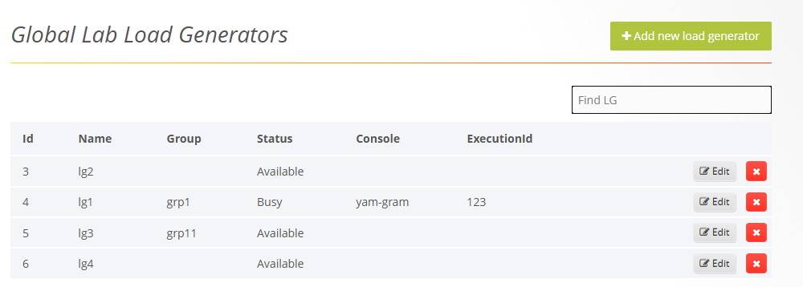
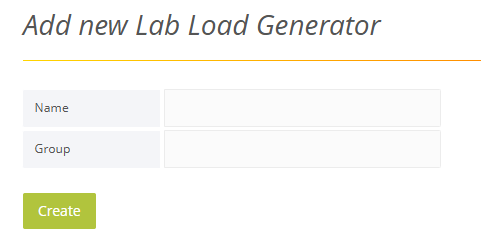

# Global Lab Load Generators

Globa Lab Load Generators are a way to dynamically allocate local load-generators. Here an Administrator can create a list of all available local load-generators - when a load-generator is used in a test, it will be marked as 'Busy' so it will not be allocated to more tests until the test is over and then it will become 'Available' again.

Global Lab Load Generators are not the same as the Organization level [Load Generators](./managing_load_generators.md), which are a list of load-generators that can be used by an organization - be local, lab mamanged or cloud.

## Adding Lab Load Generators 

**To add a new lab load generator:** 

1. In the menu bar, select **Admin** > **Global Lab Load Generators**. The Global Lab Load Generators window appears.  

    

   
1. Click **+Add a new lab load generator**. 

    An Add New Lab Load Generator window appears.

    

   
1. In the **Name** field, specify the load generator’s IP address or host name.  

1. In **Group**, optionally, specify a group that can be used to filter for certain load-generators.

## Using Lab Load Generators in the Console

1. Create an API Key. See [API Key](./managing_organizations.md#managing-api-keys)

1. In the Console **Tools** > **Cloud Options** click 'Add' and select 'Lab Load Generator'

    Lab Load Generators, even though local, are dynamic machines, like a private Cloud, so are defined in the Cloud Settings.

    

1. Specifcy the end-point URL that points to the Dashboard server that manages the load-generators, e.g. : `http://mydashboard:300`

1. Specify the credentials - this is the API Key value from the step above

1. Optionally - specify Group to filter just Load-Generators from that Group
