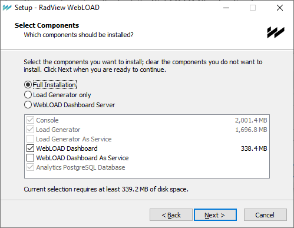

# Installing WebLOAD Dashboard

This section describes the standard WebLOAD Dashboard installation process.  

## Installation Instructions

The WebLOAD Dashboard is part of the regular WebLOAD installation.  **To install the WebLOAD Dashboard:** 

1. In the Select Components window of the WebLOAD installation wizard, select either of the following options: 

   - Select **Full Installation** and check the **WebLOAD Dashboard** checkbox to have the WebLOAD Dashboard installed locally as part of a full installation. You can also optionally check the **WebLOAD Dashboard as Service** checkbox to register the installed WebLOAD Dashboard as a Windows service.  

   - Select **Cloud Server** to only install the **WebLOAD Dashboard**. ![ref10]

     

## Enabling WebLOAD Dashboard

As a prerequisite to using WebLOAD Dashboard, you must first, in the WebLOAD Console (version 10.2 and up), enable the importing of sessions to the desired database as follows. 

1. Select **Tools** > **Global Options** > **Database**. 

   

   

2. Make sure the **Insert statistics into Postgres database during the session** checkbox is selected. 

3. Select the **Insert PMM data into database** checkbox.