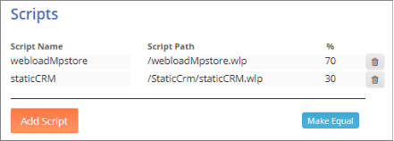

# Managing Tests

## Viewing Tests

You can view all the load tests you created in WebLOAD Dashboard. **To view the load tests:** 

- In the menu bar, select **Tests** > **Search**. 

  

The Load Tests page appears, listing the load tests in a table format. 

The Load Tests table provides the following information and actions, for each Load Test: 

 

| **Item**                                                | **Description**                                              |
| ------------------------------------------------------- | ------------------------------------------------------------ |
| **Name**                                                | The name of the Load test.  Clicking the name opens the test’s  definitions page, enabling you  to edit them. Refer to [*Editing a load test* ](#editing-a-load-test). |
| **Test  Type**                                          | The type of test: Either URL/API, Script,  or Template.      |
| **Last  Update**                                        | The date and time when the  test definitions were last updated, or the test was run manually. This field  shows no indication of whether the test is being executed in recurrence mode. |
| **Next  Execution**                                     | The date and time when the  test is next scheduled to run. Refer to [*Setting recurring test runs* ](#setting-recurring-test-runs) and [*Scheduling a one-time test run*](#scheduling-a-one-time-test-run). |
| **Last  Execution**                                     | The date and time when the test last  started running.       |
| **Last Session State**                                  | Whether the test passed or failed the last  test execution.  |
|                        | Enables viewing the last  session of this test. Selecting this option opens a Dashboard page displaying  the last session of the test. Refer to [*Using Dashboards* ](./using_dashboards.md) |
|              | Enables manually running  this test now or at a specified time. Refer to [*Scheduling a one-time test run* ](#scheduling-a-one-time-test-run). |
|                        | Instructs WebLOAD to stop  the running test.                 |
|  | Enables viewing all this  test’s sessions. Selecting this option opens a Load Sessions page [Figure 23](./manage_sessions.md#load_sessions_page) that displays  all of this test’s sessions. |
|                   | Instructs WebLOAD to  delete the load test. Refer to [*Deleting a load*](#deleting-a-load-test). |

## Creating a new load test

You can create a new load test anytime. **To create a new load test:** 

1. Perform one of the following: 

   - Select **Tests** > **New** and click **Add Load Test**. The Create a new Load Test page appears. 
   - Select **Tests** > **Search**, and click **+ Add a new load test**. The Create a new Load Test page appears. 
   - In the homepage, see the Create a new Load Test pane. 

   

   

2. Select the type of test to create. Refer to the following for detailed explanations: 

   - [*Creating a URL/API Load Test* ](#creating-a-urlapi-load-test)
 
   - [*Creating a Script Load Test* ](#creating-a-script-load-test) 

   - [*Creating a Template Load Test* ](#creating-a-template-load-test)
     

## Creating a URL/API Load Test

Use this option to instantly create a load test for testing a load on a URL and/or API. 

After entering the load test specifications, WebLOAD automatically creates a test according to the specifications. 

**To create a URL/API load test:** 

1. Perform one of the following: 

   - Select **Tests** > **New** and click **Add Load Test**. The Create a new Load Test page appears. 
   - Select **Tests** > **Search**, and click **+ Add a new load test**. The Create a new Load Test page appears. 
   - In the homepage, see the Create a new Load Test pane. 
   
   
   
   

   

2. Select **URL/API Test**.

   A Create Load Test page appears. 
   
   

3. Specify the test settings. 

   The following table describes the information you need to provide for defining the URL/API Load Test:

   | **Item**                                     | **Description**                                              |
   | -------------------------------------------- | ------------------------------------------------------------ |
   | **General**                                  |                                                              |
   | **Test  Name**                               | The name of the Load test.                                   |
   | **Request  parameters**                      | In this section, specify  the URL of the site to be tested. You can in addition create an HTTP web  service call. |
   | **Request  URL**                             | Specify the URL of the  site to be tested.                   |
   | ***Method\***                                | Optionally, specify a  method for an HTTP web service call, from the drop-down list: **Get**, **Post**, **Put**, or **Delete**. |
   | **Request  Body**                            | Optionally, specify the  web service body for the HTTP web service call. |
   | **HTTP  Headers**                            | Optionally, specify the web service header(s):  Click **Add** for  every header you wish to specify, and select the  header from the dropdown list, or enter a  custom header; then enter a value for the header. |
   | **Sleep**                                    | Specify the sleep time between each URL/API call.            |
   | **Load  Configuration**                      | For each of the following, enter a number, or use the slider tool to  specify the number. |
   | **Max  Virtual Users**                       | The maximum number of  Virtual Users to generate.            |
   | **Ramp up time in minutes**                  | The time interval over  which to increase the load from 0 Virtual Users to the number of virtual  users specified in Max Virtual Users. |
   | **Time to run Max Virtual Users in minutes** | The time interval during  which to run the load at the max number of Virtual Users |
   | **Ramp down time in minutes**                | The time interval over  which to decrease the load in order to return to 0 Virtual User |
   | **Load  Generators**                         | Select the load generator  machines that will participate in the load test, as described in [*Specifying Load Generators for a load test* ](#specifying-load-generators-for-a-load-test). |
   | **Recurrence**                               | Select this option if you  wish to schedule automatic periodic execution of the load test. Refer to [*Setting recurring test runs* ](#setting-recurring-test-runs). |

   

   

   The URL/API load test generates an increasing load over a set time frame until reaching a defined maximum load size. The maximum load size is then run for a set period after which the load is reduced back to the base load again over a time frame defined by the user. The load increments are calculated automatically by WebLOAD based on the parameters defined. ![ref10]

   Thus, the load will start with 0 Virtual Users and increase over the time frame defined in the **Ramp up time** field to reach the number of Virtual Users defined in the **Max Virtual Users** field. The test will then continue running with the maximum number of Virtual Clients for the period of time defined in the **Time to run Max Virtual Users** field, after which load will return to 0 Virtual Users value over the time frame set in the **Ramp down time** field. 

4. Select one of the following: 

   - **Create Test** – The test definitions are saved. 

   - **Create and Run Test** – The test definitions are saved, and the test starts running immediately. 

   - **Run in Sandbox Mode** – The system saves all the test definitions, but runs a limited test on the settings specified in the **Request Parameters** section while ignoring all the settings in the **Load Configuration**, **Load Generators**, and **Recurrence** sections. 

     This option is intended for SaaS users wishing to run a limited test prior to running the full test specified in the test definitions.  

## Creating a Script Load Test

Use this option to create a load test based on a WebLOAD script that was created in WebLOAD Recorder. 

**To create a script load test:** 

1. Perform one of the following: 

   - Select **Tests** > **New** and click **Add Load Test**. The Create a new Load Test page appears. 
   - Select **Tests** > **Search**, and click **+ Add a new load test**. The Create a new Load Test page appears. 
   - In the homepage, see the Create a new Load Test pane. 

   
   

   

2. Select **Script Test**. 

   A Create Load Test page appears. 

   

   

3. Specify the test settings. The following table describes the information you need to provide for defining the Script Load Test.

   | **Item**                                     | **Description**                                              |
   | -------------------------------------------- | ------------------------------------------------------------ |
   | **General**                                  | The name of the Load test.                                   |
   | **Scripts**                                  | Specify the scripts that will participate in the test, as well as  their relative weights, as described in [*Specifying Scripts for a load test* ](#specifying-scripts-for-a-load-test). |
   | **Load  Configuration**                      | For each of the following,  enter a number, or use the slider tool to specify the number. |
   | **Max Virtual Users**                        | The maximum number of Virtual Users to generate.             |
   | **Ramp up time in minutes**                  | The time interval over  which to increase the load from 0 Virtual Users to the number of virtual  users specified in Max Virtual Users. |
   | **Time to run Max Virtual Users in minutes** | The time interval during  which to run the load at the max number of Virtual Users |
   | **Ramp down time in minutes**                | The time interval over  which to decrease the load in order to return to 0 Virtual Users |
   | **Load  Generators**                         | Select the load generator  machines as described in [*Specifying Load Generators*](#specifying-load-generators-for-a-load-test) [*for a load test* ](#specifying-load-generators-for-a-load-test). |
   | **Recurrence**                               | Select this option if you  wish to schedule automatic periodic execution of the load test. Refer to [*Setting recurring test runs* ](#). |

   

   The Script load test generates an increasing load over a set time frame until reaching a defined maximum load size. The maximum load size is then run for a set period after which the load is reduced back to the base load again over a time frame defined by the user. The load increments are calculated automatically by WebLOAD based on the parameters defined. 

   Thus, the load will start with 0 Virtual Users and increase over the time frame defined in the **Ramp up time** field to reach the number of Virtual Users defined in the **Max Virtual Users** field. The test will then continue running with the maximum number of Virtual Clients for the period of time defined in the **Time to run Max Virtual Users** field, after which load will return to 0 Virtual Users value over the time frame set in the **Ramp down time** field. 

4. Select one of the following: 

   - **Create Test** – The test definitions are saved. 

   - **Create and Run Test** – The test definitions are saved, and the test starts running immediately.

   - **Run in Sandbox Mode** – The system saves all the test definitions, but runs a limited test on the settings specified in the **Scripts** section while ignoring all the settings in the **Load Configuration**, **Load Generators**, and **Recurrence** sections. 

     This option is intended for SaaS users wishing to run a limited test prior to running the full test specified in the test definitions.  

### Specifying Scripts for a load test

**To specify the script participating in a[*Script Load Test*:](#creating-a-script-load-test)** 

1. For every script you want to include in the Script Load test, click **Add Script**. 

   

   The **Scripts** page appears. 

   

   

   The Scripts page lists the scripts uploaded to the WebLOAD Dashboard. For details how to upload a script, refer to[*Uploading Resources* ](./managing_resources.md#uploading-resources). If a script was uploaded with the folder in which it is located, the folder name appears; in that case, click the folder name to navigate to the script itself. 

2. Select a script by clicking **Select Script** in the corresponding line.  

   You are returned to the Script Load Test page, with the selected script appearing in its **Scripts** list. 

   

   

3. In the **%** column, specify the relative weight of each script. Make sure that the percentages all add up to 100%. If you wish to give the scripts identical weights, click **Make Equal**. 

   

## Creating a Template Load Test

Use this option to create a load test based on a WebLOAD template file that was created in WebLOAD Console. 

**To create a template load test:** 

1. Perform one of the following: 

   - Select **Tests** > **New** and click **Add Load Test**. The Create a new Load Test page appears. 
   - Select **Tests** > **Search**, and click **+ Add a new load test**. The Create a new Load Test page appears. 
   - In the homepage, see the Create a new Load Test pane. 

   
   

   

2. Select **Template Test**. 

   A Create Load Test page appears. 

   

   

3. Specify the test settings. The following table describes the information you need to provide for defining the Template Load Test: 

   | **Item**                             | **Description**                                              |
   | ------------------------------------ | ------------------------------------------------------------ |
   | **General**                          |                                                              |
   | **Name**                             | The name of the Load test.                                   |
   | **Path**                             | Click **Select Template** to  select a template from the list appearing in the **Resources** > **Templates** page  that appears. |
   | **WebRM Virtual Clients allocation** | This is relevant  for a WebRM configuration. Specify the number of virtual users to allocate  for this test from the floating WebRM license. |
   | **Recurrence**                       | Select this option  if you wish to schedule automatic periodic execution of the load test. Refer  to [*Setting recurring test runs*](#setting-recurring-test-runs). |

   

4. Select one of the following: 

   - **Create Test** – The test definitions are saved. 
   - **Create and Run Test** – The test definitions are saved, and the test starts running immediately. 

## Specifying Load Generators for a load test 

Load generators are machines that bombard tested site with transactions to test site scalability and integrity.  Both a[` `*URL/API Load Test* ](#creating-a-urlapi-load-test)and a[` `*Script Load Test* ](#creating-a-script-load-test)require you to specify the load generators that will participate in the test.  Note that the list of available load generators is defined by a Super Admin, as described in[` `*Adding Load Generators* ](./managing_load_generators.md#adding-load-generators)

**To specify the load generators participating in a load test:** 

1. Keep in mind that each Location in the list defines a group of one or more load generators having the same “Location” tag. For a detailed explanation, refer to [*Setting Load Generators’ Location Tag* ](./managing_load_generators.md#setting-load-generators-location-tag)
1. Select a group of load generators with an identical Location, by entering a non- zero percentage in the corresponding **%** column. The percentage specifies the relative weight of this group of load generators. 

   

   

1. Make sure the sum of all the percentages is 100%. ![ref8]

   

## Setting recurring test runs

For each load test you create – see[` `*Creating a new load test* ](#creating-a-new-load-test) – you can schedule automatic periodic execution of the test. 

Note that you can also, at any time, manually run or schedule a one-time test run. Refer to[` `*Scheduling a one-time test run* ](#scheduling-a-one-time-test-run). 

**To set automatic periodic execution of a load test:** 

1. In the Create Load Test page, accessed as described in[*Creating a new load test* ](#creating-a-new-load-test), select the **Recurrence** checkbox. 

2. 

   

3. Set the frequency: **Every** **Day** or **Every** **Week**. 

4. For a weekly recurrence, specify the day of the week on which to run the test. 

5. Define the exact time of day when to run the test. 

6. Specify the **Time Zone** according to which the time is determined.

   

## Scheduling a one-time test run

You can, at any time, manually run or schedule a one-time test run, as explained in this section. 

Note that you can also schedule automatic periodic execution of a test, as part of test definition. Refer to[` `*Creating a new load test* ](#creating-a-new-load-test) 

**To manually run a load test:** 

1. In the menu bar, select **Tests** > **Search**. The Load Tests table appears [(Load Test Table)](./manage_tests.md#load_test_table). 

   

   

2. In the line corresponding to the test you wish to run, click ![ref15]. A Run Test query is displayed. 

3. 

   

4. Do one of the following: 

   - To run the test now, click **Run Now**. 
   - To run the test at a specific later time, click **Run Later**, and specify the date and time for running the test. ![ref8]

   

5. Click **Run**. 

## Editing a load test

**To edit a load test:** 

1. In the menu bar, select **Tests** > **Search**. 

   The Load Tests table appears. 

2. In the **Name** column, click the name of the test you wish to edit. 

   The test definition page appears. The following figure shows an example of the page that appears when selecting to edit a template load test. 

   

3. Edit the test definitions as desired. For an explanation of the various fields, refer to the relevant explanation in[*Creating a new load test* ](#creating-a-new-load-test)
4. Click **Update**.  

## Deleting a load test

**To delete a load test:** 

1. In the menu bar, select **Tests** > **Search**. The Load Tests table appears [(Load Test Table)](./manage_tests.md#load_test_table)
1. In the line corresponding to the test you wish to edit, click ![ref17]. A Delete Test page appears. 
1. 
1. In the Delete Test page that appears, you can select between: 
   - Deleting the load test and all its session. 
   - Deleting only the load test, but keeping the test sessions. 

