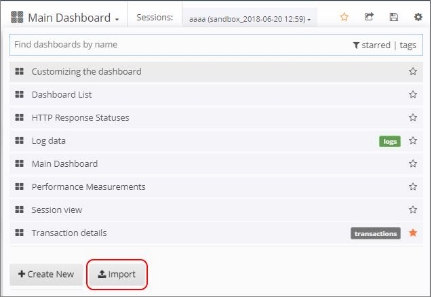
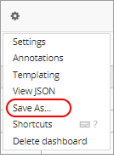

# Managing Dashboards

In WebLOAD Dashboard you can manage any dashboard saved in the database, as well as create new dashboards, delete dashboards, import and export dashboards in JSON format, and save your customized dashboards.

## Loading a Dashboard

When you access WebLOAD Dashboard, the default Home dashboard is displayed. You can however select to display any other dashboard from the database, as described in this section.  

Note that you can also import a dashboard that was saved as a JSON file, as described in[*Importing a Dashboard* ](#importing-a-dashboard).

**To load a dashboard:** 

1. In the menu bar, select **Dashboards** > **Main Dashboard**. 

1. Click the dashboard drop-down in the dashboard header. A list of all the dashboards in the database is displayed.

    

   
1. Optionally enter a text string in the Search box to filter the display by dashboards whose name contains that text string. 

1. Optionally, click **starred** in the right side of the Search box to filter the display by your favorite dashboards (= dashboards you had starred). 

1. Select a dashboard from the list. WebLOAD Dashboard displays the selected dashboard. 

## Exporting & Importing a Dashboard in JSON Format

You can export a dashboard as a JSON file, and import dashboards that were saved in JSON file format. 

For instructions how to import a dashboard that was saved as a JSON file, refer to [*Exporting a Dashboard as a JSON File*.](./sharing_dashboards.md#exporting-a-dashboard-as-a-json-file) 

### Importing a Dashboard

**To import a dashboard that was saaved in JSON file format:** 

1. Do either of the following: 

    - In the menu bar, select **Dashboards** > **Import**.**  

    

    - In the Dashboard header, click the dashboard drop-down and select Import. 

    

1. In the Import Dashboard window that appears, select **Upload .json File**, and specify the desired JSON file. 

    Alternatively, paste JSON content into the Import Dashboard window and click **Load**. 

    

    WebLOAD Dashboard displays the selected dashboard.

## Creating a New Dashboard

You can create a new empty dashboard and define it as desired. **To create a new dashboard:** 

1. Do either of the following: 

    - In the menu bar, select **Dashboards** > **+ New**. 

    

    - In the Dashboard header, click the dashboard drop-down and click **+ Create New**. 

    

   

    A new empty dashboard appears.  

1. Configure the dashboard as desired.

## Saving your Customized Dashboard

After changing a dashboard as desired, you can save the customized dashboard to keep all the changes. Note that two changes are not saved: the selected sessions and the selected time filter. 

**To save a customized dashboard:** 

1. Click the Manage Dashboard Settings icon in the middle of the dashboard header, and select **Save As**. 

    

   

1. Give your dashboard a unique name by editing the current name, which appears in the **New name** field.  

   

## Setting the Default (Home) Dashboard

You can set any desired dashboard as your Home (default) dashboard, and you can also revert to the global WebLOAD Dashboard default any time. 

**To set the Home dashboard:** 

1. In the right side of the menu bar, click the down arrow adjacent to your user name.

    

   

1. In the dropdown list that appears:

    - To set the default dashboard at the user level, select **Profile** and then in the Profile window, set the **Home Dashboard** in **Preferences**. 

    - To set the default dashboard at the organization level, select **Preferences** and then in the Org Preferences window, set the **Home Dashboard** in **Preferences**. 

     Note that your personal default takes precedence over the Org default, which takes precedence over the global default. 

1. To revert to the global default, select **Preferences** and then in the Org Preferences window, set the **Home Dashboard** to **Default**. 

## Deleting a Dashboard from the Database

**To delete a dashboard from the database:** 

1. Click the Manage Dashboard Settings icon in the middle of the dashboard header, and select Delete dashboard. 

    

   
1. Confirm the operation.
