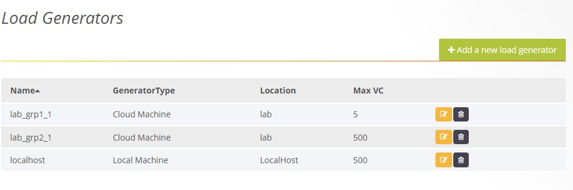
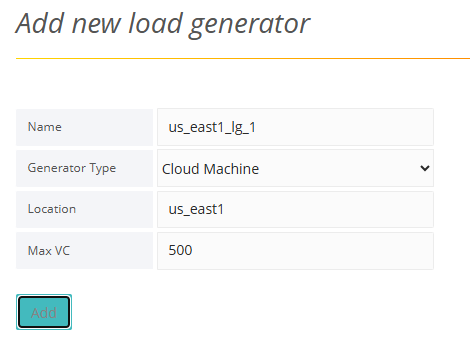
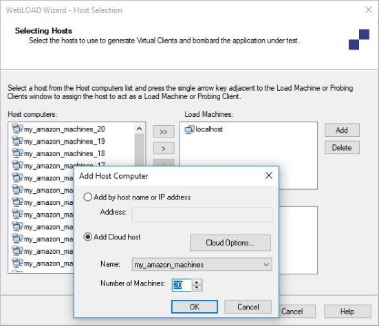

# Managing Load Generators

Both a[` `*URL/API Load Test* ](#creating-a-urlapi-load-test)and[` `*Script Load Test* ](#creating-a-script-load-test)require you to specify, from among the available load generators, which load generators to include in the test. However, the list of available load generators can only be defined by a Super Admin.  ![ref27]

## Adding Load Generators 

**To add a new load generator:** 

1. In the menu bar, select **Admin** > **Load Generators**. The Load Generators window appears.  

   

   

1. Click **+Add a new load generator**. 

2. An Add New Load Generator window appears.

   

   

3. In the **Name** field, specify the load generator’s IP address or host name.  

4. In **Generator Type**, select whether the generator is a **Local Machine** or a **Cloud Machine**.  

5. If you want to specify a Cloud Machine, first make sure it was specified as a Cloud Host in the WebLOAD Console. Refer to[*Specifying a Cloud Host as a Load Generator* ](#specifying-a-cloud-host-as-a-load-generator)

6. In **Location**, enter a human-readable field. This value does not have to be unique per load generator machine, and has an important role, as described in[*Setting Load Generators’ Location Tag* ](./managing_load_generators.md#setting-load-generators-location-tag)

7. Note that if you leave the **Location** field empty, the system will automatically give this field the value entered in the **Name** field. 

## Setting Load Generators’ Location Tag

Load Generators are defined by Name and Location. However, in the test-creation pages, the load generators are listed by Location only (and not by Name).  

This is helpful when defining a load test, because of the relationship between Name and Location, as follows: 

- Multiple separate machines can have the same **Location** (by defining multiple load generators whose **Locations** are identical but whose **Names** are not). For example: 

  - If: You want all load generators in Test Lab 1 to participate in certain tests. 
  - Then Give the same “Test Lab 1” **Location** to all the load generator machines located in Test Lab 1.  
  - Finally: You need only to select “Test Lab 1” in the Load Generators section of the Create Load Test page, and all the load generators whose Location is “Test Lab 1” will be included. 

- Likewise, any one machine can be given multiple different **Locations** (by defining multiple load generators whose **Names** are identical but whose **Locations** are not). For example: 

  - If: You sometimes want to choose load generators based on their operating system, and other times based on their geographical location. 

  - Then: Define each load generator twice, once with **Location** describing its OS (Windows or Linux), and once with **Location** describing its geographical location (New York or London).  

  - Finally: 

    You need only to select “Windows”, “Linux”, “New York” or “London” in the Load Generator section of the Create Load Test page, and only the load generators fitting that description will be included. ![ref10]

## Specifying a Cloud Host as a Load Generator

If you want to specify a cloud machine as a load generator, you need to first define the cloud host machine in the WebLOAD Console. 

**To define a cloud host in WebLOAD Console:** 

1. In WebLOAD Console, set up a WebLOAD Dashboard Account as follows: 
1. Create an Amazon EC2 account. 
1. Click **Cloud Options** in the **Tools** tab of the ribbon to create a WebLOAD Dashboard account in which you specify your Amazon security credentials, the specific Amazon region where the machines should be located, and the WebLOAD image to install on the Amazon machines.  

For a full description , refer to *Setting Up Cloud Computers* in the *WebLOAD Console User Guide*. 

2. In WebLOAD Console, define cloud host computers as follows: 
3. Click **Add** in the Host Selection window of the WebLOAD wizard.  
4. In the Add Host Computer window that appears, select **Add Cloud host** . 

For a full description , refer to *Adding Host Computers* in the *WebLOAD Console User Guide*. 

`                             