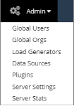
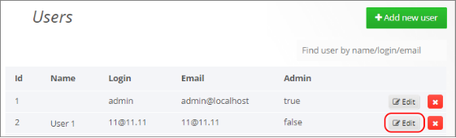
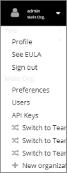

# Managing Organizations, Users and Admins

## Understanding Organizations and Admins

### Organizations and Admins

Organizations are a method of compartmentalizing dashboards, data source and users. You do not need to create multiple organizations if you want all your users to have access to the same set of dashboards and data. If however you do not want all users to access the same dashboards and data sources, define organizations as described in [*Adding an Organization*.](#_page93_x109.00_y356.04)  

If you will be defining organizations, you can have two levels of administrators: 

- Organizational administrators: These admins can manage users within specific organizations in a particular WebLOAD Dashboard installation. 
- Super administrators: These super admins can manage users across all organizations in a WebLOAD Dashboard installation. They can also change and access system-wide settings. 

### Organizational Administrators

As an Organizational administrator, you can add Data Sources, add Users to your Organization and modify Organization details and options. 

Super Administrators

As a Super Administrator, you have complete access to any Organization or User in a specific WebLOAD Dashboard installation. When logged in as super admin, the menu bar contains an additional **Admin** option to enable you to perform global administration actions. ![ref28]

## Managing Users 

Organizational admins can manage users within the specific organization, while super admins can manage all users, across all organizations. 

### User Types

There are two main types of users: 

- **Super admin user** – has full permissions to all of the WebLOAD Dashboard’s options and settings. 
- **Organizational user**. Within the organization, a user can have any of the following roles: 
  - **Viewer** – Can only view the Dashboard 
  - **Read-Only Editor** – Can edit dashboards, but cannot save the changes 
  - **Editor** – Can manage, create and execute tests and sessions, create and update dashboards, upload resources, and save the changes. This is the typical WebLOAD Dashboard user. 
  - **Organizational** **Admin** – has full permissions to all of the organization’s options and settings: can edit, save, and make changes at the organizational level, including creating organizational users and editing organizational users. 

### User Management by a Super Admin

Super admins can add users of any type, to any organization. ***User Creation by a Super Admin*** 

**To add a user of any type:** 

1. In the Menu bar, select your user name and then select **Admin** > **Global Users**.  

1. In the User window that appears, click **+ Add new user**. 

   

1. In the Add New User window that appears, enter the new user  name, email, username and password. Then click **Create**. 

   

1. The new user is created, and appears in the table in the Users window [(Figure 90)](#_page88_x54.00_y207.04). 

1. The new user’s settings can now be defined/edited. 

   - A super admin can set the new user’s permissions and other settings, by clicking **Edit** in the respective row in the Users window [(Figure 90)](#_page88_x54.00_y207.04). For instructions, refer to[*User Editing by a Super Admin – Editing User’s Permissions, Organizations, Roles and Details*.](#_page89_x109.00_y78.04) 
   - An organizational admin can set the new user’s role in the organization. For instructions, refer to[*User Editing by an Organizational Admin – Editing User’s ](#_page92_x109.00_y290.04)*Role*. ![ref28]

#### User Editing by a Super Admin – Editing User’s Permissions, Organizations, Roles and Details

A super admin can set a user’s permissions, organizational roles, and other settings. **To edit a user:** 

1. In the Menu bar, select your user name and then select **Global Users**.  

1. In the Users window that appears, click **Edit** in the row of the user you wish to edit. 

   

1. The Edit User window appears, enabling you to edit various user settings. 

   

1. You can make the user a super administrator by selecting the **Admin** checkbox in the **Permissions** section. 

1. In the **Organizations** section you can specify in which **Organizations** the user is a member, and specify the user’s **Role** in each. The available organizational roles and their permissions are described in[**Organizational user** ](#_page87_x131.00_y398.04)(on page[ 82)](#_page87_x131.00_y398.04). 

1. You can edit the user’s name, email, username, and change his password.  ![ref28]

### User Management by an Organizational Admin

An organizational admin can add existing users to the organization, and edit the roles of the organizational users. 

#### User Addition by an Organizational Admin  

**To add a user to the organization:** 

1. In the Menu bar, select your user name and then select **Users**.  

   

2. In the Organization Users window that appears, click **+ Add or Invite**. 

   

3. Enter the **Email or Username**, and optionally the **Name**, of the user you wish to invite. For each additional user you wish to add, click **Invite another** and enter that user’s details. Then click **Invite Users**. 

   

#### User Editing by an Organizational Admin – Editing User’s Role

An organizational admin can set a user’s role in the organization. 

**To edit a user’s role:** 

1. In the Menu bar, select your user name and then select **Users**.  

   

2. In the Organization Users window that appears, you can set the **Role** of each organizational user. 

   

### Managing Organizations

Super admin users can add organizations (for an explanation of Organizations, refer to [*Organizations and Admins*)](#_page86_x109.00_y265.04).  

#### Adding an Organization

**To add an organization:** 

1. In the Menu bar, select your user name, and then select **New Organization**.  

   

2. In the New Organization window that appears, enter an **Org. name**, and click **Create**.

   

   The Org Preferences window appears, populated with the new organization’s name, enabling you to edit various organization’s settings.

   

To set the new organization’s settings, refer to the instructions in[` `*Editing an Organization’s Settings*.](#_page96_x109.00_y78.04) ![ref10]

#### Editing an Organization’s Settings

**To edit an organization’s settings:** 

1. In the Menu bar, select your user name and make sure the organization name appearing below the user name, is the name of the organizations whose settings you wish to edit. If it is not, select **Switch to** in order to switch to that organization. 

   

   

2. In the Menu bar, select your user name and then select **Preferences**.  

   The Org Preferences window appears, enabling you to edit various organization’s settings 

   

3. You can edit the organization’s name and address. 

4. You can edit the organization’s preferences: **UI theme**, **Home dashboard**, and **Timezone**.  

5. You can change mange the organization’s users by clicking **Users & Roles** under **Admin Pages**. In the Organization Users window that appears, you can: 

   - Add users 

   - Delete users 

   - Set the **Role** of each organizational user.         

     

6. You can use API keys to access some functionality in a REST API, by clicking **API Keys** under **Admin Pages**. 

