# Appendix A: The WebLOAD Recorder Toolbox Set

This section describes the WebLOAD Recorder toolbox set.


## The WebLOAD Recorder Toolbox Items

The following are the WebLOAD Recorder Toolbox items:

||Toolbox Items|
| :- | :- |
|**General**||
|- Sleep|- Message|
|- JavaScriptObject|- Comment|
|- Try|- Catch|
|**Load**||
|- Begin Transaction|- End Transaction|
|- Set Timer|- Send Timer|
|- Synchronization Point|- Send Measurement|
|- URL Screening|- Value Extraction|
|- Define Concurrent|- Execute Concurrent|
|**Internet Protocols**||
|- FTP-connect|- FTP-upload|
|- FTP-download|- FTP-disconnect|
|- SMTP-send message|- POP-retrieve|
|- POP-Delete|- IMAP-Connect|
|- IMAP-Retrieve|- IMAP-Delete|
|- IMAP-CreateMailbox|- IMAP-ListMailboxes|
|- IMAP-DeleteMailbox|- IMAP-RenameMailbox|
|- IMAP-SubscribeMailbox|- IMAP-UnsubscribeMailbox|
|**Toolbox Items**||
|- IMAP-ListSubscribedMailbox|- IMAP-Search|
|- NNTP-Connect|- NNTP-GetArticle|
|- NNTP-GetArticleCount|- NNTP-PostArticle|
|- TCP-Connect|- TCP-Send|
|- TCP-Receive|- TCP-Erase|
|- TELNET-Connect|- TELNET-Receive|
|- TELNET-Send|- TELNET-Erase|
|- UDP-Bind|- UDP-Broadcast|
|- UDP-Receive|- UDP-Send|
|- UDP-Erase|- LDAP-Bind|
|- LDAP-Search|- LDAP-UnBind|
|**IoT  Protocols**||
|- MQTT-Connect|- MQTT-Subscribe|
|- MQTT-Send|- MQTT-GetMessages|
|- AMQP-Connect|- AMQP-Send|
|- AMQP-GetMessages||
|**Database**||
|- OpenDB|- Oracle OpenDB|
|- MySQL OpenDB|- Execute Command|
|- Fetch Data|- DB GetLine|
|- Oracle DB GetLine|- MySQL DB GetLine|
|- DB Load|- Oracle DB Load|
|- MySQL DB Load||
|**Verifications**||
|- WS-SingleNode|- WS-MultipleNodes|
|- Flex:Verify-Ext|- Flex:Extract-Ext|
|**Multimedia**||
|- Streaming-Create|- Streaming-Play|
|- Streaming-Play with range|- Streaming-Wait for Media  and Stop|
|- Streaming-Wait for Media  and Pause|- Streaming-Close|
|**WebSocket**||
|- WebSocket Connect|- WebSocket Send|
|- WebSocket Close||
|**Web  Services**||
|- HTTP|- WSDL|
|**JMS**||
|- JMS-Connect-JNDI|- JMS-Connect-HornetQ|
|- JMS-Send|- JMS-Receive|
|**Real  Clients**||
|- Selenium Driver|- Selenium Report Statistics|
|- JUnit Runner|- PerfectoMobile|


## The WebLOAD Recorder General Toolbox

The following table describes the purpose of each of the WebLOAD Recorder General Toolbox items:

|**Script Item**|**Purpose**|
| :- | :- |
|Sleep|<p>Emulates the time it takes users to get from one page to the next</p><p>- includes download time and the time it takes to read the page.</p>|
|Message|Places an informational or error message in the script. This message will appear in the Log window when you play back the script. Message objects can also be used to print out the values of variables.|
|JavaScript Object|<p>Enables you to insert JavaScript code directly into the script. You can code directly in JavaScript.</p><p>To add a JavaScript Object to the script, drag the **JavaScript Object** icon into the Script Tree, and then open the object to insert JavaScript code.</p>|
|Comment|Places comments in your script. The comment will appear in the JavaScript View pane when viewing the entire script.|
|Try…Catch|Places Try and Catch statements in your script. You can use the Try...Catch statements for structured exception handling.|


### **Sleep**
Users vary their activity when accessing a Web application, sometimes pausing between transactions and occasionally only accessing the server intermittently. The time a user waits between performing consecutive actions is known as sleep time.

When you record a script, WebLOAD Recorder automatically records the actual sleep time and inserts sleep icons into the script. You can edit the recorded sleep times manually, add more sleep statements, and control how WebLOAD is influenced by the sleep timers in the script.

**To insert sleep timers:**

1. Drag the **Sleep ** icon from the General toolbox into the Script Tree at the desired location.

    The Sleep dialog box opens.

1. In the **Enter or select pause time** field, enter or select the duration of the sleep. The default value is 1000 milliseconds.

    The Sleep item appears in the Script Tree and the JavaScript code is added to the script. To see the new JavaScript code, view the script in JavaScript Editing mode.

### **Message**
While running a test session, WebLOAD Recorder and WebLOAD Recorder’s Log windows display information about session execution. You can include Message nodes in your script, defining points at which to send error and/or notification messages to the Log window.

**To insert a message:**

1. Drag the **Message ** icon from the General toolbox into the Script Tree at the desired location.

     The Message dialog box opens.

    


1. Create a text message by typing the text you want to appear in the message into the input text box.
 
    > **Note:** When entering a string value to the message, the string must be enclosed in quotation marks; for example, “Sample Message”.

1. To add a global variable to the message text, click the **globe** icon to the right of the input text box and select a global variable from the drop-down list.

1. Select a severity level for the message from the drop-down list. The following severity levels are available:

    - Information message (WLInfoMessage)
    - Minor error message (WLMinorError)
    - Error message (WLError)
    - Severe error message (WLSevereError)
    - Debug message (WLDebugMessage)

1. Click **OK**.

    The Message item appears in the Script Tree and the JavaScript code is added to the script. To see the new JavaScript code, view the script in JavaScript Editing mode.


### JavaScriptObject
JavaScript Objects enable you to insert JavaScript code directly into the script, giving you access to advanced functionality not available through the WebLOAD Recorder graphic interface. For example, working with XML or COM, or retrieving data from a database, are all tasks that require some additional programming code.

**To insert a JavaScriptObject:**

1. Drag the **JavaScriptObject ** icon from the General toolbox into the Script Tree at the desired location.

    The JavaScriptObject item appears in the Script Tree and the WebLOAD Recorder protocol block is added to the script.

1. Open the object in JavaScript Editing mode to insert JavaScript code, as described in [*Using the JavaScript Editor* ](./editing_scripts.md#using-the-javascript-editor).

### **Comment**
WebLOAD Recorder enables you to add comments to your script to describe an activity or provide information about a specific operation.

**To insert a comment:**

1. Drag the **Comment ** icon from the General toolbox into the Script Tree at the desired location.

    The Comment dialog box opens.

    

   

1. Enter the text you want to appear in the comment.

1. Click **OK**.


The Comment item appears in the Script Tree and the JavaScript code is added to the script. To see the new JavaScript code, view the script in JavaScript Editing mode.

### Try / Catch Statements
You can use the Try…Catch statements for structured exception handling. This enables you to execute a particular block of statements if a specified exception occurs while your code is running.

**To insert a Try...Catch statement:**

1. Drag the **Try ** icon from the General toolbox into the Script Tree directly before the first action you want to include in the Try...Catch block.
1. Drag the **Catch ** icon from the General toolbox into the Script Tree directly after the last action you want to include in the Try...Catch block.
    
    The Try and Catch items appear in the Script Tree and the JavaScript code is added to the script. To see the new JavaScript code, view the script in JavaScript Editing mode.


## The WebLOAD Recorder Load Toolbox

The following table describes the purpose of each of the WebLOAD Recorder Load Toolbox items:

*Table: Load Toolbox Items*

|**Script Item**|**Purpose**|
| :- | :- |
|<p>Begin Transactions</p><p>End Transactions</p>|Adds named transactions to the script to measure the performance of logical actions in your script, such as a Login process. By inserting named transactions into your script, you can take a series of simple actions, define them as a single transaction, and set success or failure criteria for the complete transaction.|
|<p>Set Timer</p><p></p><p>Send Time</p>|Timers let you time any operation or group of operations in a script and send the time statistics to the WebLOAD Console.|
|SynchronizationPo int|Create peak server loads that stress your system to the limit by deliberately forcing multiple Virtual Clients to perform key tasks and execute a given command at precisely the same moment in real time.|
|SendMeasurement|Create a new measurement name and assign a value to the measurement available in WebLOAD reports.|
|URL Screening|Specify the URLs the WebLOAD engine should ignore (not fetch).|
|ValueExtraction|Extract a value from a string using a prefix and suffix.|
|DefineConcurrent|Define a starting point after which the WebLOAD engine collects all Post and Get HTTP requests, but does not execute them, until an Execute Concurrent function is run.|
|ExecuteConcurrent|Defines a starting point after which the WebLOAD engine stops collecting and begins executing all the Post and Get HTTP requests that were defined since the last Define Concurrent function, concurrently (using multithreading).|


### **Begin and End Transaction**
In addition to the automatic transactions provided by WebLOAD, you can use the WebLOAD Recorder GUI to easily add named transactions to the script to measure the performance of logical actions in your script, such as a Login process. By inserting named transactions into your script, you can take a series of simple actions, define them as a transaction, and set success or failure criteria for the transaction. Each transaction can be a simple action, such as a query, or a complex action that may include several steps.

To measure transactions, you must mark the beginning and end of the transaction in your script. During runtime, WebLOAD measures the time it takes to complete the transaction and reports the results in the WebLOAD Integrated reports, Statistics reports, and Data Drilling report.

> **Note:** You can add an unlimited number of transactions into your script, each with a different name.

**To mark the beginning of a transaction:**

1. Drag the **Begin Transaction ** icon from the Load toolbox into the Script Tree, directly above the first action you want to include in the transaction.

    The Begin Transaction dialog box opens.

    

1. Enter a logical name for the transaction; for example, Login.

1. Click **OK**.

    The Begin Transaction item appears in the Script Tree and the JavaScript code is added to the script. To see the new JavaScript code, view the script in JavaScript Editing mode.

   

**To mark the end of a transaction:**

1. Drag the **End Transaction ** icon from the Load toolbox into the Script Tree, directly after the last action you want included in the script.
 
    The End Transaction dialog box opens.

    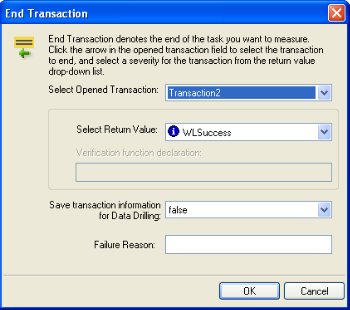

1. Select the transaction to end from the Select Opened Transaction drop-down list.

1. Select a return value for the transaction from Select Return Value drop-down list.

    You can select from the return values provided, or select Custom Function to create your own verification function to call when the transaction is complete.

    For information on creating custom functions, see the *WebLOAD Scripting Guide*.

1. To set WebLOAD to save the results of all transaction instances, successes and failures, for later analysis with Data Drilling, select **true** in the Save transaction information for Data Drilling field. Select **false** (default) to save only results of failed transaction instances that triggered some sort of error flag.

1. Optionally, enter a text string to specify a possible reason for a transaction failure within your transaction verification function in the Failure Reason field. This reason will also appear in the Statistics Report.

1. Click **OK**.

    The End Transaction item appears in the Script Tree and the JavaScript code is added to the script. To see the new JavaScript code, view the script in JavaScript Editing mode.

### Set and Send Timer
Timers let you time any operation or group of operations in a script and send the time statistics to the WebLOAD Console. For example, you can add a timer to measure the amount of time needed to complete a series of user activities on a single Web page.

You can add timers to a script directly through the WebLOAD Recorder.

> **Note:** When you set a timer, it is automatically zeroed.

**To mark the beginning of a timer:**

1. Drag the **Set Timer ** icon from the Load toolbox into the Script Tree directly before the first action you want to include in the timed task.

    The Set Timer dialog box opens.

    


1. Type a name for the timer in the Enter a timer name field.

1. Click **OK**.

    The Set Timer item appears in the Script Tree and the JavaScript code is added to the script. To see the new JavaScript code, view the script in JavaScript Editing mode.

   

**To mark the end of the timer:**

1. Drag the **Send Time**r  icon from the Load toolbox into the Script Tree directly after the last action you want included in the timed task.

    The Send Timer dialog box opens.

    

    *Figure: Send Timer Dialog Box*

1. From the Select Timer drop-down list, to select the timer to end.
1. Click **OK**.
    The Send Timer item appears in the Script Tree and the JavaScript code is added to the script. To see the new JavaScript code, view the script in JavaScript Editing mode.

### Synchronization Point
During a test session, WebLOAD simulates the random nature of the real world, where even with hundreds or thousands of Web site hits, users do not all necessarily execute the same commands at precisely the same instant. However, for testing purposes, you may wish to create peak server loads that stress your system to the limit by deliberately forcing multiple Virtual Clients to perform key tasks and execute a given command at precisely the same moment in real time.

WebLOAD provides Synchronization Points to coordinate the actions of multiple Virtual Clients. A Synchronization Point is a meeting place where Virtual Clients wait before continuing with a script. When one Virtual Client arrives at a Synchronization Point, WebLOAD holds the Client at that point until all the other Virtual Clients arrive. When all the Virtual Clients have arrived, they are all released at once to perform the next action in the script simultaneously.

For example, suppose that you want to simulate 500 users, all trying to access a form on the same Web page simultaneously. To maximize the impact of this test situation, all 500 Virtual Clients must access the form at exactly the same time. Add a Synchronization Point before the form entry node to ensure that all the Virtual Clients log in simultaneously.

WebLOAD Recorder enables you to define the meeting place where all Virtual Clients wait. You can also optionally set the timeout value, the number of milliseconds that WebLOAD will wait for all of the Virtual Clients to arrive at the Synchronization Point. The timeout is a safety mechanism that prevents an infinite wait if any of the Virtual Clients does not arrive at the Synchronization Point for any reason. Once the timeout period expires, WebLOAD releases the rest of the Virtual Clients. Setting a timeout

value is important to ensure that the test session will not ‘hang’ indefinitely in case of error.

**To insert a Synchronization Point:**

1. Drag the **Synchronization Point ** icon from the Load toolbox into the Script Tree directly before the action you want all Virtual Clients to perform simultaneously. The Synchronization Point dialog box opens.

    

1. In the Timeout Value field, enter or select a timeout value for the Synchronization Point. The default value is 1000 milliseconds.

    The Synchronization Point item appears in the Script Tree and the JavaScript code is added to the script. To see the new JavaScript code, view the script in JavaScript Editing mode.

During a test session, the SynchronizationPoint() function returns a value to WebLOAD. This value indicates whether the function was successful or not. All failures are logged and displayed in the WebLOAD and Console Log windows, similar to any other WebLOAD test failure.

Synchronization Point function calls may return one of the following return values:

- WLSuccess—synchronization succeeded. All Virtual Clients arrived at the Synchronization Point and were released together.
- WLLoadChanged—synchronization failed. A change in the load size was detected while Virtual Clients were being held at the Synchronization Point. All Virtual clients were released.
- WLTimeout—synchronization failed. The timeout expired before all Virtual Clients arrived at the Synchronization Point. All Virtual Clients were released.
- WLError—synchronization failed. Invalid timeout value. All Virtual Clients were released.

For a complete explanation and example of the SynchronizationPoint function syntax, see WebLOAD Actions, Objects, and Functions*,* in the *WebLOAD JavaScript Reference Guide*.


### Send Measurement
WebLOAD Recorder enables you to insert Send Measurement actions into your script to create a new measurement name and assign a value to the measurement. During runtime the measurement is displayed in the WebLOAD statistics report.

**To create and set the value for a measurement:**

1. Drag the **Send Measurement ** icon from the Load toolbox into the Script Tree at the desired location.

    The Send Measurement dialog box opens.

    
 

1. Type or select a name for the measurement in the Select measurement name field.

1. Type or select a value for the measurement in the Set measurement value field.

1. Click **OK**.

    The Send Measurement item appears in the Script Tree and the JavaScript code is added to the script. To see the new JavaScript code, view the script in JavaScript Editing mode.

### URL Screening
WebLOAD Recorder enables you to add URL screening to a script to define the URLs that the WebLOAD protocol engine should ignore during runtime. The ability to ignore links on the page being tested is a useful feature. For example, many Web sites include links to external sites. If these sites are not relevant to the testing requirements, they should be ignored. Other links may be to advertisement sites that charge a fee every time the link is accessed. Hitting these links during a typical load test that may run hundreds or thousands of iterations would be a tremendous waste, so these links should also be ignored.

**To add URL screening to a script:**

1. Drag the **URL Screening ** icon, from the Load toolbox, into the Script Tree at the desired location. 

    The URL Screening Building Block parameters dialog box opens.

    

   

1. Enter the URLs to ignore, separated by commas, in the Value field.

1. Click **OK**.

    The URL Screening Building Block is added to the Script Tree. The JavaScript code, including the InitAgenda() function, is added to the script. To see the new JavaScript code, view the script in JavaScript Editing mode.

> **Note:** Fields that were not assigned a value in the dialog box are left as empty fields in the script code.

### Value Extraction
WebLOAD Recorder enables you to add value extraction to a script to define the parameters for the extractValue JavaScript function.

**To add value extraction to a script:**

1. Drag the **Value Extraction ** icon, from the Load toolbox, into the Script Tree at the desired location. 

    The Value Extraction Building Block parameters dialog box opens.

    

1. In the Prefix field, enter a prefix.

1. In the Suffix field, enter a suffix.

1. In the Str field, enter the string that will be searched.

1. In the retVarName, enter the variable name that will be generated to the script.

1. Click **OK**.

    The Value Extraction Building Block is added to the Script Tree. The JavaScript code is added to the script. To see the new JavaScript code, view the script in JavaScript Editing mode.

> **Note:** Fields that were not assigned a value in the dialog box are left as empty fields in the script code.

### **Define Concurrent**
WebLOAD Recorder enables you to collect Post and Get HTTP requests and simultaneously execute them by two or more threads, as defined in the MultiThread Virtual Clients number. This is configured in the Browser Parameters tab in WebLOAD Console’s Script Options dialog box.

> **Note:** WebLOAD Recorder does not perform the Post and Get HTTP requests concurrently.

To simultaneously execute Post and Get HTTP requests, you must define where in the script to begin collecting the requests and where to stop collecting and begin executing them. The HTTP requests are collected until the engine encounters an Execute Concurrent function in the script. For more information about the Execute Concurrent Building Block, see [*Execute Concurrent* ](#execute-concurrent).

These Post and Get HTTP requests are saved in a file which you can access at any time. For more information, refer to the *WebLOAD JavaScript Reference*.

**To start collecting HTTP requests in a script:**

- Drag the **Define Concurrent**  icon from the Load toolbox into the Script Tree at the desired location.

  The Define Concurrent Building Block is added to the Script Tree. The JavaScript code is added to the script. To see the new JavaScript code, view the script in JavaScript Editing mode.

### **Execute Concurrent**
WebLOAD Recorder enables you to simultaneously execute all the Post and Get HTTP requests that were defined since the last Define Concurrent function by two or more threads, as defined in the MultiThread Virtual Clients number. This is configured in the Browser Parameters tab in WebLOAD Console’s Script Options dialog box.

> **Note:** This function can only be inserted in your script *after* a Define Concurrent function. For more information about the Define Concurrent function, see [*Define Concurrent* ](#define-concurrent).


When the engine encounters the Execute Concurrent function, it stops collecting the HTTP requests in the script and starts their execution.

**To start concurrently executing HTTP requests in a script:**

- Drag the **Execute Concurrent**  icon from the Load toolbox into the Script Tree at the desired location.

The Execute Concurrent Building Block is added to the Script Tree. The JavaScript code is added to the script. To see the new JavaScript code, view the script in JavaScript Editing mode.

## The WebLOAD Recorder Internet Protocols Toolbox

Use the WebLOAD Recorder Internet Protocols Building Blocks to simply and easily add Internet Protocols functionality to your test session script without having to write numerous lines of code.

**To add Internet Protocols Building Blocks to a test script directly through the WebLOAD Recorder GUI:**

- Drag the selected Internet Protocols icon from the Internet Protocols toolbox and drop it into the Script Tree at the appropriate point.

  WebLOAD Recorder automatically adds the appropriate JavaScript code to your test session script.

WebLOAD Recorder provides full support for secure sites that utilize the SSL security protocol. The same FTP, POP, and SMTP functionality that is available for standard- security sites is also provided for sites that utilize the SSL security protocol. WebLOAD Recorder SSL protocol support is virtually transparent for the web site tester. Simply choose the appropriate Building Block, such as FTP-Connect, for example. Activate the SSL Protocol feature by setting the Boolean SSLFlag property to true. Complete the rest of the Building Block properties as described for standard Building Block use.

> **Note:** The Internet Protocols Building Blocks displayed in the Internet Protocols toolbox correspond to only a small part of the WebLOAD Recorder Internet Protocols function set. These Building Blocks are provided for the most commonly used Internet Protocols activities. For a description of the complete set of Internet Protocols functions supported by WebLOAD Recorder, see the *WebLOAD Internet Protocols Reference* in the *WebLOAD JavaScript Reference Guide*.


Each Internet Protocols icon opens a different dialog box. Enter the required values in the Value field. Explanations are provided at the bottom of the dialog box for each parameter as it is selected in the dialog box.

> **Note:** Values that must be enclosed within quotation marks are indicated in the Value column by sets of quotation marks. Type the field value within the quotation marks that automatically appear in the input-text box that pops-up when the value field is selected. Fields that were not assigned a value in the dialog box are left as empty fields in the script code.

Once you have finished defining the new Internet Protocols activity, the new action is reflected in the Script Tree. An Internet Protocols icon is added to the Script Tree for each Internet Protocols activity defined. WebLOAD Recorder automatically adds the corresponding JavaScript code to your test session script.

To see the complete sequence of JavaScript code for all the Internet Protocols Building Blocks that have been added to the Script Tree, click the Agenda root node in the Script Tree.

> **Note:** The JavaScript code for each of the Internet Protocols Building Blocks can be found in the Internet Protocols library files, part of the Include directory under the WebLOAD installation directory. Each protocol has its own library file. For example, the SMTP functions refer to the wlSMTP.js file.
>

### FTP
Dragging an FTP icon into your Script Tree opens an FTP Building Block parameters dialog box.

#### FTPS

The FTP building block can be used to access FTPS servers. FTPS - 'FTP over SSL', not to be confued with [SFTP](#sftp) - 'SSH FTP'. To use FTPS, use the FTP building block and specify Secure FTP 'Yes' in the connection setttings.

FTP toolbox items include:

- **FTP-Connect**: Open an FTP connection.
- **FTP-Upload**: Designate a file to be uploaded to a remote host.
- **FTP-Download**: Designate a file to be downloaded from a remote host.
- **FTP-Disconnect**: Disconnect from a remote host.

#### FTP-Connect

Use the FTP-Connect Building Block to open an FTP connection.

**To enter a value:**

1. Drag the **FTP-Connect** icon from the Internet Protocols toolbox into the Script Tree at the desired location. The FTP-Connect Building Block parameters dialog box opens.

    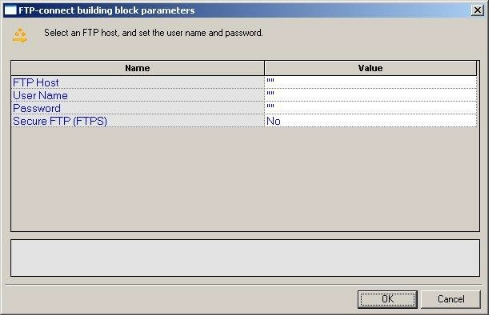

1. Click the name of an input field in the left-hand column to see an explanation of that field in the comment area at the bottom of the dialog box.

    For example, in the preceding figure, the comment area explains that the UserName field is used to define the user ID to be used when logging in to the specified FTP host. WebLOAD Recorder automatically sends the user-specified name and password to the FTP host when connecting.

1. Enter the appropriate field value into the Value column next to the field name, as described the [Table](#ftp_connect).

1. Click **OK**.

    The FTP-Connect Building Block is added to the Script Tree. The JavaScript code, including the InitAgenda()and InitClient() functions, is added to the script. To see the new JavaScript code, view the script in JavaScript Editing mode.

    In the script, the InitAgenda()function notes that the connection will be utilizing SSL security, and therefore includes the WebLOAD Recorder FTP/SSL library file. The InitClient() function includes a command to define a separate FTP/SSL object for each client. Within the main body of the script, an FTP connection is opened using the connection name, user name, and password specified by the user.


<a name = "ftp_connect"></a>
The fields in the FTP-Connect Building Block parameters dialog box are described in the following table:

|**Field Name**|**Description**|
| :- | :- |
|FTP Host|<p>Specify the name of the FTP host connection.</p><p>Type the FTP Host name into the input-text window that appears when you click the small arrow to the right of the Value input area for this field.</p><p>The FTP host is identified either through a DNS number or a full name string. A host name string must be enclosed within quotation marks.</p>|
|User Name|<p>Specify a user ID for the FTP connection.</p><p>Type the user ID into the input-text window that appears when you click the small arrow to the right of the Value input area for this field.</p><p>The user name must be enclosed within quotation marks.</p>|
|Password|<p>Specify a password for authentication during the FTP connection.</p><p>Type the password into the input-text window that appears when you click the small arrow to the right of the Value input area for this field.</p><p>The password must be enclosed within quotation marks.</p>|
|Secure FTP (FTPS)|Select the appropriate Boolean value to indicate whether the site being accessed utilizes the SSL security protocol.|

#### FTP-Upload

Use the FTP-Upload Building Block to designate a file to be uploaded to a remote host.

**To enter a value:**

1. Drag the **FTP-Upload** icon from the Internet Protocols toolbox into the Script Tree at the desired location. 

    The FTP-Upload Building Block parameters dialog box opens.

    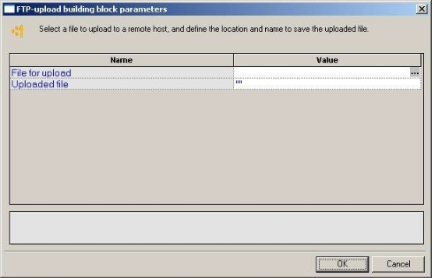

1. Click the name of an input field in the left-hand column to see an explanation of that field in the comment area at the bottom of the dialog box.

    For example, in the preceding figure, the comment area explains that the Uploaded File field is used to define the name and location for the file to be saved on the specified FTP host.

1. Enter the appropriate field value into the Value column next to the field name, as described the [Table](#ftp_upload). 

    > **Note:** If the script will be running for multiple clients or over multiple rounds, use global variables to specify a unique file name for each client and/or round, to avoid file access conflicts and to make it easier to work with and analyze the files after the test is completed. For example:
    >
    > `“k:\Ftp\files\inputFiles\text\_upload\_”+ ThreadNum + RoundNum + “.txt”`
 
1. Click **OK**.

   The FTP-Upload **B**uilding Block is added to the Script Tree and the JavaScript code is added to the script. To see the new JavaScript code, view the script in JavaScript Editing mode.

   > **Note:** The WebLOAD Recorder global variables ThreadNum and RoundNum are used to differentiate between the files uploaded by different clients during different test iterations.


<a name ="ftp_upload"></a>

The fields in the FTP-Upload Building Block parameters dialog box are described in the following table:

|**Field Name**|**Description**|
| :- | :- |
|File for upload|<p>Specify the name of the file to be uploaded to the specified FTP host.</p><p>Select the appropriate file from the Browser window that appears when you click the button to the right of the Value input area for this field.</p>|
|Uploaded file|<p>Specify a name and location to save the uploaded file.</p><p>Type the uploaded file name into the input-text window that appears when you click the small arrow to the right of the Value input area for this field.</p><p>The file name must be enclosed within quotation marks.</p>|


#### FTP-Download

Use the FTP-Download Building Block to designate a file to be downloaded from a remote host.

**To enter a value:**

1. Drag the **FTP-Download** icon from the Internet Protocols toolbox into the Script Tree at the desired location. 

    The FTP-Download Building Block parameters dialog box opens.

    

1. Click the name of an input field in the left-hand column to see an explanation of that field in the comment area at the bottom of the dialog box.

    For example, in the preceding figure, the comment area explains that the File for Download field is used to define the name of the file to be downloaded from the specified FTP host.

1. Enter the appropriate field value into the Value column next to the field name, as described the [Table](#ftp_download).

    **Note:** If the script will be running for multiple clients or over multiple rounds, use global variables to specify a unique file name for each client and/or round, to avoid file access conflicts and to make it easier to work with and analyze the files after the test is completed. For example:

    `“k:\Ftp\files\inputFiles\text\_upload\_” + ThreadNum + RoundNum + “.txt”`

1. Click **OK**.

    The FTP-Download Building Block is added to the Script Tree and the JavaScript code is added to the script. To see the new JavaScript code, view the script in JavaScript Editing mode.

    In the script, the name of the file to be downloaded is passed as a parameter to the ftp.Download() function. The file name to which the downloaded file should be saved is assigned as a value to the ftp.Outfile variable.

<a name = "ftp_download"></a>
The fields in the FTP-Download Building Block parameters dialog box are described in the following table:

|**Field Name**|**Description**|
| :- | :- |
|File for download|<p>Specify the name of the file to be downloaded from the specified FTP host.</p><p>Type the name of the file to be downloaded into the input-text window that appears when you click the small arrow to the right of the Value input area for this field. The file name must be enclosed within quotation marks.</p>|
|Downloaded file|<p>Specify a name and location to save the downloaded file.</p><p>Type the name and location in which to save the downloaded file into the input-text window that appears when you click the small arrow to the right of the Value input area for this field. The file name must be enclosed within quotation marks.</p>|


#### FTP-Disconnect

Use the **FTP-Disconnect** Building Block to disconnect from a remote host.

**To enter a value:**

- Drag the **FTP-Disconnect** icon from the Internet Protocols toolbox into the Script Tree at the desired location.

    The FTP-Disconnect Building Block is added to the Script Tree. The JavaScript code, including the TerminateClient() function, is added to the script. To see the new JavaScript code, view the script in JavaScript Editing mode.

### SFTP

Dragging an SFTP icon into your Script Tree opens an SFTP Building Block parameters dialog box. 

SFTP is SSH FTP, or Secure Shell File Transfer Protocol, not to be confused with FTP over SSL, [FTPS](#ftps) - 'File Transfer Protocl Secure'


**To enter a value:**

1. Drag the **SFTP** icon from the Internet Protocols toolbox into the Script Tree at the desired location. The SFTP Building Block parameters dialog box opens.

   

2. Click the name of an input field in the left-hand column to see an explanation of that field in the comment area at the bottom of the dialog box.

3. Enter the appropriate field value into the Value column next to the field name, as described in [SFTP Parameters](#sftp_parameters).

4. Click **OK**.

   The SFTP Building Block is added to the Script Tree. The JavaScript is added to the script. The script contains commented out examples for basic functionality like get() or put() to receive or send files.

<a name="sftp_parameters"></a>The fields in the SFTP Building Block parameters dialog box are described in the following table:

|**Field Name**|**Description**|
| :- | :- |
|FTP Host|<p>Specify the name of the FTP host connection.</p><p>Type the FTP Host name into the input-text window that appears when you click the small arrow to the right of the Value input area for this field.</p><p>The FTP host is identified either through a DNS number or a full name string. A host name string must be enclosed within quotation marks.</p>|
FTP Port | Port to connect, default is SSH Port 22
Username | Username to connect. Some SFTP Server requests file authentication instead of or on top of username, can be added later in code
Password | Password to use

This will generate the SFTP code, for example:

**Note** The code include comments for the usual commands, for example addIndentity for private key authentication. get/put command to get or put a file.

SFTP is based on [JSch](http://www.jcraft.com/jsch/) library. See [examples](http://www.jcraft.com/jsch/examples/Sftp.java.html) and [javadoc](https://epaul.github.io/jsch-documentation/javadoc/) for more options.

``` js
jsch = new Packages.com.jcraft.jsch.JSch();
//jsch.addIdentity("c:\\path\\to\\id_rsa"); //authenticate using private key:
jschSession = jsch.getSession("user", "host", 22);
config = new java.util.Properties();
config.put("StrictHostKeyChecking", "no"); //to solve UnknownHostKey:
config.put("PreferredAuthentications", "password");
jschSession.setConfig(config);  

jschSession.setPassword("pass");

jschSession.connect(10000);

sftp = jschSession.openChannel("sftp");
sftp.connect(10000);

// transfer file from local to remote server
//sftp.put(localFile, remoteFile)

// download file from remote server to local
//sftp.get(remoteFile, localFile);

sftp.exit();
```

### SMTP-Send Message
Use the SMTP-Send Message Building Block to define an email to be sent.

**To enter a value:**

1. Drag the **SMTP-Send Message** icon from the Internet Protocols toolbox into the Script Tree at the desired location.

    The SMTP-Send Message Building Block parameters dialog box opens.

    

1. Click the name of an input field in the left-hand column to see an explanation of that field in the comment area at the bottom of the dialog box.

    For example, in the preceding figure, the comment area explains that the Server Name Host designates the name of the host to which the email should be sent.

1. Enter the appropriate field value into the Value column next to the field name, as described the [Table](#smtp_send_message).

1. Click **OK**.

    The SMTP-Send Message Building Block is added to the Script Tree. The JavaScript code, including the InitAgenda(), InitClient(), and TerminateClient() functions, is added to the script. To see the new JavaScript code, view the script in JavaScript Editing mode.

    In the script, the specified SMTP connection is opened, an email message constructed from the user input is sent out, and the SMTP connection is closed.

<a name ="smtp_send_message"></a>

The fields in the SMTP-Send Message Building Block parameters dialog box are described in the following table:

|**Field Name**|**Description**|
| :- | :- |
|Server Name Host|<p>Specify the name of the host to which the email should be sent.</p><p>Type the host name into the input-text window that appears when you click the small arrow to the right of the Value input area for this field.</p><p>The file name must be enclosed within quotation marks.</p><p></p><p> **Note:** The host can be designated either with a full text name or DNS number.</p>|
|User name|<p>Specify a user name with which to login to the mail server.</p><p>Type the user ID into the input-text window that appears when you click the small arrow to the right of the Value input area for this field.</p><p>The user name must be enclosed within quotation marks.</p>|
|Password|<p>Specify a password with which to login to the mail server.</p><p>Type the password into the input-text window that appears when you click the small arrow to the right of the Value input area for this field.</p><p>The password must be enclosed within quotation marks.</p>|
|Type|<p>Select which type to use:</p><p>- SMTP</p><p>- ESMTP (SMTP extensions – supports graphics and other attachments.)</p>|
|From|<p>Specify the name of the person sending the email.</p><p>Type the sender’s name into the input-text window that appears when you click the small arrow to the right of the Value input area for this field.</p><p>The name must be enclosed within quotation marks.</p>|
|To|<p>Specify the name of the person to whom the email should be sent.</p><p>Type the receiver’s name into the input-text window that appears when you click the small arrow to the right of the Value input area for this field.</p><p>The name must be enclosed within quotation marks.</p>|
|Subject|<p>Enter a short text line that appears as the subject line for the email being sent.</p><p>Type the subject line into the input-text window that appears when you click the small arrow to the right of the Value input area for this field.</p><p>The subject text must be enclosed within quotation marks.</p>|
|Message|<p>Enter the message text of the email being sent.</p><p>Type the message text into the input-text window that appears when you click the small arrow to the right of the Value input area for this field.</p><p>The message text must be enclosed within quotation marks.</p>|
|Add attachment|<p>Specify the name of a file to be attached to this email.</p><p>Select the appropriate file from the Browser window that appears when you click the button to the right of the Value input area for this field.</p>|
|Secure SMTP (SMTPS)|Select the appropriate Boolean value to indicate whether the site being accessed utilizes the SSL security protocol.|


### POP
Dragging a POP icon into your Script Tree opens a POP Building Block parameters dialog box.

POP toolbox items include:

- **POP-Retrieve**: Retrieve all waiting messages.
- **POP-Delete**: Delete all messages from a POP mailbox.

#### POP-Retrieve

Use the POP-Retrieve Building Block to retrieve all waiting messages, optionally together with a full set of header properties for each message.

**To enter a value:**

1. Drag the **POP-Retrieve** icon from the Internet Protocols toolbox into the Script Tree at the desired location.

   The POP-Retrieve Building Block parameters dialog box opens.

   

   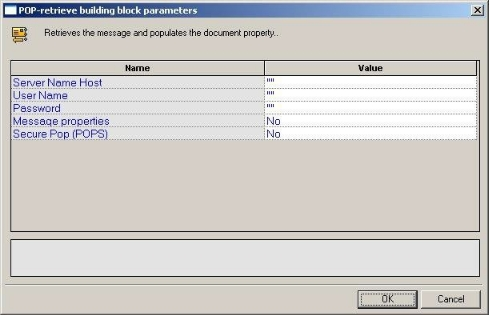

2. Click the name of an input field in the left-hand column to see an explanation of that field in the comment area at the bottom of the dialog box.

3. For example, in the preceding figure, the comment area explains that the Message Properties field is a toggle that defines whether or not all the message properties should be retrieved.

4. Enter the appropriate field value into the Value column next to the field name, as described the [Table](#pop_retrieve).

5. Click **OK**.

   The POP-Retrieve Building Block is added to the Script Tree. The JavaScript code, including the InitAgenda(), InitClient(), and TerminateClient() functions, is added to the script. To see the new JavaScript code, view the script in JavaScript Editing mode.

   In the script, the POP connection is opened using the connection name, user name, and password specified by the user. The waiting messages are retrieved and the message property values are saved to a local structure.


<a name = "pop_retrieve"></a>
The fields in the POP-Retrieve Building Block parameters dialog box are described in the following table:

|**Field Name**|**Description**|
| :- | :- |
|Server Name Host|<p>Specify the name of the POP host connection.</p><p>Type the POP Host name into the input-text window that appears when you click the small arrow to the right of the Value input area for this field.</p><p>The host name must be enclosed within quotation marks.</p>|
|User Name|<p>Specify a user ID for the POP connection.</p><p>Type the user ID into the input-text window that appears when you click the small arrow to the right of the Value input area for this field. The user name must be enclosed within quotation marks.</p>|
|Password|<p>Specify a password for authentication during the POP connection.</p><p>Type the password into the input-text window that appears when you click the small arrow to the right of the Value input area for this field.</p><p>The password must be enclosed within quotation marks.</p>|
|Message properties|<p>A toggle that defines whether or not all the message properties should be retrieved.</p><p>Toggle Message Properties on or off depending on whether you select Yes or No from the list displayed in the drop-down list box that appears when you click the small arrow to the right of the Value input area for this field.</p>|
|Secure POP (POPS)|Select the appropriate Boolean value to indicate whether the site being accessed utilizes the SSL security protocol.|


#### POP-Delete

Use the POP-Delete Building Block to delete all messages from a POP mailbox.

**To enter a value:**

1. Drag the **POP-Delete** icon from the Internet Protocols toolbox into the Script Tree at the desired location. 

   The POP-Delete Building Block parameters dialog box opens.

   

2. Click the name of an input field in the left-hand column to see an explanation of that field in the comment area at the bottom of the dialog box. 

   For example, in the preceding figure, the comment area explains that the Server Name Host field is used to define the name of the mail server. WebLOAD Recorder automatically sends the user-specified name and password to the server when connecting.

3. Enter the appropriate field value into the Value column next to the field name, as described in the [Table](#pop_delete).

4. Click **OK**.

   The POP-Delete Building Block is added to the Script Tree. The JavaScript code, including the InitAgenda(), InitClient(), and TerminateClient() functions, is added to the script. To see the new JavaScript code, view the script in JavaScript Editing mode.

   In the script, a POP connection is opened using the host name, user name, and password specified by the user. The code then loops through all messages on the server, deleting each message and printing a note to the user identifying the message that was just deleted. When all messages are deleted, the connection is closed.


<a name = "pop_delete"></a>


The fields in the POP-Delete Building Block parameters dialog box are described in the following table:

|**Field Name**|**Description**|
| :- | :- |
|Server Name Host|<p>Specify the name of the POP server connection.</p><p>Type the POP host name into the input-text window that appears when you click the small arrow to the right of the Value input area for this field. The host name must be enclosed within quotation marks.</p>|
|User Name|<p>Specify a user ID for the POP connection.</p><p>Type the user ID into the input-text window that appears when you click the small arrow to the right of the Value input area for this field. The user name must be enclosed within quotation marks.</p>|
|Password|<p>Specify a password for authentication during the POP connection.</p><p>Type the password into the input-text window that appears when you click the small arrow to the right of the Value input area for this field. The password must be enclosed within quotation marks.</p>|
|Secure POP (POPS)|Select the appropriate Boolean value to indicate whether the site being accessed utilizes the SSL security protocol.|

### IMAP

Dragging an IMAP icon into your Script Tree opens an IMAP Building Block parameters dialog box.

IMAP toolbox items include:

- **IMAP-Connect**: Start an IMAP session.
- **IMAP-Retrieve**: Retrieve all waiting messages.
- **IMAP-Delete**: Delete messages from an IMAP mailbox.
- **IMAP-CreateMailbox**: Create a new IMAP mailbox.
- **IMAP-ListMailboxes**: Generate a complete list of all IMAP mailboxes accessed through the current IMAP server.
- **IMAP-DeleteMailbox**: Delete an IMAP mailbox.
- **IMAP-RenameMailbox**: Rename an IMAP mailbox.
- **IMAP-SubscribeMailbox**: Subscribe to an IMAP mailbox.
- **IMAP-UnsubscribeMailbox**: Unsubscribe from an IMAP mailbox.
- **IMAP-ListSubscribeMailboxes**: Generate a complete list of all subscribed IMAP mailboxes accessed through the current IMAP server

- **IMAP-Search**: Search for a specific email item within an IMAP mailbox.

  

#### IMAP-Connect

Use the IMAP-Connect Building Block to start an IMAP session. When you connect, you are connecting to a specific mailbox within the host, as specified by your User ID.

**To enter a value:**

1. Drag the **IMAP-Connect** icon from the Internet Protocols toolbox into the Script Tree at the desired location.

    The IMAP-Connect Building Block parameters dialog box opens.

    

1. Click the name of an input field in the left-hand column to see an explanation of that field in the comment area at the bottom of the dialog box.

    For example, in the preceding figure, the comment area explains that the IMAP Server field is used to define the IMAP Server Name or IP to be used when logging in to the specified IMAP server. WebLOAD Recorder automatically sends the user- specified name and password to the IMAP server when connecting.

1. Enter the appropriate field value into the Value column next to the field name, as described the [Table](#imap_connect).

1. Click **OK**.

    The IMAP-Connect Building Block is added to the Script Tree. The JavaScript code, including the InitAgenda(), InitClient(), and TerminateClient() functions, is added to the script. To see the new JavaScript code, view the script in JavaScript Editing mode.

    In the script, an IMAP connection is opened using the connection name, local host name, user name, and password specified by the user.


<a name ="imap_connect"></a>


The fields in the IMAP-Connect Building Block parameters dialog box are described in the following table:

|**Field Name**|**Description**|
| :- | :- |
|User Name|<p>Specify an NT user ID for the IMAP connection.</p><p>Type the user ID into the input-text window that appears when you click the small arrow to the right of the Value input area for this field. The user name must be enclosed within quotation marks.</p>|
|Password|<p>Specify an NT password for authentication during the IMAP connection.</p><p>Type the password into the input-text window that appears when you click the small arrow to the right of the Value input area for this field. The password must be enclosed within quotation marks.</p>|
|IMAP Server|<p>Specify the IMAP server name or IP number.</p><p>Type the IMAP server name into the input-text window that appears when you click the small arrow to the right of the Value input area for this field. The IMAP host is identified either through an IP number or a full name string. A server name string must be enclosed within quotation marks.</p>|
|LocalHost|<p>Specify the name of the local host.</p><p>Type the local host name into the input-text window that appears when you click the small arrow to the right of the Value input area for this field. The local host is identified either through a DNS number or a full name string. A host name string must be enclosed within quotation marks.</p>|


#### IMAP-Retrieve

Use the IMAP-Retrieve Building Block to retrieve all waiting messages, optionally together with a full set of header properties for each message.

**To enter a value:**

1. Drag the **IMAP-Retrieve** icon from the Internet Protocols toolbox into the Script Tree at the desired location.

    The IMAP-Retrieve Building Block parameters dialog box opens.

    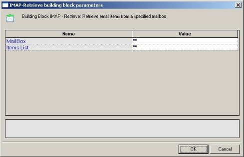

1. Click the name of an input field in the left-hand column to see an explanation of that field in the comment area at the bottom of the dialog box.

    For example, in the preceding figure, the comment area explains that the Items List field contains a list of mailbox items to be retrieved.

1. Enter the appropriate field value into the Value column next to the field name, as described in the [Table](#imap_retrieve).

1. Click **OK**.

    The IMAP-Retrieve Building Block is added to the Script Tree and the JavaScript code is added to the script. To see the new JavaScript code, view the script in JavaScript Editing mode.

    In the script, the specified message is retrieved from the specified mailbox and the message property values are saved to a local structure. A comment embedded in the code describes the message attributes stored in the imap JavaScript object.

<a name ="imap_retrieve"></a>

The fields in the IMAP-Retrieve Building Block parameters dialog box are described in the following table:

|**Field Name**|**Description**|
| :- | :- |
|MailBox|<p>Specify the name of the mailbox from which messages should be retrieved.</p><p>Type the mailbox name into the input-text window that appears when you click the small arrow to the right of the Value input area for this field. The mailbox name must be enclosed within quotation marks.</p>|
|Items List|<p>Specify the messages to be retrieved.</p><p>Type the message numbers into the input-text window that appears when you click the small arrow to the right of the Value input area for this field. The message numbers must be enclosed within quotation marks. You may specify a single message number, or you may specify a range, separated by a colon. For example, 1:10 returns messages one through ten. If you do not specify a message ID, the next message is returned.</p>|


#### IMAP-Delete

Use the IMAP-Delete Building Block to delete messages from an IMAP mailbox.

**To enter a value:**

1. Drag the **IMAP-Delete** icon from the Internet Protocols toolbox into the Script Tree at the desired location.

    The IMAP-Delete Building Block parameters dialog box opens.

    

   

1. Click the name of an input field in the left-hand column to see an explanation of that field in the comment area at the bottom of the dialog box.

    For example, in the preceding figure, the comment area explains that the Items List field contains a list of mailbox items to be deleted.

1. Enter the appropriate field value into the Value column next to the field name, as described in the [Table](#imap_delete).

1. Click **OK**.

    The IMAP-Delete Building Block is added to the Script Tree and the JavaScript code is added to the script. To see the new JavaScript code, view the script in JavaScript Editing mode.

    In the script, the messages specified by the user are deleted from the mail box specified by the user.

The fields in the IMAP-Delete Building Block parameters dialog box are described in the following table:

<a name ="imap_delete"></a>

|**Field Name**|**Description**|
| :- | :- |
|MailBox|<p>Specify the name of the mailbox from which messages should be deleted.</p><p>Type the mailbox name into the input-text window that appears when you click the small arrow to the right of the Value input area for this field. The mailbox name must be enclosed within quotation marks.</p>|
|Items List|<p>Specify the messages to be deleted.</p><p>Type the message numbers into the input-text window that appears when you click the small arrow to the right of the Value input area for this field. The message numbers must be enclosed within quotation marks. You may specify a single message number, or you may specify a range, separated by a colon. For example, 1:10 deletes messages one through ten. If you do not specify a message ID, the current message is deleted.</p>|


#### IMAP-CreateMailbox

Use the IMAP-CreateMailbox Building Block to create a new IMAP mailbox.

**To enter a value:**

1. Drag the **IMAP-CreateMailbox** icon from the Internet Protocols toolbox into the Script Tree at the desired location.

    The IMAP-CreateMailbox Building Block parameters dialog box opens.

    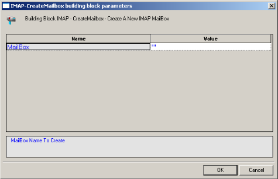

1. Click the name of an input field in the left-hand column to see an explanation of that field in the comment area at the bottom of the dialog box.

    For example, in the preceding figure, the comment area explains that the MailBox field contains the name of the mail box to be created.

1. Enter the appropriate field value into the Value column next to the field name, as described the [Table](#imap_createmailbox).

1. Click **OK**.

    The IMAP-CreateMailbox Building Block is added to the Script Tree and the JavaScript code is added to the script. To see the new JavaScript code, view the script in JavaScript Editing mode.

    In the script, a new mailbox is created using the name specified by the user.

<a name ="imap_createmailbox"></a>


The field in the IMAP-CreateMailbox Building Block parameters dialog box is described in the following table:

|**Field Name**|**Description**|
| :- | :- |
|MailBox|<p>Specify the name of the mailbox to be created.</p><p>Type the mailbox name into the input-text window that appears when you click the small arrow to the right of the Value input area for this field. The mailbox name must be enclosed within quotation marks.</p>|

#### IMAP-ListMailboxes

Use the IMAP-ListMailboxes Building Block to generate a complete list of all IMAP mailboxes accessed through the current IMAP server.

**To generate the list of IMAP mailboxes:**

- Drag the **IMAP-ListMailboxes** icon from the Internet Protocols toolbox into the Script Tree at the desired location.

    The IMAP-ListMailboxes Building Block is added to the Script Tree and the JavaScript code is added to the script. To see the new JavaScript code, view the script in JavaScript Editing mode.


#### IMAP-DeleteMailbox

Use the IMAP-DeleteMailbox Building Block to delete an IMAP mailbox.

**To delete an IMAP mailbox:**

1. Drag the **IMAP-DeleteMailbox** icon from the Internet Protocols toolbox into the Script Tree at the desired location.

    The IMAP-DeleteMailbox Building Block parameters dialog box opens.

    

   

1. Click the name of an input field in the left-hand column to see an explanation of that field in the comment area at the bottom of the dialog box.

    For example, in the preceding figure, the comment area explains that the MailBox field contains the name of the mail box to be deleted.

1. Enter the appropriate field value into the Value column next to the field name, as described the [Table](#imap_deletemailbox).

1. Click **OK**.

    The IMAP-DeleteMailbox Building Block is added to the Script Tree and the JavaScript code is added to the script. To see the new JavaScript code, view the script in JavaScript Editing mode.

    In the script, the mailbox specified by the user is deleted.

<a name = "imap_deletemailbox"></a>

The field in the IMAP-DeleteMailbox Building Block parameters dialog box is described in the following table:

|**Field Name**|**Description**|
| :- | :- |
|MailBox|<p>Specify the name of the mailbox to be deleted.</p><p>Type the mailbox name into the input-text window that appears when you click the small arrow to the right of the Value input area for this field. The mailbox name must be enclosed within quotation marks.</p>|


#### IMAP-RenameMailbox

Use the IMAP-RenameMailbox Building Block to rename an IMAP mailbox.

**To rename an IMAP mailbox:**

1. Drag the **IMAP-RenameMailbox** icon from the Internet Protocols toolbox into the Script Tree at the desired location.

    The IMAP-RenameMailbox Building Block parameters dialog box opens.

    

   

1. Click the name of an input field in the left-hand column to see an explanation of that field in the comment area at the bottom of the dialog box.

    For example, in the preceding figure, the comment area contains the name of the old mail box.

1. Enter the appropriate field value into the Value column next to the field name, as described in the [Table](#imap_renamemailbox).

1. Click **OK**.

    The IMAP-RenameMailbox Building Block is added to the Script Tree and the JavaScript code is added to the script. To see the new JavaScript code, view the script in JavaScript Editing mode. In the script, the mailbox is renamed using the name specified by the user.

The fields in the IMAP-RenameMailbox Building Block parameters dialog box are described in the following table:

<a name = "imap_renamemailbox">


|**Field Name**|**Description**|
| :- | :- |
|Old MailBox name|<p>Specify the name of the mailbox to be renamed.</p><p>Type the old mailbox name into the input-text window that appears when you click the small arrow to the right of the Value input area for this field. The mailbox name must be enclosed within quotation marks.</p>|
|New Mailbox name|<p>Specify the new name of the mailbox.</p><p>Type the new mailbox name into the input-text window that appears when you click the small arrow to the right of the Value input area for this field. The mailbox name must be enclosed within quotation marks.</p>|


#### IMAP-SubscribeMailbox

Use the IMAP-SubscribeMailbox Building Block to subscribe to an IMAP mailbox.

**To subscribe to an IMAP mailbox:**

1. Drag the **IMAP-SubscribeMailbox** icon from the Internet Protocols toolbox into the Script Tree at the desired location.

    The IMAP-SubscribeMailbox Building Block parameters dialog box opens.

    

   

   

1. Click the name of an input field in the left-hand column to see an explanation of that field in the comment area at the bottom of the dialog box.

    For example, in the preceding figure, the comment area contains the name of the mail box.

1. Enter the appropriate field value into the Value column next to the field name, as described the [Table](#imap_subscribemailbox).

1. Click **OK**.

    The IMAP-SubscribeMailbox Building Block is added to the Script Tree and the JavaScript code is added to the script. To see the new JavaScript code, view the script in JavaScript Editing mode.

    In the script, the mailbox is renamed using the name specified by the user.

The field in the IMAP-SubscribeMailbox Building Block parameters dialog box is described in the following table:

<a name ="imap_subscribemailbox"></a>


|**Field Name**|**Description**|
| :- | :- |
|MailBox name|<p>Specify the name of the mailbox to which to subscribe.</p><p>Type the mailbox name into the input-text window that appears when you click the small arrow to the right of the Value input area for this field. The mailbox name must be enclosed within quotation marks.</p>|


#### IMAP-UnsubscribeMailbox

Use the IMAP-UnsubscribeMailbox Building Block to unsubscribe from an IMAP mailbox.

**To unsubscribe from an IMAP mailbox:**

1. Drag the **IMAP-UnsubscribeMailbox** icon from the Internet Protocols toolbox into the Script Tree at the desired location.

    The IMAP-UnsubscribeMailbox Building Block parameters dialog box opens.

   

    

   

1. Click the name of an input field in the left-hand column to see an explanation of that field in the comment area at the bottom of the dialog box.

    For example, in the preceding figure, the comment area contains the name of the mail box.

1. Enter the appropriate field value into the Value column next to the field name, as described the [Table](#imap_unsubscribemailbox).

1. Click **OK**.

    The IMAP-UnsubscribeMailbox Building Block is added to the Script Tree and the JavaScript code is added to the script. To see the new JavaScript code, view the script in JavaScript Editing mode.

    In the script, the mailbox is renamed using the name specified by the user.

The field in the IMAP-UnsubscribeMailbox Building Block parameters dialog box is described in the following table:

<a name ="imap_unsubscribemailbox"></a>


|**Field Name**|**Description**|
| :- | :- |
|MailBox name|<p>Specify the name of the mailbox from which to unsubscribe.</p><p>Type the mailbox name into the input-text window that appears when you click the small arrow to the right of the Value input area for this field. The mailbox name must be enclosed within quotation marks.</p>|


#### IMAP-ListSubscribedMailboxes

Use the IMAP-ListSubscribedMailboxes Building Block to generate a complete list of all subscribed IMAP mailboxes.

**To generate the list of subscribed IMAP mailboxes:**

- Drag the **IMAP-ListSubscribedMailboxes** icon from the Internet Protocols toolbox into the Script Tree at the desired location.

    The IMAP-ListSubscribedMailboxes Building Block is added to the Script Tree and the JavaScript code is added to the script. To see the new JavaScript code, view the script in JavaScript Editing mode.


#### IMAP-Search

Use the IMAP-Search Building Block to search for a specific email item within an IMAP mailbox.

**To search for a specific email item in an IMAP mailbox:**

1. Drag the **IMAP-Search** icon from the Internet Protocols toolbox into the Script Tree at the desired location.

    The IMAP-Search Building Block parameters dialog box opens.

    

   

1. Click the name of an input field in the left-hand column to see an explanation of that field in the comment area at the bottom of the dialog box. 

    For example, in the preceding figure, the comment area explains that the MailBox field contains the name of the mail box to be searched.

1. Enter the appropriate field value into the Value column next to the field name, as described the [Table](#table_55).

1. Click **OK**.

    The IMAP-Search Building Block is added to the Script Tree and the JavaScript code is added to the script. To see the new JavaScript code, view the script in JavaScript Editing mode.

    In the script, the mailbox specified by the user is searched for all mail items containing the string “timesheet”.


<a name = "table_55"> </a>
The fields in the IMAP-Search Building Block parameters dialog box are described in the following table:

| **Field  Name** | **Description**                                              |
| --------------- | ------------------------------------------------------------ |
| MailBox         | Specify the name of the mailbox to be searched.  Type the mailbox name into  the input-text window that appears when you click the small arrow to the  right of the Value input area for this field. The mailbox name must be  enclosed within quotation marks. |
| Search String   | Specify the search criteria for the current mailbox search. Valid  search criteria include: |
|                 | ALL - All messages in the  mailbox - this is the default initial key for AND-ing. |
|                 | ANSWERED - Messages with the \\Answered flag set.            |
|                 | BCC - Messages that  contain the specified string in the envelope structure’s BCC field. |
|                 | BEFORE - Messages whose internal date is  earlier than the specified date. |
|                 | BODY - Messages that contain the specified  string in the body of the message. |
|                 | CC - Messages that contain  the specified string in the envelope structure’s CC field. |
|                 | DELETED - Messages with the \\Deleted flag  set.             |
|                 | DRAFT - Messages with the \\Draft flag set.                  |
|                 | FLAGGED - Messages with the \\Flagged flag set.              |
|                 | FROM - Messages that  contain the specified string in the envelope structure’s FROM field. |
|                 | HEADER - Messages that  have a header with the specified field-name and that contains the specified  string in the field-body. |
|                 | KEYWORD - Messages with the specified  keyword set.          |
|                 | LARGER - Messages with a size larger than the  specified number of octets. |
|                 | NEW Messages that have the  \\Recent flag set but not the \\Seen flag. This is functionally equivalent to  “(RECENT UNSEEN)”. |
|                 | NOT - Messages that do not match the specified  search key.  |
|                 | OLD - Messages that do not have the \\Recent flag  set. This is  functionally equivalent to “NOT RECENT” (as  opposed to “NOT NEW”). |
|                 | ON - Messages whose internal date is within  the specified date. |
|                 | OR - Messages that match either search key.                  |
|                 | RECENT - Messages that have the \\Recent flag set.           |
|                 | SEEN - Messages that have the \\Seen flag  set.              |
|                 | SENTBEFORE - Messages  whose Date: header is earlier than the specified date. |
|                 | SENTON - Messages whose Date: header is within the  specified date. |
|                 | SENTSINCE - Messages whose Date: header is  within or later than the specified date. |
|                 | SINCE - Messages whose internal date is  within or later than the specified date. |
|                 | SMALLER - Messages with an RFC822.SIZE  smaller than the specified number of octets. |
|                 | SUBJECT - Messages that  contain the specified string in the envelope structure’s SUBJECT field. |
|                 | TEXT - Messages that contain the specified string  in the header or body of the message. |
|                 | TO - Messages that contain the specified  string in the envelope structure’s TO field. |
|                 | UID - Messages with unique  identifiers corresponding to the specified unique identifier set. |
|                 | UNANSWERED - Messages that do not have the  \\Answered flag set. |
|                 | UNDELETED - Messages that do not have the  \\Deleted flag set. |
|                 | UNDRAFT - Messages that do not have the  \\Draft flag set.   |
|                 | UNFLAGGED - Messages that do not have the  \\Flagged flag set. |
|                 | UNKEYWORD - Messages that do not have the  specified keyword set. |
|                 | UNSEEN - Messages that do not have the  \\Seen flag set.     |
|                 | This Building Block  returns a string containing the IDs of messages that meet the search criteria  if successful, an exception if unsuccessful. |


### **NNTP**
Dragging an NNTP icon into your Script Tree opens an NNTP Building Block parameters dialog box.

NNTP toolbox items include:

- **NNTP-Connect**: Start an NNTP session.
- **NNTP-GetArticle**: Retrieve articles from the specified news group from the NNTP server.
- **NNTP-GetArticleCount**: Retrieve the number of articles in the specified news group from the NNTP server.
- **NNTP-PostArticle**: Post articles to the specified news group.

#### NNTP-Connect

Use the NNTP-Connect Building Block to start an NNTP session. When you connect, you are connecting to a specific.

**To enter a value:**

1. Drag the **NNTP-Connect** icon from the Internet Protocols toolbox into the Script Tree at the desired location.

    The NNTP-Connect Building Block parameters dialog box opens.

   

    

1. Click the name of an input field in the left-hand column to see an explanation of that field in the comment area at the bottom of the dialog box.

    For example, in the preceding figure, the comment area explains that the Server Host Name field is used to define the NNTP Server Name or IP to be used when logging in to the specified NNTP server. WebLOAD Recorder automatically sends the user-specified name and password to the NNTP server when connecting.

1. Enter the appropriate field value into the Value column next to the field name, as described the [Table](#nntp_connect).

1. Click **OK**.

    The NNTP-Connect Building Block is added to the Script Tree. The JavaScript code, including the InitAgenda(), InitClient(), and TerminateClient() functions, is added to the script. To see the new JavaScript code, view the script in JavaScript Editing mode.

    In the script, an NNTP connection is opened using the server name, user name, and password specified by the user.


<a name ="nntp_connect"></a>
The fields in the NNTP-Connect Building Block parameters dialog box are described in the following table:

|**Field Name**|**Description**|
| :- | :- |
|Server Host Name|<p>Specify the NNTP server name or IP number.</p><p>Type the NNTP server name into the input-text window that appears when you click the small arrow to the right of the Value input area for this field. The NNTP host is identified either through an IP number or a full name string. A server name string must be enclosed within quotation marks.</p>|
|User Name|<p>Specify an NT user ID for the NNTP connection.</p><p>Type the user ID into the input-text window that appears when you click the small arrow to the right of the Value input area for this field. The user name must be enclosed within quotation marks.</p>|
|Password|<p>Specify an NT password for authentication during the NNTP connection.</p><p>Type the password into the input-text window that appears when you click the small arrow to the right of the Value input area for this field. The password must be enclosed within quotation marks.</p>|

#### NNTP-GetArticle

Use the NNTP-GetArticle Building Block to retrieve articles from the specified news group from the NNTP server.

**To enter a value:**

1. Drag the **NNTP-GetArticle** icon from the Internet Protocols toolbox into the Script Tree at the desired location.

    The NNTP-GetArticle Building Block parameters dialog box opens.

    

   

1. Click the name of an input field in the left-hand column to see an explanation of that field in the comment area at the bottom of the dialog box.

    For example, in the preceding figure, the comment area explains that the Article ID field contains the ID number of the news article to be retrieved.

1. Enter the appropriate field value into the Value column next to the field name, as described the [Table](#nntp_getarticle).

1. Click **OK**.

    The NNTP-GetArticle Building Block is added to the Script Tree and the JavaScript code is added to the script. To see the new JavaScript code, view the script in JavaScript Editing mode.

    In the script, the specified article is retrieved from the specified news group.


<a name ="nntp_getarticle"></a>
The fields in the NNTP-GetArticle Building Block parameters dialog box are described in the following table:

|**Field Name**|**Description**|
| :- | :- |
|Group Name|<p>Specify the name of the news group from which articles should be retrieved.</p><p>Type the news group name into the input-text window that appears when you click the small arrow to the right of the Value input area for this field. The news group name must be enclosed within quotation marks.</p>|
|Article ID|<p>Specify the ID number of the article to be retrieved.</p><p>Type the ID number into the input-text window that appears when you click the small arrow to the right of the Value input area for this field.</p>|


#### NNTP-GetArticleCount

Use the NNTP-GetArticleCount Building Block to retrieve the number of articles in the specified news group from the NNTP server.

**To enter a value:**

1. Drag the **NNTP-GetArticleCount** icon from the Internet Protocols toolbox into the Script Tree at the desired location.

    The NNTP-GetArticleCount Building Block parameters dialog box opens.

    

   

1. Click the name of an input field in the left-hand column to see an explanation of that field in the comment area at the bottom of the dialog box.

    For example, in the preceding figure, the comment area explains that the Group Name field contains the name of the news group whose articles are to be counted.

1. Enter the appropriate field value into the Value column next to the field name, as described the [Table](#nttp_getarticlecount).

1. Click **OK**.

    The NNTP-GetArticleCount Building Block is added to the Script Tree and the JavaScript code is added to the script. To see the new JavaScript code, view the script in JavaScript Editing mode. In the script, the number of articles appearing in the specified news group is returned.


<a name ="nttp_getarticlecount"></a>
The field in the NNTP-GetArticleCount Building Block parameters dialog box is described in the following table:

|**Field Name**|**Description**|
| :- | :- |
|Group Name|<p>Specify the name of the news group from which articles should be counted.</p><p>Type the news group name into the input-text window that appears when you click the small arrow to the right of the Value input area for this field. The news group name must be enclosed within quotation marks.</p>|

#### NNTP-PostArticle

Use the NNTP-PostArticle Building Block to post articles to the specified news group.

**To enter a value:**

1. Drag the **NNTP-PostArticle** icon from the Internet Protocols toolbox into the Script Tree at the desired location.

    The NNTP-PostArticle Building Block parameters dialog box opens.

    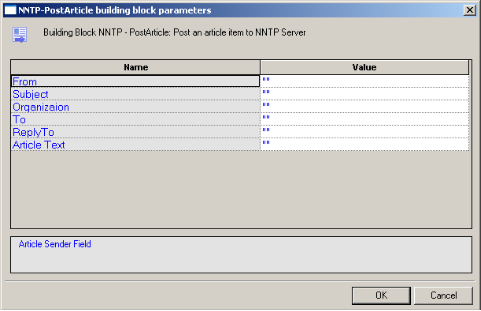

   

1. Click the name of an input field in the left-hand column to see an explanation of that field in the comment area at the bottom of the dialog box.

    For example, in the preceding figure, the comment area explains that the From field contains the name of the person sending the news article to be posted on the news group.

1. Enter the appropriate field value into the Value column next to the field name, as described the [Table](#nntp_postarticle).

1. Click **OK**.

    The NNTP-PostArticle Building Block is added to the Script Tree and the JavaScript code is added to the script. To see the new JavaScript code, view the script in JavaScript Editing mode.


<a name = "nntp_postarticle"></a>
In the script, the article text is posted to the specified news group. The fields in the NNTP-PostArticle Building Block parameters dialog box are described in the following table:

|**Field Name**|**Description**|
| :- | :- |
|From|<p>Specify the name of the person sending the email.</p><p>Type the sender’s name into the input-text window that appears when you click the small arrow to the right of the Value input area for this field.</p><p>The name must be enclosed within quotation marks.</p>|
|Subject|<p>Enter a short text line that appears as the subject line for the email being sent.</p><p>Type the subject line into the input-text window that appears when you click the small arrow to the right of the Value input area for this field.</p><p>The subject text must be enclosed within quotation marks.</p>|
|Organization|Specify the name of the organization to which the recipient belongs.|
|To|<p>Specify the name of the person to whom the email should be sent.</p><p>Type the receiver’s name into the input-text window that appears when you click the small arrow to the right of the Value input area for this field.</p><p>The name must be enclosed within quotation marks.</p>|
|ReplyTo|<p>Specify the name of the person to whom the recipient should reply.</p><p>Type the name into the input-text window that appears when you click the small arrow to the right of the Value input area for this field.</p><p>The name must be enclosed within quotation marks.</p>|
|Article Text|<p>Enter the message text of the email being sent.</p><p>Type the message text into the input-text window that appears when you click the small arrow to the right of the Value input area for this field.</p><p>The message text must be enclosed within quotation marks.</p>|


### TCP
Dragging a TCP icon into your Script Tree opens a TCP Building Block parameters dialog box.

TCP toolbox items include:

- **TCP-Connect**: Open a TCP connection.
- **TCP-Send**: Send a TCP request.
- **TCP-Receive**: Return all responses from the TCP host since the last TCP-Send action.
- **TCP-Erase**: Clear the contents of the TCP document object.

#### TCP-Connect

Use the TCP-Connect Building Block to open a TCP connection.

**To enter a value:**

1. Drag the **TCP-Connect** icon from the Internet Protocols toolbox into the Script Tree at the desired location.

    The TCP-Connect Building Block parameters dialog box opens.

    

   

1. Click the name of an input field in the left-hand column to see an explanation of that field in the comment area at the bottom of the dialog box.

    For example, in the preceding figure, the comment area explains that the Connection Timeout field is used to set the amount of time the system will wait for a TCP connection to be established before timing out. Time is defined in milliseconds.

1. Enter the appropriate field value into the Value column next to the field name, as described the [Table](#tcp_connect).

1. Click **OK**.

    The TCP-Connect Building Block is added to the Script Tree. The JavaScript code, including the InitAgenda(), InitClient(), and TerminateClient() functions, is added to the script. To see the new JavaScript code, view the script in JavaScript Editing mode.

    In the script, a TCP connection is opened using the host names specified by the user.

<a name = "tcp_connect"></a>

The fields in the TCP-Connect Building Block parameters dialog box are described in the following table:

|**Field Name**|**Description**|
| :- | :- |
|Host Name|<p>Specify the name of the TCP destination host.</p><p>Type the TCP Host name into the input-text window that appears when you click the small arrow to the right of the Value input area for this field. The TCP host is identified either through a DNS number or a full name string. A host name string must be enclosed within quotation marks.</p>|
|Port|<p>Specify the port to which you are connecting.</p><p>Type the port number into the input field. If you do not specify a value, the default TCP port is used.</p>|
|Connection Timeout|<p>Specify the amount of time the system will wait for a TCP connection to be established before timing out.</p><p>Type the timeout value in the input field. Time is defined in milliseconds.</p>|
|Outfile|<p>Specify the name of the file into which the TCP output stream should be stored.</p><p>Type the Outfile name into the input-text window that appears when you click the small arrow to the right of the Value input area for this field. The file name string must be enclosed within quotation marks.</p>|
|LocalHost|<p>Specify the name of the local host.</p><p>Type the local host name into the input-text window that appears when you click the small arrow to the right of the Value input area for this field. The local host is identified either through a DNS number or a full name string. A host name string must be enclosed within quotation marks.</p>|


#### TCP-Send

Use the TCP-Send Building Block to send a TCP request.

**To enter a value:**

1. Drag the **TCP-Send** icon from the Internet Protocols toolbox into the Script Tree at the desired location.

    The TCP-Send Building Block parameters dialog box opens.
 
    

1. Click the name of an input field in the left-hand column to see an explanation of that field in the comment area at the bottom of the dialog box.

    For example, in the preceding figure, the comment area explains that the Send String designates the text string to be sent.

1. Enter the appropriate field value into the Value column next to the field name, as described in the [Table](#tcp_send).

1. Click **OK**.

 
    The TCP-Send Building Block is added to the Script Tree and the JavaScript code is added to the script. To see the new JavaScript code, view the script in JavaScript Editing mode.

<a name = "tcp_send"></a>
The fields in the TCP-Send Building Block parameters dialog box are described in the following table:

|**Field Name**|**Description**|
| :- | :- |
|Next Prompt|<p>Specify a distinctive text string to be identified in the next string received from the host. If used, this string must appear in all communications received from the TCP host.</p><p>Type the prompt string into the input-text window that appears when you click the small arrow to the right of the Value input area for this field. The string must be enclosed within quotation marks.</p>|
|Next Size|<p>Specify the size, in bytes, of the expected data. If used, this size specification limits the length of all communications received from the TCP host.</p><p>Type the size value in the input area for this field.</p>|
|Send String|<p>Enter the text being sent to the TCP host.</p><p>Type the string text into the input-text window that appears when you click the small arrow to the right of the Value input area for this field. The message text must be enclosed within quotation marks.</p>|

#### TCP-Receive

Use the TCP-Receive Building Block to return all responses from the TCP host since the last TCP-Send action. A TCP-Receive action returns to the script when the NextPrompt, NextSize, or Timeout conditions set with a previous TCP-Send action are met. If more than one of these properties is specified, the method returns to the script when the first one is met. Subsequent uses of TCP-Receive find the next instance of the limiting property, returning additional information from the buffer. The content returned depends upon which of the three limiting properties triggered the return.

**To enter a value:**

- Drag the **TCP-Receive** icon from the Internet Protocols toolbox into the Script Tree at the desired location.

    The TCP-Receive Building Block is added to the Script Tree and the JavaScript code is added to the script. To see the new JavaScript code, view the script in JavaScript Editing mode.


#### TCP-Erase

Use the TCP-Erase Building Block to clear the contents of the TCP document object.

**To enter a value:**

- Drag the **TCP-Erase** icon from the Internet Protocols toolbox into the Script Tree at the desired location.

    The TCP-Erase Building Block is added to the Script Tree and the JavaScript code is added to the script. To see the new JavaScript code, view the script in JavaScript Editing mode.

### TELNET
Dragging a TELNET icon into your Script Tree opens a TELNET Building Block parameters dialog box.

TELNET toolbox items include:

- **TELNET-Connect**: Open a TELNET connection.
- **TELNET-Receive**: Receive a TELNET communication.
- **TELNET-Send**: Send a TELNET communication.
- **TELNET-Erase**: Clear the contents of the TELNET document object.

#### TELNET-Connect

Use the TELNET-Connect Building Block to open a TELNET connection.

**To enter a value:**

1. Drag the **TELNET-Connect** icon from the Internet Protocols toolbox into the Script Tree at the desired location.

    The TELNET-Connect Building Block parameters dialog box opens.

   

    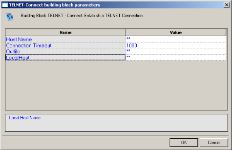

1. Click the name of an input field in the left-hand column to see an explanation of that field in the comment area at the bottom of the dialog box.

    For example, in the preceding figure, the comment area explains that the Local Host field is used to define the name of the local host for this TELNET session.

1. Enter the appropriate field value into the Value column next to the field name, as described the [Table](#telnet_connect).

1. Click **OK**.

    The TELNET-Connect Building Block is added to the Script Tree. The JavaScript code, including the InitAgenda(), InitClient(), and TerminateClient() functions, is added to the script. To see the new JavaScript code, view the script in JavaScript Editing mode.

    In the script, a TELNET connection is opened using the host names specified by the user.


<a name ="telnet_connect"></a>
The fields in the TELNET-Connect Building Block parameters dialog box are described in the following table:

|**Field Name**|**Description**|
| :- | :- |
|Host Name|<p>Specify the name of the TELNET destination host.</p><p>Type the TELNET Host name into the input-text window that appears when you click the small arrow to the right of the Value input area for this field.</p><p>The TELNET host is identified either through a DNS number or a full name string. A host name string must be enclosed within quotation marks.</p>|
|Connection Timeout|<p>Specify the amount of time the system will wait for a TELNET connection to be established before timing out.</p><p>Type the timeout value in the input field. Time is defined in milliseconds.</p>|
|Outfile|<p>Specify the name of the file into which the TELNET output stream should be stored.</p><p>Type the Outfile name into the input-text window that appears when you click the small arrow to the right of the Value input area for this field. The file name string must be enclosed within quotation marks.</p>|
|LocalHost|<p>Specify the name of the local host.</p><p>Type the local host name into the input-text window that appears when you click the small arrow to the right of the Value input area for this field. The local host is identified either through a DNS number or a full name string. A host name string must be enclosed within quotation marks.</p>|

#### TELNET-Receive

Use the TELNET-Receive Building Block to receive a TELNET communication.

**To enter a value:**

1. Drag the **TELNET-Receive** icon from the Internet Protocols toolbox into the Script Tree at the desired location.

    The TELNET-Receive Building Block parameters dialog box opens.

    

   

1. Click the name of an input field in the left-hand column to see an explanation of that field in the comment area at the bottom of the dialog box.

    For example, in the preceding figure, the comment area explains that the NextPrompt String designates the text string that must be found and identified in the next communication received via TELNET.

1. Enter the appropriate field value into the Value column next to the field name, as described the [Table](#telnet_receive).

1. Click **OK**.

    The TELNET-Receive Building Block is added to the Script Tree and the JavaScript code is added to the script. To see the new JavaScript code, view the script in JavaScript Editing mode.

<a name = "telnet_receive"></a>
The fields in the TELNET-Receive Building Block parameters dialog box are described in the following table:

|**Field Name**|**Description**|
| :- | :- |
|NextPrompt String|<p>Specify a distinctive text string to be identified in the next string received from the host. If used, this string must appear in all communications received from the TELNET host.</p><p>Type the prompt string into the input-text window that appears when you click the small arrow to the right of the Value input area for this field. The string must be enclosed within quotation marks.</p>|


#### TELNET-Send

Use the TELNET-Send Building Block to send a TELNET communication.

**To enter a value:**

1. Drag the **TELNET-Send** icon from the Internet Protocols toolbox into the Script Tree at the desired location.

    The TELNET-Send Building Block parameters dialog box opens.

    

   

1. Click the name of an input field in the left-hand column to see an explanation of that field in the comment area at the bottom of the dialog box.

    For example, in the preceding figure, the comment area explains that the Send String designates the text string to be sent.

1. Enter the appropriate field value into the Value column next to the field name, as described the [Table](#telnet_send).

1. Click **OK**.

    The TELNET-Send Building Block is added to the Script Tree and the JavaScript code is added to the script. To see the new JavaScript code, view the script in JavaScript Editing mode.


<a name ="telnet_send"></a>
The field in the TELNET-Send Building Block parameters dialog box is described in the following table:

|**Field Name**|**Description**|
| :- | :- |
|Send String|<p>Enter the text being sent to the TELNET host.</p><p>Type the string text into the input-text window that appears when you click the small arrow to the right of the Value input area for this field. The message text must be enclosed within quotation marks.</p>|

#### TELNET-Erase

Use the TELNET-Erase Building Block to clear the contents of the TELNET document object.

**To enter a value:**

- Drag the **TELNET-Erase** icon from the Internet Protocols toolbox into the Script Tree at the desired location.

    The TELNET-Erase Building Block is added to the Script Tree and the JavaScript code is added to the script. To see the new JavaScript code, view the script in JavaScript Editing mode.

### UDP
Dragging a UDP icon into your Script Tree opens a UDP Building Block parameters dialog box.

UDP toolbox items include:

- **UDP-Bind**: Create a connection to a UDP port.
- **UDP-Broadcast**: Broadcast data to the local net.
- **UDP-Receive**: Return all responses from the host since the last UDP-Send action.
- **UDP-Send**: Send a UDP communication.
- **UDP-Erase**: Clear the contents of the UDP document object.


#### UDP-Bind

Use the UDP-Bind Building Block to create a connection to a UDP port.

**To enter a value:**

1. Drag the **UDP-Bind** icon from the Internet Protocols toolbox into the Script Tree at the desired location.

    The UDP-Bind Building Block parameters dialog box opens.

    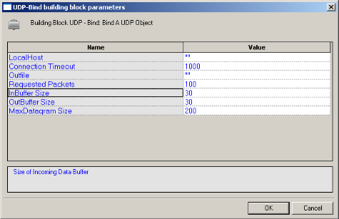

   

1. Click the name of an input field in the left-hand column to see an explanation of that field in the comment area at the bottom of the dialog box.

    For example, in the preceding figure, the comment area explains that the InBuffer Size field is used to define the amount of space allocated to the incoming data buffer for this UDP session.

1. Enter the appropriate field value into the Value column next to the field name, as described the [Table](#udp_bind).

1. Click **OK**.

    The UDP-Bind Building Block is added to the Script Tree. The JavaScript code, including the InitAgenda(), InitClient(), and TerminateClient() functions, is added to the script. To see the new JavaScript code, view the script in JavaScript Editing mode.

    In the script, the InitAgenda() function includes commands to include the WebLOAD Recorder JIPP and UDP library files. The InitClient() function includes a command to define a separate UDP object for each client. Within the main body of the script, a UDP connection is opened using the connection parameters specified by the user. The TerminateClient() function automatically closes the connection and deletes all objects created for clients during test sessions.

<a name ="udp_bind"></a>
The fields in the UDP-Bind Building Block parameters dialog box are described in the following table:

|**Field Name**|**Description**|
| :- | :- |
|LocalHost|<p>Specify the name of the local host.</p><p>Type the local host name into the input-text window that appears when you click the small arrow to the right of the Value input area for this field. The local host is identified either through a DNS number or a full name string. A host name string must be enclosed within quotation marks.</p>|
|Connection Timeout|<p>Specify the amount of time the system will wait for a UDP connection to be established before timing out.</p><p>Type the timeout value in the input field. Time is defined in milliseconds.</p>|
|Outfile|<p>Specify the name of the file into which the UDP output stream should be stored.</p><p>Type the Outfile name into the input-text window that appears when you click the small arrow to the right of the Value input area for this field. The file name string must be enclosed within quotation marks.</p>|
|Requested Packets|<p>Specify the number of requested packets per UDP communication.</p><p>Type the number of requested packets per communication for this session in the Value input area. The default value is 100.</p>|
|InBuffer Size|<p>Specify the amount of space allocated to the incoming data buffer for this UDP session.</p><p>Type the input buffer size for this session in the Value input area. The default value is 300.</p>|
|OutBuffer Size|<p>Specify the amount of space allocated to the outgoing data buffer for this UDP session.</p><p>Type the output buffer size for this session in the Value input area. The default value is 300.</p>|
|MaxDatagram Size|<p>Specify the maximum datagram size, in bytes, for this UDP session.</p><p>Type the maximum datagram size for this session in the Value input area. The default value is 200.</p>|


#### UDP-Broadcast

Use the UDP-Broadcast Building Block to broadcast data to the local net.

**To enter a value:**

1. Drag the **UDP-Broadcast** icon from the Internet Protocols toolbox into the Script Tree at the desired location.

    The UDP-Broadcast Building Block parameters dialog box opens.

    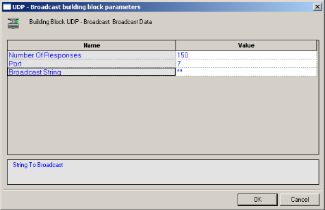

   

1. Click the name of an input field in the left-hand column to see an explanation of that field in the comment area at the bottom of the dialog box.

    For example, in the preceding figure, the comment area explains that the Broadcast String field is used to define the string to be broadcast.

1. Enter the appropriate field value into the Value column next to the field name, as described the [Table](#udp_broadcast).

1. Click **OK**.

    The **UDP-Broadcast** Building Block is added to the Script Tree and the JavaScript code is added to the script. To see the new JavaScript code, view the script in JavaScript Editing mode.

    In the script, the string defined by the user is broadcast via the specified port.


<a name ="udp_broadcast"></a>
The fields in the UDP-Broadcast Building Block parameters dialog box are described in the following table:

|**Field Name**|**Description**|
| :- | :- |
|Number of Responses|<p>Specify the number of responses the testing machine waits for before proceeding. Use this property to make sure that all network hosts have responded. To specify an unlimited number of responses, specify a Number of Responses value of zero.</p><p>Type the timeout value in the input field.</p>|
|Port|<p>Specify the port to which you are connecting.</p><p>Type the port number into the input field. If you do not specify a value, the default TCP port is used.</p>|
|Broadcast String|<p>Enter the text to be broadcast on the net.</p><p>Type the string text into the input-text window that appears when you click the small arrow to the right of the Value input area for this field. The text must be enclosed within quotation marks.</p>|


#### UDP-Receive

Use the UDP-Receive Building Block to return all responses from the host since the last UDP-Send action. A UDP-Receive action is completed when either the RequestedPackets or Timeout conditions set when the UDP connection was first established is met. Subsequent uses of UDP-Receive find the next instance of the limiting property, returning additional information from the buffer.

Use the UDP-Send Building Block to send a UDP communication.

**To enter a value:**

1. Drag the **UDP-Send** icon from the Internet Protocols toolbox into the Script Tree at the desired location.

     The UDP-Send Building Block parameters dialog box opens.

    


1. Click the name of an input field in the left-hand column to see an explanation of that field in the comment area at the bottom of the dialog box.
 
    For example, in the preceding figure, the comment area explains that the Send String designates the text string to be sent.

1. Enter the appropriate field value into the Value column next to the field name, as described the [Table](#udp_send).

1. Click **OK**.

    The UDP-Send Building Block is added to the Script Tree and the JavaScript code is added to the script. To see the new JavaScript code, view the script in JavaScript Editing mode.


<a name ="udp_send"></a>
The fields in the UDP-Send Building Block parameters dialog box are described in the following table:

|**Field Name**|**Description**|
| :- | :- |
|Destination Host|<p>Specify the name of the destination host.</p><p>Type the destination host name into the input-text window that appears when you click the small arrow to the right of the Value input area for this field. The destination host is identified either through a DNS number or a full name string. A host name string must be enclosed within quotation marks.</p>|
|Port|<p>Specify the port to which you are connecting.</p><p>Type the port number into the input field. If you do not specify a value, the default port is used.</p>|
|Send String|<p>Enter the text being sent to the specified host.</p><p>Type the string text into the input-text window that appears when you click the small arrow to the right of the Value input area for this field. The message text must be enclosed within quotation marks.</p>|

#### UDP-Erase

Use the UDP-Erase Building Block to clear the contents of the UDP document object.

**To enter a value:**

- Drag the **UDP-Erase** icon from the Internet Protocols toolbox into the Script Tree at the desired location.

    The UDP-Erase Building Block is added to the Script  Tree and the JavaScript code is added to the script. To see the new JavaScript code, view the script in JavaScript Editing mode.


## The WebLOAD Recorder IoT Protocols Toolbox

Use the WebLOAD Recorder IoT Protocols Building Blocks to simply and easily add IoT protocols functionality to your test session script without having to write numerous lines of code.


**To add IoT Protocols Building Blocks to a test script directly through the WebLOAD Recorder GUI:**

- Drag the selected IoT Protocols icon from the IoT Protocols toolbox and drop it into the Script Tree at the appropriate point.

    WebLOAD Recorder automatically adds the appropriate JavaScript code to your test session script.

The following are the available IoT Protocols building blocks:


Each Building Block opens a different dialog box. Enter the required values in the Value field. Explanations are provided at the bottom of the dialog box for each parameter as it is selected in the dialog box.

The field descriptions in this section assume a basic familiarity with IoT protocols terminology.

### MQTT-Connect

The MQTT-Connect Building Block enables you to connect to the broker (i.e., the MQTT server).

**To insert an MQTT-Connect Building Block:**

1. Drag the MQTT-Connect icon from the IoT toolbox into the Script Tree at the desired location.

    The MQTT-Connect Node Building Block parameters dialog box opens.

    

   

1. Edit the dialog box fields according to the following table.

   

       | **Field Name** | **Description**                                              |
       | :------------- | :----------------------------------------------------------- |
       | Broker Address | The address of the MQTT broker. For example: “mqtt.example.com” |
       | Broker Port    | The MQTT Broker port number. For  example: 1883.              |
       | Client ID      | The MQTT client ID. In some cases this can be random text, such as “random123”. |
       | User Name      | The MQTT user name.                                          |
       | Password       | The MQTT Client password.                                    |

   

1. Click **OK**.

The MQTT-Connect node is added to the Script Tree.


### MQTT-Subscribe
The MQTT-Subscribe Building Block enables you to subscribe to a topic.

**To insert an MQTT-Subscribe Building Block:**

1. Drag the MQTT-Subscribe icon from the IoT toolbox into the Script Tree at the desired location.

    The MQTT-Subscribe Node Building Block parameters dialog box opens.

    

   

1. Edit the dialog box fields according to the following table.

   

    | **Field Name** | **Description**                                         |
    | :------------- | :------------------------------------------------------ |
    | Topic Name     | The MQTT topic name. For example: “any topic\my topic”. |

   

1. Click **OK**.

The MQTT-Subscribe node is added to the Script Tree.


### MQTT-Send
The MQTT-Send Building Block enables you to send MQTT messages.

**To insert an MQTT-Send Building Block:**

1. Drag the MQTT-Send icon from the IoT toolbox into the Script Tree at the desired location.

    The MQTT-Send Node Building Block parameters dialog box opens.

    

   

1. Edit the dialog box fields according to the following table.

   

    | **Field Name** | **Description**              |
    | :------------- | :--------------------------- |
    | Topic Name     | The MQTT topic name.         |
    | Message        | The MQTT message to publish. |

   

1. Click **OK**.

The MQTT-Send node is added to the Script Tree.


### MQTT-GetMessages
The MQTT-GetMessages Building Block enables you to get MQTT messages.

**To insert an MQTT-GetMessages Building Block:**

1. Drag the MQTT-GetMessages icon from the IoT toolbox into the Script Tree at the desired location.

    The MQTT-GetMessages Node Building Block parameters dialog box opens.

    

   

   

1. Edit the dialog box fields according to the following table.

   

    | **Field Name** | **Description**         |
    | :------------- | :---------------------- |
    | Sleep Time     | The default sleep time. |
 

1. Click **OK**.

The MQTT-GetMessages node is added to the Script Tree.


### AMQP-Connect
The AMQP-Connect Building Block enables you to connect to the broker.

**To insert an AMQP-Connect Building Block:**

1. Drag the AMQP-Connect icon from the IoT toolbox into the Script Tree at the desired location.

    The AMQP-Connect Node Building Block parameters dialog box opens.

    

   

1. Edit the dialog box fields according to the following table.

    

    | **Field Name**       | **Description**                 |
    | :------------------- | :------------------------------ |
    | Broker Address       | The address of the AMQP broker. |
    | Broker Port          | The AMQP port number.           |
    | UserName/VirtualHost | The AMQP Client ID.             |
    | Password             | The AMQP Client password.       |

   

1. Click **OK**.

The AMQP-Connect node is added to the Script Tree.


### AMQP-Send
The AMQP-Send Building Block enables you to send AMQP messages.

**To insert an AMQP-Send Building Block:**

1. Drag the AMQP-Send icon from the IoT toolbox into the Script Tree at the desired location.

    The AMQP-Send Node Building Block parameters dialog box opens.

    

   

1. Edit the dialog box fields according to the following table.

   

    | **Field Name** | **Description**              |
    | :------------- | :--------------------------- |
    | Topic Name     | The AMQP topic name.         |
    | Message        | The AMQP message to publish. |
 
   

1. Click **OK**.

The AMQP-Send node is added to the Script Tree.

### AMQP-GetMessages
The AMQP-GetMessages Building Block enables you to get AMQP messages.

**To insert an AMQP-GetMessages Building Block:**

1. Drag the AMQP-GetMessages icon from the IoT toolbox into the Script Tree at the desired location.

    The AMQP-GetMessages Node Building Block parameters dialog box opens.

    

   

   

1. Edit the dialog box fields according to the following table.

   
    | **Field Name** | **Description**      |
    | :------------- | :------------------- |
    | Topic Name     | The AMQP Topic name. |
    | Sleep Time     | The sleep time.      |

   

1. Click **OK**.

The AMQP-GetMessages node is added to the Script Tree.


## The WebLOAD Recorder Database Toolbox

The WebLOAD Recorder Database Toolbox includes a complete set of database Building Blocks. Use the WebLOAD Recorder database Building Blocks to simply and easily add database activities to your test session script.

**To add database Building Blocks to a test script directly through WebLOAD Recorder:**

- Drag the selected database Building Block from the Database toolbox and drop it into the Script Tree at the appropriate point.

The following are the database Building Blocks available in WebLOAD Recorder:


Each database Building Block opens a different dialog box. Enter the required values in the Value field. Explanations are provided at the bottom of the dialog box for each parameter as it is selected in the dialog box.


> **Note:** The values that appear in the Wizard’s Value area are the default values for each field. In most cases, the default value for string variables is an empty string, indicated in the Value area by a set of empty quotation marks. If you are entering your own value for a string field, the new string must also be enclosed within quotation marks. Fields that were not assigned a value in the dialog box are left as empty fields in the script code.

Once you have finished defining the new database Building Block, the new activity is reflected in the Script Tree. A database Building Block is added to the Script Tree for each database Building Block defined. WebLOAD Recorder automatically adds the corresponding JavaScript code to your test session script.

To see the complete sequence of JavaScript code for all the Database Building Blocks that have been added to the Script Tree, click the Agenda root node in the Script Tree and select the JavaScript View tab.

> **Notes:** The JavaScript code for each of the Database Building Blocks can be found in the DBBuildingBlocks.js library file, which is part of the Include directory under the WebLOAD installation directory. The JavaScript code that implements these Database Building Blocks is automatically inserted to the appropriate locations within the script. Code lines may be added to the initialization phase (within the InitAgenda() function), in the main body of the script, or to the termination phase (within the TerminateAgenda() function).

The JavaScript code for that object can be edited, as described in [*Using the JavaScript Editor* ](./editing_scripts.md#using-the-javascript-editor)*.

The field descriptions in this section assume a basic familiarity with database terminology. To take full advantage of the Database Building Blocks, testers must understand how to work with ADO objects and have a basic knowledge of SQL command syntax. WebLOAD Recorder automatically inserts into the test session script the appropriate JavaScript code to implement the database commands that the tester specifies. However, it is the tester’s responsibility to specify valid database commands.

### **OpenDB**
Use the OpenDB Building Block to open and close a specified database.

**To enter a value:**

1. Drag the **OpenDB** icon from the Database toolbox into the Script Tree at the desired location. 

    The OpenDB Building Block parameters dialog box opens.

    

   

1. Click the name of an input field in the left-hand column to see an explanation of that field in the comment area at the bottom of the dialog box.

    For example, in the preceding figure, the comment area explains that the Database Type field is used to specify the type of database to be opened.

1. Enter the appropriate field value into the Value column next to the field name, as described [Table](#opendb).

    > **Note:** The Database toolbox is currently available only for database activities through ADO under a Windows operating system.

1. Click **OK**.

The OpenDB Building Block is added to the Script Tree. The JavaScript code, including the InitAgenda(), InitClient(), and TerminateClient() functions, is added to the script. To see the new JavaScript code, view the script in JavaScript Editing mode.

> **Note:** The OpenDB Building Block automatically adds the JavaScript code required to both *open* and *close* the specified database. No “CloseDB” Building Block is necessary.

<a name ="opendb"></a>

The fields in the OpenDB Building Block parameters dialog box are described in the following table:

|**Field Name**|**Description**|
| :- | :- |
|Database type|<p>Specify the type of database to be opened.</p><p>Select the appropriate value from the drop-down list that appears when you click the Value input area for this field.</p><p>The options include MS-Access and SQL Server databases.</p>|
|Server name (SQL Server)|<p>Specify the name of the machine where the database is running.</p><p>Type the appropriate server name into the input-text window that appears when you click the small arrow to the right of the Value input area for this field.</p><p>Relevant for SQL Server databases only.</p>|
|Database name (SQL Server)|<p>Specify the name of the database on the SQL server.</p><p>Type the appropriate database name into the input-text window that appears when you click the small arrow to the right of the Value input area for this field.</p><p>Relevant for SQL Server databases only.</p>|
|User name (SQL Server)|<p>Specify a user ID for authentication against the database.</p><p>Type the user ID into the input-text window that appears when you click the small arrow to the right of the Value input area for this field.</p><p>Relevant for SQL Server databases only.</p>|
|Password (SQL Server)|<p>Specify a password for authentication against the database.</p><p>Type the password into the input-text window that appears when you click the small arrow to the right of the Value input area for this field.</p><p>Relevant for SQL Server databases only.</p>|
|File name (MDB File)|<p>Specify the full path for an MDB file.</p><p>Select the appropriate file from the Browser window that appears when you click to the right of the Value input area for this field.</p><p>Relevant for MDB databases only.</p>|
|Connection name|<p>Specify the name of the connection variable.</p><p>Type the connection name into the input-text window that appears when you click the small arrow to the right of the Value input area for this field. This connection name variable is used throughout the script file to access and work with this database.</p>|


### Oracle OpenDB
Use the Oracle OpenDB Building Block to open and close an Oracle database.

> **Note:** To use the Oracle OpenDB Building Block you must first install the Oracle Client. The Oracle Client must be installed on the same machine as the WebLOAD Recorder.

**To enter a value:**

1. Drag the **Oracle OpenDB** icon from the Database toolbox into the Script Tree at the desired location.

    The OpenDB Building Block parameters dialog box opens.

    

   

1. Click the name of an input field in the left-hand column to see an explanation of that field in the comment area at the bottom of the dialog box.

    For example, in the preceding figure, the comment area explains that the Database Type field is used to specify the type of database to be opened.

1. Enter the appropriate field value into the Value column next to the field name, as described the [Table](#oracle_opendb).

    > **Note:** The Database toolbox is currently available only for database activities through ADO under a Windows operating system.

1. Click **OK**.

The Oracle OpenDB Building Block is added to the Script Tree. The JavaScript code, including the InitAgenda(), InitClient(), and TerminateClient() functions, is added to the script. To see the new JavaScript code, view the script in JavaScript Editing mode.

> **Note:** The Oracle OpenDB Building Block automatically adds the JavaScript code required to both *open* and *close* the specified database. No “CloseDB” Building Block is necessary.

<a name ="oracle_opendb"></a>

The fields in the Oracle OpenDB Building Block parameters dialog box are described in the following table:

|**Field Name**|**Description**|
| :- | :- |
|Database name|<p>Specify the name of the database on the Oracle server.</p><p>Type the appropriate database name into the input-text window that appears when you click the small arrow to the right of the Value input area for this field.</p><p>Relevant for Oracle Server databases only.</p>|
|User name|<p>Specify a user ID for authentication against the database.</p><p>Type the user ID into the input-text window that appears when you click the small arrow to the right of the Value input area for this field.</p><p>Relevant for Oracle Server databases only.</p>|
|Password|<p>Specify a password for authentication against the database.</p><p>Type the password into the input-text window that appears when you click the small arrow to the right of the Value input area for this field.</p><p>Relevant for Oracle Server databases only.</p>|
|Connection name|<p>Specify the name of the connection variable.</p><p>Type the connection name into the input-text window that appears when you click the small arrow to the right of the Value input area for this field. This connection name variable is used throughout the script file to access and work with this database.</p>|


### MySQL OpenDB
Use the MySQL OpenDB Building Block to open and close a MySQL database.

> **Note:** Before connecting to the MySQL database, verify that the MySQL connector/ODBC 3.5.1 Driver is installed on your computer. In addition, verify that the MySQL port (3306) is open on the local/remote firewall and that the MySQL database has the right grant permission for the user and IP address from which you are connecting.

**To enter a value:**

1. Drag the **MySQL OpenDB** icon from the Database toolbox into the Script Tree at the desired location.

    The MySQLOpenDB Building Block parameters dialog box opens.

    

   

1. Click the name of an input field in the left-hand column to see an explanation of that field in the comment area at the bottom of the dialog box.

1. Enter the appropriate field value into the Value column next to the field name, as described the [Table](#mysql_opendb).

1. Click **OK**.

    The MySQL Open DB Building Block is added to the Script Tree. The JavaScript code, including the InitAgenda(), InitClient(), and TerminateClient() functions, is added to the script. To see the new JavaScript code, view the script in JavaScript Editing mode.


<a name ="mysql_opendb"></a>

The fields in the MySQL OpenDB Building Block parameters dialog box are described in the following table:

|**Field Name**|**Description**|
| :- | :- |
|Server name (MySQL Server)|Specify the name of the MySQL Database server.|
|Database name|<p>Specify the name of the database on the MySQL Database server.</p><p>Type the appropriate database name into the input-text window that appears when you click the small arrow to the right of the Value input area for this field.</p>|
|User name|<p>Specify a user ID for authentication against the database.</p><p>Type the user ID into the input-text window that appears when you click the small arrow to the right of the Value input area for this field.</p>|
|Password|<p>Specify a password for authentication against the database.</p><p>Type the password into the input-text window that appears when you click the small arrow to the right of the Value input area for this field.</p>|
|Connection name|The connection to use to open the database.|

### **Execute Command**
Use the Execute Command Building Block to add simple database commands to your test session script. The database is identified using the Connection Name variable defined through the Oracle OpenDB and OpenDB Building Blocks. The Execute Command Building Block is used for database commands that do not involve getting a return value, such as Insert, Update, and Delete.

**To enter a value:**

1. Drag the **Execute Command** icon from the Database toolbox into the Script Tree at the desired location.

    The Execute Command Building Block parameters dialog box opens.

    

   

1. Click the name of an input field in the left-hand column to see an explanation of that field in the comment area at the bottom of the dialog box.

    For example, the comment area in the preceding figure explains that the SQL/Command Expression field is used to enter the command to be executed.

1. Enter the appropriate field value into the Value column next to the field name.

    For example, to enter a text string, type the complete text into the input-text window that appears when you click the small arrow to the right of the Value input area for the field, as illustrated in the preceding figure.

    

   

1. Click **OK**.


    The Execute Command Building Block is added to the Script Tree and the JavaScript code is added to the script. To see the new JavaScript code, view the script in JavaScript Editing mode.

> **Note:** The database connection is identified with the variable defined in the OpenDB and Oracle OpenDB Building Block parameters dialog boxes.

<a name ="execute_command_building_block"> </a>

The fields in the Execute Command Building Block parameters dialog box are described in the following table:

|**Field Name**|**Description**|
| :- | :- |
|Connection name|<p>Specify the name of the connection variable.</p><p>Type the connection name into the input-text window that appears when you click the small arrow to the right of the Value input area for this field.</p><p>The connection name variable must match the name of a database connection that was previously opened with the OpenDB Building Block. The same connection name is used throughout the script file to access and work with this database.</p>|
|SQL/command expression|<p>Specify the SQL command to be executed.</p><p>Type the complete command into the input-text window that appears when you click the small arrow to the right of the Value input area for this field.</p>|

### Fetch Data
Use the Fetch Data Building Block to add database commands that return data values to the script. The database is identified using the Connection Name variable defined through the OpenDB and Oracle OpenDB Building Blocks.

**To enter a value:**

1. Drag the **Fetch Data** icon from the Database toolbox into the Script Tree at the desired location.

    The Fetch Data Building Block parameters dialog box opens.


    

   

1. Click the name of an input field in the left-hand column to see an explanation of that field in the comment area at the bottom of the dialog box.

    For example, in the preceding figure, the comment area explains that the Cursor Type field is used to define the level of access and visibility requested for this database Building Block.

1. Enter the appropriate field value into the Value column next to the field name, as described the [Table](#execute_command_building_block).

    For example, to select a value from a pre-defined list, select the Cursor Type choice from the list of options displayed in the drop-down list box that appears when you click the small arrow to the right of the Value input area for this field.

1. Click **OK**.

    The Fetch Data Building Block is added to the Script Tree. The JavaScript code, including the TerminateClient() function, is added to the script. To see the new JavaScript code, view the script in JavaScript Editing mode.


The fields in the Fetch Data Building Block parameters dialog box are described in the following table:

|**Field Name**|**Description**|
| :- | :- |
|Connection name|<p>Specify the name of the connection variable.</p><p>Type the connection name into the input-text window that appears when you click the small arrow to the right of the Value input area for this field.</p><p>The connection name variable must match the name of a database connection that was previously opened with the OpenDB Building Block. The same connection name is used throughout the script file to access and work with this database. By default, the connection name defined in the most recent OpenDB Building Block appears in this field.</p>|
|RecordSet name|<p>Specify the name of the database RecordSet variable.</p><p>Type the RecordSet name into the input-text window that appears when you click the small arrow to the right of the Value input area for this field.</p><p>The same RecordSet name is used throughout the script file to access and work with records from this database.</p>|
|SQL expression|<p>Specify the SQL command to be executed.</p><p>Type the complete command into the input-text window that appears when you click the small arrow to the right of the Value input area for this field.</p>|
|Cursor type|<p>Specify the level of access and visibility requested for this database Building Block.</p><p>Select the Cursor Type choice from the list of options displayed in the drop-down list box that appears when you click the small arrow to the right of the Value input area for this field.</p>|

### DB GetLine
When running large load tests, the user input is usually read automatically from an input file. To read many rows of input data from a simple text file, WebLOAD uses the GetLine() I/O command. To read large amounts of input data from an MS-Access or SQL Server database, WebLOAD uses the equivalent DB GetLine database Building Block.

The DB GetLine Building Block reads complete records, one by one, from a specified database table. The database table is exported into a temporary file, from which the records are read, one record per line.


**To enter a value:**

1. Drag the **DB GetLine** icon from the Database toolbox into the Script Tree at the desired location.

    The DB GetLine Building Block parameters dialog box opens.

    

   

1. Click the name of an input field in the left-hand column to see an explanation of that field in the comment area at the bottom of the dialog box.

1. Enter the appropriate field value into the Value column next to the field name, as described the [Table](#dg_getline).

1. Click **OK**.

    The DB GetLine Building Block is added to the Script Tree. The JavaScript code, including the InitAgenda() and TerminateClient() functions, is added to the script. To see the new JavaScript code, view the script in JavaScript Editing mode.


<a name ="dg_getline"></a>
The f>ields in the DB GetLine Building Block parameters dialog box are described in the following table:

|**Field Name**|**Description**|
| :- | :- |
|Database type|<p>Specify the type of database to be opened.</p><p>Select the appropriate value from the drop-down list that appears when you click the Value input area for this field.</p><p>The options include MS-Access and SQL Server databases.</p>|
|Server name (SQL Server)|<p>Specify the name of the machine where the database is running.</p><p>Type the appropriate server name into the input-text window that appears when you click the small arrow to the right of the Value input area for this field.</p><p>Relevant for SQL Server databases only.</p>|
|Database name (SQL Server)|<p>Specify the name of the database on the SQL server.</p><p>Type the appropriate database name into the input-text window that appears when you click the small arrow to the right of the Value input area for this field.</p><p>Relevant for SQL Server databases only.</p>|
|User name (SQL Server)|<p>Specify a user ID for authentication against the database.</p><p>Type the user ID into the input-text window that appears when you click the small arrow to the right of the Value input area for this field.</p><p>Relevant for SQL Server databases only.</p>|
|Password (SQL Server)|<p>Specify a password for authentication against the database.</p><p>Type the password into the input-text window that appears when you click the small arrow to the right of the Value input area for this field.</p><p>Relevant for SQL Server databases only.</p>|
|File name (MDB File)|<p>Specify the full path for an MDB file.</p><p>Select the appropriate file from the Browser window that appears when you click the button to the right of the Value input area for this field.</p><p>Relevant for MDB databases only.</p>|
|SQL expression|<p>Specify the SQL command to be executed.</p><p>Type the complete command into the input-text window that appears when you click the small arrow to the right of the Value input area for this field.</p><p></p><p>  **Note:** To take full advantage of the Database Building Blocks, testers must understand how to work with ADO objects and</p><p>have a basic knowledge of SQL command syntax. WebLOAD Recorder automatically inserts into the test session script the appropriate JavaScript code to implement specified database commands. However, it is the tester who must specify the database commands to be inserted. WebLOAD Recorder cannot correct a tester’s SQL syntax errors.</p>|
|Temporary file name|<p>Name to use for the temporary file that will contain the output data from the SQL statement.</p><p>This temporary file will serve as an input file to the test session script. Data from this file is read line by line, where each data record is a separate line.</p>|
|The delimiter character between the fields|<p>Delimiter character that separates between the fields in each record.</p><p>This delimiter character must not appear as valid character within any of the data fields. The default delimiter character is a pound sign (#).</p><p>Type in a different character as needed.</p>|
|Max number of records|Specifies the maximum number of records to read from the database.|
|Number of records per Generator|<p>Specifies the maximum number of records to be read from the database by each generator.</p><p>This field is intended for instances of testing by a network of generators. Multiple generators do not merge or share data. Database access is synchronized between generators, similar to WebLOAD Recorder’s synchronization of Global Parameters.</p><p>Each generator is allowed access to a specific number of records, enabling all the generators to work with the database in parallel. Record access is divided evenly between generators. The total number of records allocated to all generators must be equal to the Maximum Number of Records field value. For example, 1000 records may be divided between 10 Load Generators, with 100 records allocated per generator.</p>|


### Oracle DB GetLine
When running large load tests, the user input is usually read automatically from an input file. To read many rows of input data from a simple text file, WebLOAD uses the Oracle GetLine() I/O command. To read large amounts of input data from an Oracle database, WebLOAD uses the equivalent Oracle DBGetLine database Building Block.

The Oracle DB GetLine Building Block reads complete records, one by one, from a specified database table. The database table is exported into a temporary file, from which the records are read, one record per line.

> **Note:** To use the Oracle DB GetLine Building Block you must first install the Oracle Client. The Oracle Client must be installed on the same machine as the WebLOAD Recorder.

**To enter a value:**

1. Drag the **Oracle DB GetLine** icon from the Database toolbox into the Script Tree at the desired location.

    The Oracle DB GetLine Building Block parameters dialog box opens.

    

   

1. Click the name of an input field in the left-hand column to see an explanation of that field in the comment area at the bottom of the dialog box.

1. Enter the appropriate field value into the Value column next to the field name, as described the [Table](#oracle-db-getline).

1. Click **OK**.

    The Oracle DB GetLine Building Block is added to the Script Tree. The JavaScript code, including the InitAgenda() and TerminateClient() functions, is added to the script. To see the new JavaScript code, view the script in JavaScript Editing mode.

<a name = "oracle-db-getline"></a>
The fields in the **Oracle DB GetLine** Building Block parameters dialog box are described in the following table:

|**Field Name**|**Description**|
| :- | :- |
|Database name|<p>Specify the name of the database on the Oracle Database server.</p><p>Type the appropriate database name into the input-text window that appears when you click the small arrow to the right of the Value input area for this field.</p>|
|User name|<p>Specify a user ID for authentication against the database.</p><p>Type the user ID into the input-text window that appears when you click the small arrow to the right of the Value input area for this field.</p>|
|Password|<p>Specify a password for authentication against the database.</p><p>Type the password into the input-text window that appears when you click the small arrow to the right of the Value input area for this field.</p>|
|SQL expression|<p>Specify the SQL command to be executed. Type the complete command into the input-text window that appears when you click the small arrow to the right of the Value input area for this field.</p><p>**Note:** To take full advantage of the Database Building Blocks, testers must understand how to work with ADO objects and have a basic knowledge of SQL command syntax. WebLOAD Recorder automatically inserts into the test session script the appropriate JavaScript code to implement specified database commands.</p><p>However, it is the tester who must specify the database commands to be inserted. WebLOAD Recorder cannot correct a tester’s SQL syntax errors.</p>|
|Temporary file name|<p>Name to use for the temporary file that will contain the output data from the SQL statement.</p><p>This temporary file will serve as an input file to the test session script. Data from this file is read line by line, where each data record is a separate line.</p>|
|The delimiter character between the fields|<p>Delimiter character that separates between the fields in each record.</p><p>This delimiter character must not appear as valid character within any of the data fields. The default delimiter character is a pound sign (#).</p><p>Type in a different character as needed.</p>|
|Max number of records|Specifies the maximum number of records to read from the database.|
|Number of records per Generator|<p>Specifies the maximum number of records to be read from the database by each generator.</p><p>This field is intended for instances of testing by a network of generators. Multiple generators do not merge or share data. Database access is synchronized between generators, similar to WebLOAD Recorder’s synchronization of Global Parameters.</p><p>Each generator is allowed access to a specific number of records, allowing all the generators to work with the database in parallel. Record access is divided evenly between generators. The total number of records allocated to all generators must be equal to the Maximum Number of Records field value. For example, 1000 records may be divided between 10 Load Generators, with 100 records allocated per generator.</p>|


### MySQL DB GetLine
When running large load tests, the user input is usually read automatically from an input file. To read many rows of input data from a simple text file, WebLOAD uses the MySQL GetLine() I/O command. To read large amounts of input data from a MySQL database, WebLOAD uses the equivalent MySQL DBGetLine database Building Block.

The MySQL DB GetLine Building Block reads complete records, one by one, from a specified database table. The database table is exported into a temporary file, from which the records are read, one record per line.

> **Note:** Before connecting to the MySQL database, verify that the MySQL connector/ODBC 3.5.1 Driver is installed on your computer. In addition, verify that the MySQL port (3306) is open on the local/remote firewall and that the MySQL database has the right grant permission for the user and IP address from which you are connecting.

**To enter a value:**

1. Drag the **MySQL DB GetLine** icon from the Database toolbox into the Script Tree at the desired location.
 
    The MySQL DB GetLine Building Block parameters dialog box opens.

   

    

   

1. Click the name of an input field in the left-hand column to see an explanation of that field in the comment area at the bottom of the dialog box.

1. Enter the appropriate field value into the Value column next to the field name, as described the following [Table](#mysql_db_getline).

1. Click **OK**.

    The MySQL DB GetLine Building Block is added to the Script Tree. The JavaScript code, including the InitAgenda(), InitClient(), and TerminateClient() functions, is added to the script. To see the new JavaScript code, view the script in JavaScript Editing mode.

<a name = "mysql_db_getline"></a>
The fields in the MySQL DB GetLine Building Block parameters dialog box are described in the following table:

|**Field Name**|**Description**|
| :- | :- |
|Server name (MySQL Server)|Specify the name of the MySQL Database server.|
|Database name|<p>Specify the name of the database on the MySQL Database server.</p><p>Type the appropriate database name into the input-text window that appears when you click the small arrow to the right of the Value input area for this field.</p>|
|User name|<p>Specify a user ID for authentication against the database.</p><p>Type the user ID into the input-text window that appears when you click the small arrow to the right of the Value input area for this field.</p>|
|Password|<p>Specify a password for authentication against the database.</p><p>Type the password into the input-text window that appears when you click the small arrow to the right of the Value input area for this field.</p>|
|SQL expression|<p>Specify the SQL command to be executed. Type the complete command into the input-text window that appears when you click the small arrow to the right of the Value input area for this field.</p><p>**Note:** To take full advantage of the Database Building Blocks, testers must understand how to work with ADO objects and have a basic knowledge of SQL command syntax. WebLOAD Recorder automatically inserts into the test session script the appropriate JavaScript code to implement specified database commands.</p><p>However, it is the tester who must specify the database commands to be inserted. WebLOAD Recorder cannot correct a tester’s SQL syntax errors.</p>|
|Temporary file name|<p>Name to use for the temporary file that will contain the output data from the SQL statement.</p><p>This temporary file will serve as an input file to the test session script. Data from this file is read line by line, where each data record is a separate line.</p>|
|The delimiter character between the fields|<p>Delimiter character that separates between the fields in each record.</p><p>This delimiter character must not appear as valid character within any of the data fields. The default delimiter character is a pound sign (#).</p><p>Type in a different character as needed.</p>|
|Max number of records|Specifies the maximum number of records to read from the database.|
|Number of records per Generator|<p>Specifies the maximum number of records to be read from the database by each generator.</p><p>This field is intended for instances of testing by a network of generators. Multiple generators do not merge or share data. Database access is synchronized between generators, similar to WebLOAD Recorder’s synchronization of Global Parameters.</p><p>Each generator is allowed access to a specific number of records, allowing all the generators to work with the database in parallel. Record access is divided evenly between generators. The total number of records allocated to all generators must be equal to the Maximum Number of Records field value. For example, 1000 records may be divided between 10 Load Generators, with 100 records allocated per generator.</p>|


### DB Load
Use the DB Load Building Block to generate a load test for the specified database. The load is generated by executing multiple iterations of database commands read from an input file. Load testing though the WebLOAD testing suite is usually scheduled only after functional testing is completed with WebLOAD Recorder.

**To enter a value:**

1. Drag the **DB Load** icon from the Database toolbox into the Script Tree at the desired location.

    The DB Load Building Block parameters dialog box opens.

    

   

1. Click the name of an input field in the left-hand column to see an explanation of that field in the comment area at the bottom of the dialog box.

1. Enter the appropriate field value into the Value column next to the field name, as described the following [Table](#db-load).

1. Click **OK**.

    The DB Load Building Block is added to the Script Tree. The JavaScript code, including the InitAgenda(), InitClient(), and TerminateClient() functions, is added to the script. To see the new JavaScript code, view the script in JavaScript Editing mode.

<a name = "db-load"> </a>  

The fields in the DB Load Building Block parameters dialog box are described in the following table:

|**Field Name**|**Description**|
| :- | :- |
|Database type|<p>Specify the type of database to be opened.</p><p>Select the appropriate value from the drop-down list that appears when you click the Value input area for this field.</p><p>The options include MS-Access and SQL Server databases.</p>|
|Server name (SQL Server)|<p>Specify the name of the machine where the database is running.</p><p>Type the appropriate server name into the input-text window that appears when you click the small arrow to the right of the Value input area for this field.</p><p>Relevant for SQL Server databases only.</p>|
|Database name (SQL Server)|<p>Specify the name of the database on the SQL server.</p><p>Type the appropriate database name into the input-text window that appears when you click the small arrow to the right of the Value input area for this field.</p><p>Relevant for SQL Server databases only.</p>|
|User name (SQL Server)|<p>Specify a user ID for authentication against the database.</p><p>Type the user ID into the input-text window that appears when you click the small arrow to the right of the Value input area for this field.</p><p>Relevant for SQL Server databases only.</p>|
|Password (SQL Server)|<p>Specify a password for authentication against the database.</p><p>Type the password into the input-text window that appears when you click the small arrow to the right of the Value input area for this field.</p><p>Relevant for SQL Server databases only.</p>|
|File name (MDB file)|<p>Specify the full path for an MDB file.</p><p>Select the appropriate file from the Browser window that appears when you click to the right of the Value input area for this field.</p><p>Relevant for MDB databases only.</p>|
|Input File Name|<p>Name of the input file that contains a set of SQL commands and transactions to be completed during this load test. Select the appropriate file from the Browser window that appears when you click to the right of the Value input area for this field. Relevant for MDB databases only.</p><p>A typical SQL command input file may look like the following:</p><p>Select1#select \* from john\_emp</p><p>Select2#select \* from john\_emp where name=‘john’ Select3#select \* from john\_emp where name=‘john’ or</p><p>age > 10</p><p>Update#update john\_emp set age = 20 where</p><p>name=‘john’</p><p>Insert#insert into john\_emp values (99, ‘zzz’, 2)</p><p>Delete#delete from john\_emp where id=99</p><p>The input file consists of rows of SQL commands. As with all load testing, the commands in the input file are executed in sequence, with WebLOAD looping through the file repeatedly until the test is completed. Each SQL command line in the input file is preceded by a name identifying the transaction in which the command will be located. A pound sign (#) separates the transaction name field from the SQL command field in each row.</p><p>Each SQL command is defined as a distinct HTTP transaction, enclosed in the script body within a BeginTransaction()/EndTransaction() set and identified by the transaction name. These transactions, like all transactions, are tracked automatically by the built-in WebLOAD timers and counters. Statistics on the performance of each transaction appear in the WebLOAD output reports, with each transaction identified in the report by name.</p>|
|Delimiter character between fields|<p>Delimiter character that separates between the fields in each record.</p><p>This delimiter character must not appear as valid character within any of the data fields. The default delimiter character is a pound sign (#).</p><p>Type in a different character as needed.</p>|
|SQL/command to reset DB|<p>Specify an SQL command to be executed at the end of a testing round to reset the database.</p><p>This field is reserved for any “cleanup” commands that may be required in order to continue using the database for multiple iterations.</p><p>Type the complete command into the input-text window that appears when you click the small arrow to the right of the Value input area for this field.</p>|


### Oracle DB Load
Use the Oracle DB Load Building Block to generate a load test for the specified Oracle database. The load is generated by executing multiple iterations of database commands read from an input file. Load testing though the WebLOAD testing suite is usually scheduled only after functional testing is completed with WebLOAD Recorder.

> **Note:** To use the Oracle DB Load Building Block you must first install the Oracle Client. The Oracle Client must be installed on the same machine as the WebLOAD Recorder.

**To enter a value:**

1. Drag the **Oracle DB Load** icon from the Database toolbox into the Script Tree at the desired location.

    The Oracle DB Load Building Block parameters dialog box opens.

    

   

1. Click the name of an input field in the left-hand column to see an explanation of that field in the comment area at the bottom of the dialog box.

1. Enter the appropriate field value into the Value column next to the field name, as described in the following[Table](#oracle-db-load).

1. Click **OK**.

    The Oracle DB Load Building Block is added to the Script Tree. The JavaScript code, including the InitAgenda(), InitClient(), and TerminateClient() functions, is added to the script. To see the new JavaScript code, view the script in JavaScript Editing mode.

   
<a name = "oracle-db-load"></a>
The fields in the Oracle DB Load Building Block parameters dialog box are described in the following table:

|**Field Name**|**Description**|
| :- | :- |
|Database name|<p>Specify the name of the database on the Oracle Database server.</p><p>Type the appropriate database name into the input-text window that appears when you click the small arrow to the right of the Value input area for this field.</p>|
|User name|<p>Specify a user ID for authentication against the database.</p><p>Type the user ID into the input-text window that appears when you click the small arrow to the right of the Value input area for this field.</p>|
|Password|<p>Specify a password for authentication against the database.</p><p>Type the password into the input-text window that appears when you click the small arrow to the right of the Value input area for this field.</p>|
|Input File Name|<p>Name of the input file that contains a set of SQL commands and transactions to be completed during this load test. Select the appropriate file from the Browser window that appears when you click the button to the right of the Value input area for this field. Relevant for MDB databases only.</p><p>A typical SQL command input file may look like the following:</p><p>Select1#select \* from john\_emp</p><p>Select2#select \* from john\_emp where name=‘john’</p><p>Select3#select \* from john\_emp where name=‘john’ or</p><p>age > 10</p><p>Update#update john\_emp set age = 20 where</p><p>name=‘john’</p><p>Insert#insert into john\_emp values (99, ‘zzz’, 2)</p><p>Delete#delete from john\_emp where id=99</p><p>The input file consists of rows of SQL commands. As with all load testing, the commands in the input file are executed in sequence, with WebLOAD looping through the file repeatedly until the test is completed. Each SQL command line in the input file is preceded by a name identifying the transaction in which the command will be located. A pound sign (#) separates the transaction name field from the SQL command field in each row.</p>|
|Input File Name (continued)|Each SQL command is defined as a distinct HTTP transaction, enclosed in the script body within a BeginTransaction()/EndTransaction() set and identified by the transaction name. These transactions, like all transactions, are tracked automatically by the built-in WebLOAD timers and counters. Statistics on the performance of each transaction appear in the WebLOAD output reports, with each transaction identified in the report by name.|
|Delimiter character between fields|<p>Delimiter character that separates between the fields in each record.</p><p>This delimiter character must not appear as valid character within any of the data fields. The default delimiter character is a pound sign (#).</p><p>Type in a different character as needed.</p>|
|SQL/command to reset DB|<p>Specify an SQL command to be executed at the end of a testing round to reset the database.</p><p>This field is reserved for any “cleanup” commands that may be required in order to continue using the database for multiple iterations.</p><p>Type the complete command into the input-text window that appears when you click the small arrow to the right of the Value input area for this field.</p>|


### MySQL DB Load
Use the MySQL DB Load Building Block to generate a load test for the specified MySQL database. The load is generated by executing multiple iterations of database commands read from an input file. Load testing though the WebLOAD testing suite is usually scheduled only after functional testing is completed with WebLOAD Recorder.

> **Note:** Before connecting to the MySQL database, verify that the MySQL connector/ODBC 3.5.1 Driver is installed on your computer. In addition, verify that the MySQL port (3306) is open on the local/remote firewall and that the MySQL database has the right grant permission for the user and IP address from which you are connecting.

**To enter a value:**

1. Drag the **MySQL DB Load** icon from the Database toolbox into the Script Tree at the desired location.

    The MySQL DB Load Building Block parameters dialog box opens.

   

    

   

1. Click the name of an input field in the left-hand column to see an explanation of that field in the comment area at the bottom of the dialog box.

1. Enter the appropriate field value into the Value column next to the field name, as described the [Table](#MySQL_DB_Load_Building_Block_Parameters_Dialog_Box_Field).

1. Click **OK**.

    The MySQL DB Load Building Block is added to the Script Tree. The JavaScript code, including the InitAgenda(), InitClient(), and TerminateClient() functions, is added to the script. To see the new JavaScript code, view the script in JavaScript Editing mode.

The fields in the MySQL DB Load Building Block parameters dialog box are described in the following table:
<a name = "MySQL_DB_Load_Building_Block_Parameters_Dialog_Box_Field"></a>

|**Field Name**|**Description**|
| :- | :- |
|Server name (MySQL server)|Specify the name of the MySQL Database server.|
|Database name|<p>Specify the name of the database on the MySQL Database server.</p><p>Type the appropriate database name into the input-text window that appears when you click the small arrow to the right of the Value input area for this field.</p>|
|User name|<p>Specify a user ID for authentication against the database.</p><p>Type the user ID into the input-text window that appears when you click the small arrow to the right of the Value input area for this field.</p>|
|Password|<p>Specify a password for authentication against the database.</p><p>Type the password into the input-text window that appears when you click the small arrow to the right of the Value input area for this field.</p>|
|Input File Name|<p>Name of the input file that contains a set of SQL commands and transactions to be completed during this load test. Select the appropriate file from the Browser window that appears when you click the button to the right of the Value input area for this field. Relevant for MDB databases only.</p><p>A typical SQL command input file may look like the following:</p><p>Select1#select \* from john\_emp</p><p>Select2#select \* from john\_emp where name=‘john’ Select3#select \* from john\_emp where name=‘john’</p><p>or age > 10</p><p>Update#update john\_emp set age = 20 where</p><p>name=‘john’</p><p>Insert#insert into john\_emp values (99, ‘zzz’, 2)</p><p>Delete#delete from john\_emp where id=99</p><p>The input file consists of rows of SQL commands. As with all load testing, the commands in the input file are executed in sequence, with WebLOAD looping through the file repeatedly until the test is completed. Each SQL command line in the input file is preceded by a name identifying the transaction in which the command will be located. A pound sign (#) separates the transaction name field from the SQL command field in each row.</p><p>Each SQL command is defined as a distinct HTTP transaction, enclosed in the script body within a BeginTransaction()/EndTransaction() set and identified by the transaction name. These transactions, like all transactions, are tracked automatically by the built-in WebLOAD timers and counters. Statistics on the performance of each transaction appear in the WebLOAD output reports, with each transaction identified in the report by name.</p>|
|Delimiter character between fields|<p>Delimiter character that separates between the fields in each record.</p><p>This delimiter character must not appear as valid character within any of the data fields. The default delimiter character is a pound sign (#).</p><p>Type in a different character as needed.</p>|
|SQL/command to reset DB|<p>Specify an SQL command to be executed at the end of a testing round to reset the database.</p><p>This field is reserved for any “cleanup” commands that may be required in order to continue using the database for multiple iterations.</p><p>Type the complete command into the input-text window that appears when you click the small arrow to the right of the Value input area for this field.</p>|


## The WebLOAD Recorder Verifications Toolbox

The following table describes the purpose of each of the WebLOAD Recorder Verifications Toolbox items:

|**Script Item**|**Purpose**|
| :- | :- |
|WS-Single|Verifies the value of the first element returned by the query to the Web service (WS).|
|WS-Multiple|Verifies the value of every element returned by the query to the Web service (WS).|
|Flex:Verify-Ext|Verifies data in the AMF data response.|
|Flex:Extract-Ext|Extracts data from AMF data response|


**To add Verifications Building Blocks to a test script directly through the WebLOAD Recorder:**

- Drag the selected verification Building Block from the Verifications toolbox and drop it into the Script Tree immediately after the node that represents the response you wish to verify.

Each Verifications Building Block opens a different dialog box. Enter the required values in the Value fields. Explanations are provided at the bottom of the dialog box for each parameter as it is selected in the dialog box.


> **Note:** The values that appear in the dialog box Value area are the default values for each field. In most cases, the default value for string variables is an empty string, indicated in the Value area by a set of empty quotation marks. If you are entering your own value for a string field, the new string must also be enclosed within quotation marks. Fields that were not assigned a value in the dialog box are left as empty fields in the script code.

A Verifications node is added to the Script Tree for each Verifications Building Block defined. WebLOAD Recorder automatically adds the corresponding JavaScript code to your test session script.

### WS-Single
The WS-Single Building Block enables you to automatically generate a verification function of the value of the first element in a Web service’s response, in your script. During playback, the results of the verification process (failure or success) are displayed in the Log View window.

If the verification succeeds, a Debug message is written to the Log View (with the element name and actual value) and the function returns WLSuccess. If the verification fails, a Warning message is displayed and the function returns WLMinorError.

**To insert a WS-Single Building Block:**

1. Drag the **WS-Single** icon from the Verifications toolbox into the Script Tree immediately after the node that represents the response you wish to verify.

    The WS-Single Node Building Block parameters dialog box opens.

    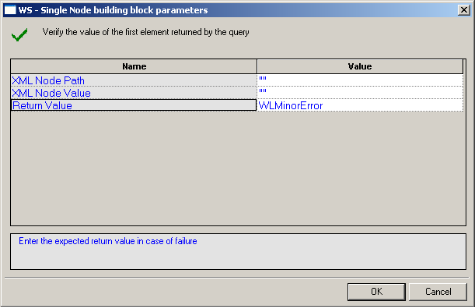

   

1. Edit the dialog box fields according to the following table.

   

    | **Field Name** | **Description**                                      |
    | :------------- | :--------------------------------------------------- |
    | XML Node Path  | The XPath query string of the object to be verified. |
    | XML Node Value | The desired response of the verification.            |
    | Return Value   | The return value in case of failure.                 |

   
1. Click **OK**.

    The WS-Single node is added to the Script Tree. The JavaScript code, including the InitAgenda()function, is added to the script. To see the new JavaScript code, view the script in JavaScript Editing mode.

    For example:

```javascript
function InitAgenda()
{
//Start generation for Building Block WS - Single Node

IncludeFile("wlXmlVerification.js", WLExecuteScript); wlGlobals.SaveSource = true;
xmlDom	= InitXML();

//End generation for Building Block WS - Single Node
}

/***** WLIDE - WS - Single Node - ID:2 *****/

VerifyXMLNode(document.wlSource, “//Result”, “2”)

// END WLIDE
```


> **Note:** After the verification function is created in the script, you can duplicate it several times within the script to verify different response values.


### WS-Multiple
The WS-Multiple Building Block enables you to automatically generate a verification function of the values of every element in a Web service’s response, in your script.

During playback, the result of the verification process (failure or success) is displayed in the Log View window.

If the verification succeeds, a Debug message is written to the Log View (with the element name and actual value) and the function returns WLSuccess. If the verification fails, a Warning message is displayed and the function returns WLMinorError.

**To insert a WS-Multiple Building Block:**

1. Drag the **WS-Multiple** icon from the Verifications toolbox into the Script Tree immediately after the node that represents the response you wish to verify.

    The WS-Multiple Nodes Building Block parameters dialog box opens.

    

   

1. Edit the dialog box fields according to the following table.

   

    | **Field Name** | **Description**                                      |
    | :------------- | :--------------------------------------------------- |
    | XML Node Path  | The XPath query string of the object to be verified. |
    | XML Node Value | The desired response of the verification.            |
    | Return Value   | Select the return value in case of failure.          |


   

1. Click **OK**.

    The WS-Multiple node is added to the Script Tree. The JavaScript code, including the InitAgenda()function, is added to the script. To see the new JavaScript code, view the script in JavaScript Editing mode.

**For example:**

```javascript
function InitAgenda(){

//Start generation for Building Block WS - Multiple Nodes

IncludeFile("wlXmlVerification.js", WLExecuteScript); wlGlobals.SaveSource = true;

xmlDom	= InitXML();

//End generation for Building Block WS - Multiple Nodes

}

/***** WLIDE - WS - Multiple Nodes - ID:3 *****/

VerifyXMLNodes(document.wlSource, ”//Result”, “5”)

// END WLIDE
```


> **Note:** After the verification function is created in the script, you can duplicate it several times within the script to verify different response values.

### Flex:Verify-Ext
The Flex:Verify-Ext Building Block enables you to automatically generate a verification function of the data in the AMF data response, in your script. During playback, the results of the verification process (failure or success) are displayed in the Log View window.

If the verification succeeds, a Debug message is written to the Log View (with the element name and actual value) and the function returns WLSuccess. If the verification fails, a Warning message is displayed and the function returns WLMinorError.

**To insert a Flex:Verify-Ext Building Block:**

1. Drag the **Flex:Verify-Ext** icon from the Verifications toolbox into the Script Tree immediately after the node that represents the AMF data response you wish to verify.

    The Flex:Verify-Ext Building Block parameters dialog box opens.

    

   

1. Edit the dialog box fields according to the following table.

   

    | **Field Name**               | **Description**                                |
    | :--------------------------- | :--------------------------------------------- |
    | AMF Response Parameter Name  | The path to the relevant AMF response element. |
    | AMF Response Parameter Value | The value of the AMF response's parameter.     |
    | Severity                     | Select the return value in case of failure.    |

   

1. Click **OK**.

    The Flex:Verify-Ext node is added to the Script Tree. The JavaScript code, including the InitAgenda()function, is added to the script. To see the new JavaScript code, view the script in JavaScript Editing mode.

    **For example:**

```javascript
function InitAgenda()
{

//Start generation for Building Block Flex:Verify-Ext 
      
IncludeFile("amfVerification.js");

//End generation for Building Block Flex:Verify-Ext
}

/***** WLIDE - Flex:Verify-Ext - ID:11 *****/

AMFResponse = new Packages.com.radview.amf.WLAmfMessage(getAmfDataAsJsStri ng());

VerifyAMFExt(AMFResponse,"ActionMessage.bodies(0).data.b ody(1).category", "AMF test3", WLMinorError)

// END WLIDE
```


> **Note:** After the verification function is created in the script, you can duplicate it several times within the script to verify different response values.

### **Flex:Extract-Ext**
The Flex:Extract-Ext Building Block enables you to automatically extract data from an AMF data response, in your script. During playback, the extracted data is displayed in the Log View window.

If the extraction succeeds, a Debug message is written to the Log View (with the element name and actual value). If the extraction fails, the function returns NULL and a warning message is displayed.

**To insert a Flex:Extract -Ext Building Block:**

1. Drag the **Flex: Extract-Ext** icon from the Verifications toolbox into the Script Tree immediately after the node that represents the AMF data response from which you wish to extract data.

    The Flex:Extract-Ext Building Block parameters dialog box opens.

    

   

1. Edit the dialog box fields according to the following table.

   
 
    | **Field Name**              | **Description**                                |
    | :-------------------------- | :--------------------------------------------- |
    | AMF Response Parameter Name | The path to the relevant AMF response element. |
    | Parameter Name              | The name of the parameter to assign.           |

   

1. Click OK.

    The Flex:Extract-Ext node is added to the Script Tree. The JavaScript code, including the InitAgenda()function, is added to the script. To see the new JavaScript code, view the script in JavaScript Editing mode.

**For example:**

```
retVal = extractAMFValueExt("ActionMessage.bodies(0).data.body(1)

.category");
```


> **Note:** After the extraction function is created in the script, you can duplicate it several times within the script to extract data from different AMF data responses.


## The WebLOAD Recorder WebSocket Toolbox

Use the WebLOAD WebSocket Building Blocks to simply and easily add WebSocket functionality to your test session script. For a full description of the available WebSocket functionality, refer to the *WebLOAD™ JavaScript Reference Guide*.

### **WebSocket Connect**
Use the WebSocket Connect Building Block to create a WebSocket connection to a specific URL address.

> **Note:** A WebSocket emits event messages. In order to process received event messages, event handlers needs to be defined for the WebSocket. 

**To insert a WebSocket Connect Building Block:**

1. Drag the **WebSocket Connect** icon from the WebSocket toolbox into the Script Tree at the desired location.

    The WebSocket Connect Building Block parameters dialog box opens.

    

   

1. Click the name of an input field in the left-hand column to see an explanation of that field in the comment area at the bottom of the dialog box.

    For example, in the preceding figure, the comment area explains that the Socket Address field is used to define the URL to which to connect.

1. Enter the appropriate field value into the Value column next to the field name.

    |**Field Name**|**Description**|
    | :- | :- |
    |Socket Address|Specify the URL to which to connect.|
    |Socket variable name|Specify a name for this WebSocket object.|


### WebSocket Send

Use the WebSocket Send Building Block to send data to a WebSocket connection.

**To insert a WebSocket Send Building Block:**

1. Drag the **WebSocket Send** icon from the WebSocket toolbox into the Script Tree at the desired location.

    The WebSocket Send Building Block parameters dialog box opens.

    

   

   
1. Click the name of an input field in the left-hand column to see an explanation of that field in the comment area at the bottom of the dialog box.

1. For example, in the preceding figure, the comment area explains that the Data to Send field is used to define the data to be sent.

1. Enter the appropriate field value into the Value column next to the field name.


|**Field Name**|**Description**|
| :- | :- |
|Data to send|Specify the data to be sent.|
|Socket variable name|Specify the name of the WebSocket object to which to send the data.|


### WebSocket Close

Use the WebSocket Close Building Block to close a WebSocket connection.

**To insert a WebSocket Close Building Block:**

1. Drag the **WebSocket Close** icon from the WebSocket toolbox into the Script Tree at the desired location.

    The WebSocket Close Building Block parameters dialog  box opens.

    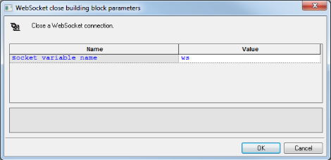

   

   

1. Click the name of an input field in the left-hand column to see an explanation of that field in the comment area at the bottom of the dialog box.

1. Enter the appropriate field value into the Value column next to the field name.

|**Field Name**|**Description**|
| :- | :- |
|Socket variable name|Specify the name of the WebSocket connection you wish to close.|


## The WebLOAD Recorder Web Services Toolbox

Use the WebLOAD Web Services Building Blocks to simply and easily add web service calls or HTTP requests to your test session script.

### HTTP
Use the HTTP Building Block to create an HTTP web service call. This building block supports any HTTP method.

**To insert an HTTP Web Service Building Block:**

1. Drag the **HTTP** icon from the Web Services toolbox into the Script Tree at the desired location.

    The HTTP Web Service dialog box opens.

    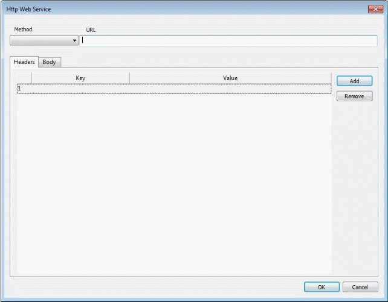

   

1. Select a method from the **Method** drop-down list: **Get**, **Post**, **Put**, **Delete**, **Copy**, **Head** or **Options**.

1. Enter a URL in the **URL** field.

1. Optionally, use the **Headers** tab to define the web service headers, as follows:

     1. In the **Key** field, select a key from the drop-down list, or enter any key.
     1. In the **Value** field, enter a value for the specified key.
     1. To add additional headers, click **Add**, and repeat steps (a) to (b). To remove a header, select the relevant line and click **Remove**.

    

   

1. Optionally, use the **Body** tab to define the web service body, using either of the following methods:

     - Select **Form-data**, and define a desired list of Keys and their Values.
          1. In the **Key** field, select a key from the drop-down list, or enter any key.
          1. In the **Value** field, enter a value for the specified key.
          1. To add an additional form data element, click **Add**, and repeat steps (a) to (b). To remove a form data element, select the relevant line and click **Remove**.

   
    

   

    - Select **Raw** and enter content into the empty box.

    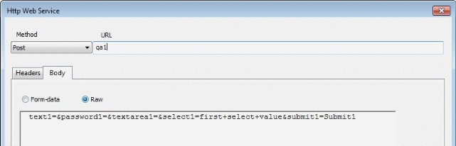

   

   

1. Click **OK**. The matching code appears in the JavaScript View.

   

### WSDL
Use the WSDL Building Block to create a web service call based on data from a Web Services Description Language (WSDL) file.

**To insert a WSDL Building Block:**

1. Drag the **WSDL** icon from the Web Services toolbox into the Script Tree at the desired location.

    The WSDL Web Service dialog box opens.

    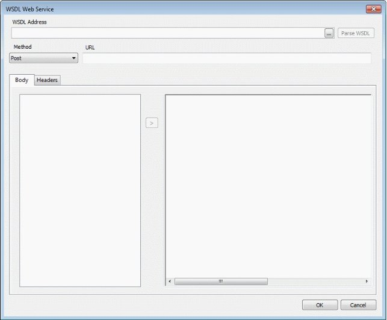
  

1. In the **WSDL Address** field, enter a WSDL URL, or browse to a WSDL file.

1. Click **Parse WSDL**. The left pane in the **Body** tab is populated with the interfaces, and their methods, of the WSDL file.

1. Define the web service body, as follows:

     1. Select a desired method and click the arrow between the left and right panes.The right pane displays the body of the selected method. In addition, WebLOAD automatically creates a default SOAPAction header based on the selected method.

      

        

      

     1. Enter values as desired to replace the “?” in the method body.

   

1. View and edit the SOAPAction headers as follows:

    1. Click the **Headers** tab to view the SOAPAction header that WebLOAD had automatically created when you selected the method.

        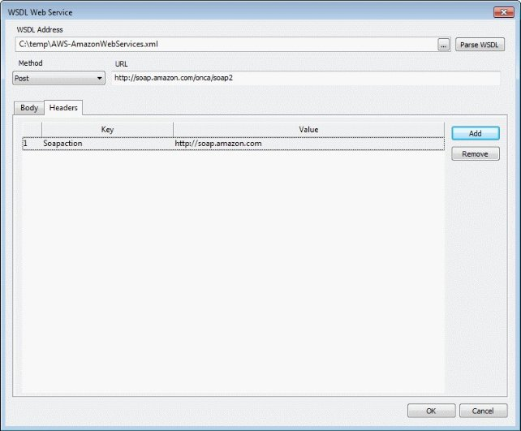

      

    1. Optionally edit the header.

    1. Optionally add additional headers, as follows:

          - Click **Add**. A new empty line is added to the table.
          - In the **Key** field, select a key from the drop-down list, or enter any key.
          - In the **Value** field, enter a value for the specified key.

    1. To remove a header, select the relevant line and click **Remove**.

1. Click **OK**. The matching code appears in the JavaScript View.


## The JMS Toolbox

The following table describes the purpose of each of the WebLOAD Recorder JMS Toolbox items:

|**Script Item**|**Purpose**|
| :- | :- |
|JMS-Connect-JNDI|Connect to a JMS queue, and create consumer and producer objects using JNDI.|
|JMS-Connect- HornetQ|Connect to a JMS queue, and create consumer and producer objects using HornetQ implementation.|
|JMS--Send|Send a JMS message using a previously created producer.|
|JMS-Receive|Receive a JMS message from a previously created consumer.|

**To use JMS in WebLOAD:**

1. Create JMS consumer and producer objects, either through JNDI or using the HornetQ implementation.
1. Use send and/or receive to put or get messages from a queue.

    > **Note:** The implementation relies on the WebLOAD Java connection, which enables making changes to the generated code easily. Refer to the “Working with Java” section of the *WebLOAD Scripting Guide* for more details.


### **JMS-Connect-JNDI**
The JMS-Connect-JNDI Building Block creates a JMS connection using JNDI. More specifically, the following objects are used:

- InitialContext – JNDI context
- JMS Connection Factory – looked up using JNDI
- JMS Destination (Queue) – looked up using JNDI
- JMS Session – using the JMS Connection
- JMS Producer and Consumer – using the session and destination

The objects are created in InitClient to be used once per virtual client. If required, some or all of the code can be moved to the script body to repeat the action each round.

The code can be adjusted as needed, for example by adding properties to the lookup:

```
env = new Packages.java.util.Properties(); env.put("INITIAL\_CONTEXT\_FACTORY", "my.factory");

env.put("PROVIDER\_URL", ["http://10.0.1.11");](http://10.0.1.11/)

jndiContext = new Packages.javax.naming.InitialContext(env);
```


**To insert a JMS-Connect-JNDI Building Block:**

1. Drag the **JMS-Connect-JNDI** icon from the JMS toolbox into the Script Tree. The JMS-Connect-JNDI Building Block parameters dialog box opens.

    

   

1. Edit the dialog box fields according to the following table.

   

    | **Field Name**     | **Description**                                              |
    | :----------------- | :----------------------------------------------------------- |
    | Connection Factory | The JNDI Name of the Connection Factory, for example: "java:comp/env/jms/MyConnectionFactory" |
    | Destination        | The JNDI name of the destination, , for example: "java:comp/env/jms/QueueName" |
 

1. Click **OK**.

    The node is added to the Script Tree. The JavaScript code, including the InitAgenda()function, is added to the script. To see the new JavaScript code, view the script in JavaScript Editing mode.

    For example:

```javascript
function InitAgenda()

{

//Start generation for Building Block JMS-Connect-JNDI IncludeFile("wljms.js",WLExecuteScript);

//End generation for Building Block JMS-Connect-JNDI

}

function InitClient()

{

//Start generation for Building Block JMS-Connect-JNDI

jndiContext = new Packages.javax.naming.InitialContext();

connectionFactory = jndiContext.lookup("/myConFact");

dest = jndiContext.lookup("/myQueue");

connection = connectionFactory.createConnection();

session = connection.createSession(false, Packages.javax.jms.Session.AUTO\_ACKNOWLEDGE);

producer = session.createProducer(dest); consumer = session.createConsumer(dest); connection.start();

//End generation for Building Block JMS-Connect-JNDI

}

/***** WLIDE - JMS-Connect-JNDI - ID:2 *****/

//JMS 'producer' and 'consumer' objects created at InitClient()

// END WLIDE

function TerminateClient()

{

//Start generation for Building Block JMS-Connect-JNDI connection.close();

//End generation for Building Block JMS-Connect-JNDI

}
```


### JMS-Connect-HornetQ
The JMS-Connect-HornetQ Building Block creates a JMS connection using the HornetQ native implementation.

More specifically, the HornetQJMSClient class is used to create the connection factory and queue, as follows:

- Create JMS Connection Factory using HornetQJMSClient

- Create JMS Queue using HornetQJMSClient
- Create standard JMS objects – consumer, producer, session using the created objects

The objects are created in InitClient to be used once per virtual client. If required, some or all of the code can be moved to the script body to repeat the action each round.

> **Note:** HornetQ supports different ways of creating the connection. The code can be adjusted to support methods other that the method described here..

**To insert a JMS-Connect-HornetQ Building Block:**

1. Drag the **JMS-Connect-HornetQ** icon from the JMS toolbox into the Script Tree. The JMS-Connect- HornetQ Building Block parameters dialog box opens.

    

   

1. Edit the dialog box fields according to the following table.

   

    | **Field Name** | **Description**                                         |
    | :------------- | :------------------------------------------------------ |
    | JMS Queue name | The name of the JMS Queue, used in createQueue() calls. |

   

1. Click **OK**.

    The node is added to the Script Tree. The JavaScript code, including the InitAgenda()function, is added to the script. To see the new JavaScript code, view the script in JavaScript Editing mode.


For example:

```javascript
function InitAgenda()

{

//Start generation for Building Block JMS-Connect- HonrnetQ

IncludeFile("wljms.js",WLExecuteScript);

//End generation for Building Block JMS-Connect-HonrnetQ

}

function InitClient()

{

//Start generation for Building Block JMS-Connect-

HonrnetQ transportConfiguration =

new Packages.org.hornetq.api.core.TransportConfiguration

("org.hornetq.core.remoting.impl.netty.NettyConnectorFac tory");

connectionFactory = Packages.org.hornetq.api.jms.HornetQJMSClient.createConn ectionFactoryWithoutHA

(Packages.org.hornetq.api.jms.JMSFactoryType.CF, [transportConfiguration]);

connection = connectionFactory.createConnection();

session = connection.createSession(false, Packages.javax.jms.Session.AUTO\_ACKNOWLEDGE);

queue = Packages.org.hornetq.api.jms.HornetQJMSClient.createQueu e("MyQueue");

producer = session.createProducer(queue); consumer = session.createConsumer(queue); connection.start();

//End generation for Building Block JMS-Connect-HonrnetQ

}

/***** WLIDE - JMS-Connect-HonrnetQ - ID:2 *****/

//JMS 'producer' and 'consumer' objects created at InitClient()

// END WLIDE

function TerminateClient()

{


//Start generation for Building Block JMS-Connect-

HonrnetQ connection.close();

//End generation for Building Block JMS-Connect-HonrnetQ

}
```


### JMS-Send
The JMS-Send Building Block sends a JMS message to the specified ‘producer’ (javax.jms.MessageProducer), using a given ‘session’ (javax.jms.Session).

The ‘producer’ and ‘session’ objects are expected to already have been created, for example by using one of the JMS-Connect building blocks.

**To insert a JMS-Send Building Block:**

1. Drag the **JMS-Send** icon from the JMS toolbox into the Script Tree. The JMS-Send Building Block parameters dialog box opens.

    

   

1. Edit the dialog box fields according to the following table.


    | **Field Name**  | **Description**                                              |
    | :-------------- | :----------------------------------------------------------- |
    | Session object  | <p>The JMS Session object, created by</p><p>connection.createSession()</p> |
    | Producer object | <p>The JMS Producer object, created by</p><p>session.createProducer()</p> |
    | Message Text    | The text to send                                             |

   

1. Click **OK**.

    The node is added to the Script Tree.

For example:

`sendJmsMessage(session, producer, "Text to send");`

### JMS-Receive
The JMS-Receive Building Block receives a JMS message from the specified ‘consumer’ (javax.jms.MessageConsumer), into a given variable. The variable can then be used to inspect the message context, using standard JavaScript String methods.

The ‘consumer’ object is expected to already have been created, for example by using one of the JMS-Connect building blocks.

##### **To insert a JMS-Receive Building Block:**

1. Drag the **JMS-Receive** icon from the JMS toolbox into the Script Tree. The JMS-Receive Building Block parameters dialog box opens.
 
    

   

1. Edit the dialog box fields according to the following table.

   

    | **Field Name**             | **Description**                                              |
    | :------------------------- | :----------------------------------------------------------- |
    | Consumer object            | The JMS Consumer object, create by session.createConsumer(). |
    | Return Message Text object | The return value name.                                       |

   

1. Click **OK**.

The node is added to the Script Tree.

For example:

`var message = receiveJmsMessage(consumer);

 InfoMessage("Got message: " + message);`


## The Real Clients Toolbox

The Real Clients Toolbox includes Selenium, Perfecto Mobile, and JUnit Runner building blocks.

### Selenium Building Blocks
Use the WebLOAD Selenium Building Blocks to simply and easily create Selenium actions. For a full description of how to use Selenium scripts in WebLOAD, refer to [*Selenium Integration* ](./appendix_g.md#selenium-integration), and to the *Working with Java Selenium Scripts* section in *Chapter 3 Advanced JavaScript Script Features* of the *WebLOAD Scripting Guide*.

**To call Selenium actions using the Selenium building blocks:**

1. Use the **Selenium driver** building block to instruct WebLOAD to create a Selenium Java WebDriver (org.openqa.selenium.WebDriver).
1. Where desired, enter commands to be executed by the Selenium Java WebDriver. For information about using the WebDriver, refer to the Selenium documentation ([http://docs.seleniumhq.org/docs/03_webdriver.jsp#selenium-webdriver-api-](http://docs.seleniumhq.org/docs/03_webdriver.jsp#selenium-webdriver-api-commands-and-operations)[ commands-and-operations](http://docs.seleniumhq.org/docs/03_webdriver.jsp#selenium-webdriver-api-commands-and-operations)).
1. Where desired, use the **Selenium Report Statistics** building block to insert a command that instructs WebLOAD to collect Selenium statistics from the current page.


#### Selenium driver

Use the Selenium Driver Building Block to instruct WebLOAD to create a Selenium Java WebDriver (org.openqa.selenium.WebDriver).

**To insert a Selenium Driver Building Block:**

1. Drag the **Selenium Driver** icon from the Real Clients toolbox into the Script Tree at the desired location.

    The Selenium Driver Building Block parameters dialog box opens.

    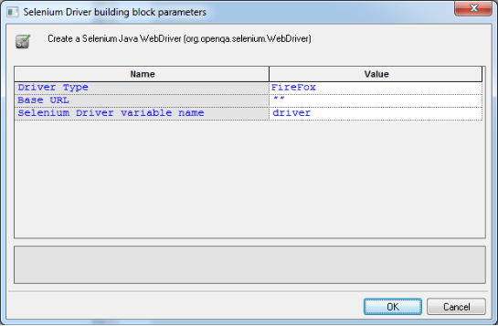

 

1. Click the name of an input field in the left-hand column to see an explanation of that field in the comment area at the bottom of the dialog box.

    For example, in the preceding figure, the comment area explains that the Driver Type field is used to specify which Selenium driver type to use.

1. Enter the appropriate field value into the Value column next to the field name, as described in the [Table](#selenium_driver).


    <a name = "selenium_driver"></a>

   

   

    | **Field Name**                | **Description**                                              |
    | :---------------------------- | :------------------------------------------------------------------------------------------------------------------- |
    | Driver Type                   | <p>Specify what type of Selenium driver to create. The possible values are:</p><p>- Firefox</p><p>- Chrome</p><p>- Internet Explorer</p> |
    | Base URL                      | Specify the first URL to which the driver will connect.      |
    | Selenium Driver variable name | Specify a name for this WebLOAD object.                      |

   

1. Click **OK**.

     The node is added to the Script Tree.

#### Selenium Report Statistics

Use the Selenium Report Statistics Block to instruct WebLOAD to collect and report navigation timing statistics for the current page.

For a full list and description of the navigation timing statistics, see the [Table](./appendix_g.md#navigation_timing_statistics)

##### **To insert a Selenium Report Statistics Building Block:**

1. Drag the **Selenium Report Statistics** icon from the Real Clients toolbox into the Script Tree at the desired location.

    The Selenium Report Statistics Building Block parameters dialog box opens.

   

    

   

1. Click the name of an input field in the left-hand column to see an explanation of that field in the comment area at the bottom of the dialog box.

    For example, in the preceding figure, the comment area explains that the Selenium Driver field is used to specify the Selenium Driver object.

1. Enter the appropriate field value into the Value column next to the field name, as described in the [Table](#selenium_report).


    <a name = "selenium_report"> </a>   

    | **Field Name**  | **Description**                                              |
    | :-------------- | :----------------------------------------------------------- |
    | Selenium Driver | Specify the name of the Selenium Driver object. Navigation timing statistics will be collected for actions executed by this Selenium Driver. |
    | Page Name       | <p>By default, WebLOAD reports navigation timing statistics as an average across all pages accessed by the Selenium Driver. If you wish to also display separately the statistics for a particular page, enter the page name in this parameter. The resultant measurements will be called <Measurement Name>-<Page Name>.</p><p>This parameter is optional.</p> |

   

1. Click **OK**.

    The node is added to the Script Tree.

    For example, if you enter **driver** as the name of the Selenium driver, and **my Page name** as the name of a desired page, the following is added to the Script Tree:

`reportStatistics(driver, "my Page name");`

### JUnit Runner Building Block for running JUnit and other unit testing frameworks
Use the JUnit Runner building block to run all unit tests of specified classes, as part of the load.

This building block is relevant not only for JUnit but for unit tests of any kind inserted in the script. For example, if your script includes Cucumber unit tests, then adding the JUnit Runner building block will run the Cucumber unit tests.

##### **To insert a JUnit Runner Building Block:**

1. Drag the **JUnit Runner** icon from the JMS toolbox into the Script Tree. The JUnit Runner Building Block parameters dialog box opens.

    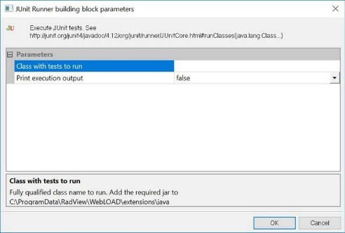

   

1. Edit the dialog box fields according to the following table.

    | **Field Name**          | **Description**                                              |
    | :---------------------- | :----------------------------------------------------------- |
    | Class with tests to run | A comma-separated list of the classes on which to run the unit tests. |
    | Print execution output  | Whether to display in the WebLOAD Recorder and WebLOAD Console log window, the unit testing execution results. |

   

1. Click **OK**.

    The node is added to the Script Tree.

### Perfecto Mobile Building Blocks
Use the Perfecto Mobile building block to instruct WebLOAD to create a Perfecto Mobile script. For a full description of how to create and use Perfecto Mobile scripts in WebLOAD, refer to [*Integrating with Perfecto Mobile* ](./appendix_f.md#appendix-f-integrating-with-perfecto-mobile).


