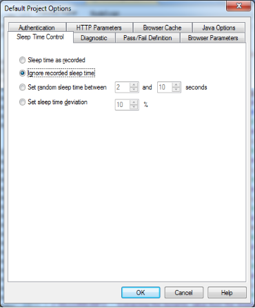
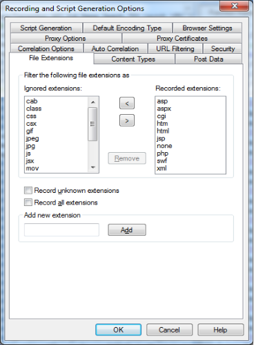
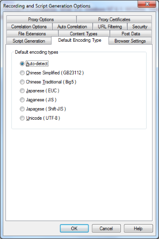
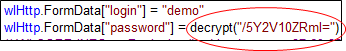
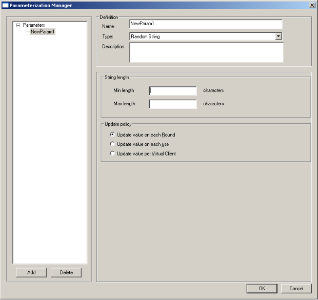

# Configuring the WebLOAD Recorder Options

You can set the following WebLOAD Recorder configuration options:

- **Default Project Options** – Settings for WebLOAD Recorder that will be in effect for each script you create. These options are for the playback.
- **Current Project Options** – Settings that will override the Default Project Options settings.
- **Recording and Script Generation Options** – Settings that define the behavior of WebLOAD Recorder during the recording and script generation of a Web session.
- **Settings** – Settings for WebLOAD Recorder.
- **Customize** – Settings for the toolbar.
- **Parameterization Manager** – Settings for replacing a recorded static value in a script with a random value from a pool of values, or with a whole set of values from a file.

## Configuring the Default and Current Project Options

The Project Options are settings for WebLOAD Recorder that will be in effect for each script you create.

- **Default Project Options** are settings that will be in effect for each script you create. Each script created or edited in WebLOAD Recorder is automatically assigned these defaults. You can modify these settings to your specifications.
- ![ref13]**Current Project Options** are settings that will override the Default Project Options settings and affect only the currently open script. You can modify these settings to your specifications.

> ##### **Notes:**
> The Current Project Options dialog boxes are the same as the Default Project Options dialog boxes *except* for the title.
>
> You must be in Edit mode to modify the options.
>

### Opening the Default and Current Project Options

**To open the Default Project Options dialog box:**

- Click **Default Project Options** in the **Tools** tab of the ribbon,

  -Or-

  Select **Default Project Options** from the WebLOAD Recorder **Home** tab of the ribbon.
  
  The Default Project Options dialog box opens with the Sleep Time Control tab displayed.
  
  

**To open the Current Project Options dialog box:**

- Click **Current Project Options** in the **Tools** tab of the ribbon,

  -Or-
  
  Select **Current Project Options** from the WebLOAD Recorder **Home** tab of the ribbon,
  
  -Or-
  
  Right-click the Agenda root node in the Script Tree and select **Current Project Options**.
  
  The Current Project Options dialog box opens with the Sleep Time Control tab displayed.
  
  

The following table describes the tabs in the Default and Current Project Options dialog box.

*Table 14: Default and Current Project Options Dialog Box Tabs*

|**Tab**|**Description**|
| :- | :- |
|
**Sleep Time Control**

(default)
|Define the behavior of Sleep time during script playback and debug. Sleep time is a pause to simulate the intermittent activity of real users.|
|**Pass/Fail Definition**|Define the test failure criteria in WebLOAD Recorder.|
|**Browser Parameters**|Define the Virtual Client behavior.|
|**Authentication**|Define the Global and Proxy authentication settings.|
|**HTTP Parameters**|Define the HTTP Client behavior on the HTTP protocol level.|
|**Browser Cache**|Define the type of cache and when the cache is cleared.|
|**Diagnostic**|Define the Diagnostic options that can be enabled while developing a script or for tracking problems in existing scripts.|
|**Java Options**|Define the Virtual Machine to be used.|

### Setting Pass/Fail Definitions
Use the Pass/Fail Definition options to define test failure criteria in WebLOAD Recorder.

**To set the Pass/Fail Definition options:**

1. Click **Default/Current Project Options** in the **Tools** tab of the ribbon. The Default/Current Project Options dialog box opens.

1. Select the **Pass/Fail Definition** tab.

   The Pass/Fail Definition tab moves to the front of the dialog box. 

   

1. Set test failure criteria. By default, WebLOAD Recorder will fail a test if a severe error occurs during the test run. You can also set WebLOAD Recorder to fail the test if a set numbers of errors or warnings are encountered.

1. Click **OK**.

### Configuring Sleep Time Control Options

Sleep time is a pause to simulate the intermittent activity of real users. WebLOAD Recorder enables you to control the sleep time during run-time and set a script to execute with the sleep times recorded in the script, random sleep times, or no sleep times.

**To configure Sleep Time Control options:**

1. Click **Default/Current Project Options** in the **Tools** tab of the ribbon. The Default/Current Project Options dialog box opens.

1. Select the **Sleep Time Control** (default) tab. The Sleep Time Control tab moves to the front of the dialog box.

   

1. Specify the type of sleep to use when playing the script. There are four options:

   - Select **Sleep time as recorded** to run the script with the delays corresponding to the natural pauses that occurred when recording the script.

   - Select **Ignore recorded sleep time** (default) to eliminate any pauses when running the script and run a worst-case stress test.

   - Select **Set random sleep time** and set the range of delays to represent a range of users.

   - Select **Set sleep time deviation** and set the percentage of deviate from the recorded value to represent a range of users.

     

1. Click **OK**.

### Setting the Browser Parameters
The Browser Parameters option enables you to define Virtual Client behavior.

**To set the Browser Parameters options:**

1. Click **Default/Current Project Options** in the **Tools** tab of the ribbon. The Default/Current Project Options dialog box opens.

1. Select the **Browser Parameters** tab.

   The Browser Parameters tab moves to the front of the dialog box.

   

1. To set the Browser and Version:

   1. Select the browser from the **Select the browser** drop-down list. An appropriate version automatically appears in the **Select the version** field.
   1. You can select an alternative version from the drop-down list, or click the Change  button to edit the version definition (see [*Editing Browser Version*](#_bookmark143)[* Definitions ](#_bookmark143)).

1. To simulate specific cache behaviors, select the **DNS cache** checkbox and **SSL cache** checkbox.

1. To set Redirection limits:

   1. Select the **Enable redirection** checkbox.
   1. In the Redirection limit field, type or select the desired redirection limit. The default limit is 10.

1. To enable a persistent connection to the server, select the **Persistent connection** checkbox.

1. To set Gzip, select the **Gzip support** checkbox.

1. To set character encoding:

   1. Select a character encoding type from the drop-down list.
   1. To enforce character encoding, select the **Enforce character encoding** checkbox.

1. Click **OK**.

The following table describes the fields and buttons in the Browser Parameters tab.

|**Field**|**Description**|
| :- | :- |
|*Browser Type*|The browser type and user-agent setting specify the type of browser the Virtual Clients should emulate. By default, all Virtual Clients use the WebLOAD Recorder default browser agent.|
|**Select the browser**|You can set WebLOAD Recorder to emulate any of the standard browsers.|
|**Select the user-agent**|You can specify any specific application by supplying a custom user-agent that is included in all HTTP headers.|
|*Cache*|The types of cache to simulate.|
|**DNS Cache**|
Caches the IP addresses received from the domain name server, reducing the domain name resolution time.

Disable DNS caching if you want to include the time for domain name resolution in the WebLOAD performance statistics.
|
|**SSL Cache**|
Caches the SSL decoding keys received from an SSL server, so that WebLOAD Recorder only receives the key on the first SSL connection in each round. In subsequent connections, WebLOAD Recorder retrieves the key from cache. Enabling SSL Cache also reduces transmission time during SSL communication.

Disable SSL caching if you want to measure the transmission time of the decoding key in the WebLOAD performance statistics for each SSL connection.
|
|*Redirection*||
|**Enable redirection**|Enables the redirection.|
|**Redirection limit**|Sets the redirection limit.|
|*Persistent Connection*||
|**Persistent connection (keep-alive)**|When enabled, WebLOAD Recorder keeps an HTTP connection alive between successive accesses in the same round of the main script. Keeping a connection alive saves time between accesses. WebLOAD attempts to keep the connection alive unless you switch to a different server. However, some HTTP servers may refuse to keep a connection alive. You should not keep a connection alive if establishing the connection is part of the performance test.|
|*HTTP properties*||
|**Gzip support**|
Sets the wlGlobals.AcceptEncodingGzip flag.

When this flag is set, WebLOAD Recorder behaves as follows:

1. For each request, sends the header “Accept-Encoding: gzip, deflate”. This informs the server that the client can accept zipped content.

2. `	`When this header is turned on, the server MAY send a response with the header “content-encoding: gzip” or “content-encoding: deflate”. If either of these headers is sent, it means that the response is zipped/deflated and WebLOAD Recorder will unzip/inflate the content.

**Note:** Most servers will work correctly even if the client does not send the “Accept-Encoding: gzip, deflate” header.

Therefore, unless needed, it is recommended not to set the wlGlobals.AcceptEncodingGzip flag because it is performance heavy. However, some servers will fail if it is not sent. Microsoft Internet Explorer/Mozilla sends it by default.

You can manually code the script to send the “Accept-Encoding: gzip, deflate” header even if the wlGlobals.AcceptEncodingGzip flag is not set. In this case, if the server returns zipped content, WebLOAD Recorder will not unzip it.
|
|*Character Encoding*||
|**Select the character encoding value**|Contains the value corresponding to the character set being used. The default value is Default (0), the regional settings of the computer.|
|**Enforce character encoding**|Indicates whether the parser should use the character set it parses in the HTML pages or override it using the value specified in the Select Character Encoding drop-down list. The default value is false (use the encoding from the HTML pages).|

##### Editing Browser Version Definitions

The available browser version list is appropriate for the browser type you select. You can add to the browser version list.

> **Note:** If you are working in the Current Project options dialog box, adding a browser version to the list only affects the current session. When you restart the application, the original browser version list is used. If you are working in the Default Project options dialog box, the updated browser version list is saved for future sessions as well.

**To add a browser version:**

1. Click the browse button in the **Browser Type** area on the Browser Parameters tab. The User Agent dialog box opens.

   

2. Manually edit the version definition.

3. Click **OK**.

### Setting the HTTP Parameters
The HTTP Parameters option enables you to define HTTP client behavior on the HTTP protocol level.

**To set the HTTP Parameters options:**

1. Click **Default/Current Project Options** in the **Tools** tab of the ribbon. The Default/Current Project Options dialog box opens.

1. Select the **HTTP Parameters** tab. The HTTP Parameters tab appears at the front of the dialog box. 

   

   

1. Set the HTTP version by clicking **HTTP version 1.0** or **HTTP version 1.1**.

1. Select one or more **HTTP properties** checkboxes.

1. Click **OK**.

The following table describes the fields and buttons in the HTTP Parameters dialog box.

|**Field**|**Description**|
| :- | :- |
|*HTTP version*|The appropriate HTTP protocol version (for example “HTTP/1.1”).|
|**HTTP version 1.0**|Sets the HTTP protocol version to 1.0.|
|**HTTP version 1.1**|Sets the HTTP protocol version to 1.1.|
|*HTTP properties*||
|**Multi IP support**|
Sets the wlGlobals.MultiIPSupport flag to indicate that the HTTP protocol version supports more than one IP address.

If this option is selected, WebLOAD takes all IP addresses defined on the Load Generator machine. However, you can exclude specific IP addresses by modifying the WebLOAD.ini configuration file.

To exclude certain IP addresses, open the WebLOAD.ini file in

`<RadView directory>`\bin and locate the following line:

EXCLUDED\_IPS=" "

Enter the IP addresses you wish to exclude. If you enter multiple addresses, use a pipe delimiter between addresses as in the following example:

EXCLUDED\_IPS="127.0.0.1|
|**Encode form data**|
Sets the wlGlobals.EncodeFormdata flag.

In general, when an HTTP client (Microsoft Internet Explorer/Firefox or WebLOAD Recorder) sends a post request to the server, the data must be HTTP encoded. Special characters like blanks, “>“ signs, and so on, are replaced by “%xx”. For example, space is encoded as “%20”.

This encoding can be performance heavy for large data, so WebLOAD Recorder enables you to turn it off.

This should ONLY be done if you are sure that the data does not contain special characters. If it does, and the customer wants to improve performance via this flag, then you should replace the special characters within the script or use wlHttp.EncodeFormdata to set the flag for specific requests.
|
|**Accept language**|Sets the wlGlobals.AcceptLanguage flag. This flag defines a global value for the “Accept-Language” header which will be sent with each request. Some applications/servers will behave differently depending on the setting. It is a simple string and WebLOAD Recorder does not enforce any checks on the values. It is similar to the property in the sense that it is a wlGlobals/wlHttp setting that affects the value of request headers.|

### **Setting the Browser Cache**
WebLOAD Recorder enables you to define the behavior of the cache that WebLOAD Console uses in order to simulate the behavior of a browser’s cache. WebLOAD can cache JavaScript files, style sheets, images, applets, and XML files.

**To define the browser cache behavior:**

1. Click **Default/Current Project Options** in the **Tools** tab of the ribbon. The Default/Current Project Options dialog box opens.
1. Select the **Browser Cache** tab.

   The Browser Cache tab moves to the front of the dialog box.

The following table describes the fields in the Browser Cache tab.

|**Field**|**Description**|
| :- | :- |
|*Browser cache types*||
|**None**|All Virtual Clients simulate a browser with no available cache.|
|**Clear cache after each Request**|Defines that the cache will be cleared after each request.|
|**Check for newer version after each Request**|
Defines that WebLOAD will check for a newer version of the cached item after every request.

Whenever the engine has a request for a cached resource, the engine sends the request with an “if-modified-since” header. If the server responds with a 200 status, the engine will refresh the cache.
|
|**Clear cache after each Round**|Defines that the cache will be cleared after each script execution round. This is the default setting.|
|**Check for newer version after each Round**|
Defines that WebLOAD will check for a newer version of the cached item after each round.

Whenever the engine has a request for a cached resource, the engine sends the request with an “if-modified-since” header. If the server responds with a 200 status, the engine will refresh the cache.
|
|**Never clear cache**|Defines that the cache will never be cleared. Each client maintains its own cache.|
|*Cache content*|
You can select a filter, enabling you to indicate specific content types to be cached in the script. The available filters are:

- JavaScript files

- Style sheets

- Images

- Applets

- XML files

- Dynamic
|

### Configuring Authentication Settings
WebLOAD Recorder enables you to define the global and proxy authentication settings.

WebLOAD Recorder enables you to configure a double proxy configuration, which instructs the recorder to use two application proxies, one for regular HTTP traffic and another for secure (SSL) traffic. To configure the two proxies, see [*Configuring a Double](#_bookmark176) *[Proxy* ](#_bookmark176)*.

**To configure Authentication settings:**

1. Click **Default/Current Project Options** in the **Tools** tab of the ribbon. The Default/Current Project Options dialog box appears.

2. Select the **Authentication** tab.

   The Authentication tab moves to the front of the dialog box.

   

3. Fill in the fields, as described below and click **OK**.

The following table defines all the fields and options in the Authentication tab.

|**Field**|**Description**|
| :- | :- |

*Global Authentication Settings*

|**User name** and **Password**|The user name and password that the script should use to log onto restricted HTTP sites.|
| :- | :- |
|
**NT user name** and

**NT password**
|The user name the script should use for Windows NT Challenge response authentication.|
|
**SSL client certificate file** and

**SSL client certificate password**
|The file name (optionally including a directory path) of the certificate WebLOAD makes available to SSL servers and type the password. Click **Browse** to search for the file.|
|**Authentication method**|
The authentication method supported by the server:

- NTLM (default).

- Kerberos.
|
|**Kerberos server**|The Kerberos server Fully Qualified Domain Name (FQDN). For example, specify “qa4” rather than “qa4.radview.co.il”. This field is only enabled when the authentication method is set to Kerberos.|
|*Proxy authentication settings*||
|
**Proxy server:**

**Proxy host** and **Proxy port**
|The host name and port number for the proxy server.|
|**Proxy user name** and **Proxy password**|The user name and password for the proxy server.|

### Setting Diagnostic Options

Diagnostic options can be enabled while developing a script or for tracking problems in existing scripts.

**To set Diagnostic options:**

1. Click **Default/Current Project Options** in the **Tools** tab of the ribbon. The Default/Current Project Options dialog box opens.

1. Select the **Diagnostic** tab.

   The Diagnostic tab moves to the front of the dialog box.

   

   

1. Set the **Enable syntax check** option, see [*Enabling Syntax Checking* ](#_bookmark149).

1. Set the **Enable the enhanced RadView support diagnostic** option, see [*Enabling](#_bookmark150)[ RadView Support Diagnostic* ](#_bookmark150).

1. Click **OK**.

#### Enabling Syntax Checking

Enable syntax checking to perform the following tests on a script while it is running.

|**Test**|**Description**|
| :- | :- |
|**Type Inspection**|
WebLOAD Recorder checks that each property receives the correct type. For example, wlLocals.ParseForms = 14 prompts the following log message:

“Wrong type for the property ParseForms. The correct type is Boolean. Legal values are: “Yes”/”No” or “true”/”false”.
|
|**Value Inspections**|
WebLOAD Recorder checks to ensure that each property is assigned a legal value. For example, wlHttp.Version = “2.1” prompts the following log message:

“2.1 is an illegal value for the property Version. Legal values are: 1.0, 1.1.”
|
|**Scope Inspections**|
WebLOAD Recorder checks to ensure that each property is assigned a permitted scope. For example, wlLocals.ConnectionSpeed = 28800 prompts the following log message:

“The property ConnectionSpeed is not valid for the object wlLocals.”
|
|**Case Inspections**|
WebLOAD Recorder objects and properties are case sensitive. When syntax checking is enabled, WebLOAD Recorder checks to ensure that all objects and properties are written correctly. For example, wlLocals.parse = “No” prompts the following message:

“The property parse should be written Parse.”
|

We recommend that syntax checking be run at least once while developing a script.

**To enable syntax checking:**

1. Click **Default/Current Project Options** in the **Tools** tab of the ribbon.

1. Select the **Diagnostic** tab.

1. Select the **Enable syntax check** checkbox.

   

#### Enabling RadView Support Diagnostic

Enabling the RadView support diagnostic option creates large files in the WebLOAD Recorder\User\Log directory that may affect Load Generator performance.

**To enable RadView Support diagnostic:**

1. Click **Default/Current Project Options** in the **Tools** tab of the ribbon.
1. Select the **Diagnostic** tab.
1. Select the **Enable the enhanced RadView support diagnostic** checkbox.

### Configuring the Java Options
The Java options enable you to define the Java Virtual Machine to be used by WebLOAD Recorder, for executing Java classes.

**To configure Java Option settings:**

1. Click **Default/Current Project Options** in the **Tools** tab of the ribbon. The Default/Current Project Options dialog box appears.

1. Select the **Java Options** tab.

   The Java Options tab moves to the front of the dialog box.

   

   

1. In the Select run-time JVM to be used drop down, select one of the available Java Virtual Machines. The default setting is the WebLOAD standard Java Virtual Machine.

   

   The selected value is passed to wlGlobals.JVMtype and is the key for

   WLJVMs.xml. This XML file (located on every WebLOAD Machine in the

   ...\extensions\JVMs directory) contains the following parameters for each JVM:

   - Type (the value from the flag)
   - Path (should be machine-agnostic)
   - Options

   When Type is “Default”, the RadView default (installed) JVM will be used. The default JVM’s path is defined in webload.ini, as it depends on the WebLOAD installation path.

1. Click **OK**.

The Java Options are saved.

## Configuring the Recording and Script Generation Options

The Recording and Script Generation Options enable you to define the behavior of the WebLOAD Recorder during the recording and script generation of a Web session.

### Opening the Recording and Script Generation Options

**To open the Recording and Script Generation Options dialog box:**

- Click **Recording and Script Generation Options** in the **Tools** tab of the ribbon. 

  Or-

  Select **Recording and Script Generation Options** from the WebLOAD Recorder
  
  **Home** tab of the ribbon.

The Recording and Script Generation Options dialog box opens with the File Extensions tab displayed.

The following table describes the tabs in the Recording and Script Generation Options dialog box.

|**Tab**|**Description**|
| :- | :- |
|**Proxy Certificates**|Configure the Server Side and Client Side certificates.|
|**Script Generation**|Define how the WebLOAD Recorder should handle various HTTP elements.|
|**Default Encoding Type**|Select the default encoding type.|
|**Browser Settings**|
Select the default browser.

If you selected either Microsoft Internet Explorer or Netscape Navigator, you can also request that the program configure the proxy value automatically (default). If you want to configure the proxy value manually, see [*Configuring the Proxy Value for Your Browser* ](#_bookmark17).
|
|
**File Extensions**

(default)
|Select which file types should be recorded and which ones should not.|
|**Content Types**|Select which objects should be recorded and which ones should not.|
|**Post Data**|Define how the WebLOAD Recorder should handle Post Data.|
|**Proxy Options**|Configure the proxy values for WebLOAD Recorder and the application (if necessary).|
|**Correlation Options**|Define correlation and logging options.|
|**Auto Correlation**|Define the auto-discovery correlation options.|
|**URL Filtering**|Configure which types of URLs the WebLOAD Recorder records.|

### Specifying the Script Content to be Generated
Use the Script Generation tab in the Recording and Script Generation Options dialog box to specify what the WebLOAD Recorder should record in your script. The Script Generation tab lists all the HTTP objects that can be automatically identified by the WebLOAD Recorder and recorded in the script so you do not have to enter them manually. For example, you can instruct WebLOAD Recorder whether or not to record and display the headers.

**To specify the HTTP objects to be recorded:**

1. Select **Recording and Script Generation Options** from the WebLOAD Recorder

   **Home** tab of the ribbon.

   The Recording and Script Generation Options dialog box appears (see [Figure 114](#_bookmark154)).

1. Select the **Script Generation** tab. 

   The Script Generation tab moves to the front of the dialog box. 

   

   

1. Select or clear the options to specify what the WebLOAD Recorder should record in your script.

1. Click **OK**.

The following table describes the options in the Script Generation tab.

|**HTTP Object**|**Description**|**Example**|
| :- | :- | :- |
|**Generate Authentication**|
Generates the name and password that appear in the header of a request.

This option is selected by default.
|wlHttp.UserName=“John” wlHttp.Password=“Blue”|
|**Generate proxy**|
Generates the proxy setting.

This option is selected by default.
|wlHttp.Proxy=<*ProxyName*>.<*ProxyPort*>|
|**Generate proxy authentication**|
Generates the name and password used to identify you to the proxy.

This option is selected by default.
|wlHttp.ProxyUserName=<*UserName*> wlHttp.ProxyPassword=<*Password*>|
|**Decode query string**|Records the query string that is the part of the URL after the “?” sign and is used for sending parameters for the specific server item which is targeted by this URL.|
When this option is not selected, the GET command will displayed as follows:

[wlHttp.Get(“http://localhost/netizenba](http://localhost/netizenba) nk/myAccountWelcome.asp?netizenSID=313 41549426&ssn=1234&password=1231&I1.x=2 1&I1.y=10”)

That is all the parameters that will appear as part of the URL.

When this option is selected, the URL will be parsed and displayed as follows:

wlHttp.FormData[“netizenSID”] = “31341549618”

wlHttp.FormData[“ssn”] = “124”

wlHttp.FormData[“password”] = “3424”

wlHttp.FormData[“I1.x”] = “29”

wlHttp.FormData[“I1.y”] = “14”

[wlHttp.Get(“http://localhost/netizenb](http://localhost/netizenba)a nk/myAccountWelcome.asp”)

That is a block of parameters that will be easier to parameterize.
|
|**Generate redirection path**|WebLOAD Recorder records (in the script) only the first GET statement; the rest of the URLs visited when redirected are inserted into the script as comments. The script does not revisit all the URLs during playback.|
wlHttp.Get [(“http://www.abcdef.com”)](http://www.abcdef.com/)

// Redirections: [http://www.ghijkl.com, ](http://www.ghijkl.com/)etc.
|
|**Generate all headers**|
Generates **all** HTTP headers.

The headers

If-Modified-Since, If-None-Matched, and Keep Alive will be commented out to overcome the situation where recorded links were fetched from the browser’s

cache during the recording.

The request header Accept-Encode: gzip will also be commented out, to ensure correct behavior.

When Generate All Headers is selected, Generate Referer Header and Generate Custom Header are automatically checked and disabled so that they cannot be unchecked.
|
wlHttp.Header[“user-agent”]

=“Mozilla/4.04 [en] (WinNT; I)”

wlHttp.Header[“accept-charset”] =“iso- 8859-1,\*,utf-8”

wlHttp.Header[“proxy-connection”]

=“Keep-Alive”

wlHttp.Header[“accept-language”] =“en”
|
|**Generate referer header**|
Generates the referer header only. This header tells the server which URL submitted the request. For example, if you click a link from page xxx, the browser will send that url as the referer.

This option is selected by default.

This option is automatically selected and cannot be changed when Generate All Headers is selected.
|wlHttp.Header[“Referer”] = [“http://www.easycar.com/”](http://www.easycar.com/)|
|**Generate custom headers**|Generates any headers that are not explicitly defined in the RFC, such as the SOAP Action header. This option is selected by default.||
|**Comment status**|Writes a comment about the status of your transactions (that is, any GET statement), including information about the contents of the pages.|
[wlHttp.Get(“http://www.RadView.com/”)](http://www.RadView.com/)

//200 OK
|
|**Comment request headers**|Writes a comment for each HTTP request.|
// Request Headers:

// user-agent=Mozilla/4.0 (compatible; MSIE 5.01; Windows NT)

// accept-encoding=gzip, deflate

// proxy-connection=Keep-Alive
|
|**Comment response headers**|Writes a comment for each reply to HTTP request.|
// Response Headers:

// content-type=text/html

// server=Microsoft-IIS/4.0

// date=Thu, 06 Jan 2000 16:12:44 GMT

// via=1.1 localhost (Jigsaw/1.0a5)//

200 OK
|
|**Encode binary data**|Used to specify if the binary data should be encoded. By default this flag is not selected.|
If a mobile operator wants to simulate the sending of binary data from the browser (phone) to the server. Part of the binary data is a value (for example, phone number) that needs parameterization.

When the EncodeBinaryData flag is selected, the binary form data “x0Ax0BAMIRx00” appears as “%0A%0BAMIR%00” in the script.
|
|**Generate**  **VIEWSTATE data**|Enables filtering the  VIEWSTATE  data while  recording.  When this is not  selected,  VIEWSTATE data  will be  commented out in  the script.||
|**Save all redirection headers**|Records the headers for all  URL redirections.||
|Generate Client side Cookies|When unchecked, the web  page sets  cookies from the  JavaScript  and you must  implement  the cookies  manually in  the script.  If selected, the cookies from  the headers  are compared  to cookies  that the server  sends. If  there is a  difference,  the correct  SetCookie  command is  added to  the script. This is  performed  during  recording.  The cookie value  is obtained  from the  recorded  traffic. WebLOAD  automatically  inserts a  comment  before the  SetCookie command in  the script  to let the user  know that  the cookie was  added  automatically.||
|**Parse JSON**|Used to specify how to  present  JSON values in the  script appearing in the  JavaScript View pane –  whether as  a long string, or  parsed.|An example of a long script display:   `wlHttp.FormData["data"]="{\"id\":\  "001\", \"type\":\"donut\",  \"name\":\"Cake\"  }"  An example  of parsed JSON display:  var  json = {  "id":  "0001",  "type":  "donut",  "name": "Cake"  }`|
|**Generate Host List**|Enables running the same script on different hosts, with minimum editing, by replacing host names with variables. If selected, each host name in the recording is replaced by a variable. To specify the actual value of each host variable, define it in the [*InitAgenda*](#_bookmark65)*()* function|Instead of the script including, for example: [wlHttp.Get("https://www.amazon.com/")](http://www.amazon.com/)  It will include the following: wlHttp.Get("https://" + domain_www_amazon_com + "/") You can then, using the same script, run one test in which you edit the InitAgenda()function so that: domain_www_amazon_com=”[www.amazon.com](http://www.amazon.com/)” and another test in which: domain_www_amazon_com=”[www.qalab.com](http://www.qalab.com/)”|
|||wlHttp.Get("https://" +|
|||domain_www_amazon_com + "/")|
|||You can then, using the same script, run one test in which you edit the InitAgenda()function so that:|
|||domain_www_amazon_com=”[www.amazon.com](http://www.amazon.com/)” and another test in which: domain_www_amazon_com=”[www.qalab.com](http://www.qalab.com/)”|

### Setting the WebLOAD Recorder to Record Post Data Types

Use the Post Data tab in the Recording and Script Generation Options dialog box to instruct the WebLOAD Recorder how to treat different data types when it is recording. Data can be written in the script as part of the command, as a data block, or in a data file. A data block is stored within the script itself, and is useful when you prefer to see the data directly. A data file stores the data in a local text file, and is useful when you are working with large amounts of data which would be too cumbersome to store within the script code itself, or binary data. When working with data files, only the name of the text file is stored in the script itself. Data can also be recorded as FormData, in which the data is formatted in a tidy name-value format and is

url-encoded when sent to the server.

While recording a script, WebLOAD automatically identifies if there are no name-value pairs, checks if there is a valid content type (for example, text/plain), and records it accordingly (for example, as Data).

> **Note:** The content type application/x-www-form-urlencoded (with or without a charset), should always be recorded as FORMDATA, unless you explicitly specify to record it as DATA or DATA FILE.

**To set the WebLOAD Recorder to record data types:**

1. Click **Recording and Script Generation Options** in the **Tools** tab of the ribbon. 

   Or- 

   Select **Recording and Script Generation Options** from the WebLOAD Recorder **Home** tab of the ribbon.

   The Recording and Script Generation Options dialog box appears (see [Figure 114](#_bookmark154)).

2. Select the **Post Data** tab. The Post Data tab moves to the front of the dialog box.

   

3. Fill in the fields as described in table below.

4. Optionally, you can double-click an item from the DATA block or DATAFILE block lists to display the item’s full text.

   

   

5. Click **OK** to return to the Post Data tab.

6. Click **OK** to save the record options settings.

The following table defines all the fields and options in the Post Data tab.

|**Field**|**Description**|
| :- | :- |
|**DATA block**|Lists the types of data that the WebLOAD Recorder records as DATA blocks in the script’s JavaScript. A DATA block is recorded without HTTP encoding and is not structured. During playback, the WebLOAD Recorder makes this data into form data and sends it without any further modification. A DATA block is for posting data that is not meant to be HTTP encoded, for example Web service calls.|
|**DATAFILE block**|Lists the types of data that the WebLOAD Recorder records as DATAFILE blocks (files with a name and a path). A DATAFILE block can store text and binary data. During playback, the WebLOAD Recorder copies and then sends this file with multipart form data, using a MIME protocol.|
|**Remove**|Click this button to delete a selected DATA block or DATAFILE block from both lists.|
|**Add new type**|Type the name of a new type you want to be added to either of the lists.|
|**As DATAFILE**|Adds the new type you entered in the Add new type field to the DATAFILE block list.|
|**As DATA**|Adds the new type you entered in the Add new type field to the DATA block list.|
|**Record Unknown Post Types as**|
Select to instruct the WebLOAD Recorder to record any data type not defined on this tab as:

- FORMDATA

- DATA

- DATAFILE
|

By default, the following content types are recorded as DATA blocks:

- application/json; charset=utf-8
- application/json-rpc
- application/xml; charset=utf-8
- text/xml
- ![ref13]text/xml; charset=utf-8

> **Note:** The recorder searches for exact content types from this list. Therefore, text/xml and text/xml; charset=utf-8 are different content types even though the former is a subset of the latter.

WebLOAD Recorder deals specially with the following content types:

- multipart/form-data – This content type is used for uploading files. The actual content type sent by the client is multipart/form-data;boundary=long- string. The recorder searches for the multipart/form-data content type and then records the request as a From Data, although it appears in the DATAFILE block list.
- multipart/text – This content type is similar to multipart/form-data, except that the multipart/text content type is not used for uploading files. The multipart/text content type is therefore handled as a DATA block, but since it contains a variable in the name (the value of boundary in multipart/text;boundary= …), the treatment of this content type is hard- coded. For example, any content type that starts with multipart/text is recorded as a DATA block content type.
- soap messages – This content type is always recorded as DATA blocks.

### Configuring the Default Encoding Type
Use the Default Encoding Type tab in the Recording and Script Generation Options dialog box to set up the default encoding type.

**To configure the default encoding type:**

1. Click **Recording and Script Generation Options** in the **Tools** tab of the ribbon. 

   Or- 

   Select **Recording and Script Generation Options** from the WebLOAD Recorder **Home** tab of the ribbon.

   The Recording and Script Generation Options dialog box appears (see [Figure 114](#_bookmark154)).

2. Select the **Default Encoding Type** tab.

3. The Default Encoding Type tab moves to the front of the dialog box.

    

4. Select an option as the default encoding type.

5. Click **OK**.

### Configuring the Default Browser
Use the Browser Settings tab in the Recording and Script Generation Options dialog box to set up the default browser.

**To configure the default browser:**

1. Click **Recording and Script Generation Options** in the **Tools** tab of the ribbon. 

   Or- 

   Select **Recording and Script Generation Options** from the WebLOAD Recorder **Home** tab of the ribbon. The Recording and Script Generation Options dialog box appears (see [Figure 114](#_bookmark154)).

2. Select the **Browser Settings** tab.

   The Browser Settings tab moves to the front of the dialog box.

   

3. Fill in the fields, as described in [Table 23](#_bookmark161).

4. Click **OK**. 

   A message appears stating that in order for WebLOAD Recorder to change your proxy definition automatically, you must close all instances of the browser before recording.

   After you close all instances of the browser, the WebLOAD Recorder screen appears.

The following table defines all the fields and options in the Browser Settings tab.

|**Field**|**Description**|
| :- | :- |
|*Default browser selection*||
|**Web browser**|
Select this option to define Google Chrome, Mozilla Firefox or Microsoft Internet Explorer as your default browser.

If you selected Mozilla Firefox as your browser, and Mozilla Firefox was installed on the machine *after* WebLOAD Recorder was installed, a message appears recommending that you install the Firefox extension responsible for setting the proxy definitions automatically.

If you accept, the extension is installed.

If you do not accept, the Set the proxy definitions automatically checkbox is automatically cleared, and you should configure the proxy value manually (see [*Configuring the Proxy Value for Your Browser* ](#_bookmark17)on page [14](#_bookmark17)).

The next time you check the Set the proxy definitions automatically

checkbox, WebLOAD Recorder will show the installation message again.
|
|**Other browser**|Select this option and browse to define a browser other than Google Chrome, Mozilla Firefox or Microsoft Internet Explorer as your default browser.|
|**Mobile native application**|Select this option to define a mobile native application as your default browser. This option is intended for recording from a mobile device. To do so, you must setup the device and the system as described in [Recording](#_bookmark356) [Mobile Applications ](#_bookmark356).|
|**None**|Select this option to define that there is no default browser.|
|*Automatic browser settings*||
|**Set the proxy definitions automatically**|If you selected either Mozilla Firefox or Microsoft Internet Explorer, you can also set WebLOAD Recorder to configure their proxy settings automatically (default). If you want to configure the proxy value manually, see [*Configuring the Proxy Value for Your Browser* ](#_bookmark17).|
|**Clear browser cache**|Select this option to clear the browser cache before recording. This option is selected, by default.|
|**Clear browser cookies**|Select this option to clear the browser’s cookie history before recording. This option is selected, by default.|
|*General browser settings*||
|**Open a new browser window for each recording**|Select this option to open a new browser window each time you start recording. The first time you start recording, a message is displayed with information about this option. You can disable this message by checking the **Don’t show this message again** checkbox.|
|**Simulate mobile user agent**|
Select this option to simulate a mobile web application.

If you select this option, define the specific user agent (browser type and browser version) you wish to simulate. You can click the Change button  to edit the user agent definition.|

### Configuring the Correlation Options
Use the Correlation Options tab in the Recording and Script Generation Options dialog box to set up the correlation options.

**To configure the correlation options:**

1. Click **Recording and Script Generation Options** in the **Tools** tab of the ribbon. 

   Or- 

   Select **Recording and Script Generation Options** from the WebLOAD Recorder **Home** tab of the ribbon. 

   The Recording and Script Generation Options dialog box appears (see [Figure 114](#_bookmark154)).

2. Select the **Correlation Options** tab.

   The Correlation Options tab moves to the front of the dialog box.

   

   

3. Fill in the fields, as described in [Table 24](#_bookmark164).

4. Click **OK**.

|**Field**|**Description**|
| :- | :- |
|**Add correlation comments to script**|
Select this option to instruct WebLOAD to add comments to your script in the places where correlation was performed and create a log of all the changes that were made to your script’s JavaScript.

When selected, the following comment is added to your script before a command that extracts the dynamic value from a response or that uses a parameter instead of a dynamic value in a request:

//WLCORR – Extracting the dynamic value from the response according to Correlation Rule <ID>s

-Or-

//WLCORR – Using the Correlation Parameter instead of the dynamic value according to Correlation Rule <ID>s

where `<ID>` is the correlation rule ID.
|
|**Preserve user changes**|
Specify whether to preserve or discard user changes before running correlation.

- When this option is unselected, all manual (user) changes to the script are discarded before running correlation. This is equivalent to performing Script Regeneration prior to running correlation.

- When this option is selected (default), user changes are preserved when correlation is run. If the changes introduced by correlation conflict with the changes made by the user, the user is requested to resolve the conflict, as described in [*Resolving Conflicts between Manual](#_bookmark86)[ Changes and Correlation Changes* ](#_bookmark86)on page [96.](#_bookmark86)
|
|**Correlation level**|
Specify the correlation level to determine the type of correlation to run automatically after recording the script:

Possible values:

- Do not run – Do not run correlation after recording the script.

- Use existing rules – Perform manual correlation after recording the script, using the existing rules.

- Discover rules – Perform automatic correlation after recording the script, to discover and suggest new rules.

- Prompt – After recording the script, a dialog box is displayed enabling you to select the type of correlation you wish to perform (Do not run, Use existing rules, or Discover rules).
|
|**Logging level**|
Specify the correlation logging level to determine the amount and content of the comments that the correlation engine adds to your script’s JavaScript.

Possible values:

- 0 – None. No log messages are added to the JavaScript.

- 1 – Minimal. Fatal, Error, and Warning messages are added to the JavaScript. Fatal messages indicate that an unrecoverable error occurred, Error messages indicate that a recoverable error occurred, and Warning messages indicate that there is a possible error.

- 2 – Medium. In addition to the messages added with the minimal logging level, Info messages are added to the JavaScript. Info messages provide important information, such as, when a rule finds a value or when a correlation hint is found.

- 3 – Full. In addition to the messages added with the medium logging level, Debug messages are added to the JavaScript. Debugging messages provide detailed information about the script.
|
|**Logging file**|
Specify the location of the correlation log file. The default file is

correlation.log and the default location is:

C:\Program Files\Radview\WebLOAD\Log
|
|**Correlation rules file**|
Specify the location of the correlation rules XML file. The default file is

correlationRules.xml and the default location is:

C:\Program Files\Radview\WebLOAD\Extensions\Correlation
|
|**Edit Rules**|Open the Correlation Rules Editor. For more information about the Correlation Rules Editor, see [*Configuring the Correlation Rules* ](#_bookmark89).|
|Flex / AMF correlation||
|**Correlate Flex / AMF messages**|
Create automatic correlation rules to correlate RPC Flex messages and Messaging Flex messages.

Selecting this option enables correlation of the DSId value. This correlation is part of the AMF script generation, which means the correlation is performed during recording.
|
|**Auto generate DSIds**|
If selected, a new DSId is generated during session initialization. The generated DSId is used for all AMF requests until the next session initialization.

If not selected, the DSId is retrieved from the session initialization request (nil request) and is used for all AMF requests until the next session initialization.
|
|**Disable Flex correlation**|Disable Flex correlation.|

### Configuring the Auto-Correlation Options

Use the Auto Correlation Options tab in the Recording and Script Generation Options dialog box to set up the Auto Discovery correlation options.

**To configure the Auto Discovery correlation options:**

1. Click **Recording and Script Generation Options** in the **Tools** tab of the ribbon. 

   Or- 

   Select **Recording and Script Generation Options** from the WebLOAD Recorder **Home** tab of the ribbon.

   The Recording and Script Generation Options dialog box appears (see [Figure 114](#_bookmark154)).

2. Select the **Auto Correlation Options** tab.

3. The Auto Correlation Options tab moves to the front of the dialog box.

   

   

4. Fill in the fields, as described in [Table 25](#_bookmark166).

5. Click **OK**.

|**Field**|**Description**|
| :- | :- |
|**Minimum value length**|Specify the minimum length of the value to be considered for correlation. Shorter values, even if matched by a rule, are ignored.|
|**Filter strength**|
Specify the rules to display in the Correlation Review Form, according to the rule’s score. Each rule is given a score during auto-discover correlation according to an algorithm that calculates the chances of the rule being used. Specify the filter strength as follows:

- Strict (few records) – Display only the rules that are very likely to be used in the script. This leads to faster script execution, but also has a high risk of missing a necessary rule.

- Normal (balanced) – Displays rules that are likely to be used in the script. This leads to average script execution, includes most (if not all) of the necessary rules and displays some rules that are not used.

- Weak (many records) – Display rules that have a chance of being used in the script. This leads to slower script execution and displays many rules that are not used.
|
|**Value delimiters**|
Specify the characters to be considered delimiters when searching for a dynamic value during correlation. The correlation engine searches for the dynamic value in the script, where the value is surrounded by a specific delimiter.

For example, in:

SessionID=1234&Day

’&’ is a delimiter, which defines ‘1234’ and ‘Day’ as two separate strings.
|
|**Show correlation review form**|
Specify when to show the Correlation Review form after performing correlation.

Possible values:

- Never.

- Always.

- After Auto-discovery.
|

### Configuring the URL Filtering Options
Use the URL Filtering tab in the Recording and Script Generation Options dialog box to configure which types of URLs the WebLOAD Recorder records.

**To configure the URL filtering options:**

1. Click **Recording and Script Generation Options** in the **Tools** tab of the ribbon. 

   Or- 

   Select **Recording and Script Generation Options** from the WebLOAD Recorder **Home** tab of the ribbon. 

   The Recording and Script Generation Options dialog box appears (see [Figure 114](#_bookmark154)).

2. Select the **URL Filtering** tab.

3. The URL Filtering tab moves to the front of the dialog box.

   

   

4. Fill in the fields, as described in [Table 26](#_bookmark168).

5. Click **OK**.

The following table describes the fields in the URL Filtering tab.

|**Field**|**Description**|
| :- | :- |
|**Excluded URLs List**|Lists the URLs that WebLOAD Recorder does not record. WebLOAD Recorder ignores all actions involving any URL in this list when it is encountered during a Web session.|
|**Included URLs List**|Lists the URLs that WebLOAD Recorder records. WebLOAD Recorder records all actions involving any URL in this list when it is encountered during a Web session.|
|**Edit URLs List**|Type a URL in this field to add the URL to either the Included URLs List or Excluded URLs List.|
|**Add to Exclude**|Click to add the URL in the Edit URLs List field to the Excluded URLs List.|
|**Add to Include**|Click to add the URL in the Edit URLs List field to the Included URLs List.|
|**Remove**|Click to delete a selected URL from either the Included URLs List or the Excluded URLs List.|

### Configuring the File Extensions
Use the File Extension tab in the Recording and Script Generation Options dialog box to configure which types of files the WebLOAD Recorder records.

Both the File Extensions and the Content Types tabs (see [*Configuring the Content Types](#_bookmark171) *[to Record* ](#_bookmark171)*on page [198](#_bookmark171)), enable you to specify the types of data that are accepted and recorded by WebLOAD Recorder, or not accepted and ignored. On the File Extensions tab, you specify which objects should be recorded or ignored, according to their file extension, such as “.gif”, “.wav”, or “.txt”.

In a case where the file extension and content types contradict each other, precedence is given to the record filter as opposed to the ignore filter. For example, if the File Extensions and Content Types tabs are configured with the following settings:

- Filter the following file extensions as – Recorded Extensions: gif
- Filter the following content types as – Ignored Types: image/gif

A resource with the gif file extension that contains image/gif content is recorded in WebLOAD Recorder even though the image/gif content type is set to be ignored.

**To configure the file extensions:**

1. Click **Recording and Script Generation Options** in the **Tools** tab of the ribbon. 

   Or-

   Select **Recording and Script Generation Options** from the WebLOAD Recorder **Home** tab of the ribbon.

   The Recording and Script Generation Options dialog box appears (see [Figure 114](#_bookmark154)).

2. Select the **File Extensions** tab.

   The File Extensions tab moves to the front of the dialog box.

   

3. Fill in the fields, as described [Table 27](#_bookmark170).

4. Click **OK**.

   

The following table describes the fields in the File Extensions tab.

|**Field**|**Description**|
| :- | :- |
|**Ignored extensions**|Lists the file extensions that WebLOAD Recorder does not record. WebLOAD Recorder ignores all actions involving any file extension in this list when it is encountered during a Web session.|
|**Recorded extensions**|Lists the file extensions that WebLOAD Recorder records. WebLOAD Recorder records all actions involving any file extension in this list when it is encountered during a Web session.|
|**Remove**|Click this button to delete a selected file extension from both lists.|
|**Record unknown extensions**|Select this option to record all actions involving any unknown file extensions encountered during a Web session. File extensions not defined and listed in the Ignored Extensions window are treated as if they were included in the Recorded Extensions window.|
|**Record all extensions**|Select this option to disregard the settings in the Ignored / Recorded Extensions lists. WebLOAD Recorder then records all actions involving all file extensions encountered during a Web session, including unknown file extensions.|
|**Add new extension**|Type a new file extension.|
|**Add**|Click this button to add the new file extension to the Ignored Extensions list.|

### Configuring the Content Types to Record
Use the Content Types tab in the Recording and Script Generation Options dialog box to set up which types of Web content the WebLOAD Recorder records.

Both the Content Types and the File Extensions tabs (see [*Configuring the File Extensions](#_bookmark169)* on page [196](#_bookmark169)), enable you to specify the types of data that are accepted and recorded by WebLOAD Recorder, or not accepted and ignored. On the Content Types tab you

define which objects should be recorded by type, such as “image/gif”, “image/jpeg”, or “text/html”.

In a case where the content types and file extension contradict each other, precedence is given to the record filter as opposed to the ignore filter. For example, if the Content Types and File Extensions tabs are configured with the following settings:

- Filter the following content types as – Recorded Types: image/gif
- Filter the following file extensions as – Ignored Extensions: gif

A resource with the gif file extension that contains image/gif content is recorded in WebLOAD Recorder even though the gif file extension is set to be ignored.

**To configure the content types to record:**

1. Click **Recording and Script Generation Options** in the **Tools** tab of the ribbon. 

   Or-

   Select **Recording and Script Generation Options** from the WebLOAD Recorder **Home** tab of the ribbon. 

   The Recording and Script Generation Options dialog box appears (see [Figure 114](#_bookmark154)).

2. Select the **Content Types** tab.

   The Content Types tab moves to the front of the dialog box.

   

   

3. Fill in the fields.

4. Click **OK**.

The following table describes the fields in the Content Types tab.

|**Field**|**Description**|
| :- | :- |
|**Ignored types**|Lists the content types that WebLOAD Recorder does not record. WebLOAD Recorder ignores all actions involving any content type in this list when it is encountered during a Web session.|
|**Recorded types**|Lists the content types that WebLOAD Recorder records. WebLOAD Recorder records all actions involving any content type in this list when it is encountered during a Web session.|
|**Remove**|Click this button to delete a selected content type from both lists.|
|**Record unknown types**|Select this option to record all actions involving any unknown content types encountered during a Web session. Content types not defined and listed in the Ignored Types area are treated as if they were included in the Recorded Types area.|
|**Record all types**|Select this option to disregard the settings in the Ignored / Recorded Types lists. WebLOAD Recorder then records all actions involving all content types encountered during a Web session, including unknown content types.|
|**Add new content type**|Type a new content type.|
|**Add**|Click this button to add the new content type to the Ignored Types list.|

### Setting the Proxy Options
Use the Proxy Options tab in the Recording and Script Generation Options dialog box to designate the proxy server at your organization as the *application proxy* during recording sessions or to change the proxy port number for WebLOAD Recorder.

When you record scripts with the WebLOAD Recorder, your browser must be configured to use proxy port 9884 (which is the default proxy port). In other words, you must record scripts through proxy port 9884.

WebLOAD Recorder enables you to configure a double proxy configuration, which instructs the recorder to use two application proxies, one for regular HTTP traffic and another for secure (SSL) traffic. To configure the double proxy, see [*Configuring a Double](#_bookmark176) *[Proxy* ](#_bookmark176)*.

**To set the proxy options:**

1. Click **Recording and Script Generation Options** in the **Tools** tab of the ribbon.

   Or- 

   Select **Recording and Script Generation Options** from the WebLOAD Recorder **Home** tab of the ribbon.

   The Recording and Script Generation Options dialog box appears (see [Figure 114](#_bookmark154)).

2. Select the **Proxy Options** tab.

   The Proxy Options tab moves to the front of the dialog box.

   

3. Fill in the fields, as described in [Table 29](#_bookmark175).

4. Click **OK**.

The following table describes the fields and options on the Proxy Options tab.

|**HTTP Object**|**Description**|
| :- | :- |
|*Recording proxy options*||
|**Proxy port**|The port number for the WebLOAD Recorder proxy-recorder. The default value is 9884. When you record scripts, your browser must use the default value.|
|**Use transparent proxy**|Select this option to enable WebLOAD Recorder to record from any Web client that does not support proxy configurations. When selected, the **Proxy port** field is disabled. For more information, see [*Recording Desktop Web Applications* ](#_bookmark51)on page [59.](#_bookmark51)|
|*Application proxy options*||
|**Use the following definitions for the application’s proxy server**|Select this option if you use a proxy server to access the Internet. When selected, the **HTTP proxy/Port, SSL proxy/Port** and the **Proxy authentication** area fields are enabled and updated with the current settings from your Internet browser. (This is only relevant for Internet Explorer and Mozilla Firefox. If you are using a different Internet browser, update these fields manually). For additional information on determining if your browser is configured with a proxy, see [*Troubleshooting* ](#_bookmark55).|
|**HTTP proxy/Port**|The address and port number of your organization’s proxy, if one exists (for example, to access the Internet beyond a company firewall). Modifying these fields automatically updates your default browser’s proxy settings and restores the original settings when the recording process is complete.|
|**SSL proxy/Port**|The address and port number of your organization’s Secure proxy, if one exists (for example, to access the Internet beyond a company firewall). Use these fields in conjunction with the HTTP Proxy/Port fields to define a double proxy. Modifying these fields automatically updates your default browser’s proxy settings and restores the original settings when the recording process is complete.|
|
**Use browser’s settings**

**when recording**
|Select this option to enable WebLOAD Recorder to use your default browser’s proxy settings when recording a script. When selected, WebLOAD Recorder copies your default browser’s proxy settings into the **HTTP Proxy/Port** and **SSL Proxy/Port** fields. (This is only relevant for Internet Explorer and Mozilla Firefox. If you are using a different Internet browser, this is irrelevant).|
|*Proxy authentication*||
|**User name**|The user name used for proxy authentication purposes.|
|**Password**|The password used for proxy authentication purposes.|
|*Proxy exceptions*||
|**Do not use proxy server for addresses beginning with**|
Enter the address of complex addresses you wish to bypass.

A proxy bypass entry can begin with a protocol type such as http:// or https://. If a protocol type is used, the exception entry applies only to requests for that protocol. Note that the protocol value is not case sensitive. Multiple entries should be separated by a semicolon (;).

Next, enter an Internet address, an IP address, or domain name. If no protocol is specified, any request using the address is bypassed. If a protocol is specified, requests with the address are bypassed only if they are of the indicated protocol type. Both address entries and protocol types are not case sensitive.

This field allows a wildcard character ( \* ) to be used in place of zero or more characters.
|
|*User Authentication*||
|**User Name**|The user name used for user authentication purposes.|
|**Password**|The password used for user authentication purposes.|

#### Configuring a Double Proxy

A double proxy configuration is a way to instruct the recorder to use two application proxies: one for non-secure HTTP traffic and one for SSL traffic. When you define only an HTTP proxy as the application proxy in the Proxy Options tab in the Recording and Script Generation Options dialog box, the recorder uses the same definition for both traffic types.

In order to instruct the recorder to use a separate proxy for secured HTTP traffic, define the SSL Proxy and Port values.

WebLOAD Recorder also enables you to set authentication information for accessing the proxy. In the SSL proxy configuration, the User Name and Password values (in the Proxy Authentication frame) are used for both HTTP and SSL proxies. In order to set different authentication information for the SSL proxy, add the following lines to wlproxyinclude.js (which can be found in the WebLOAD include directory):

`ProxyObject.RSecondarySSLProxyUserName = “radview” `

`ProxyObject.RSecondarySSLProxyPassword=“rad1”`

Finally, using this configuration will generate JavaScript code to indicate to the playback engine that it needs to use two proxies:

`wlHttp.UseSameProxyForSSL = false`

`wlHttp.HttpProxy = wlHttp.HttpsProxy =`

The engine will fit the relevant proxy to the request.

### Setting the Proxy Certificates

Use the Proxy Certificates tab in the Recording and Script Generation Options dialog box to configure the Server Side and Client Side certificates.

**To set the proxy certificates:**

1. Click **Recording and Script Generation Options** in the **Tools** tab of the ribbon. 

   Or- 

   Select **Recording and Script Generation Options** from the WebLOAD Recorder **Home** tab of the ribbon. 

   The Recording and Script Generation Options dialog box appears (see [Figure 114](#_bookmark154)).

2. Select the **Proxy Certificates** tab.

3. The Proxy Certificates tab moves to the front of the dialog box. 

   

   

4. Fill in the fields.

5. Click **OK**.

The following table describes the fields and options on the Proxy Certificates tab.

|**Field**|**Description**|
| :- | :- |
|*Server side certificates*||
|**Certificate file name**|Browse to the server certificate file that will be used to emulate a server certificate for the user client application. Default: The certificate supplied with the WebLOAD installation.|
|**Certificate password**|Type the password for the supplied certificate file. Default: password of the supplied by RadView certificate.|
|**Trusted CA file name**|
Browse to a Trusted CA file that is a certificate file with the list of trusted certificate authorities.

**Note:** We recommend that you use the file supplied with the WebLOAD installation.
|
|Client side certificates||
|**Certificate file name**|Browse to the client certificate file that will be used by the proxy to connect to Internet sites.|
|**Certificate password**|Type the password for the supplied certificate file.|

### Setting Security Options
Use the Security tab in the Recording and Script Generation Options dialog box to mask passwords in the script.

There are two kinds of passwords you can mask:

- Protocol passwords – WebLOAD protocol password fields. These are the various possible password fields of the wlHttp object. They include the five following fields:
  - ProxyNTPassWord
  - ProxyPassWord
  - HttpsProxyPassWord
  - PassWord
  - NTPassWord
- Form passwords – Password fields in form data. These can vary, depending on the form. You can list the names of the passwords fields whose contents you wish to encrypt.

In the JavaScript code, the encrypted password is replaced with a ‘decrypt’ statement for the encrypted value, as shown in the following example:

Note that the purpose of the masking operation is to make sure passwords are not **visible** in plain text.

**To set the password encryption options:**

1. Click **Recording and Script Generation Options** in the **Tools** tab of the ribbon. 

   Or- 

   Select **Recording and Script Generation Options** from the WebLOAD Recorder **Home** tab of the ribbon. 

   The Recording and Script Generation Options dialog box appears (see [Figure 114](#_bookmark154)).

2. Select the **Security** tab.

3. The Security tab moves to the front of the dialog box.

   

4. Fill in the fields, as described in [Table 31](#_bookmark180).

5. Click **OK**.

The following table describes the fields and options on the Security tab.

|**Field**|**Description**|
| :- | :- |
|*Protocol Passwords*||
|**Encrypt Protocol Passwords**|Select this option to instruct WebLOAD to encrypt all WebLOAD protocol passwords.|
|*Form Passwords*||
|**Encrypt Form Passwords**|Select this option to instruct WebLOAD to encrypt all form passwords specified in the Form Password Fields List.|
|**Form Password Fields List**|Lists the form passwords that WebLOAD will encrypt.|
|**Add new form password name**|Type the name of a form password field to add it to the Form Password Fields List.|
|**Add**|Click to add a form password field to the Form Password Fields List.|
|**Remove**|Click to delete a selected password field from the Form Password Fields List.|

## Configuring the Settings

WebLOAD Recorder enables you to specify settings for WebLOAD Recorder.

### Opening the Settings

**To open the Settings dialog box:**

- Click **Settings** in the **Tools** tab of the ribbon. 

  Or-

- Select **Settings** from the WebLOAD Recorder **Home** tab of the ribbon. The Settings dialog box opens.

The following table describes the options in the Settings dialog box.

|**Setting**|**Description**|
| :- | :- |
|**Playback**|Set the number of iterations to run when running scripts with WebLOAD Recorder (Default:1) and determine when to be prompted to save the session file.|
|**File Locations**|Define the default file locations during a test session.|
|**Diff Viewer**|Define which program is used for comparing recordings to playbacks. The default is WinMerge.|
|**Merge Tool**|Define which program is used for resolving code conflicts by editing the JavaScript code. The default is WinMerge.|

### Setting Playback Options

Set the number of iterations to be run during a test session and whether to prompt to save the session file before returning from debug mode to edit mode.

**To set Playback iterations:**

1. In the Settings dialog box ([Figure 128](#_bookmark183)), click **Playback**. The Playback Options screen is displayed (see [Figure 128](#_bookmark183)).
1. Specify the number of iterations to run during script playback. The default value is 1.
1. Select **Prompt to save the debugging session file** if you wish to be prompted to save the session file before switching to edit mode. When this is not selected, you are prompted to save the session file only when closing a script or exiting WebLOAD Recorder.
1. Click **OK**.

### **Setting File Locations**
Define the default file locations during a test session.

**To set the file locations:**

1. In the Settings dialog box ([Figure 128](#_bookmark183)), click **File Locations**. The File Locations screen is displayed.

   

   

   The Description area at the bottom of the dialog provides a short explanation of each file location item.

   The following file locations can be defined:

   - Sessions, scripts, and Templates: Default storage location for WebLOAD Recorder session, project, and script files.
   - User Include Files: Default path for user Include files.
   - User Copy Files: Default path for user Copy files.
   - User PostData Files: Default path for user PostData files.
   - User Certificate Files: Default path for user Certificate files.

2. Double-click the file location option that you wish to reset, and select a new file location.

3. Click **OK**.

### Defining the Difference Viewer Application
Define which application is used for comparing and displaying the differences which may exist between a recording and its playback.

**To define the difference viewer application:**

1. In the Settings dialog box ([Figure 128](#_bookmark183)), click **Diff Viewer**. The Diff Viewer screen is displayed.

    

   By default, WinMerge is selected.

2. Optionally, select **External** and enter the relevant information into the corresponding field to specify a different application. Enter the following information:

   1. The path to the application’s executable file. (Mandatory.)
   2. % rname – Represents the name for the dialog box which displays the recording file. (Optional.)
   3. % pname – Represents the name for the dialog box which displays the playback file. (Optional.)
   4. % record – Represents the path of the recording file. (Optional.)
   5. % playback – Represents the path of the playback file. (Optional.)

   

   **Examples:**

   - ExamDiff Pro:

     C:\Program Files\ExamDiff Pro\ExamDiff.exe % record % playback -- left\_display\_name:% rname --right\_display\_name:% pname

   - KDiff:

     C:\Program Files\KDiff\kdiff3.exe % record % playback --L1 % rname --L2 % pname

   - Araxis

     C:\Program Files\Araxis\compare.exe /max /wait /title1:% rname /title2:% pname % record % playback

   

3. Click **OK**.

### Defining the Merge Tool Application
Define which application is used for resolving conflicts between user changes and correlation changes made to the JavaScript code.

**To define the merge tool application:**

1. In the Settings dialog box ([Figure 128](#_bookmark183)), click **Merge Tool**. The Merge Tool screen is displayed. 

   

   By default, WinMerge is selected. WinMerge enables 2-way merging.

2. Optionally, select **External** and enter the relevant information into the corresponding field to specify a different application such as Araxis or TortoiseSVN which enable 3-way merging. Enter the following information:

   1. %basefile – Represents the path of the base file, before user and correlation changes.
   1. %corrfile – Represents the path of the file with the correlation changes.
   1. %userfile – Represents the path of the file with the user changes.
   1. %outfile – Represents the outcome of the merge file.

   ##### **Examples:**

   - Perforce Merge:

     `C:\Path-To\P4Merge.exe %basefile %corrfile %userfile %outfile`

   - KDiff3:

     `C:\Path-To\kdiff3.exe %basefile %userfile %corrfile -o %outfile --L1 Base --L2 User --L3 Correlation`

   - Araxis:

     `C:\Path-To\compare.exe /max /wait /3 /title1:Correlation /title2:Base /title3:User %corrfile %basefile %userfile %outfile /a2`

   - WinMerge (2.8 or later):

     `C:\Path-To\WinMerge.exe %outfile DiffMerge:`

     `C:\Path-To\DiffMerge.exe -caption=%mname -result=%outfile –merge -nosplash -t1=%yname -t2=%bname -t3=%tname %userfile %basefile %corrfile`

   

3. Click **OK**.

## Customizing the Quick Access Toolbar

You can use the **Customize Quick Access Toolbar** option in the Quick Access toolbar to customize the Quick Access toolbar.

## Configuring the Parameterization Manager

The Parameterization Manager enables you to edit a script containing static values and transform it into a script that will run multiple variations of the static values.

When recording a script, WebLOAD captures the data that is being sent, including login details, user selections, and entered text. When running the script under load, simulating many users, it is desirable to use variations in the data, so as to simulate the

application more realistically. To do so, you can replace the static values with parameters.

Parameter values can come from a file, or be automatically generated numbers, strings and dates.

The Parameterization Manager enables you to specify how the script should select values from the data file. For example:

- Order considerations – Whether to randomly select values from the data file, or use them in the order they appear.
- Uniqueness considerations – Whether the same value can be used at the same time by different virtual clients.

You can also specify the update policy, which defines when a new value will be read or calculated. For example, whether to update the value on each round, or once at the beginning of the test.

### Opening the Parameterization Manager

**To open the Parameterization Manager dialog box:**

- Click **Parameterization Manager** in the **Home** tab of the ribbon. The Parameterization Manager dialog box opens.

### Setting Parameters in the Parameterization Manager
1. In the Parameterization Manager Dialog Box ([*Figure 132*](#_bookmark191)), click **Add**.
1. In the **Name** field, enter a name for the parameter.
1. In the **Type** field, select the parameter type:

   - **Date/Time** – Defines a date/time parameter. For more information see [*Defining](#_bookmark193)[ a Date/Time Parameter* ](#_bookmark193).
   - **File** – Defines a data file parameter. For more information see [*Defining a Data](#_bookmark195)[ File* ](#_bookmark195). To create a new data file, see [*Creating a Data File* ](#_bookmark198)(on

      page [222](#_bookmark198)).

   - **Number** – Defines a number parameter. For more information see [*Defining a](#_bookmark199)[ Number Parameter* ](#_bookmark199).
   - **Random String** – Defines a random string parameter. For more information see

      [*Defining a Random String Parameter* ](#_bookmark201).
   
      The parameters definitions are stored with the script. You can change the parameters’ definition at any time by using the Parameterization Manager again.

#### Defining a Date/Time Parameter

**To define a date/time parameter:**

1. In the Parameterization Manager Dialog Box ([*Figure 132*](#_bookmark191)), click **Add**. The Parameterization Manager dialog box opens.

1. In the **Type** field, select **Date/Time**. The fields appropriate for defining a date/time parameter appear in the dialog box.

   

1. In the **Description** field, optionally enter a description for the date/time parameter.

1. Fill in the fields as described in [Table 33](#_bookmark194).

1. Click **OK**.

The following table describes the fields and buttons in the Parameterization Manager – Date/Time dialog box.

|**Setting**|**Description**|
| :- | :- |
|*Date/Time Format*||
|**Sample (current time)**|Shows the current time in the format you select in **Date/Time format**.|
|**Date/Time format**|Various predefined date/time formats. Select the desired format.|
|**Custom format**|
Enables you to define a custom date/time format using the supported field types. The valid field options are:

- %a – Abbreviated weekday name (such as, Fri).

- %A – Full weekday name (such as, Friday).

- %b – Abbreviated month name (such as, Oct).

- %B – Full month name (such as, October).

- %c – Standard date and time string (Sun Oct 17 04:41:13 2010).

- %d – Day of the month (1-31).

- %H – Hour, in 24-hour format (00-23).

- %I – Hour, in 12-hour format (1-12).

- %j – Day of the year (1-366).

- %m – Month in numerical format (1-12).

- %M – Minute (0-59).

- %p –AM/PM.

- %S – Second (0-59).

- %U – Week of the year, (0-53), where week 1 has the first Sunday.

- %w – Weekday in numerical format (0-6), where Sunday is 0.

- %W – Week of the year, (0-53), where week 1 has the first Monday.

- %x – Date representation, as preferred in your locale.

- %X – Time representation, as preferred in your locale.

- %y – Abbreviated year (0-99).

- %Y – Full year (such as 2011).

- %Z – Time zone name.

- %% – Percent sign.

In addition, you can enter any kind of separator between fields, including spaces, dashes, underscores, slashes, and periods.
|
|**Verify Format**|
After entering a custom format, click this button to verify whether the format is valid:

- If it is valid, a sample of the format’s output is displayed in the

&emsp;**Sample (current time)** field.

- If it is invalid, a popup window appears indicating that you must enter a valid value.
|
|*Offset*|Specifies that the date/time parameter will not consider the current date and time but another date and time, in the future or in the past.|
|**Offset parameter by**|Determines by how many days and how much time to offset the current date.|
|**Prior to current date**|Specifies a negative offset (prior to the current day and time).|
|*Update Policy*|Defines when to update the parameter.|
|**Update value on each Round**|The virtual clients update the parameter once per round. Thus, if the same parameter appears again in the same round, it will get the same value.|
|**Update value on each use**|The virtual clients update the parameter’s value each time it is used.|
|**Update value per Virtual Client**|The virtual clients update the parameter’s value once at the beginning of the test (when running the InitClient function). All usage of the parameter by that virtual client will always use the same value.|

#### Defining a Data File

**To select a data file:**

1. In the Parameterization Manager Dialog Box ([*Figure 132*](#_bookmark191)), click **Add**.

1. In the **Type** field, select **File**. The fields appropriate for selecting a data file and configuring its settings appear in the dialog box.

   

   

1. In the **Description** field, optionally enter a description of the file.

1. Fill in the fields as described in [Table 34](#_bookmark197).

1. Click **OK**.

The following table describes the fields and buttons in the Parameterization Manager – File dialog box.

|**Setting**|**Description**|
| :- | :- |
|*Select Input File*||
|**File Name**|Enables selecting the data file. Click  to select a data file.|
|File Delimiter**|The character separating the fields in each row of the data file.|
|**Create New Data File**|
Enables creating a new data file. For information, see [*Creating a Data File*](#_bookmark198)

.
|
|*Select access method*|Defines the method for reading the next value/row from the file. The predefined methods are the most common and useful methods.|
|**Use values from the file**|
Use rows from the file without any specific restrictions. This is the recommended method to use when applicable.

This method corresponds to the following Custom settings: Scope – *local*, Order – *random*, When Out of Values – *cycle*.

For the explanations of Scope, Order and When Out of Values, see the explanations of the **Custom (Advanced)** option.
|
|**Use values, ensure that virtual clients do not use the same value at the same time**|
Use unique rows from the file so that a row cannot be used by two virtual clients at the same time. This is useful for example if the value is the login name, and the system under test does not allow the same user to be logged in twice.

This method corresponds to the following Custom settings:

Scope – *global unique*, Order – *random*, When Out of Values – *cycle*.

For the explanations of Scope, Order and When Out of Values, see the explanations of the **Custom (Advanced)** option.
|
|**Use all values once and stop the virtual clients**|
Use each row once. When all rows have been used, the virtual clients will be stopped.

This method corresponds to the following Custom settings:

Scope – *global unique*, Order – *random*, When Out of Values – *stop virtual client*.

For the explanations of the Scope, Order and When Out of Values parameters, see the explanations of the **Custom (Advanced)** option.
|
|**Custom (Advanced)**|Enables selecting any combination of Scope, Order and When Out of Value settings.|
|**Scope**|
Defines the scope (sharing policy) of values.

- **Local** – Each virtual client reads rows from its own copy of the pool.

- **Global unique** – All virtual clients read a unique row from a global pool, which is shared by all virtual clients on all load generators. A row cannot be used by two virtual clients at the same time.

- **Global** – All virtual clients in the session read rows from the shared (global) pool. However, the rows are not necessarily unique – two virtual clients may happen to use the same row at the same time. Note that if you select Global, there is not much point in enforcing order on the values because all virtual clients run at the same time, so it is not possible to read the values efficiently in a certain order. Therefore, specify Random or Not-ordered in the **Order** field.
|
|**Order**|
Defines the method for reading the next row from the file:

- **Random** – Every virtual client gets a random row from the file. All available rows have the same probability of being selected at any given point.

- **Not Ordered** – Every virtual client gets a random row from among the rows that have been used less times. Over time, all rows are used approximately the same number of times.

- **Ordered** – Every virtual client gets the next row from the file (sequential order). If necessary, the file is read through many times. Select this option only if sequential order is crucial for the application. When running more than one virtual client concurrently, the order of execution is anyway not defined, therefore this option is discouraged.

Note that specifying *Ordered* in conjunction with a *Global* or *Global Unique* Scope and *Cycle* When Out of Values, has unavoidable performance costs.
|
|**When out of values**|
Defines whether the rows can be used any number of times, or only once.

- **Cycle values** – Each row can be used any number of times.

- **Stop virtual client** – After each row was used once, stop any virtual client that requests another row. An error message is written to the monitor log window.

- **Keep last value** – After each row was used once, keep re-using the last value.
|
|*Update Policy*|
Defines when a parameter is updated, meaning when a new row is read.

- **Update value on each Round** – A virtual client reads a new row from the file per round. Thus, if the same parameter appears again in the same round, it will get the same value.

- **Update value on each use** – A virtual client reads a parameter’s row each time it is used.

- **Update value per Virtual Client** – A virtual clients reads a new row from the file when initialized (when running the InitClient function). All usage of a parameter by that virtual client will always use the same value.
|
|
**Show all file rows /**

**Show first 10 rows only**
|Determines which rows the grid displays.|
|**Use first row as title row**|Uses the first row of the file as the title row. If you select this option, the values of the first row are not used as data but as parameter names. For further explanations, refer to [*Inserting User-Defined Parameters in a Script](#_bookmark203)* .|

#### Creating a Data File

You can create a new data file.

**To create a data file:**

1. From the Parameterization Manager – File dialog box ([Figure 134](#_bookmark196)), click **Create New Data File**. 

   The Create Data File dialog box appears.

   

   

2. Select a file delimiter from the drop-down list.

3. Type the number of rows in the Rows field. The default is 10 rows.

4. Type the number of columns in the Columns field. The default is 10 columns.

5. If you did not use the default values, click **OK**.

6. In the table, type a value in each cell.

7. Click **OK**.

8. A Save As dialog box appears. Save the new data file.

#### Defining a Number Parameter

**To define a number parameter:**

1. In the Parameterization Manager Dialog Box ([*Figure 132*](#_bookmark191)), click **Add**. The Parameterization Manager dialog box opens.

2. In the **Type** field, select **Number**. The fields appropriate for defining a number parameter appear in the dialog box. 

   

   

3. In the **Description** field, optionally enter a description of the number parameter.

4. Fill in the fields as described in [Table 35](#_bookmark200).

5. Click **OK**.

The following table describes the fields and buttons in the Parameterization Manager – Number dialog box.

|**Setting**|**Description**|
| :- | :- |
|*Number range*||
|**Min**|The minimum value for the number range.|
|**Max**|The maximum value for the number range.|
|*Select access method*|
Defines the method for determining the next number value.

The predefined methods are the most common and useful methods.
|
|**Random**|
Use random numbers freely.

This method corresponds to the following Custom settings: Scope – *local*, Order – *random*, When Out of Values – *cycle*.

For the explanations of Scope, Order and When Out of Values, see the explanations of the **Custom (Advanced)** option.
|
|**Random Unique, ensures that virtual clients do not use the same value at the same time**|
Use unique numbers. A number cannot be used by two virtual clients at the same time.

This method corresponds to the following Custom settings:

Scope – *global unique*, Order – *random*, When Out of Values – *cycle*.

For the explanations of Scope, Order and When Out of Values, see the explanations of the **Custom (Advanced)** option.
|
|**Use all values from the range once and stop the virtual clients**|
Use each number once. When all numbers in the range have been used, the virtual clients will be stopped.

This method corresponds to the following Custom settings:

Scope – *global unique*, Order – *random*, When Out of Values – *stop virtual client*.

For the explanations of Scope, Order and When Out of Values, see the explanations of the **Custom (Advanced)** option.
|
|**Local counter, each Virtual Client takes values sequentially from its own pool.**|
Each virtual client will pass through the numbers in the range.

This method corresponds to the following Custom settings: Scope – *local*, Order – *ordered*, When Out of Values – *cycle*.

For the explanations of Scope, Order and When Out of Values, see the explanations of the **Custom (Advanced)** option.
|
|**Global counter, all Virtual Clients take values sequentially from a shared pool**|
Use increasing integer values. Each value can be used only once. When the whole range is used, the virtual clients are stopped.

This method corresponds to the following Custom settings:

Scope – *global unique*, Order – *ordered*, When Out of Values – *stop virtual client*.

For the explanations of Scope, Order and When Out of Values, see the explanations of the **Custom (Advanced)** option.
|
|**Custom (Advanced)**|Enables selecting any combination of Scope, Order and When Out of Value settings.|
|**Scope**|
Defines the scope (sharing policy) of values.

- **Local** – Each virtual client reads values from its own copy of the pool.

- **Global unique** – All virtual clients read a unique value from a global pool, which is shared by all clients on all load generators. A value cannot be used by two virtual clients at the same time.

- **Global** – All virtual clients in the session read values from the shared (global) pool. However, the values are not necessarily unique – two virtual clients may happen to use the same value at the same time. Note that if you select Global, there is not much point in enforcing order on the values because all virtual client run at the same time, so it is not possible to read the values efficiently in a certain order. Therefore, specify Random or Not-ordered in the **Order** field.
|
|**Order**|
Defines the method for determining the next number value:

- **Random** – Every virtual client gets a random number value. All available values have the same probability of being selected at any given point.

- **Not Ordered** – Every virtual client gets a random number value from among the values that have been used less times. Over time, all rows are used approximately the same number of times.

- **Ordered** – Every virtual client gets the next number value. If necessary, the sequence of numbers is gone through many times. Select this option only if sequential order is crucial for the application. In general, this option is not recommended

&emsp;Note that specifying *Ordered* in conjunction with a *Global* or *Global Unique* scope and *Cycle* When Out of Values, has unavoidable performance costs.
|
|**When out of values**|
Defines whether the values can be used any number of times, or only once.

- **Cycle values** – Each value can be used any number of times.

- **Stop virtual client** – After each value was used once, stop any virtual client that requests another value. An error message is written to the monitor log window.

- **Keep last value** – After each value was used once, keep re-using the last value.
|
|*Update Policy*|
Defines when a parameter is updated, meaning when a new value is read.

- **Update value on each Round** – A virtual client reads a new value per round. Thus, if the same parameter appears again in the same round, it will get the same value.

- **Update value on each use** – A virtual client reads a parameter’s value each time it is used.

- **Update value per Virtual Client** – A virtual clients reads a new value when initialized (when running the InitClient function). All usage of a parameter by that virtual client will always use the same value.
|

#### Defining a Random String Parameter

**To define a random string parameter:**

1. In the Parameterization Manager Dialog Box ([*Figure 132*](#_bookmark191)), click **Add**. The Parameterization Manager dialog box opens.

1. In the **Type** field, select **Random String**. The fields appropriate for defining a random string parameter appear in the dialog box.

   

   

1. In the **Description** field, optionally enter a description of the random string parameter.

1. Fill in the fields as described in [Table 36](#_bookmark202).

1. Click **OK**.

The following table describes the fields and buttons in the Parameterization Manager – Random String dialog box.

|**Setting**|**Description**|
| :- | :- |
|*String length*||
|**Min**|The minimum length of the string, in number of characters.|
|**Max**|The maximum length of the string, in number of characters.|
|*Update Policy*|
Defines when to update the parameter, meaning when the virtual clients get a new value for the parameter.

- **Update value on each Round** – A virtual clients reads a new value per round. Thus, if the same parameter appears again in the same round, it will get the same value.

- **Update value on each use** – A virtual clients reads a parameter’s value each time it is used.

- **Update value per Virtual Client** – A virtual clients reads a new value when initialized (when running the InitClient function). All usage of the parameter by that virtual client will always use the same value.
|

> **Note:** Using a random string parameter in a script does not provide unique values. If you need unique values, or special formatting of the string, create a data file with unique values and use File parameterization (see [*Defining a Data File* ](#_bookmark195)on page [218](#_bookmark195)).

### Inserting User-Defined Parameters in a Script
WebLOAD Recorder enables you to edit parameters having static values and replace the static values with a call to a set of specified values. During runtime, the script runs the parameter using values from the set.

The first step is to use the Parameterization Manager to define the set of values (see [*Configuring the Parameterization Manager* ](#_bookmark189)on page [213](#_bookmark189)*)*. The set of values is a type of parameter (Number parameter, String parameter, Date/Time parameter or Data File parameter). The second step, described in this section, is to replace a static value in the script with a call to the defined parameter.

**To insert a user-defined parameter in a script:**

1. In the main window, click **Open** in the **File** tab of the ribbon, and open the script you want to edit.

1. In the JavaScript View pane, select the static value you want to replace. For example, in the line : 

   `wlHttp.FormData["name"] = "john"` 

   `select "John".`

1. Right-click and select **Insert Variable**.

   The Insert Variable menu appears ([Figure 54](#_bookmark68)).

1. Select the parameter you defined in the Parameterization Manager.

   The selected parameter replaces the static value in the script. In our example, if you selected Users\_firstname.getValue()from the Insert Variable menu, the line now shows:

   `wlHttp.FormData["name"] = Users\_firstname.getValue();`

   Note that if you are using a parameter from a data file, the parameter name reflects whether the data file includes a title row.

   - If the data file includes a title row, the parameter name is of type:

     `{Parameter name}\_{column title}.getValue().`

   - If the data file does not include a title row, the column number is used, and the parameter name is of type:

     `{Parameter name}\_Col{column number}.getValue()`

> **Note:** To replace multiple occurrences of a static value, you can use the **Edit > Replace**tool.

#### Example of Using User-Defined Parameters in a Script

If the original recorded script includes:

`wlHttp.FormData["first\_name"] = "John"`
`wlHttp.FormData["last\_name"] = "Smith"`

`wlHttp.FormData["age"] = "47"`

and you wish to replace the static values (John, Smith, 47) with parameters, you can define a random number parameter ‘Age’, and a file parameter that calls the ‘Users’ data file having columns ‘firstName’ and ‘lastName’.

Using the Insert Variable menu, modify the script as follows:

`wlHttp.FormData["first\_name"] = Users\_firstName.getValue();` 

`wlHttp.FormData["last\_name"] = Users\_lastName.getValue();` 

`wlHttp.FormData["age"] = Age.getValue();`
