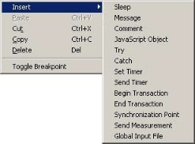
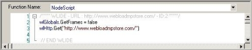
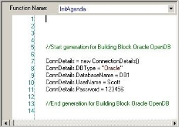
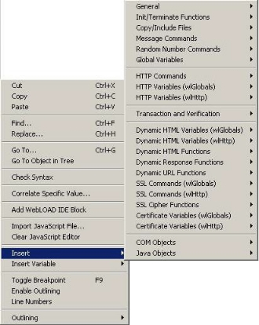



# Editing Scripts

This section provides instructions for editing scripts with WebLOAD Recorder.

## About Editing Scripts with WebLOAD Recorder  

WebLOAD Recorder is both flexible and extendable to fit all of your script editing needs, from the most basic to the most advanced. On the simplest level, you use the WebLOAD Recorder GUI to record your basic script. You can edit your script either while it is being recorded or after it has finished recording to add functionality through the options available in the GUI. In most cases, the options available through the GUI meet all testing needs. For advanced functionality where programming is required, the JavaScript Editor is available to add further functionality to your script.

In the script, each request and event is based on previous input, tying the entire script into a whole, making many actions interdependent. Items such as JavaScript Objects, Comments, Messages, and Sleeps can be added to the script, but changing the sequence of items in effect means changing the sequence of activities, and may destroy the functionality of the script. For more information on recording scripts, see [*Recording Scripts* ](./recording_scripts.md#recording-scripts).

When editing your script, you can work at whatever level you prefer. The following script editing tools are discussed:

- [*Editing a Script in the Script Tree* ](#_bookmark58) describes how to add script items and JavaScript Objects, and edit a script by right-clicking in the Script Tree.
- [*Editing a Script in the JavaScript View Pane* ](#editing-a-script-in-the-javascript-view-pane) describes how to use JavaScript objects to create scripts with the full functionality of JavaScript code programs. The WebLOAD Recorder JavaScript Editor includes a set of context- sensitive prompts that help you code your script more effectively.
- [*Editing your Script Using the WebLOAD Recorder Toolbox Set* ](#editing-your-script-using-the-webload-recorder-toolbox-set) describes how to use the WebLOAD Recorder toolbox that contains drag-and-drop items to create a script with minimal coding.

### Editing a Script in the Script Tree

This section describes how to edit a script in the Script Tree. If you are editing your script while it is being recorded, you can focus on any specific node in the Script Tree and edit its JavaScript in the JavaScript view pane.

> **Note:** You must be in Visual Editing mode.

### **Adding Script Items and JavaScript Objects to a Script**
WebLOAD Recorder contains shortcuts to frequently performed actions. This section describes how to place script items and JavaScript Objects from the **Insert** menu into a script. For guidelines for replacing the placeholder variables with your own, see [*Guidelines for Editing JavaScript Code* ](#guidelines-for-editing-javascript-code).

**To add items and JavaScript Objects to a script:**

1. In the main window, click **Open** in the **File** tab of the ribbon and open the script you want to edit.

1. Make sure that you are in Visual Editing mode.

1. Right-click the Agenda root node or the script item where you want to place the new script item.

   A pop-up menu appears.

1. From the pop-up menu, click **Insert**. The following list of shortcuts appears.

   

1. Select a script item or JavaScript Object.

   The script item or JavaScript is inserted on a new line in the script, immediately after the selected node.

The script items and JavaScript Objects that you can insert are also available through the WebLOAD Recorder toolbox, see [*Editing your Script Using the WebLOAD Recorder Toolbox Set* ](#editing-your-script-using-the-webload-recorder-toolbox-set).

### **Editing a Script by Right-Clicking in the Script Tree**
You can edit directly in the Script Tree using the right mouse button. When you right- click a script item, a menu gives you options that vary according to the script item selected and the mode.

**To right-click menus in Edit mode:**

1. In the main window, click **Open** in the **File** tab of the ribbon and open the script you want to edit.
1. Make sure that you are in Visual Editing mode.
1. In the Script Tree, right-click the Agenda root node or right-click a script item in the tree.

   A pop-up menu appears. The menu for the Agenda root differs slightly from the menu for a script item, as described in [*Table 7*](#_bookmark61).

The following table describes the menu options:

*Table 7: Menu Options*

|**Right-Click Menu Option**|**Purpose**|
| :- | :- |
|
Synchronize

(Agenda root menu only)
|
Synchronize the Script Tree, with the edits made to the JavaScript code in Visual Editing mode In most cases, synchronization is performed automatically.

Only available at the Agenda root level.
|
|Insert|
Insert a script item or JavaScript Object into the script (see

[*Adding Script Items and JavaScript Objects to a Script* ](#_bookmark59)).

The script items and JavaScript Objects that you can insert are also available through the WebLOAD Recorder toolbox, described in [*Editing your Script Using the WebLOAD Recorder Toolbox Set* ](#editing-your-script-using-the-webload-recorder-toolbox-set)*.
|
|Paste|
Paste the script item you cut or copied, after the current script item.

**Note:** If you copied a script item, you can paste it more than once. Each time you paste, the node ID automatically changes.

If you cut a script item, you can paste it only once, and the node ID does not change.
|
|
Cut

(script item menu only)
|Cut the script item from the tree to paste elsewhere.|
|
Copy

(script item menu only)
|Copy the script item from the tree to paste elsewhere.|
|
Delete

(script item menu only)
|Delete the script item from the tree.|
|Toggle Breakpoint|Add or remove a breakpoint at the selected script item in the Script Tree. For more information, see [*Setting Breakpoints* ](#_bookmark113).|
|Current Project Options|Display the Current Project Options dialog box. Only available at the script level. For more information, see [*Configuring the](#_bookmark138) *[Default and Current Project Options* ](#_bookmark138)*.|
|Regenerate Script|Regenerate the script. For more information, see [*Performing](#_bookmark48) *[Script Regeneration* ](#_bookmark48)*.|
|Response Validation|Add response validation to the script. For more information, see [*Validating Responses* ](#_bookmark123)|

## Editing a Script in the JavaScript View Pane

You can edit directly in the JavaScript View pane using the right mouse button. When you right-click a script item, a menu gives you options that vary according to the mode.

### Editing the JavaScript Code for a Script Item
You can edit the JavaScript code generated by WebLOAD Recorder for any item in the script.

> **Note:** When you select the Agenda root node, the entire script appears in the JavaScript View pane as read only. To edit the entire script, see [*Using the JavaScript Editor* ](#_bookmark66)(on  page [75](#_bookmark66)).

**To edit the JavaScript code for a script item:**

1. In the main window, click **Open** in the **File** tab of the ribbon and open the script you want to edit.

1. Make sure that you are in Visual Editing mode.

1. Select the **JavaScript View** checkbox in the **View** tab to open the JavaScript View pane.

1. Select the item in the Script Tree.

   The JavaScript script code for that item appears in the JavaScript View pane.

   

1. Edit the script (see [*Editing the JavaScript Code* ](#_bookmark69)).

   

> **Important:** The ID number is automatically generated by WebLOAD Recorder and is the connection between the script node and the specific header. It is recommended that you do not change the contents of this comment. If you do, important data might be lost.

### Editing the JavaScript Code Functions
A script includes a few sections of code, including functions. At the Agenda root node only, you can select these sections from the **Function Name** drop-down list.

When you select the NodeScript for the Agenda root node, the entire script appears in the JavaScript View pane as read only. You can only edit the script as a whole file when in JavaScript Editing mode (see [*Using the JavaScript Editor* ](#_bookmark66)).

When you select a section other than NodeScript for the Agenda root node, the code appears in the JavaScript View pane. In the JavaScript View pane, you can edit the JavaScript code for functions called in the script. By default, WebLOAD Recorder calls the InitAgenda(), InitClient(), TerminateClient(), and TerminateAgenda() functions ?for each script.

*Table 8: WebLOAD Functions*

|**Function**|**Description**|
| :- | :- |
|InitAgenda|Optional. Creates a JavaScript function InitAgenda to begin the script. InitAgenda is typically where global variables are defined.|
|InitClient|
Optional. Creates a JavaScript function InitClient to begin a client process.

Usually there will be only one client in a WebLOAD Recorder session; WebLOAD uses multiple clients.
|
|TerminateClient|
Optional. Creates a JavaScript function TerminateClient to end a client process.

Usually there will be only one client in a WebLOAD Recorder session; WebLOAD uses multiple clients.
|
|TerminateAgenda|Optional. Creates a JavaScript function TerminateAgenda to end the script.|

The function properties do not need to be edited unless you want to make special customizations, such as including a function from a different file and using the IncludeFile() function.

**To edit the JavaScript code for functions:**

1. In the main window, click **Open** in the **File** tab of the ribbon and open the script you want to edit.

1. Make sure that you are in Visual Editing mode.

1. Select the **JavaScript View** checkbox in the **View** tab to open the JavaScript View pane.

1. Select the script item in the Script Tree.

   The JavaScript script code for the script item appears in the JavaScript View pane. The JavaScript for the Agenda root node will include the whole script.

1. From the **Function Name** drop-down list, located at the top of the JavaScript View pane, select the name of the function.

   The JavaScript code for the function appears in the JavaScript View pane. 

   

   

1. Type the JavaScript code to include in the InitClient, InitAgenda, TerminateClient, or TerminateAgenda (see [*Editing the JavaScript Code* ](#_bookmark69)).

> **Note:** You cannot add a WebLOAD Recorder protocol block in the middle of a function. When in Visual Editing mode, this option is disabled.

### Using the JavaScript Editor
Although represented visually, all scripts are written in JavaScript. The JavaScript code within a script is created from the actions you record and the verification tests you place in the script. You can add JavaScript Objects to your recorded script, allowing you to add additional written code directly to your script. The JavaScript Editor is both a viewer and an editor for adding and editing JavaScript code in the script.

WebLOAD Recorder provides the following features for manually editing a script:

- Import JavaScript Files

  WebLOAD Recorder enables you to import JavaScript files into your script.

- WebLOAD Recorder Protocol Block

  WebLOAD Recorder enables you to add code to your script which is then represented visually in the Script Tree.

- An IntelliSense Editor mode for the JavaScript View pane

  Add new lines of code to your script or edit existing JavaScript functions through the IntelliSense Editor mode of the JavaScript View pane. The IntelliSense Editor helps you write the JavaScript code for a new function by formatting new code and prompting with suggestions and descriptions of appropriate code choices and

syntax as programs are being written. IntelliSense supports the following shortcut keys:

- **Period (“.”)** – Enter a period after the object name, to display a drop-down list of the object’s available properties that can be added to the script (see

  [Figure 52](#_bookmark67)).

- `<CTRL>` `<Space>` – While typing the name of an object, you can type `<CTRL>`

  `<Space>` to display a drop-down list of the available objects that begin with the letters that you entered. For example, if you type wl the IntelliSense Editor displays a drop-down list of all of the objects that begin with wl (such as wlhttp).

In addition, the IntelliSense Editor gives a structure to the code with the outline bar and line numbering.

Collapsing the code enables you to view the heading of the section, without seeing the code within the section. To expand or collapse different sections of the code:

- Click the plus sign (+) or minus sign (-) on the outline bar,

  -Or-

- Right-click within the IntelliSense Editor and select **Outlining** from the pop-up menu. The available outlining options are:
  - **Toggle outline** – collapses or expands the section at the mouse location.
  - **Toggle all outline** – collapses or expands all outlines.
  - **Collapse to definition** – collapses all outlines.

You can enable or disable both the outline bar and line numbering features by:

- Right-clicking within the IntelliSense Editor and selecting **Enable Outlining** or

  **Line Numbers** from the pop-up menu.

When these features are enabled, a checkmark appears next to the name in the pop-up menus. By default, these features are enabled, but WebLOAD opens with the settings that were saved during the previous WebLOAD session. During playback and debug modes, all outlines are expanded.

Use WebLOAD Recorder’s predefined delimiters to keep your code structured and organized. The available delimiters include:

- For JavaScript functions, use “{“ as the start delimiter and “}” as the end delimiter.
- For Script Tree nodes, insert a WLIDE comment from the General WebLOAD Recorder toolbox. This automatically inserts a start delimiter “//” and end

  delimiter “End WLIDE”.

For more information, see the *WebLOAD Scripting Guide.*

- A selection of the most commonly used functions and commands, available through the **Insert** menu.

  You can choose to program your own JavaScript Object code within your script and take advantage of the WebLOAD Recorder GUI to simplify your programming efforts. Rather than manually typing out the code for each command, with the risk of making a mistake, even a trivial typographical error, and adding invalid code to the script file, you may select an item from the **Insert** menu, illustrated in the following figure, to bring up a list of available commands and functions for the selected item. WebLOAD Recorder automatically inserts the correct code for the selected item into the JavaScript Object currently being edited. You may then change specific parameter values without any worries about accidental mistakes in the function syntax.

In addition to the Insert menu, you may select an item from the Insert Variable menu, to add system and user-defined parameters to the script. This eliminates the need for manual coding. For more information about adding user-defined parameters to the script, see [*Inserting User-Defined Parameters in a Script* ](./configuring_recorder_options.md#inserting-user-defined-parameters-in-a-script)

- ![ref7]A Syntax Checker that checks the syntax of the code in your script file and catches simple syntax errors before you spend any time running a test session. While standing in the JavaScript View pane of the WebLOAD Recorder desktop, click **Syntax Checker** in the **Edit** tab of the ribbon, or right-click and select **Check Syntax** from the pop-up menu to check the syntax of the code in your script file.

> **Important:** WebLOAD Recorder scripts should be edited only within the confines of WebLOAD Recorder, not within an external editor. If you use an external editor to modify the JavaScript code in a script file generated by WebLOAD Recorder, your visual script will be lost.

#### **Editing the JavaScript Code**

> **Note:** Any part of the code that is edited in the JavaScript Editing mode is inserted into the script as a JavaScript block, which cannot be edited in the Visual Editing mode.

**To edit the JavaScript code for the script:**

1. In the main window, click **Open** in the **File** tab of the ribbon and open the script you want to edit.

2. Select **Full Script** in the **Home** tab of the ribbon to open the script in JavaScript Editing mode.

   The entire script appears.

3. Position the cursor where you want to edit the JavaScript code.

   **Note:** To add a new JavaScript node, place the cursor after the END WLIDE comment of the previous node before you start writing your JavaScript code. When you switch back to Visual Editing mode a JavaScript node is automatically created, containing your code.

   

4. Type the JavaScript code that you want this item to contain.

5. Add functions and commands from the **Insert** menu (see [*Adding Commands and Functions to a Script* ](#adding-commands-and-functions-to-a-script)).

6. Import a JavaScript file:

   1. Right-click in the script.
   2. Click **Import JavaScript File** from the pop-up menu. The JavaScript code is added to the script.

7. Add a WebLOAD Recorder protocol block from the pop-up menu (see [*Adding WebLOAD Recorder Protocol Blocks* ](#adding-webload-recorder-protocol-blocks)).

8. Perform a syntax check:

   1. Right-click in the script.
   2. Select **Check Syntax** from the pop-up menu.

   WebLOAD Recorder performs a syntax check and displays the errors.

9. Toggle a breakpoint (for more information, see [*Setting Breakpoints* ](#_bookmark113)).

> **Note:** To clear the JavaScript View pane, click **Clear JavaScript Editor** in the **Edit** tab of the ribbon.

#### **Adding WebLOAD Recorder Protocol Blocks**

**To add WebLOAD Recorder Protocol Blocks to a script:**

1. In the main window, click **Open** in the **File** tab of the ribbon and open the script you want to edit.

1. Click **Full Script** in the **Home** tab to edit the script in full screen editing mode.

1. In the JavaScript View pane, position the cursor where you want to place the WebLOAD Recorder protocol block.

1. Right-click in the script, and click **Add WebLOAD Recorder Block** from the pop- up menu.

   

   A WebLOAD Recorder protocol block header is inserted on a new line in the script, immediately after the line where the cursor is located, and a script item is added to the Script Tree.

   

   

1. Replace the placeholder `<Block Type>` with a description. For example: Replace `<Block Type>` with URL.

1. Add the JavaScript code after the WebLOAD Recorder protocol block header. The code is added to the script.

   

#### **Adding Commands and Functions to a Script**

WebLOAD Recorder contains shortcuts to frequently performed actions. This section describes how to place Commands, and functions from the **Insert** menu in a script. For guidelines for replacing the placeholder variables with your own, see [*Guidelines for](#guidelines-for-editing-javascript-code) *[Editing JavaScript Code* ](#guidelines-for-editing-javascript-code)*.

**To add commands and functions to a script:**

1. In the main window, click **Open** in the **File** tab and open the script you want to edit.

1. In the JavaScript View pane, position the cursor where you want to place the command or function.

1. Right-click in the script and click **Insert**. The list of shortcuts appears.

   

   

   

1. Select a command or function.

The command or function selected is inserted on a new line in the script, immediately after the line where the cursor is located.

#### **Guidelines for Editing JavaScript Code**

Use the following guidelines to edit commands and functions you have placed in a script through the JavaScript Editor:

- Placeholders between brackets `< >` that appear in generic examples *must* be replaced with the literal name of a variable.

  For example, the generic example:
  
  `wlHttp.PassWord = “`<Password>`“`
  
  must be replaced with the string:
  
  `wlHttp.PassWord = “Blue”`

- Placeholders between square brackets within parentheses ([ ]) are optional function parameters. It is not mandatory to include them in the command.

  For example, the generic example:

  `<Line\_Array> = GetLine(“<File\_Name>“ [,”<Separator>“])`

  can be replaced with the string:

  MyFile = GetLine(“C:\\InputFile.txt”)`

- Placeholders between square brackets [ ] are array variables and *must* be replaced with the literal name of a variable, enclosed with square brackets.

  For example:
  
  `wlHttp.Header[“<Key>“]= “<Value>“`
  
  must be replaced with the string:
  
  `wlHttp.Header[“proxy-connection”]=“Keep-Alive”`

- In a WebLOAD Recorder protocol block, replace the placeholder `<Block Type>`with a description. 

  For example:

  `<Block Type>`

  can be replaced with:

  `SSL Certificate`

## Editing your Script Using the WebLOAD Recorder Toolbox Set

The WebLOAD Recorder provides a set of objects, such as Sleep, that you can drag and drop to add script items in the Script Tree while recording or viewing your script. The WebLOAD Recorder bar is referred to as the toolbox.

Use the WebLOAD Recorder toolboxes to add the following items to your script:

- General objects, such as Message or Sleep timers. These objects are used in all test scripts, run in both WebLOAD Recorder and WebLOAD. General toolbox tools are described in [*The WebLOAD Recorder General Toolbox* ](./appendix_a.md#the-webload-recorder-general-toolbox).
- Load objects, such as transactions and synchronization points used in WebLOAD tests. Load toolbox tools are described in [*The WebLOAD Recorder Load Toolbox* ](#_bookmark212).
- Internet Protocols functionality, such as downloading data from an FTP site for a WebLOAD Recorder test. Internet Protocols Building Blocks are described in [*The](#_bookmark221)[ WebLOAD Recorder Internet Protocols Toolbox* ](#_bookmark221).
- JMS functionality, such as sending and receiving JMS message. JMS Building Blocks are described in [*The JMS Toolbox* ](./appendix_a.md#the-jms-toolbox).
- IoT Protocols functionality, such as connecting to a broker. IoT Protocols Building Blocks are described in [*The WebLOAD Recorder IoT Protocols Toolbox* ](#_bookmark290).
- Real Clients functionality, such as Selenium actions and a Perfecto Mobile script. Real Clients building blocks are described in [*The Real Clients Toolbox* ](./appendix_a.md#the-real-clients-toolbox).

- Web Service functionality, such as adding web service calls or HTTP requests to your test session script. Web Services Building Blocks are described in [*The WebLOAD Recorder Web Services Toolbox* ](./appendix_a.md#the-webload-recorder-web-service-toolbox).
- Database actions, such as opening and getting data from a database for a WebLOAD Recorder test. Database Building Blocks are described in [*The WebLOAD Recorder Database Toolbox* ](./appendix_a.md#the-webload-recorder-database-toolbox).
- Verification functionality, such as verifying specific elements within HTTP responses in your script. Verifications Building Blocks are described in [*The WebLOAD Recorder Verifications Toolbox* ](./appendix_a.md#the-webload-recorder verifications-toolbox).
- WebSocket functionality, such as creating a WebSocket connection to a specific URL address. WebSocket building blocks are described in [*The WebLOAD Recorder WebSocket Toolbox* ](./appendix_a.md#the-webload-recorder-websocket-toolbox*).

### Adding Script Items from a WebLOAD Recorder Toolbox

**To drag and drop a WebLOAD Recorder toolbox item into your script:**

1. Place the mouse over the item in the WebLOAD Recorder toolbox that you want to add.
1. Press and hold the mouse button (just “clicking” has no effect).
1. Drag the item into the Script Tree, highlighting the item *after* which you want to add the new item.
1. Release the script item you have inserted.
1. For many of the items, such as Message, Comments, and Sleep objects, additional dialog boxes are used to prompt you for the information necessary to add messages, comments, and pause times. Enter the necessary information, and click **OK**.

   The item with its toolbox icon appears in the Script Tree at the point where you placed the item.

1. For JavaScript Objects, add JavaScript code to the script (see [*Using the JavaScript](#_bookmark66)[ Editor* ](#_bookmark66)).

## Working with JavaScript Files

WebLOAD Recorder enables you to open a JavaScript file and convert it to a WebLOAD Recorder project file or continue working with the file as a JavaScript file.

You may want to save it as a JavaScript file if it is an Include file (component of a whole script) and not the main script.

We recommend that you convert the JavaScript file to a WebLOAD Recorder project file for the following reasons:

- The project file is better suited to the WebLOAD Recorder visual environment.
- Enables you to save additional information to the script, such as the Current Project options.

**Note:** When you convert a JavaScript file to a WebLOAD Recorder project file, the original JavaScript file is not deleted. If you convert it to the new format, you can always save it as a regular JavaScript file, using the Save As option.

**To work with a JavaScript File:**

1. In the main window, click **Open** in the **File** tab**.**

1. Select a JavaScript file.

   The Open message appears.

   

1. Click **Yes** to convert the JavaScript file to a WebLOAD Recorder project file,

   -Or-

   Click **No** to continue working with the file as a JavaScript file.

   If you continue working with the file as a JavaScript file, the file appears in the JavaScript View pane as a JavaScript file, and the WebLOAD Recorder block shows that it is a JavaScript file.

> **Important:** If you save the file as a JavaScript file, the next time you open the file, the **Open** message will *not* appear.

