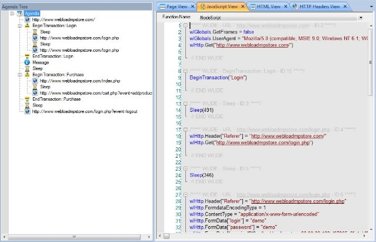
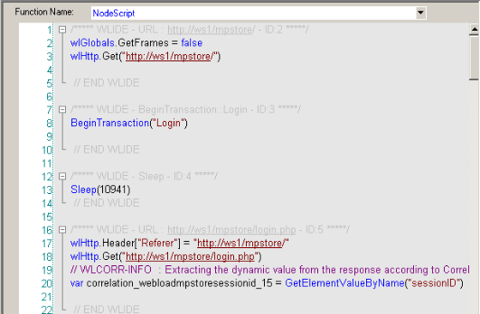

# Overview of the WebLOAD Integrated Development Environment

This section provides a brief overview to the WebLOAD Integrated Development Environment.

## About WebLOAD Recorder

WebLOAD Recorder is an easy-to-use tool for recording, creating, and authoring protocol test scripts for the WebLOAD environment.

WebLOAD Recorder is a visual environment for creating protocol test scripts (referred to as scripts) that provides the following features:

- Recording scripts
- Editing scripts
- Running and Debugging scripts

WebLOAD Recorder records your action in a Web browser and saves it as a JavaScript script. WebLOAD Recorder provides two editing modes, the Visual Editing mode and the JavaScript Editing mode, that enable you to edit your JavaScript script.

WebLOAD Recorder enables you run and play back the script in a number of ways, such as full playback without any breakpoints, with breakpoints, or step-by-step. After the script is run, WebLOAD Recorder returns response data from the Web server.

WebLOAD Recorder provides various views of the response data to help you debug and edit the script. These views include a Web Page view, HTTP Header view, JavaScript view, DOM view, and HTML view.

The script can then be used in the WebLOAD environment to test the performance of your Web application.

## The User Flow

As you develop a Web application, you and your organization will usually do the following:

1. Plan your session to include the basic tasks that you want the test to perform.

1. Create the Test script in WebLOAD Recorder.

1. Test the application in WebLOAD using the script created in WebLOAD Recorder.

   You do not need to modify the test script as it can run from WebLOAD Recorder to WebLOAD seamlessly.

WebLOAD emulates multiple users on a network or server, testing to be sure the application *scales* as needed. These tests ensure that your application operates “normally” under load and stress, and your application appears as per your

specifications and to your visitors’ expectations.

The scripts are executed during WebLOAD test sessions by multiple Virtual Clients in parallel, achieving simultaneous access to the SUT and generating the load burden necessary for effective testing. Each execution of the script generates an independent instance running in parallel during your WebLOAD test session.

> **Note:** Refer to the WebLOAD documentation for more information about using WebLOAD.

## Script Creation

You create a JavaScript script in WebLOAD Recorder so that you can test applications by running the JavaScript script in WebLOAD to simulate the actions of real users.

A *Script* is a test script written in JavaScript code that is used to test the functionality of a Web application under a load. It contains a sequence of HTTP protocol calls sent by Virtual Clients to your System Under Test (SUT). For example, if you want to test the performance of your Web application when clients access a certain page, your script must contain the code for accessing the page.

A script can be generated automatically using the recording tools supplied with WebLOAD Recorder, or it can be created manually by writing a script. This guide describes the recording tools supplied with WebLOAD Recorder for developing test scripts automatically and provides instructions for developing test scripts manually.

Before creating a script, you should consider and plan which actions you want to include in a test session.

Create a script by carrying out the following steps:

1. Recording the script.
1. Editing / enhancing the script.
1. Running and debugging the script.

The first step of creating a script is recording. As you execute a typical sequence of activities, WebLOAD Recorder records your accesses, creating a precise, detailed record of all your activities and application responses that occur during a recording session.

WebLOAD Recorder operates in conjunction with a Web browser, such as Microsoft’s Internet Explorer. The basic ‘Building Blocks’ of a test session are your actions. As you work with a test application in the browser, (navigating between pages, typing text into a form, clicking the mouse, and so on), WebLOAD Recorder stores information about you actions in a script file. Externally, your activities are represented in WebLOAD Recorder by a set of icons arranged in a Visual Script Tree. Internally, WebLOAD Recorder records these actions and automatically creates scripts that act as scripts, recreating the actions and verifying the functionality of Web sites under realistic conditions.

The second step of creating a script is editing the code of the recorded script. This can be done in Visual Editing mode and/or JavaScript Editing mode. For example, if you want a script to vary a sequence of accesses, submit randomized data read from a file, or work with Java or COM components, a certain degree of programming is required. This guide describes how to edit the code in your scripts to add more complex functionality to your testing sessions.

The last step is to run your script in WebLOAD Recorder to perform testing so you can emulate how your script will run when executed in WebLOAD. You can then use the debugging tools to correct or modify your script so that it acts as you expected.

After completing these basic steps, you can incorporate your script into a WebLOAD test.

> **Note:** For examples of basic scripts, see the *WebLOAD Scripting Guide*.
>

### The Recording Tool

WebLOAD Recorder is supplied with a recording tool to perform the following:

- Recording on any site, including sites that use SSL security.
- Recording in any browser that supports a configurable proxy.

The recording tool runs independently of the WebLOAD Recorder. It runs under Microsoft Windows 2000, XP, 2003 and 2007.

### The Editing Modes

WebLOAD Recorder provides two modes in which to write lines of code:

- Visual Editing mode
- JavaScript Editing mode

You can switch between modes while customizing scripts.

#### **Visual Editing Mode**

In Visual Editing mode, rather than writing numerous lines of code to describe the actions you want to test, you simply record the actions in a browser without programming. Your interactions with your Web application are captured, recorded, and presented graphically in the Script Tree.

When editing a script, you can also drag and drop items from the WebLOAD Recorder toolboxes into the script Tree. This makes programming easier by building the code behind an intuitive drag-and-drop interface.

Each node in the Script Tree is a graphical representation of the JavaScript code. JavaScript code that cannot be edited appears grayed out.

#### JavaScript Editing Mode

WebLOAD Recorder provides complete testing flexibility with the JavaScript Editor, enabling you to add your own code into the recorded script or import a JavaScript file. Each block of code is presented graphically in the Script Tree.

WebLOAD Recorder provides the following programming assistance to manually edit a script:

- IntelliSense Editor mode for the JavaScript View pane.
- Insert menu with commonly used functions and commands.
- Syntax Checker that checks the syntax of the code in your script file and catches simple syntax errors before you spend any time running a test session.
- ![ref9]Import JavaScript files.

**Note:** For detailed information about the JavaScript language, see *The Core JavaScript Language* in the *Netscape JavaScript Guide.* This guide is supplied in Adobe Acrobat format with the WebLOAD software. You may also learn the elements of JavaScript programming from many books on Web publishing. Keep in mind that some specific JavaScript objects relating to Web publishing do not exist in the WebLOAD test environment.

### The Run Mode

WebLOAD Recorder enables you to run the script and view the results. You can then debug the script.

WebLOAD Recorder provides a debugger that enables you to correct or modifying your script so that is acts as you expected. It includes a variety of tools to help with the task of debugging your script, such as setting breakpoints and specifying watch variables and expressions.

