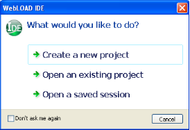
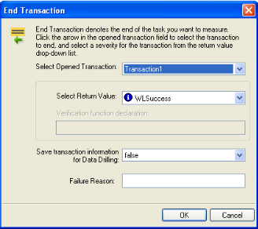
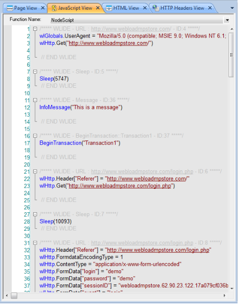
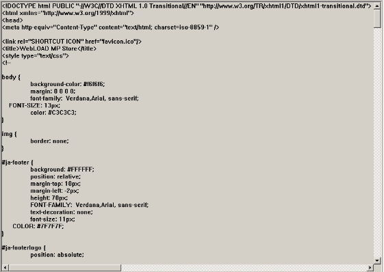
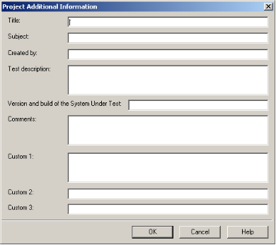

# Recording Scripts

This section provides instructions for recording scripts with WebLOAD Recorder.

## About Recording Scripts with WebLOAD Recorder

Use WebLOAD Recorder to create test scripts as a baseline for testing your Web application in the WebLOAD Console. As you navigate through a Web application, WebLOAD Recorder records your actions, automatically generating a script that reflects your actions in JavaScript. WebLOAD Recorder creates your scripts for you, writing GET and POST HTTP protocol commands automatically.

As your actions are recorded, WebLOAD Recorder displays them in the Script Tree, which is a tree hierarchy with visual indications of the information recorded.

WebLOAD Recorder records only HTTP protocol calls that place a load on the System Under Test (SUT). Activities that are not relevant to the script, such as moving windows for a more comfortable display or opening another application, are not recorded. While your script is being recorded, you can edit it with the WebLOAD Recorder Toolbox set. For information on editing your script using the WebLOAD Recorder Toolbox set, see [*Editing your Script Using the WebLOAD Recorder Toolbox Set](./editing_scripts.md#editing-your-script-using-the-webload-recorder-toolbox-set)* .

This process creates the basic script. You can then view the recorded script as JavaScript code in the JavaScript view pane, revise the script to test more objects in more detail, and run and debug the script. For information on editing your script, see [*Editing Scripts* ](#_bookmark56). For information on running and debugging your script, see [*Running and Debugging Scripts* ](./running_debugging_scripts.md#running-and-debugging-scripts).

The script can then be used with WebLOAD for load and scalability testing of your application.

## Starting WebLOAD Recorder

**To start WebLOAD Recorder:**

1. Select **Start** > **Programs** > **RadView** > **WebLOAD** > **WebLOAD Recorder**. WebLOAD Recorder opens.

   

   

2. Check or uncheck **Don’t ask me again**.

3. Click one of the following options:

   1. **Create a new project** – Opens a new project. WebLOAD supports several types of projects, the default project being Internet Protocol Project. The new project type is set according to the type of project which was last open. To create a different type of project, select **New Project** in the **File** tab of the WebLOAD Recorder ribbon and select the desired project type.
   2. **Open an existing project** – Browse to the project.
   3. **Open a saved session** – Browse to the session.

The WebLOAD [*Recorder main window*](./quick_start.md#recorder_edit_mode) opens in Editing Mode, enabling you to begin creating or editing your script.

## Recording a script

You can either start working with WebLOAD Recorder immediately, or you can configure the recording options first. For more information about configuring the recording options, see [*Configuring the Recording and Script Generation Options* ](#_bookmark152).

When you record a script, WebLOAD Recorder displays the script being created in real time. You can watch WebLOAD Recorder record your actions as you navigate in the Web browser.

If you start and stop recording more than once during a single recording session (for example, to skip an irrelevant step in the application you plan to test) each subsequent set of JavaScript commands is appended to the end of the script. If you open an existing script and start recording new Web activity, WebLOAD Recorder also appends the new JavaScript commands to the end of the script.

**To record a script:**

1. Start **WebLOAD Recorder** (see [*Starting WebLOAD Recorder* ](#_bookmark35)).

   -Or-

   Start **WebLOAD Recorder** from your Explorer by double-clicking the WebLOAD Recorder project file (.wlp) or session WebLOAD Recorder session file (.wls).

   The WebLOAD Recorder main window opens in Editing Mode, enabling you to begin recording your script.

2. To create a new script, click **New Project** in the **File** tab of the ribbon.

3. To open an existing script:

   1. Click **Open** in the **File** tab of the ribbon.
   2. Select a file.

4. Click **Start** in the **Home** tab of the ribbon.

   

   By default, the Recording dialog box appears.

   

   

   The Recording dialog box enables you to quickly define the basic settings for the default Web browser which you will be using during the recording.

   > **Note:** Any changes to the settings in the Recording dialog box affect the settings of the Browser Settings tab of the Recording and Script Generation Options dialog box ([Figure 114](./correlating_scripts.md#rec_script_gen_options)). For more information, see [*Configuring the Default Browser* ](#_bookmark159).

5. Optionally change the browser settings:

   

   | **Field**                             | **Description**                                              |
   | :------------------------------------ | :----------------------------------------------------------- |
   | **Open**                              | 
Select one of the following options as your default browser:

- Microsoft Internet Explorer.

- Mozilla Firefox.

- Google Chrome.

- Native Mobile Recording. For further explanations, refer to [*Recording](#_bookmark356)[ Mobile Applications* ](#_bookmark356).

- None – No default browser.

If you selected Mozilla Firefox as your browser, and Mozilla Firefox was installed on the machine *after* WebLOAD Recorder was installed, a message appears recommending that you install the Firefox extension responsible for setting the proxy definitions automatically. If you accept, the extension is installed.
 |
   | **URL address**                       | 
Enter an address of a web page if you wish to open that specific page in the browser you selected.

This option is useful if you wish to open the same page multiple times.
 |
   | **Clear browser cache**               | Select this option to clear the browser cache before recording. This option is selected, by default. |
   | **Clear cookies**                     | Select this option to clear the browser’s cookie history before recording. This option is selected, by default. |
   | **Identify as**                       | Select this option to simulate a mobile web application.     |
   | **Browser**                           | Select the browser type you wish to simulate.                |
   | **Version**                           | Select the browser version you wish to simulate. Alternatively, click the Change button  to edit the browser version definition. See [*Editing Browser Version Definitions* ](./configuring_recorder_options.md#editing-browser-version-definitions)*. |
   | 
**Don’t show**

**again**
 | Select this checkbox if you do not wish to see this dialog box every time you select **Start Recording**. |

   

   In addition, you can optionally click **More Options** to open the Browser Settings tab of the Recording and Script Generation Options dialog box ([Figure 119](#_bookmark160)) and define the default browser settings in full detail.

6. Click **OK**. The Recording dialog box closes.

   A floating WebLOAD Recording toolbar appears. Throughout any recording session, the WebLOAD Recording toolbar always appears on top of the active window.

   

   

   The following table describes the function of each button in the WebLOAD Recording toolbar:

   *Table 4: WebLOAD Recording Toolbar Buttons*

   | **Button**                                  | **Purpose**                                                  |
   | :------------------------------------------ | :----------------------------------------------------------- |
   | 

 | Start recording.                                             |
   | 

 | End recording.                                               |
   |                | Pause or resume recording.                                   |
   |              | Insert message.                                              |
   |              | Insert comment.                                              |
   |                 | 
Begin transaction.

Adds named transactions to the script to measure the performance of logical actions in your script, such as a Login process. By inserting named transactions into your script, you can take a series of simple actions, define them as a single transaction, and set success or failure criteria for the complete transaction.
 |
   |                   | End transaction.                                             |
   |                | 
Define concurrent.

Defines a starting point after which the WebLOAD engine collects all Post and Get HTTP requests, but does not execute them until an Execute Concurrent function is run.
 |
   |               | 
Execute concurrent.

Defines a starting point after which the WebLOAD engine stops collecting and begins executing all the Post and Get HTTP requests that were defined since the last Define Concurrent function, concurrently (using multithreading).
 |

   

   WebLOAD Recorder begins recording all actions you perform in the browser, as indicated by the recording notification in the WebLOAD Recorder status bar.

   

   

   If this is the first time that you are recording after WebLOAD Recorder was launched, the default browser opens automatically with its predefined home page. This enables you to start recording and then access a page.

   

   

   

7. In the Web browser window, access the System Under Test (SUT).

8. Perform the steps that you want to test, retrieving and submitting information found on different site pages and locations. Try to emphasize the actions whose performance you need to measure in your test sessions.

   Watch how WebLOAD Recorder adds nodes to the script as you work. Your actions are recorded and appear in the Script Tree as you navigate the site. (If you see more nodes in the Script Tree with different URLs, this may be traffic generated by browser plug-ins or extensions, for example, third-party toolbars.)

   

   1. Click the **JavaScript View** tab to watch the JavaScript of the pages as they are being recorded.

      > **Note:** During recording, the InitAgenda and TerminateAgenda sections of the script are not generated and therefore are not visible.

   2. Click the **HTTP Headers View** tab to watch the response headers of the pages as they are being recorded.

   3. Click the **HTML View** tab to watch the HTTP data as it is being recorded.

   > **Note:** When switching between the JavaScript, HTTP Headers, Browser, and HTML Views, the new view displays the node that is selected in the Script Tree (during edit mode) or Execution Tree (during debug mode). These views are available during recording, after the recording is finished, and after opening a saved script.

9. When you are finished, select **WebLOAD Recorder**.

1. Click **Stop Recording** in the WebLOAD Recorder recording floating toolbar or in the **Home** tab of the WebLOAD Recorder ribbon.

   WebLOAD Recorder stops recording.

1. Click **Save** in the **File** tab of the WebLOAD Recorder ribbon.

1. In the **File name** field in the Save As dialog box, type a descriptive name for the script, and then click **Save**.

   Your script is saved with the file extension \*.wlp.

1. Close the Browser window to work in WebLOAD Recorder. The Recording Complete dialog box opens.

   

1. Select one of the following:

   - **Automatically discover rules and correlate script** to run the correlation engine using the existing rules, and apply auto-discovery correlation to find potential correlation rules. For more information, see [*Automatic Discovery of Correlation Rules* ](./correlating_scripts.md#automatic-discovery-of-correlation-rules)*(.)
   - **Correlate script using only the existing rules** to run the correlation engine using the existing defined rules. For more information, see [*Configuring the Correlation Rules* ](./correlating_scripts.md#configuring-the-correlation-rules).
   - **Don’t correlate now** to view the recorded script without correlating the script. You can manually correlate the script later.

> **Notes:** Although by default the Recording Complete dialog box appears, this depends on your settings in the Correlation Options tab of the Recording and Script Generations options dialog box. For more information, see [*Setting the Default Correlation Action* ](./correlating_scripts.md#setting-the-default-correlation-action).

You can customize the script in a variety of ways or you can run your script as recorded. For information on editing your script, see [*Editing Scripts* ](#_bookmark56). For information on running your script, see [*Running and Debugging Scripts* ](./running_debugging_scripts.md#running-and-debugging-scripts).

> **Notes:** If actions that you are interested in were not recorded, check the cache settings in your browser. WebLOAD Recorder may be skipping steps that you want to record because your browser is using a system cache file. For more information, see [Clearing](#_bookmark16) [the Cache and Cookies in Your Browser ](#_bookmark16).
>
> When you stop the recording, if no actions were recorded (that is, the script is blank), WebLOAD Recorder automatically displays the recording troubleshooting information.
>

### Pausing a Recording

WebLOAD Recorder enables you to pause a recording so that you can edit the script.

**To pause a recording:**

1. Click  from the WebLOAD Recording toolbar

   -Or-

   Click **Pause** in the **Home** tab of the ribbon. The recording pauses.

2. To restart the recording, click  from the WebLOAD Recording toolbar,

   -Or-

   Click **Start** in the **Home** tab of the ribbon. 

   The recording restarts.

### Inserting Messages in a Recording

WebLOAD Recorder enables you to insert messages while recording, defining points at which to send error and/or notification messages to the Log window.

**To insert a message:**

1. Click  from the WebLOAD Recording toolbar at the desired location in the recording.

   The Message dialog box opens.

   

   

2. Create a text message by typing the text you want to appear in the message in the input text box.

   > **Note:** When you enter a string value in the message, you must enclose it in quotation marks; for example, “Sample Message”.

3. To add a global variable to the message text, click the globe icon to the right of the input text box, and select a global variable from the drop-down list.

4. Select a severity level for the message from the drop-down list. The following severity levels are available:

   1. Information message (WLInfoMessage)
   2. Minor error message (WLMinorError)
   3. Error message (WLError)
   4. Severe error message (WLSevereError)
   5. Debug message (WLDebugMessage)

   

5. Click **OK**.

The Message item appears in the Script Tree, and the JavaScript code is added to the script. To see the new JavaScript code, view the script in JavaScript Editing mode.

### Inserting Comments in a Recording

WebLOAD Recorder enables you to insert comments while recording to describe an activity or provide information about a specific operation.

**To insert a comment:**

1. Click  from the WebLOAD Recording toolbar at the desired location in the recording.

   The Comment dialog box opens.

   

2. Enter the text you want to appear in the comment.

3. Click **OK**.

   The Comment item appears in the Script Tree, and the JavaScript code is added to the script. To see the new JavaScript code, view the script in JavaScript Editing mode.

### Inserting Begin and End Transactions in a Recording

In addition to the automatic transactions provided by WebLOAD, you can add named transactions during a recording to measure the performance of logical actions in your script, such as a Login process. By inserting named transactions into your script, you can take a series of simple actions, define them as a transaction, and set success or failure criteria for the transaction. Each transaction can be a simple action, such as a query, or a complex action that may include several steps.

To measure transactions, you must mark the beginning and end of the transaction in your script. During runtime, WebLOAD measures the time it takes to complete the transaction and reports the results in the WebLOAD Integrated reports, Statistics reports, and Data Drilling report.

> **Note:** You can add an unlimited number of transactions into your script. Each transaction must have a different name.

**To mark the beginning of a transaction:**

1. Click ![ref24] from the WebLOAD Recording toolbar just before the first action you want to include in the transaction.

   The Begin Transaction dialog box opens.

   

2. Enter a logical name for the transaction; for example, “Login”.

3. Click **OK**.

   The Begin Transaction item appears in the Script Tree, and the JavaScript code is added to the script. To see the new JavaScript code, view the script in JavaScript Editing mode.

**To mark the end of a transaction:**

1. Click  from the WebLOAD Recording toolbar directly after the last action you want included in the script.

   The End Transaction dialog box opens.

   

   

   

2. Select the transaction to end from the Select Opened Transaction drop-down list.

3. Select a return value for the transaction from the Select Return Value drop-down list.

   You can select from the return values provided, or select **Custom Function** to create your own verification function to call when the transaction is complete.

   For information on creating custom functions, see the *WebLOAD Scripting Guide*.

4. To set WebLOAD to save the results of all transaction instances, successes, and failures for later analysis with Data Drilling, select **true** in the **Save transaction information for Data Drilling** field. Select **false** (default) to save only results of failed transaction instances that triggered some sort of error flag.

5. Optionally, enter a text string to specify a possible reason for a transaction failure within your transaction verification function in the **Failure Reason** field. This reason will also appear in the Statistics Report.

6. Click **OK**.

   The End Transaction item appears in the Script Tree, and the JavaScript code is added to the script. To see the new JavaScript code, view the script in JavaScript Editing mode.

### Defining Concurrent in a Recording

WebLOAD Recorder enables you to collect Post and Get HTTP requests and simultaneously execute them by two or more threads, as defined in the MultiThread Virtual Clients number. This is configured in the Browser Parameters tab in WebLOAD Console’s Script Options dialog box.

![ref13]**Note:** WebLOAD Recorder does not perform the Post and Get HTTP requests concurrently.

To simultaneously execute Post and Get HTTP requests, you must define where in the script to begin collecting the requests and where to stop collecting and begin executing them. The HTTP requests are collected until the engine encounters an Execute Concurrent function in the script. For more information about the Execute Concurrent Building Block, see [*Executing Concurrent Definition in a* Recording ](#_bookmark42)(on

page [46](#_bookmark42)).

**To define when to start collecting HTTP requests in a script:**

- Click from the WebLOAD Recording toolbar at the desired location in the recording.

  The Define Concurrent Building Block is added to the Script Tree. The JavaScript code is added to the script. To see the new JavaScript code, view the script in JavaScript Editing mode.
  
  

### Executing Concurrent Definition in a Recording

WebLOAD Recorder enables you to define the Execute Concurrent function. Then in WebLOAD Console, you can simultaneously execute all the Post and Get HTTP requests that were defined since the last Define Concurrent function by two or more threads, as defined by the MultiThread Virtual Clients number. This is configured in the Browser Parameters tab in WebLOAD Console’s Script Options dialog box.

> **Note:** The Execute Concurrent function can only be inserted in your script *after* a Define Concurrent function. For more information about the Define Concurrent function, see [*Define Concurrent* ](#_bookmark219).

When the engine encounters the Execute Concurrent function, it stops collecting the HTTP requests in the script and starts their execution.

**To insert concurrently executing HTTP requests in a script:**

- Click from the WebLOAD Recording toolbar at the desired location in the recording.

The Execute Concurrent Building Block is added to the Script Tree. The JavaScript code is added to the script. To see the new JavaScript code, view the script in JavaScript Editing mode.

## Viewing the Recorded Script

WebLOAD Recorder creates scripts by recording your actions as you interact with your Web application or System Under Test (SUT). Your recorded script serves as a baseline, which is subsequently used in the WebLOAD environment to test the performance of your Web application.

WebLOAD Recorder presents each recorded action visually in the Script Tree and as code in the JavaScript View pane.

### Viewing the Recorded Script in the Script Tree

As you navigate through a Web application, WebLOAD Recorder records your actions.

WebLOAD Recorder displays the following as nodes in the Script Tree:

- Pages accessed
- Sleep time
- Messages
- Comments
- Begin Transaction
- End Transaction
- Define Concurrent
- Execute Concurrent

When navigating to a new page in the Web application, WebLOAD Recorder inserts a node with the URL into the Script Tree.

When you pause while navigating in the Web application, WebLOAD Recorder inserts a Sleep node into the Script Tree. The Sleep node represents your thinking time.

When you insert a message while recording, WebLOAD Recorder inserts a Message node into the Script Tree.

When you insert a comment while recording, WebLOAD Recorder inserts a Comment node into the Script Tree.

When you begin a transaction while recording, WebLOAD Recorder inserts a BeginTransaction node into the Script Tree. All actions that occur during the Transaction appear on a lower hierarchical level in the Script Tree. You can collapse or expand this node by clicking  or   respectively.

When you end a transaction while recording, WebLOAD Recorder inserts an EndTransaction node into the Script Tree.

When you define concurrent while recording, WebLOAD Recorder inserts a DefineConcurrent node into the Script Tree.

When you define concurrent while recording, WebLOAD Recorder inserts an ExecuteConcurrent node into the Script Tree.

After the script is recorded, you can edit the script (see [*Editing a Script in the Script Tree*](#_bookmark58) ).

After your script has been developed, you can run and debug it. While the script is running, you can view it in the Script Tree (see [*Viewing the Execution Sequence in the](#_bookmark103) *[Script Tree* ](#_bookmark103)*).

### Viewing the Recorded Script in the JavaScript View Pane

Each node in the Script Tree is actually a visual representation of JavaScript code. You can view the contents of the nodes in the JavaScript view pane.

In the JavaScript view pane, you can do the following:

- Display the code for each node individually.
- View code for the entire script as a whole.
- View the code for different sections in the script, by clicking the Agenda root node in the Script Tree and selecting a section from the Function Name list at the top of the JavaScript view pane.

Each block of code starts with a header that contains “WLIDE”, description, and ID number, and ends with the “END WLIDE” closing comment. The ID number is automatically generated by WebLOAD Recorder and is the connection between the script node and the specific header. The comments in the script are a light grey color.

After the script is recorded, you can edit the script (see [*Editing a Script in the JavaScript View Pane* ](#editing-a-script-in-the-javascript-view-pane)*).

After your script has been developed, you can run and debug it. While the script is running, you can view it in the JavaScript View pane (see [*Viewing the Execution Sequence in the JavaScript View Pane* ](./running_debugging_scripts.md#viewing-the-execution-sequence-in-the-javascript-view-pane))

### Viewing the Recorded Script in the HTTP Headers View Pane

Each node in the Script Tree is also a visual representation of response headers. You can view the headers of the nodes in the HTTP Headers view pane.

In the HTTP Headers view pane, you can do the following:

- Display the header for each node individually.
- View headers for the entire script as a whole.

When you click a node in the Script Tree, you can view the header for that node.

You can expand the header to view all of the gets and posts for that node.

For an object that does not have a header, such as a Sleep node, the following is displayed:

The Post command involves sending data to the HTTP server, as opposed to the Get command, which is used only for retrieving data. In the HTTP Headers View, the Post command also includes the actual data that was sent to the server. This part of the HTTP message is marked by a special icon:

After the script is recorded, you can edit the script (see [*Editing a Script in the JavaScript](#editing-a-script-in-the-javascript-view-pane) *[View Pane* ](#editing-a-script-in-the-javascript-view-pane)*).

After your script has been developed, you can run and debug it. While the script is running, you can view it in the JavaScript View pane (see [*Viewing the Execution Sequence in the JavaScript View Pane* ](./running_debugging_scripts.md#viewing-the-execution-sequence-in-the-javascript-view-pane)).

### Viewing the Recorded Script in the HTML View Pane

Each node in the Script Tree is actually a visual representation of HTML code. You can view the HTML preview of each page and frame requested in the script in the HTML view pane.

In the HTML view pane, you can display the code for each node individually. After your script has been developed, you can run and debug it. For more information on debugging with the HTML View, see [*Using the HTML View to View Results* ](#_bookmark119).

## Performing Script Regeneration

When a script is recorded, all of the HTTP traffic is saved even if not all of it is used to generate the script (the recorded traffic is saved to the .wle file of the script). The script is created according to the settings defined in the Script Generation tab in the Record and Script Generation Options dialog box. You can regenerate the script any time after recording, to include additional traffic information that was originally recorded. This is done by modifying the settings in the Script Generation tab and then regenerating the script.

For example, by default when a script is recorded, the HTTP headers settings for the HTTP requests are not displayed in the script even though they are recorded. After selecting the **Generate All Headers** checkbox in the Script Generation tab and regenerating the script, the script includes the wlHttp headers property. For more information on the script content that can be regenerated, see [*Specifying the Script](#_bookmark155) *[Content to be Generated* ](#_bookmark155)

In addition, script regeneration is affected by changes in the settings defined in the Post Data tab in the Record and Script Generation Options dialog box. You can record a script with content type x in the DATA list, DATAFile list, or not in any list, (which means it will be recorded as FORMDATA) and then change the settings and regenerate the script and it will play back according to the new settings.

**To perform script regeneration:**

1. Click **Correlation** in the **Home** tab of the ribbon and select **Regenerate Script** from the drop-down list.

   -Or-

   Right-click a node in the Script Tree and select **Regenerate Script** from the pop-up menu. This regenerates only the selected node.

   > **Note:** If your script was created manually, and not recorded, WebLOAD informs you that your script does not contain any recorded nodes and cannot regenerate the script. When performing script regeneration, any modifications to the script’s originally recorded nodes are lost. Any nodes that were added after the recording will remain in the script after the script is regenerated.

   The Perform Script Regeneration dialog box appears.

   

   

2. Click **Save and Continue** to save the changes in your script and regenerate the script.

   -Or-

   Click **Don’t Save and Continue** to regenerate the script without saving the changes in your script.

   -Or-

   Click **Cancel** to close the Perform Script Regeneration dialog box without regenerating the script.

> **Note:** Click **Edit** > **Undo** to discard the newly regenerated script and revert back to the previous script.

## Saving a Script

You must save your scripts so that you can use them in test sessions.

**To save a script:**

1. Click **Save** in the **File** tab of the ribbon and select **Save** or **Save As**. The Save As dialog box appears.

1. Type the script name in the **File name** field.

1. Click **Save**.

   Your script is saved with the file extension \*.wlp. You may now run a test using the script.

## Saving Additional Project Information

The Additional Information dialog box provides details about the project that help identify it; for example:

- A descriptive title
- The author name
- The subject of the test
- The system under test
- Other important information about the project

Use the Additional Information dialog box to save information about the project.

**To save additional information properties for the project:**

1. Select **Additional Information** from the WebLOAD Recorder **Home** tab of the ribbon.

   The Project Additional Information dialog box opens.

   

   

   

2. Fill in the fields to save additional information, useful for later reference, with the project.

3. Click **OK**.

The following table describes the fields of the Project Additional Information dialog box.

*Table 5: Project Additional Information Dialog Box Fields*

| **Field**                                  | **Description**                                              |
| :----------------------------------------- | :----------------------------------------------------------- |
| Title                                      | Provides a space for you to type a title for this project. The title can be different then the project file name. |
| Subject                                    | Provides a space for you to type a description of the subject of the project. Use this property to group similar projects together. |
| Created by                                 | Provides a space for you to type the name of the person who authored this project. |
| Test description                           | Provides a space for you to type a description of the test objectives and what the project is designed to test. |
| Version and build of the System Under Test | Provides a space for you to type the name, version and build number of the System Under Test (SUT). |
| Comments                                   | Provides a space for you to type any comments regarding the project. |
| Custom                                     | Provides a space for you to type any comments you want saved with this project. |

## Recording Desktop Web Applications

Desktop web applications, such as Rich Internet Applications (RIAs), are web based applications that have the features and functionality of local desktop applications. A desktop web application can run either in a web browser or in software that is installed and run locally on the user’s desktop (for example, Adobe AIR applications).

Recording desktop web applications in scripts using WebLOAD Recorder, involves configuring the web applications to use a specific proxy setting. This proxy setting is usually configured automatically when opening WebLOAD Recorder for browser- based applications in Internet Explorer or Mozilla Firefox. To record any other web application that does not run within the browser, configure the web application to pass the traffic to the server through the WebLOAD Recorder proxy server, using one of the following methods:

- [*Recording WebLOAD Scripts Using the Client’s Proxy Setting* ](#recording-webload-scripts-using-the-clients-proxy-setting).
- [*Recording WebLOAD Scripts Using the LAN Settings* ](#_bookmark53).
- [*Recording WebLOAD Scripts Using Proxy Tunneling* ](#_bookmark54).

### Recording WebLOAD Scripts Using the Client’s Proxy Setting

Web applications that support working through a proxy server can be configured to pass the traffic to the server through the WebLOAD Recorder proxy server. Follow the web application’s proxy setting instructions to specify the WebLOAD Recorder proxy server as the application’s proxy server.

WebLOAD Recorder’s default proxy server settings are:

- Host: localhost.

- Port: 9884.

  

### Recording WebLOAD Scripts Using the LAN Settings

Some operation systems provide the ability to configure the proxy setting of the LAN

connection. The following example demonstrates configuring the Internet application’s proxy setting of the LAN connection in Windows XP:

**To configure the proxy setting in Windows XP:**

1. From the **Start** menu, select **Settings** > **Control Panel**. The Control Panel dialog box appears.

1. Select **Internet Properties** and then select the **Connections** tab.

   The Internet Properties – Connections tab appears.

   

   

1. In the Local Area Network (LAN) settings, click **LAN settings**. The Local Area Network (LAN) Settings dialog appears.

   

1. In the Proxy server area check **Use a proxy server for your LAN**.

1. In the Address and Port fields enter WebLOAD Recorder’s proxy server setting. By default, this is localhost:9884.

   > **Note:** This setting is necessary for the recording process only and should be removed before the load test execution.

1. Click **OK**.

The proxy setting of the LAN connection in Windows XP is configured.

### Recording WebLOAD Scripts Using Proxy Tunneling

Proxy tunneling is a general method to handle desktop web applications that do not support working through a proxy server. Proxy tunneling involves using an external utility to redirect the outgoing web traffic on the client machine. The redirection enforces the traffic to pass through WebLOAD’s proxy recorder, which is listening on port 9884, during the recording stage.

**To record scripts using Proxy Tunneling:**

1. Enable a port interception service on the client machine. Configure the service to redirect the outgoing traffic from the application to pass through WebLOAD’s proxy. The following are possible methods for intercepting web application traffic:

   - Use an external utility that is capable of controlling and rerouting HTTP traffic. For example, the Proxifier application, which is available at:[ http://www.proxifier.com.](http://www.proxifier.com/)
   - Configure your firewall. Some firewalls provide advanced services of traffic manipulation.
   - Configure your hardware. Four to seven layer switches may be used for controlling and routing web based traffic.

1. Configure WebLOAD Recorder’s recording options as follows:

   1. Click **Recording and Script Generation Options** in the **Tools** tab of the ribbon. The Recording and Script Generation Options dialog appears (see [Figure](../images/#rec_script_gen_options)).

   1. Select the Browser Settings tab.

   1. The Browser Settings tab appears (see [Figure 119](#_bookmark160)).

   1. In the Automatic Browser Settings area, uncheck **Set the Proxy definitions automatically**.

   1. Select the Proxy Options tab.

      The Proxy Options tab appears (see [Figure 125](#_bookmark174)).

   1. In the Recording Proxy Options area, check **Use Transparent Proxy**. This enables WebLOAD Recorder to record from any Web client that does not support proxy configurations.

      

1. Start recording your script.

1. Run the web application. While the web application is running, all the http traffic generated on the client machine is directed to WebLOAD Recorder. WebLOAD handles this traffic as if it is received from a browser client and generates the appropriate script.

1. Stop recording the script when the application is finished running.

1. Disable the interception service.

> **Note:** Before starting the test and running the generated script, the interception service must be stopped. Otherwise, the load traffic generated by the Console will be directed back to the recorder.

The script is recorded successfully. You can now run the test in WebLOAD Console.

In certain cases, the WebLOAD Proxy Recorder may timeout during recording. This may be due to a slow network and/or SUT. The default timeout is 60. To avoid this situation, you can increase the default timeout.

**To change the default timeout:**

1. Right-click the `wlproxyinclude.js` file in {RadView directory}\Include and select **Edit**.

1. Add the following line to the file:

   `ProxyObject.RProxyCOptConnectionTimeOut = 300`

1. Save the file.

## Troubleshooting

Refer to the following table if you are having recording related problems. Before assuming the problem is with WebLOAD, make sure that your internet settings are correct and that you can access the internet without recording.

*Table 6: Troubleshooting*

| **Problem**                                                  | **Possible Options**                                         | **Solution**                                                 |      |
| :----------------------------------------------------------- | :----------------------------------------------------------- | :----------------------------------------------------------- | :--- |
| Script is not created while recording                        | Make sure browser opens while recording.                     | Click **Recording and Script Generation Options** in the **Tools** tab of the ribbon and select the **Browser Settings** tab. Ensure that the settings are correct for your browser. See [*Configuring the Default Browser* ](#_bookmark159) for more information. |      |
|                                                              | Check browser proxy settings.                                | **For Internet Explorer:** 
1. `	`From your browser’s menu, select **Tools † Internet Options** and select the **Connections Options** tab.

2. Click **Lan Settings**.

3. If none of the checkboxes are selected, you have a direct connection to the internet and the browser proxy settings are not the problem.

&emsp;If **Automatically detect settings** and/or **Use automatic configuration script** are checked, you must disable the automatic settings. Before disabling the automatic settings, contact your system administrator for your proxy server information.

&emsp;If **Use a proxy server for your LAN** is checked, copy the Address and Port field’s current proxy settings. In WebLOAD, click **Recording and Script Generation Options** in the **Tools** tab of the ribbon and select the **Proxy Options** tab. Check **Use the following definitions for the application’s proxy server** and enter the current proxy information into the HTTP Proxy/Port and SSL Proxy/Port fields.
 |      |
|                                                              |                                                              | **For Mozilla Firefox:** 
1. From your browser’s menu, select

&emsp;**Tools** > **Options**.

2. At the top of the Options dialog box, select the **Advanced** icon and select the **Network** tab.

3. In the Connection area, click **Settings**.

4. If **Direct connection to the internet** is selected, the browser proxy settings are not the problem.

If **Auto-detect proxy settings for this network** or **Automatic proxy configuration URL** are selected, you must disable the automatic settings. Before disabling the automatic settings, contact your system administrator for your proxy server information.

If **Manual proxy configuration** is selected, copy the **HTTP Proxy** and **Port** field’s current proxy settings. In WebLOAD, click **Recording and Script Generation Options** in the **Tools** tab of the ribbon and select the **Proxy Options** tab. Check **Use the following definitions for the application’s proxy server** and enter the current proxy information into the HTTP Proxy/Port and SSL Proxy/Port fields.
 |      |
|                                                              | Recording with a browser other than Internet Explorer or Mozilla Firefox. | 
1. Click **Recording and Script Generation Options** in the **Tools** tab of the ribbon and select the **Browser Settings** tab. Select **Other browser** or **None** as the default browser setting.

2. While recording, you must manually change the client’s proxy setting. In your browser, manually configure the proxy settings to use WebLOAD’s default port: 9884.

&emsp;This points the browser’s proxy settings to the WebLOAD recorder enabling WebLOAD to record the browser’s HTTP clients.
 |      |
|                                                              | LAN settings options for IE are disabled by IT Group Policies | Request that your Network Administrator change the policies for the specific machine on which you are recording. For more information about Group Policy see the [Microsoft TechNet Library.](http://technet.microsoft.com/en-us/library/bb457072.aspx) |      |
|                                                              | Advanced options                                             | 
1. While recording, open the task manager and ensure that a single proxynator.exe process is active. If there is no proxynator.exe process or there is more than one proxynator.exe process contact RadView support for further assistance.

2. WebLOAD uses ports 9884, 9010, and 9000. Enter netstat -a -p tcp in the command line to ensure that the ports are not being used by another application on your machine. A list of the unavailable ports appears.

If port 9884 is unavailable, click **Recording and Script Generation Options** in the **Tools** tab of the ribbon and select the **Proxy Options** tab. In the **Recording Proxy Options** frame, modify the Proxy Port value from 9884 to an available port number.

If port 9010 or port 9000 are unavailable, open the WebLOAD.ini file in <RadView directory>\bin and locate the following lines:

TESTTALK\_CLIENT\_PORT=“9010” TESTTALK\_NETWORK\_PORT=“9001”

Modify the port value of the unavailable port from 9010 and/or 9000 to an available port number.
 |      |
| Local sites are not recorded in the Script                   | Proxy settings are set to bypass local addresses             | 
1. From your browser’s menu, select **Tools** > **Internet Options** and select the **Connections Options** tab.

2. Click **Lan Settings**.

3. Check **Bypass proxy server for local addresses** to ensure that the proxy settings are not set to bypass local addresses or any other server that you want to record.
 |      |
|                                                              | WebLOAD does not record from [http://localhost](http://localhost/) | 
**For Internet Explorer:**

Use any of the following instead of [http://localhost:](http://localhost/)

- http://<your machine name>

- http://<your IP address>

- <http://localhost./>

**For Mozilla Firefox:**

1. From your browser’s menu, select **Tools** > **Options**.

2. Select the **Advanced** > **Network** tab and click **Settings**.

3. Clear the **No proxy for property** checkbox.
 |      |
| Secured sites are not recorded in the script                 | Proxy settings do not point to the recorder.                 | 
**For Internet Explorer:**

1. From your browser’s menu, select **Tools** > **Internet Options** and select the **Connections Options** tab.

2. Click **Lan Settings**.

3. Ensure that **Use a proxy server for your LAN** is checked and modify the port setting to 9884.

**For Mozilla Firefox:**

1. From your browser’s menu, select **Tools** > **Options**.

2. At the top of the Options dialog box, select the

&emsp;**Advanced** icon and select the **Network** tab.

3. In the Connection area, click **Settings**.

4. Ensure that **Manual proxy configuration** is selected and modify the port setting to 9884.
 |      |
|                                                              | A different proxy is needed for SSL                          | 
You must configure an SSL proxy. For instructions, see

[*Setting the Proxy Options* ](./configuring_recorder_options.md#setting-the-proxy-options)
 |      |
| Certificate Error is displayed in the browser during recording |                                                              | 
The browser correctly detects the recorder and warns the user. You can safely ignore the warning and continue.

**Note:** You can prevent the warning if you configure WebLOAD to use the server’s certificate. Set the proxy certificate options in the Recording and Script Generation Options dialog box. For more information see [*Setting the Proxy Certificates* ](#_bookmark177).
 |      |
| A partial script is created while recording                  | Browser cache needs to be cleared.                           | 
**For Internet Explorer or Mozilla Firefox:**

1. In WebLOAD Recorder, click **Recording and Script Generation Options** in the **Tools** tab of the ribbon.

2. Select the **Browser Settings** tab.

3. In the Automatic Browser Settings area, check **Clear the browser cache** and click **OK.**

**For any other browser:**

- From your browser’s menu, select the command that clears the browser’s cache.
 |      |
|                                                              | Proxy settings need to be modified                           | 
Modify the proxy setting’s file extensions and content types to record specific extensions, since WebLOAD by default only records top-level URLs, such as HTML, XML, and text.

1. Click **Recording and Script Generation Options** in the

&emsp;**Tools** tab of the ribbon.

2. In the Recording and Script Generation Options dialog box select the **Content Types** and **File Locations** tabs.

3. Add the specific extension and content types that are not being recorded.

For more information see [*Configuring the Content Types to](#_bookmark171) *[Record* ](#_bookmark171)* and [*Setting File Locations* ](#_bookmark185).
 |      |
| The Internet Explorer proxy settings are locked              |                                                              | 
1. Click **Start** > **Run**.

2. Type Regedit and click **OK**.

3. Select **HKEY\_CURRENT\_USER** > **Software** > **Policies**

&emsp;> **Microsoft** > **Internet Explorer** > **Control Panel**.

4. Set the data value for each key in this directory to 0.
 |      |

