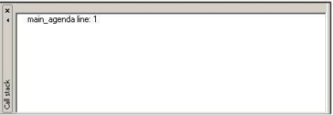
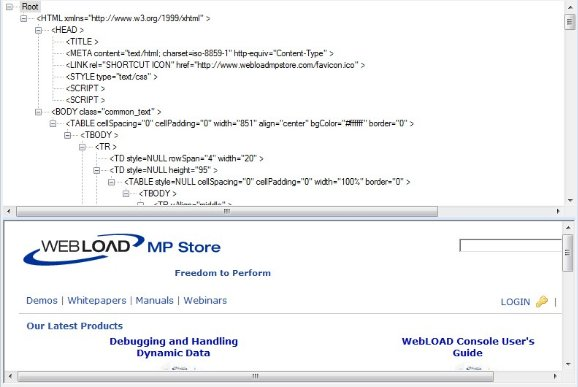
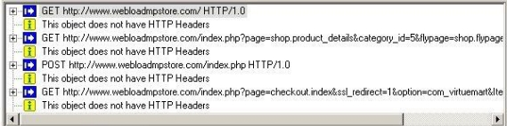
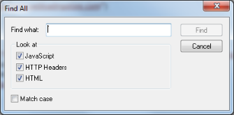

# Running and Debugging Scripts

This section provides instructions for running and debugging scripts with WebLOAD Recorder.

## About Running and Debugging Scripts with WebLOAD Recorder

When you run your script, WebLOAD Recorder interacts with your Web application just as a real user would. WebLOAD Recorder runs your script line by line. As your script executes, execution arrows are displayed in the left margin of the Script Tree and the JavaScript View pane, showing your progress.

Unless otherwise configured in the project options, the test session will log and continue on Minor Errors encountered during runtime. Severe Errors will cause WebLOAD Recorder to stop the entire test. If WebLOAD Recorder encounters HTTP errors that are undefined by WebLOAD, the test session logs them and continues running.

Messages, test failures, and differences are indicated by messages in the Log View Window.

After running a script, you can debug it. WebLOAD Recorder enables you to check that the script runs smoothly without errors, offers step controls to run through the script step-by-step, breakpoints, and various view and windows to monitor variables.

## Running a Script

This section provides instructions for running a script. Before running a script, you can do the following:

- Set the number of iterations to run, see [*Setting Playback Options* ](#_bookmark184).
- Set the file locations for a test session, see [*Setting File Locations* ](#_bookmark185).
- Set WebLOAD Recorder to ignore the recorded sleep time, see [*Configuring Sleep](#_bookmark141)[ Time Control Options* ](#_bookmark141).

### Starting the Execution of a Script

**To execute the script:**

1. In the main window, click **Open** in the **File** tab of the ribbon and open the script you want to edit.

1. Click **Run** in the **Home** or **Debug** tab of the ribbon,

   -Or-

   Click **Step Into** in the **Debug** tab of the ribbon to run the script step-by-step. 

   The script runs and displays the following:

   - A sequence of the events generated by the script in the Execution Tree.
   - The execution sequence in the JavaScript View pane and the Script Tree.
   - If the Page View tab is open, the pages returned from the Web site.

> **Note:** If you specified more than one playback iteration, you are returned to the beginning of the script (for information on playback iteration, see [*Setting Playback](#_bookmark184) *[Options* ](#_bookmark184)*on page [209](#_bookmark184)).
>

### **Viewing the Execution Sequence in the Script Tree**
When you run your script, WebLOAD Recorder interacts with your Web application just as a real user would. WebLOAD Recorder runs your script line by line. Execution arrows are displayed in the left margin of the Script Tree. When you select a node in the Script Tree, the corresponding information is displayed in each of the available views. For example, the Page View displays the page you have requested from the server, the HTML View displays the HTML of that page, and the HTTP Headers View displays the request and response’s headers. For more information, see [*Viewing and](#_bookmark115) *[Analyzing the Test Results* ](#_bookmark115)*.

WebLOAD Recorder enables you to do the following:

- Run through the entire script line by line, and add breakpoints (see [*Debugging a](#_bookmark112)[ Script* ](#_bookmark112)on page [120](#_bookmark112)).
- Display the Current Project Options by right-clicking the Agenda root node and clicking **Current Project Options** from the pop-up menu,

  -Or-
  
  Click **Current Project Options** in the **Tools** tab of the ribbon (see [*Configuring the](#_bookmark138) *[Default and Current Project Options* ](#_bookmark138)*on page [155](#_bookmark138)).
  
  -Or-
  
  Select **Current Project Options** from the WebLOAD Recorder **Home** tab of the ribbon (see [*Configuring the Default and Current Project Options* ](#_bookmark138)on page [155](#_bookmark138)).

**To view the Script Tree:**

- In the main window, click **Visual Mode** in the **Home** tab.

  By default, the Script Tree pane appears at the top left of the main window, to the right of the WebLOAD Recorder Toolbox pane.

### **Viewing the Execution Sequence in the JavaScript View Pane**
JavaScript View displays the complete JavaScript of your script with an execution arrow tracking its progress during runtime.

WebLOAD Recorder enables you to do the following:

- Run through the entire script line by line, add breakpoints, and add Watch variables (see [*Debugging a Script* ](#_bookmark112)on page [120](#_bookmark112)).
- Check the syntax by right-clicking in the script and clicking **Check Syntax** from the pop-up menu.

**To view the JavaScript View:**

- In the main window, select the **JavaScript View** checkbox in the **View** tab.

### **Viewing the Response Data in the Execution Tree**
As you execute a script, WebLOAD Recorder displays the actions performed during runtime in the Execution Tree. The Execution Tree is an interactive tree that you can use to examine the results.

### **Comparing Recorded Sequence and Execution Sequence Side by Side side by side**
You can view the recorded sequence alongside the execution sequence using the side by side view feature. This can help you manually discover differences between the original recorded session and the playback.

Side by side view is available for the Browser, HTTP Headers, and HTML Views.

**To view the recorded sequence side by side with the execution sequence:**

- Select **Side by Side** in the **Session** tab of the ribbon.

  The recorded sequence is displayed to the left of the execution sequence.

> **Note**: This feature is only available after complete running an execution sequence, not at the beginning of an execution sequence.

### Comparing a Script Recording node to its Playback
After running a script test, you can perform a comparison of the original script recording and its playback for each node in the script.

**To compare a script node’s recording to its playback:**

1. Select a script node.

1. Click **Compare HTML** in the **Session** tab of the ribbon.

   -Or-

   Right-click a node in the Script Tree or the Execution Tree and select **Compare html** from the pop-up menu.

   The defined Difference Viewer application launches and automatically compares the selected node in the recording and in the playback. For information about defining the Difference Viewer application, see [*Defining the Difference Viewer](#_bookmark186) *[Application* ](#_bookmark186)*.

### **Comparing a Recorded Sequence with the Execution Sequence**
You can compare an entire original recorded sequence with the current execution sequence using the Compare All feature. This can help you to check and fix any undesirable changes you made to the original recorded session.

**To compare the current execution with the original sequence:**

- Select **Compare All** in the **Session** tab of the ribbon.

The following comparison information and options are provided:

#### ***Execution Tree pane in Compare All mode***

In the **Execution Tree** pane, each node’s background color indicates the degree to which the original execution was changed, as follows:

-  Green – The current execution is identical with the original execution

-  Yellow – There is a minor difference between the original and the current execution
-  Red – There is a major difference between the original and the current execution

#### ***Compare pane***

The **Compare** pane that appears at the bottom of the screen lists a digest of the differences between the original and the current execution. The icon at the beginning of each line indicates the level of difference:

-  Yellow – indicates a minor change.

-  Red – indicates a major change.

  Double clicking a line, or right-clicking a line and selecting **Go to location**, opens a side-by-side view of the relevant code in the view pane, with the first difference highlighted in blue. The original recorded sequence is displayed on the left and the current execution is displayed on the right. The side by side comparison can be viewed in the Browser, HTTP Headers, and HTML Views.

In addition, right-clicking a line and selecting **Compare HTML**, launches the defined Difference Viewer application that compares the selected node in the original recording with the current execution. For more information see [*Comparing a Script](#_bookmark107) *[Recording node to its Playback* ](#_bookmark107)*.

### Stopping the Execution of a Script
When debugging a script using a Step Into or breakpoint, the playback session stops immediately upon completion of the current WebLOAD Recorder protocol block.

**To stop the execution of a script:**

- Click **Stop** in the **Home** tab of the ribbon,

  -Or-
  
  Use the hotkeys **Shift + F5**.
  
  The playback session is stopped.

## Debugging Scripts

WebLOAD Recorder provides an integrated debugger with a variety of tools to help locate bugs in your script. The debugger provides special menus, windows, dialog boxes, and grids of fields for debugging. You can pause the debugger and trigger WebLOAD Recorder to wait for user input before proceeding with running the script. In the script, you can set breakpoints and step into / over / out. While debugging your script, you can abort the debugger without executing the TerminateClient and TerminateAgenda functions, as opposed to stopping it completely.

### **Debug Tab Items**
Commands for debugging can be found on the **Debug** tab of the ribbon.

The **Debug** tab contains commands to start the debugging process. The following options are available through the **Debug** tab.

|**Tab Item**|**Description**|
| :- | :- |
|***Execution group***||
|**Run**|Starts playback of the script from the current statement until a breakpoint or the end of the script is reached.|
|**Stop**|Stops the playback of the script.|
|**Abort**|
Stops the playback of the script without executing the

TerminateClient or TerminateAgenda functions.
|
|***Debug group***||
|**Step Into**|Starts the play back of the script, a step at a time, entering each function encountered.|
|**Step Over**|Starts the playback of the script, one step at a time. When a function is reached, it is executed without stepping through the function.|
|**Step Out**|Plays through the remaining steps of the called function, and stops on the line in the script immediately following the function call. Using this command you can quickly finish executing the current function after determining that a bug is not present in the function.|
|**Break Execution**|Stops the playback of the script at that point.|
|**Toggle Breakpoint**|Defines a line in the script where WebLOAD Recorder suspends execution.|
|**Remove all Breakpoints**|Eliminates all breakpoints.|
|**Disable/Enable all Breakpoints**|Disable or enable all breakpoints.|
|**Edit Breakpoints**|Displays the Breakpoints dialog box, enabling the setting of breakpoints.|
|***Debug Windows group***||
|**Watch Window**|Toggles the displays of the Watch window (available only during runtime in debug mode), which displays the names and values of variables and expressions..|
|**Variables Window**|Toggles the display of the Variables window (available only during runtime in debug mode) which displays information about variables used in the current and previous statements and functions..|
|**Call Stack**|Toggles the display of the Call Stack window which lists the function calls that led to the current statement, with the current function on the top of the stack..|

### Debugging a Script
When debugging a script, you can set the script to run in the following ways:

- Step-by-step – The execution starts at the first line of the script and stops at each subsequent line.
- Breakpoints – The execution starts at the first line of the script and stops when it reaches a breakpoint.
- A combination of step-by-step and breakpoints.

**To debug a script:**

1. Click **Run** or **Step Into** in the **Debug** tab of the ribbon.
1. When you reach the end of the script you can:
   1. Click **Step Into** in the **Debug** tab to return to the beginning of the script.
   1. View results (see [*Viewing and Analyzing the Test Results* ](#_bookmark115)on page [130](#_bookmark115)).
   1. Add breakpoints (see [*Setting Breakpoints* ](#_bookmark113)on page [121](#_bookmark113)).
1. Return to Edit mode and revise your script.

#### Starting the Debugger

**To start debugging:**

- Click **Run** in the **Debug** tab to run the script continuously,

  -Or-
  
  Click **Step Into** in the **Debug** tab to run the script step-by-step.

#### Setting Breakpoints

Use breakpoints to define places in the script to suspend execution. Breakpoints can be set in Edit mode and in Debug mode. The breakpoints you set will be saved as a part of your WebLOAD Recorder project.

**To set multiple breakpoints to a script:**

1. Display the entire script.

1. Select the line of code.

1. Click **Edit Breakpoints** in the **Debug** tab. The Breakpoints dialog box opens.

   

   

1. Click the arrow next to the **Break at** field. The Breakpoint options appear.

   

1. Click the Line number.

   The Line number is added to the list of breakpoints.

1. To add context to the breakpoint, click the arrow again, and click **Advanced**. 

   The Advanced Breakpoint dialog box opens.

   

   

1. Fill in the fields, and click **OK**.

   

**To set a breakpoint in the Script Tree:**

1. Right-click an item in the Script Tree.
1. From the pop-up menu, click **Toggle Breakpoint**.

   A red dot appears in the left margin of the JavaScript View pane adjacent to the selected code and in the Script Tree adjacent to the visual script element for which the breakpoint is defined, indicating that the breakpoint is set.
   
   

**To set a breakpoint in the JavaScript View pane:**

1. Select the **JavaScript View** checkbox in the **View** tab to open the JavaScript View pane.
1. In the Script Tree, click the **Agenda** root node to display the entire script in the JavaScript View pane.
1. In the JavaScript View pane, select the line of code where you want the script to wait.
1. Right-click and select **Toggle Breakpoint** from the pop-up menu,

   -Or-
   
   Click **Toggle Breakpoint** in the **Debug** tab.
   
   A red dot appears in the left margin of the JavaScript View pane adjacent to the selected code and in the Script Tree adjacent to the visual script element for which the breakpoint is defined, indicating that the breakpoint is set.
   
   

**To set a breakpoint in Debug mode:**

1. Run the script by clicking **Step Into** in the **Debug** tab.

1. Continue stepping through the script until reaching the point you want to insert the breakpoint.

1. In the JavaScript View pane, select the code where you want to insert in breakpoint.

1. Click **Toggle Breakpoint** in the **Debug** tab.

1. While in debug mode a red dot appears in the left margin of your script code, indicating that the breakpoint is set.

   

#### Running to a Breakpoint

**To run until a breakpoint is reached:**

1. Set a breakpoint (see [*Setting Breakpoints* ](#_bookmark113)on page [121](#_bookmark113)).
1. Click **Run** in the **Debug** tab

   Click **Step Into** in the **Debug** tab to run the script step-by-step.

#### Removing Breakpoints

You can remove individual breakpoints or remove all breakpoints in the script.

**To remove a breakpoint:**

1. ##### Select the **JavaScript View** checkbox in the **View** tab to open the JavaScript View pane.

1. In the Script Tree, click the **Agenda** root node to display the entire script in the JavaScript View pane.

1. In the JavaScript View pane, select the line containing the breakpoint you want to remove.

1. Click **Toggle Breakpoint** in the **Debug** tab. The red dot in the left margin disappears.

   

**To remove all breakpoints:**

1. Select the **JavaScript View** checkbox in the **View** tab to open the JavaScript View pane.
1. In the Script Tree, click the **Agenda** root node to display the entire script in the JavaScript View pane.
1. Click **Remove all Breakpoints** in the **Debug** tab The red dot in the left margin disappears.

#### Disabling and Enabling All Breakpoints

You can disable or enable all breakpoints in the script.

**To disable or enable all breakpoints:**

1. Select the **JavaScript View** checkbox in the **View** tab to open the JavaScript View pane.

1. In the Script Tree, click the **Agenda** root node to display the entire script in the JavaScript View pane.

1. Click **Disable/Enable Breakpoints** in the **Debug** tab.

   - When all of the breakpoints are disabled, the red dots in the left margin turn white.
   
   - When all of the breakpoints are enabled, the white dots in the left margin turn red.
   
     

#### Stepping Into the Script

**To run the script and execute one statement at a time (Step Into):**

1. Click **Run** or **Step Into** in the **Debug** tab.

   The debugger executes the next statement and then it pauses execution. If you step into a nested function call, the debugger steps into the most deeply nested function.

1. Repeat step **1** to continue executing the script one statement at a time.

**To step into a specific function:**

1. Set a breakpoint just before the function call or use the **Step Into** command to advance the script execution to that point.

   For information on setting breakpoints see [*Setting Breakpoints* ](#_bookmark113).

1. Click **Step Into** in the **Debug** tab.

   

#### Stepping Out or Over a Function

**To step over a function:**

1. Click **Run** or **Step Into** in the **Debug** tab.

1. Execute the script to the function call.

1. Click **Step Over** in the **Debug** tab.

   The debugger executes the next function, but pauses after the function returns.

1. Continue executing the program.

   

**To step out of a function:**

1. Click **Run** or **Step Into** in the **Debug** tab and execute the program to some point inside the function.

1. Click **Step Out** in the **Debug** tab.

   The debugger continues until it has completed execution of the return from the function, then pauses.
   
   

#### Stopping the Playback of the Script

You can stop the playback of the script at a specific point. Stopping a script executes the TerminateClient or TerminateAgenda functions.

**To stop the playback of the script:**

1. Start debugging. Click **Run** or **Step Into** in the **Debug** tab.
1. Click **Break Execution** in the **Debug** tab.

   The script stops running. You can continue the playback from this point, at a later time.

1. Click **Stop** in the **Debug** tab.

   The script stops running. Continuing the playback from this point is not possible.
   
   

#### Aborting the Playback of the Script

You can abort the playback of the script at a specific point. Aborting a script does not execute the TerminateClient or TerminateAgenda functions.

**To abort the execution of a script:**

- Click **Abort** in the **Debug** tab. The playback session is aborted.

#### Using the Watch Window

The Watch window is used for debugging your application, and is only available when you are running your script. The Watch window displays the values of selected variables or watch expressions that you specify while debugging your script. The values of the variables and expressions in the Watch window are only updated when execution is stopped at a breakpoint.

Use the Watch window to specify variables and expressions that you want to watch while debugging your program. You can also modify the value of a variable using the Watch window. To add a watch variable, see [*Adding a Watch Variable or Expression* ](#_bookmark114).

**To open the Watch window:**

- Select the **Watch Window** checkbox in the **Debug** tab.

The Watch window contains four tabs:

- Watch1
- Watch2
- Watch3
- Watch4

Each tab displays a user-specified list of variables and expressions in a grid field. You can group variables that you want to watch together onto the same tab. For example, you could put variables related to a specific page on one tab and variables related to second page on another tab. You could watch the first tab when debugging the first page and the second tab when debugging the second page.

If you add an array variable to the Watch window, plus sign (+) or minus sign (-) boxes appear in the Name column. You can use these boxes to expand or collapse your view of the variable.

##### Viewing the Value of a Variable in the Watch Window

You can view the value of a variable in the Watch window.

**To view a variable or expression in the Watch window:**

1. Start debugging. Click **Run** or **Step Into** in the **Debug** tab of the ribbon.
1. Select the **Watch Window** checkbox in the **Debug** tab to open the Watch window.

In the Name column, plus sign (+) or minus sign (-) boxes may appear. These appear if you added an array or object variable to the Watch window. Use these boxes to expand or collapse your view of the variable.

##### Adding a Watch Variable or Expression

You can add a watch variable or expression to the Watch window, while you are running your script. Valid expressions accepted in the Watch window include any valid JavaScript expression that can be added to the script.

The Watch dialog box is equivalent to using the JavaScript eval function. Using the eval function you can define a variable and its value. In the same way, you can use the watch dialog box to define values for variables used throughout a script.

For example, if your script contains the variable a, when you type a=10 in the Watch window, the engine evaluates the expression as though it were written within the script. The result of the expression a=10 would be setting the variable a to 10. Then when you type a=a+1 in the watch window, the variable a would be set to 11. The value of the variable is always according to the last definition of the variable. So, if you type a=2, the variable a would be set to 2 regardless of what the variable’s value was beforehand.

**To add a Watch variable or expression in the JavaScript View pane:**

1. Start debugging. Click **Run** or **Step Into** in the **Debug** tab.

1. Select the **JavaScript View** option in the **View** tab to open the JavaScript View pane.

1. In the Script Tree, click the **Agenda** root node to display the entire script in the JavaScript View pane.

1. In the JavaScript View pane, select the line where you want to add the Watch variable or expression.

1. Right-click the variable in the JavaScript View pane, and click **Add Watch** from the pop-up menu.

   The Add Watch dialog box opens.

   

1. In the Expression field, type a variable or expression.

1. Click **Add**.

The variable or expression is added to the Watch window. The Watch window evaluates the variable or expression immediately and displays the value or an error message.

If you added an array or object variable to the Watch window, plus sign (+) or minus sign (-) boxes appear in the Name column. Use these boxes to expand or collapse your view of the variable.

1. You can optionally edit the name or value of the variable or expression by double- clicking the name or value that you want to edit.

#### Viewing the Variables Window

The Variables window provides quick access to variables that are important in the scripts current context.

**To open the Variables Window:**

1. Start debugging. Click **Run** or **Step Into** in the **Debug** tab.
1. Select the **Variables Window** checkbox in the **Debug** tab.

The Variables window displays variables used in the current statement and in the previous statement. It also displays return values when you step over or out of a function.

The Variables window contains a grid with fields for the variable name and value. The debugger automatically fills in these fields. You cannot add variables or expressions to the Variables window (you must use the Watch window, see [*Adding a Watch Variable or](#_bookmark114) *[Expression* ](#_bookmark114)*on page [128](#_bookmark114)), but you can expand or collapse the variables shown. You can expand an array, object, or structure variable in the Variables window if it has a plus sign (+) box in the Name field. If an array, object, or structure variable has a minus sign (-) box in the Name field, the variable is already fully expanded.

The Variables window also has a Context dropdown list that displays the current scope of the variables displayed. To view variables in a different scope, select the scope from the drop-down list box.

##### Viewing the Value of a Variable

You can view the value of a variable in the Variables window.

**To view a variable in the Variables window:**

1. Start debugging. Click **Run** or **Step Into** in the **Debug** tab.
1. Select the **Variables Window** checkbox in the **Debug** tab to open the Variables window.

#### Viewing the Call Stack Window

The Call Stack window lists the function calls that led to the current statement, with the current function on the top of the stack.

**To open the Call Stack Window:**

1. Start debugging. Click **Run** or **Step Into** in the **Debug** tab.
1. Select the **Call Stack** checkbox in the **Debug** tab.

## Viewing and Analyzing the Test Results

While recording, editing, and running your script, WebLOAD Recorder provides information on all major events that occurred during runtime such as failures and error messages. You can navigate through the Execution Tree to view the results of your test at increasing levels of detail. This technique lets you view detailed information on any errors.

### Using the Execution Tree to View Results
As you execute a script, WebLOAD Recorder displays the Web pages accessed in the Web application in the Execution Tree.

When working with a file JavaScript file that has not been converted to a WebLOAD Recorder project file, WebLOAD Recorder displays a playback node for each HTTP request of the JavaScript.

### Using the Page View to View Results

The Page View displays a visual representation of the baseline set of Web pages in your script. This view is available while recording, editing, or running your script.

**To open the Page View:**

1. Select the **Page View** checkbox in the **View** tab of the ribbon.
1. Select the **Page View** tab.

### Using the DOM View to View Results
DOM View displays all of the objects and the structure of the Web page displayed in Page View, giving you access to objects not visible in the pages presentation layer.

DOM View is available when Page View is open, while recording, editing, or running your script. When an element is selected in the DOM View, the object is highlighted in the Page View.

**To open the DOM View:**

1. Select the **DOM View** checkbox in the **View** tab of the ribbon.
1. Select the **DOM View** tab.

### Using the HTML View to View Results
HTML view displays an HTML preview of each page and frame requested in the script. When switching between the JavaScript, HTTP Headers, Browser, and HTML Views, the new view displays the node that is selected in the Script Tree (during edit mode) or Execution Tree (during debug mode). These views are available while recording, after the recording is finished, and after opening a saved script.

**To open the HTML View:**

1. Select the **HTML View** checkbox in the **View** tab of the ribbon.

1. Select the **HTML View** tab.

   

1. To search for text:

   1. Right-click and click **Find** from-the pop-up menu.
   1. Type the text you want to find, and click **Find Next**.

1. To copy text:

   1. Select the text you want to copy.
   1. Right-click and click **Copy** from-the pop-up menu.

### Using the HTTP Headers View to View Results

The HTTP Headers View displays the GET and POST HTTP protocol commands. Other commands can also be displayed, such as CONNECT. When switching between the various views, the new view displays the node that is selected in the Script Tree.

These views are available while recording, after the recording is finished, during playback and debugging, and after opening a saved script.

**To open the HTTP Headers View:**

1. Select the **HTTP Headers View** checkbox in the **View** tab of the ribbon.

1. Select the **HTTP Headers View** tab.

   

   The headers are divided into groups of headers per playback request. For each request, only the relevant headers are displayed. You can expand the headers to show the form data and all other content.

   

   

1. To view all of the headers on the script, click the Agenda root node.

1. To view headers of a specific round, click the Round node in the Execution tree.

1. To search for text:

   1. Right-click and click **Find...** from-the pop-up menu.

   1. In the **Find what** field, type the text you want to find. 

      The **Find what** field is case sensitive.

   1. Click **Find Next**. The entire text of the selected node is selected.

1. To copy text:

   1. Select the text you want to copy.
   1. Right-click and click **Copy** from-the pop-up menu. The entire text of the selected node is copied.

   

### Using the Log View Window to View Results
In addition to the results available through viewing the Script Tree and the Execution Tree, the Log View Window displays the errors encountered during playback and additional information about your test session results.

An Info Message or a minor error will not cause the playback to stop. Similarly, a generic message, issued when WebLOAD Recorder encounters HTTP errors that are undefined by WebLOAD, will not cause playback to stop. A higher level of severity (Error or Severe Error) ends the playback upon completion of the WebLOAD Recorder protocol block.

**To open the Log View Window:**

- Select the **Log View** checkbox in the **View** tab of the ribbon.

  By default, the Log View pane appears at the bottom of the main window.
  
  

The following information is displayed:

- **!** – The result and severity of each message:
  - Information message
  - Minor error message
  - Error message
  - Severe error message

- **Time** – The amount of runtime.
- **Description** – The runtime action and information about failed actions, including the date and time the action occurred.

### Performing a Full Search in the Test Results
You can search for a specific string in all views at once.

**To search for text in all views:**

1. Select **Find All** in the **Edit** tab of the ribbon.

   

2. In the **Find what** field, type the text you want to find.

3. Under **Look at**, specify in which view you wish to search. You can select any combination of the following:

   1. JavaScript
   2. HTTP Headers
   3. HTML

4. Optionally check the **Match case** checkbox.

5. Click **Find**.

   A results pane appears in the bottom half of the screen, displaying all the search results.

- The icon to the left of each search result indicates in which page view the result appears.

- Double clicking a search result highlights the result both in the Script Tree and in the corresponding page view.

  

#### Printing the Contents of the Log View Window

**To print the contents of the Log View Window:**

1. Right-click inside the Log View window.
1. Select **Print** from the right-click menu. The Print Setup dialog displays.
1. Select a printer and click **OK**.

#### Saving the Contents of the Log View Window

**To save the contents of the Log View Window:**

1. Right-click inside the Log View window.
1. Select **Save** from the right-click menu. The Save As dialog displays.
1. In the **File Name** field, type in the name for the file.
1. Click **Save**.

   The file is saved with the extension \*.log.

You can view the saved log file with any text editor.

#### Viewing a Log Message

**To view the complete log message:**

1. Right-click an entry in the Log View window.
1. Select **Display Message** from the right-click menu.

   The Log Message window with detailed information on the selected entry appears.

## Validating Responses

WebLOAD Recorder enables you to validate a response in a script by adding a response validation function. You can validate a Web page’s title, the maximum time taken to load the Web page, its content, and the length of its content. You can also

determine WebLOAD’s behavior if validation fails. During playback, the results of the validation process (failure or success) are displayed in the Log View window.

**To add a response validation function:**

1. Select a node in the Script Tree.

1. Click **Response Validation** in the **Home** tab of the ribbon.

   -Or-

   Right-click the node and select **Response Validation**.

   -Or-

   Perform the following:

   1. Click the **HTML View** tab to view the node in HTML View.
   1. Select HTML text within the node.
   1. Right-click the selection and click **Response Validation**. The Response Validation dialog box appears.

   > **Note:** When accessing the Response Validation dialog box from **HTML View**, the dialog box appears automatically configured with the selected content.

   

   

1. Configure the responses you wish to validate during playback, according to the information displayed in [Table 13, ](#_bookmark125)and click **OK**.

1. The Response Validation function is added to your script.

   

   | **Field**                                           | **Description**                                              |
   | :-------------------------------------------------- | :----------------------------------------------------------- |
   | *Page Title*                                        |                                                              |
   | **Validate**                                        | Select to validate the page title.                           |
   | **Success if Page Title is**                        | The title of the Web page. During playback, if the title of the Web page matches the text entered in this field, the validation is successful. |
   | **Recorded page title is**                          | The page title as defined in the HTML `<title>` tag.           |
   | *Page Time*                                         |                                                              |
   | **Validate**                                        | Select to validate the page time.                            |
   | **Page Time limit x sec**                           | The maximum number of seconds that may elapse while waiting for the Web page to open for the validation to be successful. |
   | *Content length*                                    |                                                              |
   | **Validate**                                        | Select to validate the content length.                       |
   | **Equal to x bytes**                                | The size of the Web page content, in bytes, must equal the specified value for the validation to be successful. |
   | **Greater than x bytes**                            | The size of the Web page content, in bytes, must be greater than the specified value for the validation to be successful. |
   | **Lower than x bytes**                              | The size of the Web page content, in bytes, must be less than the specified value for the validation to be successful. |
   | **Recorded Content Length is**                      | The size of the response, in bytes.                          |
   | *Content*                                           |                                                              |
   | **Validate**                                        | Select to validate the content. For a full explanation, refer to [*Performing](#_bookmark126) *[Multiple Text Validations of Web Page Content* ](#_bookmark126)*. |
   | **Success if response contains/does not contain x** | For each JavaScript expression you include in your validation check, specify whether it must or must not appear in the Web page for the validation to be successful. |
   | **Add**                                             | 
Click this button to add a new JavaScript expression to the list of validations that must or must not appear in the Web page.

The string "<text to find>" appears in the box above the button. Delete this string and instead do either or both of the following:

- Enter a text string in quote marks. For example, "**Welcome**".

- Enter a parameter without quote marks. For example, **TodaysDate()**. You can click **Add Parameter** and select a parameter from the list.

Note that you can concatenate strings and/or parameters to create a JavaScript expression. For example: **"Welcome" + params\_user.getValue()**.
 |
   | **Remove**                                          | Click this button to delete a selected JavaScript expression from the list of validations that must or must not appear in the Web page. |
   | **Add Parameter**                                   | Opens a list of parameters you can include in the **contains/does not contain** text. This list is identical to the list available in the Insert Variable menu ([*Figure 54*](#_bookmark68)). |
   | *In case of validation failure*                     |                                                              |
   | **Display warning and continue running**            | Select to display a warning during playback and continue running the script, if the verification fails. |
   | **Display error and stop the round**                | Select to display an error during playback and stop the round, if the verification fails. |
   | **Display fatal error and stop test execution**     | Select to display a fatal error and stop running the script, if the verification fails. |
   | **Call to JS function**                             | Select to run a specified JavaScript function, if the verification fails. |
   | **Error message (Optional)**                        | Enter an error message to be displayed if the verification fails (optional). |

   

1. Click **OK**. The Response Validation function is added to your script.

### Performing Multiple Text Validations of Web Page Content
You can use the **Response Validation** feature to validate a Web page’s content.

**To validate the content of a Web page:**

1. Follow the instructions in [*Validating Responses* ](#_bookmark123) to access the Response Validation dialog box ([Figure 90](#_bookmark124)).

1. In the **Content** section, check the **Validate** checkbox.

1. Click **Add**.

   The box above the Add button displays **“<text to find>”**.

   

   

1. Define a JavaScript expression and whether it must or must not appear in the Web page, as follows:

   1. Delete the string **“<text to find>”** and instead do either or both of the following:

      - Enter a text string enclosed in quote marks. For example, "**Welcome**".
      - Enter a parameter without quote marks. For example, **TodaysDate()**. Alternatively, you can click **Add Parameter** and select a parameter from the list of predefined parameters.

      Note that you can concatenate strings and/or parameters to create a JavaScript expression. For example: **"Welcome" + params\_user.getValue()**.

   1. Select **contains** if the expression must appear in the Web page; select **does not contain** if it should not appear in the Web page.

1. Repeat the previous step for every additional expression you wish to define.

The below image shows a content validation example. In this example, the page content will be validated only if it contains the string Welcome followed by a user name, and does not contain the string Error.

## Editing a Script for Dynamic HTML Pages

When you record an HTML page in the WebLOAD Recorder, there can be dynamic values that WebLOAD adds to the script, which are recorded in the WebLOAD Recorder. Such dynamic values can contain state management information, such as the session-id, which is usually passed as URL encoded parameters or hidden form fields. The dynamic values that are recorded in the WebLOAD Recorder are different during each run. Since the value that was recorded in the WebLOAD Recorder and the dynamic value do not match, you will receive an error.

To overcome this situation, you need to edit the script and perform correlation. This can be done manually, or by using WebLOAD’s Smart Copy feature. This feature

enables you to convert the dynamic value into the correct value for the specific session.

> **Notes:** 
>
> - The Smart Copy feature supports converting the dynamic value of the following HTML objects: images, links, and form elements.
> - Editing the script and performing correlation is not necessary for static HTML pages, since they do not contain dynamic values. In this case, the script executes smoothly with no need for initial editing.

**To edit a script using Smart Copy:**

1. After recording and running your script, open the Page View with the DOM View. Select the **DOM View** checkbox in the **View** tab of the ribbon.

   The Page and DOM View appear.

1. In the Execution Tree, select the first node.

1. In the Page View, search for an error message. If there is no message, select the next node in the Execution Tree and search for a message there.

   

1. Once you locate the message, open the JavaScript View. Select the **JavaScript View** checkbox in the **View** tab of the ribbon.

   The JavaScript View appears with the requested block of code selected.

1. Within the selected block of code, locate the dynamic value (for example, the session-id field). This field must be retrieved from the previous block of code.

   

1. Click the previous node in the Execution Tree to search for the element that contains the dynamic value. Make sure the Browser and DOM Views are open. Select the **Page View** and **DOM View** checkboxes in the **View** tab of the ribbon.

1. In the DOM View, locate the element that contains the dynamic value. This is usually a hidden input field.

   

   **Note:** You cannot use the value recorded in the script, since the value that was recorded was dynamic, and will not match the new value that is given when you run the script.

1. Right-click the element and select **Smart Copy** from the pop-up menu.

   

   The Smart Copy dialog box appears.

   

1. Click **Copy to clipboard** and click **OK**.

1. To edit the JavaScript, click **Full Script** in the **Home** tab of the ribbon.

1. Create a variable for the dynamic field by typing the following at the end of the selected block of code:

   `Session\_id =`

1. Paste the clipboard text (using **Paste** in the **Edit** tab of the ribbon) after the equal sign.

   For example:

   `Session\_id = document.forms[1].elements[2].value`

1. In the subsequent block of code, replace

   wlHttp.FormData[“session\_id”] = <static session id>

   with

   `wlHttp.FormData[“session\_id”] = session\_id`

   The script is edited. You can now run the script successfully without receiving error messages.

