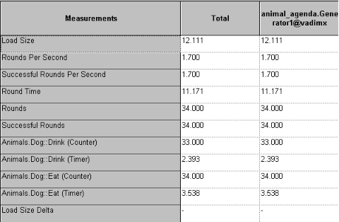

# Advanced JavaScript script Features

Previous chapters discussed the basic set of script tools used to test typical Internet applications. However, to evaluate and test your Internet application most effectively, it is not enough to measure the total transaction turn-around time or throughput of the website. A website is often only the front-end for applications that reside behind the scenes, for back-end components that do the actual work for an application. Testing the components that stand behind your Internet application is essential for comprehensive Internet application testing. A detailed breakdown and analysis of the results of each user activity helps pinpoint the source of any potential bottlenecks or other problems, and expedites the work required for any corrections or improvements.

WebLOAD fully supports component based testing. WebLOAD Recorder scripts do not simply measure the time required for transactions to a website to be completed. WebLOAD JavaScript script objects can also directly access the back-end applications that compose your Internet application.

WebLOAD provides a single, uniform environment for all your testing needs. WebLOAD JavaScript is the single scripting language that is able to work seamlessly with COM, Java, and XML DOM, accessing the applications that use these technologies through a variety of protocols, or your own proprietary protocol, in addition to standard Web-site testing, adding power to and increasing the universal applicability of your testing scripts.

This chapter introduces various component-based testing features.

Syntax specifications for the WebLOAD objects that appear in the examples in this chapter are provided in the *WebLOAD JavaScript Reference Guide*.


## Working with the XML DOM

XML is a meta-language developed by W3C to organize and transfer data in a generic, universally recognized manner. XML relies on a simple, logical structure that is both easy to learn and works quickly and reliably, focusing on transferring hard data only, with no formatting or presentation information. XML acts as a gateway between autonomous, heterogeneous, component-based systems. This allows users to connect or link to any platform. XML provides an elegant solution for Web masters who wish to reach a wide range of clients, working on any number of diverse systems.

WebLOAD provides full support for work with the XML Document Object Model. Using XML DOM objects, WebLOAD scripts are able to both *access* XML site information, and *generate new XML data* to send back to the server for processing, taking advantage of all the additional benefits that XML provides.

WebLOAD supports:

- Working with existing XML Data Islands. Data Islands are XML documents embedded within HTML documents. WebLOAD Recorder, like the IE Browser, produces an XML DOM object for each Data Island.
- Creating new XML DOM objects via the XML Object Constructor. WebLOAD supports XML Native Browsing through use of the XML Object Constructor.
- Parsing and manipulating any XML data, using the XML Parser Object.

Both WebLOAD and the IE Browser use the MSXML parser to create XML DOM objects. Since WebLOAD XML DOM objects and Browser XML DOM objects are created by the same MSXML parser, the XML DOM objects that are produced for both WebLOAD and the IE Browser are identical.

When working through the IE Browser, XML DOM objects are accessed through the all collection. When working through WebLOAD, XML DOM objects are accessed through the wlXmls collection. Since a WebLOAD XML DOM object is identical to an IE Browser XML DOM object, the WebLOAD XML DOM uses the same Document Interface (programming methods and properties) found in the IE Browser XML DOM.

The next few sections of this guide explain basic XML concepts and usage. Look in the *WebLOAD JavaScript Reference Guide* for a description of the WebLOAD wlXmls collection syntax and for a complete list of the WebLOAD-supported XML DOM Interfaces.

For more general XML support and cross platform capabilities, WebLOAD offers the XMLParserObject as another alternative for accessing XML data. The XMLParserObject is based on the open source Xerces XML parser. In addition to the multi-platform support, using this object will result in lower memory consumption and increased performance during load testing.

The following sections contain examples using the XMLParserObject. For more information about the XMLParserObject please refer to the *WebLOAD JavaScript Reference Guide. A*dditional information about the XMLParserObject’s underlying Xerces component can be found at [http://xml.apache.org/xerces-c/.](http://xml.apache.org/xerces%1ec/)


### WebLOAD XML DOM Objects
WebLOAD XML DOM objects produced from HTML documents may be used on two different levels:

- The simplest approach is to use the XML DOM object to work directly with text strings through the standard HTML properties id, src, and innerHTML. These properties refer to the text strings found within an HTML document.
- On a more sophisticated level, programmers may use the same XML DOM object to work with a full set of XML DOM Document Interface properties and methods, as listed in *Appendix B* of the *WebLOAD JavaScript Reference Guide*. The following figure illustrates these options:


### **Data Islands**
Data Islands are XML documents embedded within HTML documents. Data Islands found on HTML documents are located either between a set of `<xml>` and `</xml>` tags or between a set of `<script>` and `</script>` tags. Data Islands consist of either a complete body of in-line XML code or a reference to XML code found in another location, with the location specified in a src=location statement.

WebLOAD, like the Internet Explorer browser, produces an XML DOM object for each Data Island. No matter how a Data Island is specified, either within a set of `<xml>` tags or a set of `<script>` tags, either as in-line XML code or through a reference to another location, WebLOAD produces a full XML DOM object for each Data Island. These XML DOM objects are accessible through the wlXmls collection.


Data Island XML DOM objects expose both aspects of each XML DOM object:

- The standard HTML properties id, src, and innerHTML. These properties refer to text strings found within the HTML document.
- The XML Document Interface. The interface provides access to the properties and methods of the XML DOM object.

The following figure illustrates the various Data Islands options.

> **Note:** Not all these Data Islands would be found in a single wlXmls collection if they have been taken from different sources. They appear here in a single figure to illustrate the various Data Island possibilities.


Data Islands are accessible through WebLOAD scripts using the wlXmls collection of XML DOM objects corresponding to all the Data Islands found in an HTML document. Each Data Island produces a different XML DOM object.

For example, when working with an HTML document that includes two Data Islands, use the following code to assign the XML object that references the first Data Island to another object:

`XMLDataIsland1 = document.wlXmls[0]`

To access the second Data Island use: 

`XMLDataIsland2 = document.wlXmls[1]`

If a Data Island is identified by name through an ID, you could also access the Data

Island through the id property. For example, if the first Data Island begins:

`<xml id=“xmlBookstoreDatabase”>`

Then you could access the Data Island using any of the following:


`MyBookstore = document.wlXmls.xmlBookstoreDatabase` 

`MyBookstore = document.wlXmls[“xmlBookstoreDatabase”]` 

`MyBookstore = document.wlXmls[0]`


The following HTML code fragments illustrate these Data Islands options.

#### Data Island—In-Line Code

In this code fragment, in-line XML data is embedded in the HTML page. WebLOAD uses this data to create the XML DOM object.

```html
<html>

<head>


...

</head>

<body>

...

<!—in-line XML data>

<xml id="xmldoc\_1">

<?xml version="1.0" standalone = true?> Programmer’s Guide

<author>Mark Twain</author>

<title>Tom Sawyer</title>

<price>$11.00</price>

</book>

<foo>

...

</foo>

</xml>

...

</body>

</html>
```


#### Data Island—Reference to Another Source

In this code fragment, a reference to XML data found at another location is found in the HTML page. WebLOAD creates an XML DOM object from the source found at that location *only*.

> **Note:** If a Data Island includes an src=location statement, then any additional XML data found embedded within the Data Island on the HTML page will be ignored.

```html
<html>

<head>


...

</head>

<body>

...

<!—reference to another source>

<xml id=“xmldoc\_2” [src=“http://demo/bookstore.xml”>](http://demo/bookstore.xml)

</xml>

...

</body>

</html>
```


#### Data Island—Scripted In-Line

XML DOM objects created from scripts within HTML documents may also be based on either in-line XML data or references to other sources.

For example:

```xml

<SCRIPT language=“xml” id=“xmlscript”>

<?xml version="1.0”?>

<!—XML data in-line within a script element.>

<bookstore>

Programmer’s Guide

<author>Mark Twain</author>

<title>Tom Sawyer</title>

<price>$11.00</price>

</book> Programmer’s Guide

<author>Oscar Wilde</author>

<title>The Giant And His Garden</title>

<price>$8.00</price>

</book>

</bookstore>

</SCRIPT>
```


#### Data Island—Scripted Reference to Another Source

The preceding code illustrates XML data embedded in a script. Scripts may also include references to other sources:

<SCRIPT language=“xml” id=“xmlscript” src=“book.xml”>

</SCRIPT>


### Example: Using Data Islands in a script

The following example illustrates Data Island usage. Assume you are working with a Web Bookstore site that includes the following inventory database code fragment:

```
<HTML>

<HEAD>


<TITLE> </TITLE>

</HEAD>

<BODY>
```


<h3>Html file with embedded XML</h3>

<P>Here begins the XML Data Island</P>

```html
<xml id="WebStudents">

<wclass>

<!-- My students who attended my web programming class -

->

<student id="1">

<name>Linda Jones</name>

<legacySkill>Access, VB5.0</legacySkill>

</student>

<student id="2">

<name>Adam Davidson</name>

<legacySkill>Cobol, MainFrame</legacySkill>

</student>

<student id="3">

<name>Charles Boyer</name>

<legacySkill>HTML, Photoshop</legacySkill>

</student>

<student id="4">

<name>Charles Mann</name>

<legacySkill>Cobol, MainFrame</legacySkill>

</student>

</wclass>

</xml>	<P>Here ends the XML Data Island</P>

</BODY>

</HTML>
```


#### Working with HTML Properties

When accessing this website, your script may use the standard HTML properties id and innerHTML to print out text strings showing the information found within the XML tags, as follows:


##### **JavaScript script Code:**

```javascript
function InitAgenda()

{

wlGlobals.Parse = true wlGlobals.ParseXML = true

}

wlHttp.SaveSource = true

[wlHttp.Get("http://www.webloadmpsto](http://www.webloadmpstore.com/xmlsamples/sample2.htm)re.com/[xmlsamples/sample2.htm](http://www.webloadmpstore.com/xmlsamples/sample2.htm) l")

var XMLstudents = document.wlXmls[0] 

InfoMessage("ID : " +XMLstudents.id) 

InfoMessage("HTML text : " +XMLstudents.innerHTML)


```

##### **Output Text:**

Running this script produces the following output, essentially a text copy of the Data Island fields:

ID : WebStudents HTML text :

<wclass>

<!-- My students who attended my web programming class -->

<student id="1">

<name>Linda Jones</name>

<legacySkill>Access, VB5.0</legacySkill>

</student>

<student id="2">

<name>Adam Davidson</name>

<legacySkill>Cobol, MainFrame</legacySkill>

</student>

<student id="3">

<name>Charles Boyer</name>

<legacySkill>HTML, Photoshop</legacySkill>

</student>

<student id="4">

<name>Charles Mann</name>

<legacySkill>Cobol, MainFrame</legacySkill>

</student>

</wclass>


#### Working with XML DOM Properties

Your script may also access the complete XML DOM Document Interface for the XML DOM object created from this Data Island. For example, to see a printout of the complete XML DOM structure for the xmlBookSite Data Island described on the preceding pages, use the following recursive function. See *Appendix B* in the *WebLOAD JavaScript Reference Guide*, for a description of the XML DOM properties used in this script fragment.

**JavaScript script Code:**

```javascript
function InitAgenda()

{

wlGlobals.Parse = true wlGlobals.ParseXML = true

}

wlHttp.SaveSource = true

[wlHttp.Get("http://www.webloadmpstore.com/xmlsamples](http://www.webloadmpstore.com/xmlsamples/sample2.htm)/sample2.htm l")

var XMLstudents = document.wlXmls[0]

var XMLstudentDoc =	XMLstudents.XMLDocument

var XMLstudentElement = XMLstudentDoc.documentElement

InfoMessage("Printing XML under the root") InfoMessage(XMLstudentElement.xml) InfoMessage("Element structure of the DOM") printChildren(XMLstudentElement)

// function that will print all the fields and their attributes function printChildren(element)

{

switch(element.nodeTypeString)

{

case "element":

InfoMessage(element.nodeName)

for(var i=0; i<element.childNodes.length; i++)

{

printChildren(element.childNodes.item(i))

}


break case "text":

InfoMessage("\"" + element.nodeValue + "\"") break

}

}

InfoMessage("End of test")
```


**Output Text:**

Running this script produces the following output:

Printing XML under the root

```xml
<wclass>

<!-- My students who attended my web programming class -->

<student id="1">

<name>Linda Jones</name>

<legacySkill>Access, VB5.0</legacySkill>

</student>

<student id="2">

<name>Adam Davidson</name>

<legacySkill>Cobol, MainFrame</legacySkill>

</student>

<student id="3">

<name>Charles Boyer</name>

<legacySkill>HTML, Photoshop</legacySkill>

</student>

<student id="4">

<name>Charles Mann</name>

<legacySkill>Cobol, MainFrame</legacySkill>

</student>

</wclass>

Element structure of the DOM wclass

student name

"Linda Jones"


legacySkill "Access, VB5.0" student

name

"Adam Davidson" legacySkill "Cobol, MainFrame" student

name

"Charles Boyer" legacySkill "HTML, Photoshop" student

name

"Charles Mann" legacySkill "Cobol, MainFrame"

End of test
```


**JavaScript script Code Using the XMLParser Object:**

A similar script, with the same functionality, can be written using the XMLParserObject, as shown in the code snippet below:

```javascript
xmlObject = new XMLParserObject(); doc = xmlObject.

[parseURI("http://www.webloadmpstore.com/](http://www.webloadmpstore.com/xmlsamples/sample2.html)xmlsamples[/sample2.html"](http://www.webloadmpstore.com/xmlsamples/sample2.html)

)

doc1 = doc.getDocumentElement()

//used to present only the xml

domNode = doc1.getElementsByTagName("xml").item(0); InfoMessage("Printing XML under the root") printChildren(domNode)

function printChildren(element)

{

switch(element.nodeTypeString)

{

case "element":

InfoMessage(element.nodeName)

for(var i=0; i<element.childNodes.length; i++)

{

printChildren(element.childNodes.item(i))

}


break case "text":

InfoMessage("\"" + element.nodeValue + "\"") break

}

}

InfoMessage("End of test")
```


#### Changing Bookstore Data

After you have accessed the website and created an XML DOM object from the XML data found on the site, you may wish to change some of the data and post the new version back to the website. To change the author of the first book to ‘S. B. David Lee Eddings’:

```js
function InitAgenda()

{

wlGlobals.Parse = true wlGlobals.ParseXML = true

}

wlHttp.SaveSource = true wlHttp.Get

[("http://www.webloadmpstore.com/xmlsamples/sample](http://www.webloadmpstore.com/xmlsamples/sample1.xml)1[.xml")](http://www.webloadmpstore.com/xmlsamples/sample1.xml)

//Getting the XML file

var xmlBookListDoc = document.wlXmls[0]

var xmlBookListIsland = xmlBookListDoc.XMLDocument

var xmlBookListElement = xmlBookListIsland.documentElement

InfoMessage("Printing xml under the root: " + xmlBookListElement.xml)

//First access the node of the first book

var FirstBook = xmlBookListElement.childNodes.item(0)

//Next access the node of the author of the first book var AuthorFirstBook = FirstBook.childNodes.item(1)

//Finally access the node of the text of the author of the first book

var TextAuthorFirstBook = AuthorFirstBook.childNodes.item(0)

//In other words, the node in the XML database tree


//that actually stores the author name value is located at:

//	document.wlXmls[0].XMLDocument.

//	documentElement.childNodes.item(0).childNodes.

//	item(1).childNodes.item(0)

//Now assign a new value

TextAuthorFirstBook.nodeValue = "S. B. David Lee Eddings"

InfoMessage("The changed author value, from J.R.R. Tolkein, to: "

\+ TextAuthorFirstBook.nodeValue) InfoMessage("Print xml under the root: " + xmlBookListElement.xml)
```


The changed bookstore database will look as follows:

```xml
<bookstore name="NODE1NAME">

<book>

<title lang="en">Everyday Italian</title>

<author>David Eddings</author>

<year>2005</year>

<price>30.00</price>

</book>

<book category="CHILDREN">

<title lang="en">Harry Potter</title>

<author>J K. Rowling</author>

<year>2005</year>

<price>29.99</price>

</book>

<book category="WEB">

<title lang="en">XQuery Kick Start</title>

<author>James McGovern</author>

<author>Per Bothner</author>

<author>Kurt Cagle</author>

<author>James Linn</author>

<author>Vaidyanathan Nagarajan</author>

<year>2003</year>

<price>49.99</price>

</book>

<book category="WEB">

<title lang="en">Learning XML</title>

<author>Erik T. Ray</author>

<year>2003</year>


<price>39.95</price>

</book>

</bookstore>

You can change the bookstore data in the same way by using the XMLParserObject. The script code is even shorter:

xmlObject = new XMLParserObject(); doc = xmlObject.

[parseURI("http://www.webloadmpstore.com/xmlsamples/sample](http://www.webloadmpstore.com/xmlsamples/sample1.xml)1.xml")

;

InfoMessage("The xml under the root : " + doc.xml) doc1 = doc.getDocumentElement()

FirstBook =	doc1.getElementsByTagName("book").item(0); AuthorFirstBook	= FirstBook.childNodes.item(1) ; TextAuthorFirstBook	= AuthorFirstBook.childNodes.item(0) TextAuthorFirstBook.nodeValue = "S. B. David Lee Eddings"

InfoMessage("The changed author value, from J.R.R. Tolkein, to: " + TextAuthorFirstBook.nodeValue)

InfoMessage("The xml under the root : " + doc.xml)
```


#### Adding New Bookstore Data

The following script fragment illustrates adding a new ‘book element’ to the xmlBooksite database. See Appendix B in the *WebLOAD JavaScript Reference Guide*, for a description of the XML DOM properties used here.

```javascript
var xmlBookListDoc = document.wlXmls[0]

var xmlBookListIsland = xmlBookListDoc.XMLDocument

//STEP 1, create the new book element

//	and append it to the tree

newBook = xmlBookListIsland.createElement("book") xmlBookListIsland.documentElement.appendChild(newBook)

//STEP 2, create and name the new book’s title element title1 = xmlBookListIsland.createElement("title")

name = xmlBookListIsland.createTextNode("River God")

//append the new name node to the title node title1.appendChild(name)

//append the new title node to the book node newBook.appendChild(title1)


//STEP 3, create and name the new book’s author element author = xmlBookListIsland.createElement("author")

name = xmlBookListIsland.createTextNode("Wilbur Smith") author.appendChild(name)

newBook.appendChild(author)

//STEP 4, create and name the new book’s year element year = xmlBookListIsland.createElement("year")

name = xmlBookListIsland.createTextNode("1975") year.appendChild(name) newBook.appendChild(year)

//STEP 4, create and name the new book’s price element price = xmlBookListIsland.createElement("price") amount = xmlBookListIsland.createTextNode("40.55") price.appendChild(amount)

newBook.appendChild(price)


```

The newly expanded bookstore database will look as follows:

```xml
<bookstore name="NODE1NAME">

<book>

<title lang="en">Everyday Italian</title>

<author>S. B. David Lee Eddings</author>

<year>2005</year>

<price>30.00</price>

</book>

<book category="CHILDREN">

<title lang="en">Harry Potter</title>

<author>J K. Rowling</author>

<year>2005</year>

<price>29.99</price>

</book>

<book category="WEB">

<title lang="en">XQuery Kick Start</title>

<author>James McGovern</author>

<author>Per Bothner</author>

<author>Kurt Cagle</author>

<author>James Linn</author>

<author>Vaidyanathan Nagarajan</author>

<year>2003</year>


<price>49.99</price>

</book>

<book category="WEB">

<title lang="en">Learning XML</title>

<author>Erik T. Ray</author>

<year>2003</year>

<price>39.95</price>

</book>

<book>

<title>River God</title>

<author>Wilbur Smith</author>

<year>1975</year>

<price>40.55</price>

</book></

</bookstore>
```


You can achieve the same result using XMLParserObject. The script Code is as follows:

```javascript
xmlObject = new XMLParserObject(); doc = xmlObject.

[parseURI("http://www.webloadmpstore.com/xmlsamples/sample](http://www.webloadmpstore.com/xmlsamples/sample1.xml)1.xml")

;

doc1 = doc.getDocumentElement()

newNode1 = doc.createElement("book"); doc1.appendChild(newNode1);

title1 = doc.createElement("title") ; titleText = doc.createTextNode("River God"); newNode1.appendChild(title1) title1.appendChild(titleText )

author = doc.createElement("author")  ; authorName =	doc.createTextNode("Wilbur Smith"); newNode1.appendChild(author) author.appendChild(authorName )

year = doc.createElement("year") ; yearInd =	doc.createTextNode("1975"); newNode1.appendChild(year ) year.appendChild(yearInd )


price = doc.createElement("price") ; priceAmount =	doc.createTextNode("40.55"); newNode1.appendChild(price) price.appendChild(priceAmount )
```


### **Creating and Filling New XML DOM Objects**
WebLOAD supports the creation of new XML DOM objects through the WLXmlDocument() constructor. New XML DOM objects may either be created:

- Empty, with the user adding data as needed.
- Already loaded with data found in existing XML files or text strings.

New XML DOM objects created by the WLXmlDocument() constructor are not produced from HTML documents, so they do not include the HTML property set (id, innerHTML, and src). HTML properties have no meaning for XML DOM objects created without any connection to an HTML document.

XML DOM objects created with the WLXmlDocument() constructor include the complete XML DOM Document Interface described in *Appendix B* in the *WebLOAD JavaScript Reference Guide*. Users may also load and reload XML data into XML DOM objects through the load() and loadXML() methods. This section describes the different methods of creating and filling data into XML DOM objects.

##### WLXmlDocument(xmlStr)—Creating XML DOM Object from XML String

The WLXmlDocument(xmlStr) constructor accepts an optional parameter, an XML string that includes the entire XML document data. For example:

`NewXMLObj = new WLXmlDocument(xmlStr)`

Use this form of the WLXmlDocument() constructor to create new XML DOM objects from an XML string parameter rather than relying on Data Islands from an HTML page.

##### Working with XML in Native (Direct) Browsing Mode

WebLOAD automatically processes Data Islands found on HTML documents. WebLOAD also provides access to pure XML documents. For example, assume a website uses Native Browsing rather than having XML data explicitly embedded in Data Islands. If you wish to work with this website you could issue a Get transaction to access the XML page after enabling the SaveSource property to save the page source to a file. Once the XML string has been saved in the data file produced by the Get transaction, you may then use WLXmlDocument() to create a new XML DOM object from that XML data string. You now have a fully functional XML DOM object, with a


Document Interface identical to that of XML DOM objects created from Data Islands. You may use this XML DOM object to manipulate the data, assign or change data values, and post the changed data back to the server, exactly as you would when working with a Data Island.

The following script fragments illustrates this sequence:

1. Set SaveSource so that the downloaded XML data will be saved to a file that can later be passed to the WLXmlDocument() constructor:

   `wlHttp.SaveSource=true`

2. Get the XML page, either as a static page from the server:

   `[wlHttp.Get(“http://demosite/bo](http://demosite/bookstore.xml)okstore.xml”)`

   Or through a database query to the bookstore:

   `[wlHttp.Get(“http://demosite/bookstore.exe?](http://demosite/bookstore.exe) author=Mark Twain&MaxPrice=$20.00”)`

3. Create a new XML DOM object using the saved page source, which happens to include the XML string:

   `newXmlObj = new WLXmlDocument(document.wlSource)`

4. At this point you have an XML DOM object which may be manipulated in any way just as you would manipulate XML DOM objects produced by Data Islands. You may make any changes or additions you wish to the XML DOM object data, as described in previous examples illustrating changing or adding bookstore data.

   For example, you may post the new XML DOM data back to the server:

   `wlHttp.Data.Type=“text/xml”`

   `wlHttp.Data.Value=xmlobj.xml`

   `wlHttp.Post(“Http://demosite/bookstore.exe?operation=](http://demosite/bookstore.exe?operation=upd)upd ate”)`

> **Note:** The WLXmlDocument(xmlStr) constructor must be passed complete, self- contained XML strings *only*. The DTD section must not contain any external references when using this form of the constructor. 


##### WLXmlDocument()—Creating a New, Blank XML DOM Object

The WLXmlDocument() constructor may be used without any parameters. In this case, a new, blank XML DOM object will be created. For example:

`NewBlankXMLObj = new WLXmlDocument()`

You may now use the loadXML() method to add XML data to your new blank XML DOM object.

`NewBlankXMLObj = loadXML(“<?xml version='1.0’?>`

`<bookstore></bookstore>”)`

To add more content to the document, create elements and add them as child nodes as described in the example in the previous section.

##### Loading XML Files into XML Objects

The MSXML Document Interface provides two methods for loading XML documents into XML DOM objects:

- loadXML(“XMLdocumentstring”)
- load(“URL”)

This section describes the advantages and limitations of the loadXML() and load() methods when used in WebLOAD Recorder scripts, and discusses how to select the method that will be most effective in your scripts.


> **Note:** You may use loadXML() and load() repeatedly to load and reload XML data into XML DOM objects. Remember that each new ‘load’ into an XML DOM object will overwrite any earlier data stored in that object.

###### Using loadXML(XMLDocString

The loadXML(XMLDocString) method accepts a literal XML document in string format as its only parameter. This allows users to work with XML documents and data that did not originate in HTML Data Islands, such as with Native Browsing. In a typical scenario, a user downloads an XML document. WebLOAD saves the document contents in string form. The string is then used as the parameter for loadXML(). The information is loaded automatically into an XML object.

For example:

```xml
// Create a new XML document object 

NewXMLObj = new WLXmlDocument() 

wlHttp.SaveSource = true

[wlHttp.Get(http://www.server.com/xmls/doc.xml)](http://www.server.com/xmls/doc.xml\))

 XMLDocStr = document.wlSource

// Load the new object with XML data from the saved source.

// We are assuming no external references, as explained below NewXMLObj.loadXML(XMLDocStr)


```

> **Note:** Creating a new, blank XML DOM object with WLXmlDocument() and then loading it with an XML string using loadXML() is essentially equivalent to creating a new XML DOM object and loading it immediately using WLXmlDocument(xmlStr). As with the WLXmlDocument(xmlStr) constructor, only standalone, self-contained DTD strings may be used for the loadXML() parameter. External references in the DTD section are not allowed.


###### Using load("URL")

The load("URL") method accepts a URL or filename where the XML document may be found as its only parameter. load() relies on the MSXML parser to handle any Get transactions needed to download the XML document. The XML data is then loaded automatically into the XML object.

For example:

```
myXMLDoc = document.wlXmls[0]

myXMLdoc.load(http://server/xmls/file.xml”)
```


When you use the load() method in your script, the MSXML module performs all the underlying HTTP transactions. External references in the DTD section are not allowed when using load(). However, the MSXML module accesses external servers and completes all necessary transactions without any control or even knowledge on the part of the WebLOAD system tester. From WebLOAD’s perspective, these transactions are never performed in the context of the test session. For this reason, any settings that the user enters through the WebLOAD Recorder or Console will not be relayed to the MSXML module and will have no effect on the document ‘load’. For the same reason, the results of any transactions completed this way will not be included in the WebLOAD statistics reports.

###### Comparing loadXML() and load()

WebLOAD supports both the load() and the loadXML() methods to provide the user with maximum flexibility. The following table summarizes the advantages and disadvantages of each method:

||**Advantages**|**Disadvantages**|
| :- | :- | :- |
|**loadXML()**|Parameters that the user has defined through WebLOAD for the testing session will be applied to this transaction.|The method fails if the DTD section of the XML document string includes any external references.|
|**load()**|The user may load XML files that include external references in the DTD section.|<p>Parameters that the user has defined through WebLOAD for the testing session will not be applied to this transaction.</p><p>WebLOAD does not record the HTTP Get operation. (See note below.)</p><p>The transaction results are not included in the session statistics report.</p><p>Using this method may adversely affect the test session results.</p>|


> **Note:** If you wish to measure the time it took to load the XML document using the load() method, create a timer whose results will appear in the WebLOAD Recorder statistics. For example:
>

`myXMLDoc = document.wlXmls[0] SetTimer(“GetXML”)`

`myXMLdoc.load(“http://server/xmls/file.xml”)`

### **Example: Building an XML Database from Scratch**
The next example will put together some of the pieces from the previous sections. Here we will create a new, skeletal XML DOM object for a bookstore database, build new book elements, and add each new book to our bookstore database.

```
// 1. CREATE AN EMPTY XML OBJECT with a skeleton: xmlBookstoreDoc = new WLXmlDocument

(“<?xml version='1.0’?><bookstore></bookstore>”)

// 2. ADD CONTENT TO THE DOCUMENT:

//create the first book element

newBook = xmlBookstoreDoc.createElement(“book”)

//append the new book to the bookstore tree xmlBookstoreDoc.documentElement.appendChild(newBook)

//create, name, and append the new book’s author element

author = xmlBookstoreDoc.createElement(“author”) name = xmlBookstoreDoc.createTextNode(“Mark Twain”) author.appendChild(name) newBook.appendChild(author)

//create, name, and append the new book’s title element

title =  xmlBookstoreDoc.createElement(“title”) name = xmlBookstoreDoc.createTextNode(“Tom Sawyer”) title.appendChild(name)

newBook.appendChild(title)

//create, name, and append the new book’s price element

price = xmlBookstoreDoc.createElement(“price”) amount = xmlBookstoreDoc.createTextNode(“$12.00”) price.appendChild(amount) newBook.appendChild(price)

// 3. CONTINUE TO ADD CONTENT TO THE DOCUMENT:

//create the second element and append it to the tree newBook = xmlBookstoreDoc.createElement(“book”) xmlBookstoreDoc.documentElement.appendChild(newBook)


//create, name, and append author, title, and price elements

author = xmlBookstoreDoc.createElement(“author”) name = xmlBookstoreDoc.createTextNode(“Leo Tolstoy”) author.appendChild(name)  newBook.appendChild(author)

title = xmlBookstoreDoc.createElement(“title”)

name = xmlBookstoreDoc.createTextNode(“War and Peace”)

title.appendChild(name) newBook.appendChild(title)

price = xmlBookstoreDoc.createElement(“price” amount = xmlBookstoreDoc.createTextNode(“$20.00”) price.appendChild(amount) newBook.appendChild(price)
```

A new XML DOM bookstore database object has now been created and filled with information about two books. The product of the xmlBookstoreDoc.documentElement.xml property would be:

```xml
<?xml version="1.0”?>

<bookstore>

<book>

<author>Mark Twain</author>

<title>Tom Sawyer</title>

<price>$12.00</price>

</book>

<book>

<author>Leo Tolstoy</author>

<title>War and Peace</title>

<price>$20.00</price>

</book>

</bookstore>
```


### **Handling Web Service Transactions**
WebLOAD supports working with Web services, including manipulating the Web service’s responses.

A Web service response is a soap-formatted XML message. Accessing this XML message becomes possible, after parsing the response using WebLOAD’s

XMLParserObject. This enables you to locate the node containing the desired part of the web service response.


The following sample script demonstrates how WebLOAD handles web service transactions by extracting the dynamic XML from the web service response and parsing it using the XMLParserObject. The desired return value is then located by searching through the parsed XML.

```javascript
xmlObject = new XMLParserObject()

wlGlobals.GetFrames = false [wlHttp.Get("http://www.webloadmpstore.com/ajaxsample")](http://www.webloadmpstore.com/ajaxsample)

wlHttp.Header["Referer"] = ["http://www.webloadmpstore.com/ajaxsample/"](http://www.webloadmpstore.com/ajaxsample/)

wlHttp.FormData["wsdl"] = "$WL$VOID$STRING$"

[wlHttp.Get("http://www.webloadmpstore.com/ajaxsample/serveradd1.](http://www.webloadmpstore.com/ajaxsample/serveradd1) php")

wlHttp.Header["Referer"] = ["http://www.webloadmpstore.com/ajaxsample/"](http://www.webloadmpstore.com/ajaxsample/)

wlHttp.Data["Type"] = "text/xml; charset=utf-8"

wlHttp.Data["Value"] = "<?xml version=\"1.0\" encoding=\"utf- 8\"?><soap:Envelope xmlns:xsi=[\"http://www.w3.org/2001/XMLSchema](http://www.w3.org/2001/XMLSchema-instance\)-[instance\](http://www.w3.org/2001/XMLSchema-instance\)" xmlns:xsd=\["http://www.w3.org/2001/XMLSchema](http://www.w3.org/2001/XMLSchema\)\"

xmlns:soap=\["http://schemas.xmlsoap.org/soap/envelope/](http://schemas.xmlsoap.org/soap/envelope/\)\"><soap:B ody><add xmlns=\"urn:addwsdl\"><a>20</a><b>30</b></add></soap:Body></soap

:Envelope>"

[wlHttp.Post("http://www.webloadmpstore.com/ajaxsample/serveradd1](http://www.webloadmpstore.com/ajaxsample/serveradd1)

.php")

//Extract the XML part from the response doc = document.wlXmls[0]

InfoMessage (doc.xml)

//Load the extracted XML into the XMLParserObject xo = xmlObject.loadXML(doc.xml)

//Locate the node containing the Web Service result according to the name of the node: "return"

node = xo.getElementsByTagName("return").item(0) InfoMessage(node.xml)
```


### **Document Type Definition (DTD)**
The term DTD is an acronym for Document Type Definition. The Document Type Definition is a set of rules that describes the grammar of a particular XML document. The DTD is used to validate an XML document.

For example, the DTD for a bookstore database would do the following:

1. *Define the structure* and attributes of that database.

   Based on the rules found in the DTD, you might have a database that requires every book entry to include information on the book’s title, author, and price. Information on publishers and reprint requests may be declared optional.

1. After the DTD defines the structure and attributes of the database, the XML Data Island *assigns values* to the attributes listed in the DTD.
1. Once an XML document has been downloaded, the Browser *validates the document*

   by checking that the XML data follows the rules set by the DTD.

   ![ref8]If the price is missing from a certain book item, for example, and a price is required by the DTD, then the Browser will not be able to validate that XML document.

> **Note:** For the Browser to parse and validate an XML document according to a particular DTD, the author must include a <DOCTYPE> section in the XML document. WebLOAD Recorder supports DTD verification only if the DTD is completely included in the Data Island and there are *no external references* in the DTD.

The following code illustrates a self contained DTD for the bookstore example used throughout this section of the manual:

```xml-dtd
<!-DOCUMENT STARTS HERE->

<?xml version="1.0"?>

<!-THE DTD STARTS HERE -->

<!DOCTYPE [


<!ELEMENT books-table (book)+>

<!ELEMENT book (title,author+,isbn,publication-date,book- type,book-family+)>

<!ELEMENT title (#PCDATA)>

<!ELEMENT author (#PCDATA)>

<!ELEMENT isbn (#PCDATA)>

<!ELEMENT publication-date (#PCDATA)>

<!ELEMENT book-type (#PCDATA)>

<!ELEMENT book-family (#PCDATA)>

<!--attribute list-->

<!ATTLIST book id ID #REQUIRED>


<a name="_bookmark74"></a><!ATTLIST author rank CDATA #IMPLIED>

]>

<!--THE DTD ENDS HERE-->

<!--DATA PART OF THE DOCUMENT->

<books-table>

<book id="thisbook">

<title></title>

<author rank=""></author>

<isbn></isbn>

<publication-date></publication-date>

<book-type></book-type>

<book-family></book-family>

</book>

</books-table>

<!-DOCUMENT ENDS HERE->
```


## **Working with Java**

Java is an object-oriented, dynamic, platform-independent programming language developed by Sun Microsystems in the mid-1990s. Java provides its users with a complete run-time environment, a Virtual Machine (VM). With the Java VM sitting in your Web browser, any HTML document can include embedded Java, adding active content to your Web page. Java includes a variety of useful features, such as Remote Method Invocation (RMI), which allows local developers to seamlessly access distributed application functions and procedures, and Java Database Connectivity (JDBC), which allows Java clients to interact with any ODBC- or JDBC-compliant database, whether it resides locally or on a remote server. By utilizing Java tools and classes, user applications are able to offer far greater power and capabilities than when working with simple HTML code alone. For this reason, over the past few years, Java has become one of the most popular development mediums for large-scale Internet applications.

WebLOAD supports full Java access from your JavaScript scripts. Full Java support means that your WebLOAD scripts will not only test access time to an HTML page. WebLOAD scripts can also invoke and run local Java classes used by the Java applications embedded within an HTML page. The Java components that stand behind that Web page need no longer be considered ‘black boxes’. Your JavaScript script can directly access and test the classes of each locally residing Java component, allowing you to test each aspect of your application.

WebLOAD uses LiveConnect3, developed by Netscape Communications Corporation and maintained and supported by the Mozilla Foundation, to allow your JavaScript scripts to communicate with Java classes. LiveConnect is an invisible architecture that runs in the background. Your JavaScript code may work directly with Java. Your WebLOAD script can even include both JavaScript code that calls Java code and Java code that calls JavaScript code. The interface between Java and JavaScript is managed for you, allowing you to create the Java/JavaScript testing scenario that best meets your needs.

### **Requirements**
This section provides a brief explanation of how to work with Java components directly from your JavaScript script. Sample scripts illustrate typical usage.

#### JDK/JRE 1.5 (or Higher)

Install the standard Sun Microsystems Java Virtual Machine (JVM), version 1.5 or higher, on your system.

**To verify that you are working with version 1.5 or higher**

1. Select **Control Panel** from the Windows **Start** > **Settings** menu and double click the **Add/Remove Programs** icon.
1. Check the items listed in the dialog box. Entries that reference Java should be labeled version 1.5 or higher.
1. If you wish to update your version of Java, download the latest version from[ http://java.sun.com ](http://java.sun.com/)([http://java.sun.com](http://java.sun.com/)).

   Follow the standard Sun installation instructions. It makes no difference if you install the JVM before or after installing WebLOAD.

If you are doing any development work that may require application compilation, you must install the complete Java Developer’s Kit (JDK). If your application is complete and you will only be running it, without making any changes or corrections that may require compilation, then the Java Runtime Environment (JRE) will be enough to simply run a test session. The decision to install only the JRE, or the complete JDK, depends on your own application’s requirements. WebLOAD Recorder provides full Java support in both cases.

#### PATH Environment Variable

Your command path must include both the Java bin and Java classic directories. The Java bin directory is where the Java programs and compiler are located. The Java classic directory is where the jvm.dll file is located.

For example, after a typical installation of JDK version 1.5, your PATH should include something similar to this:

`PATH=%PATH%;C:\Program Files\jdk1.5\bin; C:\Program Files\jdk1.5\jre\bin\classic`


#### CLASSPATH Environment Variable

Your CLASSPATH environment variable must point to the following:

- JVM class libraries
- LiveConnect class libraries
- Your application’s class libraries (a series of \*.class and \*.jar files)

For example, assuming your Java class libraries are located in the Java\lib directory, the LiveConnect class libraries are located in LiveConnect\classes, and your application class libraries are located in the AppDev\lib directory, your CLASSPATH should include the following:

`CLASSPATH=%CLASSPATH%;C:\Java\lib\rt.jar; C:\LiveConnect\classes;C:\AppDev\lib`

In general, following a WebLOAD Recorder installation, the LiveConnect class libraries are located in:

`C:\Program Files\RadView\WebLOAD\LiveConnect\classes`

#### Setting PATH and CLASSPATH Environment Variables

Set the PATH and CLASSPATH environment variables to include the necessary directories. The settings can be modified through Windows or a DOS command window.

**To verify that both your PATH and CLASSPATH environment variables include the necessary directories:**

1. From the Windows taskbar, select **Start** > **Settings** > **Control Panel**.
1. Double click the **System** icon and select the **Environment** tab.
1. Check the Environment Variables to confirm that your environment variables are set correctly.

Alternatively, you could open a DOS command window:

- Type path, and press <Enter>.

  Your current PATH setting will appear in the window.

If you type set classpath and press <Enter>, your current CLASSPATH setting will appear in the window.


Remember that the exact full directory path name will differ from system to system. Check with your system administrator to verify the correct Java directory path names for your system.

Alternatively, you could do the following:

1. Right-click the **My Computer** icon on your desktop.
1. Select **find…**, and search for jvm.dll.

This file is usually found in a directory path that ends with …\bin\classic. This directory, and the same directory without the \classic ending, should both appear in the PATH environment variable.

If your PATH or CLASSPATH environment variables do not include the necessary directories do the following:

1. Add the correct directory names for your system to the PATH or CLASSPATH environment variable definitions in the Environment tab of the System dialog box.
1. Click **Set**.
1. Click **Apply**, to reset the variables to the new settings.

   You do not have to reboot your system. But you do have to restart TestTalk for WebLOAD to recognize the new PATH environment variable definition.

#### Public Methods

JavaScript scripts adhere to the same rules of object-oriented programming (OOP) as any other program. All programs must respect the OOP concepts of public and private. As in any OOP language, Java class methods may be either public or private. Public methods are functions that are externally visible and can be called by other Java classes and by JavaScript. For JavaScript to be able to control a Java class, the Java class must provide public methods.

### Identifying Java Objects in JavaScript scripts
Java uses its own specific terminology. Java objects are referred to as *classes*. These classes are organized hierarchically within *packages*. To access Java objects, specify the full path to that class, using the format:

`<java package full path>.<java class>`

For example, to reference the Java class Lassie contained in the package dogs, which is contained within the package animals, write `animals.dogs.Lassie`.


***Accessing Java Objects from JavaScript scripts***

Java objects found in JavaScript scripts are accessed according to the rules listed here. Detailed explanations and examples illustrating these rules are provided in the Netscape websites listed in [*Working with Java* ](#working-with-java).

- To access a built-in Java object, use the package java. This package acts as a flag, informing the compiler that it is about to start work with a built-in Java object. You may then continue to work directly with that object, its properties, and methods.

  For example:
  
  `var myJavaString = new java.lang.String("Hello world")`
  
  `…`
  
  `stringlen = myJavaString.length()`
  
  `…`
  
  -Or-
  
  `s = new java.net.Socket ("12.3.5.56",23)`
  
  `…`
  
  `s.getInputStream`
  
  `…`
  
  In these examples, java.lang and java.net are the full package names and String and Socket are the class names.

- To access a *locally defined* or third party Java object that is not part of the Java, Sun, or Netscape packages, use the reserved Java keyword Packages. This keyword acts as a flag, informing the compiler that it is about to start work with a locally- defined Java object. You may then continue to work directly with that object, its properties, and methods.

  For example:
  
  `var myJavaDog = new Packages.JavaDog(Lassie)`
  
  `…`
  
  `dogbreed = myJavaDog.dogBreed`
  
  `…`

Use the Packages keyword to access any user-defined class whose definition is included in the CLASSPATH library list.

### Forestalling Errors
Most common compilation and runtime errors can be prevented if you follow the instructions in this guide. Usually, you won’t have any problems as long as you verify that Java was installed correctly and specify Java objects with the correct full path and argument list. This section lists the most common potential pitfalls, in an effort to prevent problems before they occur.

- You must have Java version 1.2 installed on your system. Working with earlier versions of Java will cause your scripts to fail with the following WebLOAD Recorder error message:

  `WebLOAD can’t find jvm.dll`

  If you receive this error message, you may have an older version of the JVM, or you may not have Java installed at all on your system. If this is the problem, download and install the newer version of Java from [http://java.sun.com](http://java.sun.com/).

- Java version 1.2 or higher must be installed and environment variables defined on each Load Generator included in your test session. Test sessions that involve multiple Load Generators require a resident JVM with the correct environment variable settings on each Load Generator.

- Whether to install only the JRE or the complete JDK depends on your application’s requirements. If you will be doing any development or compilation, install the complete JDK. Trying to compile Java class files (such as JavaClass.java) on a computer that does not have the JDK installed will trigger an error. The JDK must be installed on *each* computer on which Java files will be compiled. The JRE can not handle any compilation requests.

- Each system environment is slightly different. When setting the PATH or CLASSPATH environment variables for your system, substitute the actual path to the required Java directories and libraries on your system. Use the Environment tab in the System dialog box from the Windows Control Panel to set the environment variables.

- Environment variables must be set with the correct values before starting TestTalk or running any Load Generators. Make sure you first verify and set the environment variables through the Windows Control Panel and only then start TestTalk.

- If you do not have the correct Java class directories included in your PATH, your scripts may fail with the following WebLOAD error message:

  `WebLOAD` can’t find jvm.dll

  If you receive this error message and your version of the JVM is 1.2 or higher, check your system PATH (through the Windows Control Panel) to be sure it points to the jvm.dll library. Make sure the directories listed are in fact the correct directories, and verify the correct path name in your script code.

- The class path and name in your script files must be specified absolutely correctly, with all elements spelled correctly and with the correct case. For example, the class name MyJavaClass is not the same as **my**JavaClass.

- The directories included in the CLASSPATH environment variable must also be specified absolutely correctly, with all elements spelled correctly, to exactly match the class path and names that appear in your JavaScript scripts.

  For example, assume you are working with an application that includes the Java class MyJavaClass, whose constructor expects a single string argument, located in the directory I:\AppFiles\libs.
  
  Your CLASSPATH environment variable should include:
  
  `CLASSPATH=%CLASSPATH%;I:\AppFiles\libs`
  
  Your script should reference this class as follows:
  
  `var myJavaObj = new Packages.MyJavaClass(“stringArg”)`
  
  If you were not careful, you could accidentally define CLASSPATH to include the wrong directory, such as:
  
  `CLASSPATH=%CLASSPATH%;I:\AppFiles\orig-libs`
  
  Or you could accidentally include an incorrect package path in the script file, such as:
  
  `var myJavaObj = new`
  
  `Packages.Jlib.MyJavaClass(“stringArg”)`
  
  In either of these cases the constructor call would fail and WebLOAD would return the following error message:
  
  `TypeError: <classname> is not a constructor`

- Make sure to pass the correct number and types of arguments to Java class constructors or methods.

  Realize that working with Java from your JavaScript script is really very simple and intuitive, as illustrated in the simple examples found in the remainder of this section. You simply must take care to specify objects correctly. Careless spelling mistakes will trigger errors, as they would in most programming languages.

### Example: passing simple variables between Java and JavaScript
You may pass any legal JavaScript variable or object as a parameter to a Java object or method. Conversions between basic variable types, such as integer, string, or Boolean, will be completed automatically. Return values will also convert correctly. 

The following example illustrates passing basic values between Java and JavaScript objects. The Java class method expects two parameters, a string and an integer, and returns the concatenation of both parameters into a single string. Conversions between Java and JavaScript strings and integers are completed automatically.

**Java side:**

```java
public class SimpleExample

{

public String Concat(String a, int b)

{

return a + " : " + b;

}

}


```

**JavaScript side:**

```javascript
a = new Packages.SimpleExample() InfoMessage(a.Concat("RoundNum",RoundNum))
```


### Passing Objects Between Java and JavaScript

LiveConnect uses the reserved Java class JSObject to pass a JavaScript object to Java objects. JSObject tells the Java side that it is being sent a JavaScript object. To pass a JavaScript object as a parameter to a Java method, your Java file must include the following:

- Import the netscape.javascript package.
- Define the corresponding formal parameter of the method to be of type JSObject.

You may set and change a JavaScript object property value, and even add a new member to a JavaScript object, while working from the Java side.

For example, the following code illustrates passing values between parallel Java and JavaScript objects.

**Java Side:**

```java
import netscape.javascript.JSObject; public class JavaDog

{

public String dogBreed; public String dogColor; public String dogSex;

public JavaDog(JSObject jsDog)

{

this.dogBreed = (String)jsdog.getMember("breed"); this.dogColor = (String)jsdog.getMember("color"); this.dogSex = (String)jsdog.getMember("sex");


}
```


> **Note:** The getMember method of JSObject is used to access the properties of the JavaScript object. This example uses getMember to assign the value of the JavaScript property jsDog.breed to the Java data member JavaDog.dogBreed.

**JavaScript Side:**

To continue with this example, look at the following definition of the JavaScript object `Dog:`

```javascript
function Dog(breed, color, sex)

{

this.breed = breed this.color = color this.sex = sex

}
```

Create an instance of the **JavaScript object Dog** as follows:

`Lassie = new Dog("collie", "chocolate", "female")`

The JavaScript property Lassie.color here has been assigned the value chocolate.

Now create an instance of the **Java object JavaDog** in the JavaScript code by passing the JavaScript Lassie object to the JavaDog constructor as follows:

`javaDog = new Packages.JavaDog(Lassie)`

> **Note:** The JavaScript code uses the Packages class to identify JavaDog as a locally defined Java object.
>

The Java property javaDog.dogColor has the value chocolate because the getMember method in the Java constructor assigns the value of Lassie.color to dogColor.

Detailed explanations of the JSObject class are provided in [http://developer.netscape.com/docs/manuals/js/core/jsref/lcjsobj.htm.](http://developer.netscape.com/docs/manuals/js/core/jsref/lcjsobj.htm)


### **Automatic Timers And Counters For Java Objects**
WebLOAD provides automatic timers and counters that wrap around every Java class method invocation found in your script. Automatic timers and counters allow you to effortlessly measure and quantify the behavior and response time of each specific Java component individually, enabling the most comprehensive testing of your Java-based application.

Every time your JavaScript script calls a Java class method, a timer and a counter are automatically created for that method. The results are included in the Statistics Report for that test session. These automatic Java timers are in addition to the standard WebLOAD Timer functions, which may be called from the Java side of your script as well as the standard JavaScript side. 

For example, assume you are communicating with a server using the Java socket class:

```java
try

{

// Connect to a server through Java socket s = new java.net.Socket ("12.3.5.56",23)

// Create Java I/O streams

from\_server = new java.io.DataInputStream(s.getInputStream()) to\_server = new java.io.PrintStream(s.getOutputStream())

//Read line from Input stream to JavaScript string value line = from\_server.readLine()

InfoMessage("" + line)

// Write JavaScript string value to the Output stream to\_server.println ("Client " + ClientNum + "-" + RoundNum )

// Get answer from the server via the Input stream line = from\_server.readLine()

InfoMessage("" + line)

}

catch (Exception) {

ErrorMessage ("Server is not connected")

}


finally

{

try {


}



if (s != null) s.close();

catch(Exception) {}

}
```


Each time you call any of the Java class methods, a timer and counter for that method is automatically incremented. The results appear in the Statistics Report. Each timer and counter is uniquely identified with the Java class, object, and method name, as illustrated in the following figure:


The counter and timer information is collected and displayed automatically, every time you call a Java class method from your script. You do not have to add anything to your script code to take advantage of this feature.


### Calling a WebLOAD API from a Java Application
This section describes two methods for calling WebLOAD JavaScript functions from the java code:

- [*Using the WebLoadWrapper to call WebLOAD API from a Java Application*](#using-the-webloadwrapper-to-call-webload-api-from-a-java-application)
- [*Legacy method of calling WebLOAD API from a Java Application*](#legacy-method-of-calling-webload-api-from-a-java-application)

#### Using the WebLoadWrapper to call WebLOAD API from a Java Application

The WebLoadWrapper simplifies the method of calling WebLOAD functions from the Java code.

##### Functions supported by WebLoadWrapper

It can be used to call the following WebLOAD functions from within Java:

- Void beginTransaction(String name) – Calls BeginTransaction
- Void debugMessage(String msg) – Prints DebugMessage only in WebLOAD Recorder
- Void endTransaction(String name) – Calls EndTransaction
- String getValue(String parameterName, String defaultValue) – Gets a parameterization manager parameter value
- Void infoMessage(String msg) – Prints InfoMessage in WebLOAD
- Void sendMeasurement(String name, Number value) – Calls

  SendMeasurement in WebLOAD

- Object getWebLoadRootObject() – Returns the JSObject. This can be used, for example, for direct calls to any WebLOAD’s JavaScript method.

##### Coding with WebLoadWrapper

**To use the WebLoadWrapper in your code:**

1. In your java class, import com.radview.webload.WebLoadWrapper.

1. To hook the Java class into the WebLOAD context, in the WebLOAD Recorder run the following command in the javascript code, either once at the beginning of the script or once in the InitClient()method:

   `Packages.com.radview.webload.WebLoadWrapper.setThreadWebLoadRootOb ject(this);`


If you would like to call any JavaScript method directly from your Java code WITHOUT using the WebLoadWrapper methods, or you need to use a method that WebLoadWrapper does not wrap, you can use the following method which is part of WebLoadWrapper:

`Object getWebLoadRootObject()` – Returns the JSObject of the calling JavaScript You can then use the returned JSObject to call the method you’d like. For example

`getWebLoadRootObject().eval("InfoMessage('test')");`

Once you get the JSObject, use it as described in [Legacy method of calling WebLOAD API from a Java Application](#legacy-method-of-calling-webload-api-from-a-java-application).

##### Example: using WebLoadWrapper

The following example shows how to use WebLoadWrapper in the Java code.

```java
package com.example;

import com.radview.webload.WebLoadWrapper; public class MyClass {

private WebLoadWrapper wlWrapper; public void myExampleFunc() {

wlWrapper = new WebLoadWrapper(); wlWrapper.beginTransaction("transaction 1");

<do any other work> …;

wlWrapper.endTransaction("transaction 1");

}

}
```

#### Legacy method of calling WebLOAD API from a Java Application

WebLOAD utilizes the locally understood, generic ‘this’ object, passing the current ‘this’ object as a parameter to a Java method. The JavaScript concept of ‘this’ object as your current working object is preserved even while working with that object’s properties and methods from the Java side.

Using ‘this’ object, WebLOAD is able to call WebLOAD functions directly from within Java method code, passing to the Java functions the default ‘this’ object that is expected by the function.

For example:

- Use the WebLOAD SetTimer and SendTimer functions to time Java activities.
- Use InfoMessage to print messages to the log window.

The following script illustrates calling WebLOAD functions from Java code.


**Java side:**

```java
import netscape.javascript.JSObject;

// The JSObject class must be imported for the

// code to successfully compile public class MyJClass

{

public void TimersFromJava(JSObject myJavaScriptObj)

{

String args[] = {"Timer1"}; myJavaScriptObj.call("SetTimer",args);

…<do any other work> …;

myJavaScriptObj.call("SendTimer",args);

}
```


> **Note:** You can call the JavaScript SetTimer and SendTimer functions directly from the Java class using the JSObject.call() method. Pass parameters to the functions being called (in this case the timer name expected by the timer functions), using the args array.

**JavaScript side:**

```javascript
// The following JavaScript code uses the Java class

// defined in the preceding Java section. myJavaObject = new Packages.MyJClass()

// The JavaScript code uses the Packages class to

// identify MyJClass as a locally defined Java object try

{

myJavaObject.TimersFromJava(this)

}

catch (e)

{

SevereErrorMessage("Error : " + e);
```


> **Note:** You work with myJavaObject as you would with any JavaScript object. TimersFromJava is called as a simple object method, passing the locally understood ‘this’ object as the parameter to the Java method.

The try...catch statement in the JavaScript code marks a block of statements to try. The catch block specifies the response the program should supply should an exception be thrown. If an exception is thrown, the try...catch statement catches it. WebLOAD recommends wrapping the JavaScript calls to Java functions within try...catch statements, to add robustness and error recovery to your code.


##### Example: reading data from a JDBC database

The following example illustrates a very common website activity—accessing a database. The Java side of the example is a straightforward Java program to access a JDBC, including methods to:

- Load a driver
- Open a connection
- Create and execute SQL queries

The JavaScript side of the example illustrates exactly how simple it is to work with the Java program from a JavaScript script.

**Java side:**

```java
import java.sql.\*; public class jdbcExample

{

Connection conn; Statement st1; ResultSet rs;

public static void loadDriver(String js\_driver) throws ClassNotFoundException

{

Class.forName(js\_driver);

}

public void getConnection(String js\_url, String js\_login, String js\_pswd) throws SQLException

{

//get the connection & also create a statement: conn = DriverManager.getConnection

(js\_url, js\_login, js\_pswd); st1 = conn.createStatement();

}

public String executeQuery(String js\_query) throws SQLException

{

//execute sql statement:

rs = st1.executeQuery(js\_query);

// loop over the result set.


String strOnSuccess = "3. Result Set is:"; while (rs.next())

{

strOnSuccess = strOnSuccess + "\n" + rs.getString("ReportName");

}

// return the data return strOnSuccess;

}

}
```

**JavaScript side:**

![ref19]The JavaScript side of this test session script runs a JDBC load test which checks the ability of the database to handle a large number of SQL queries.

> **Note:** The following is the sequence of JDBC activity in this script:

1. The JDBC driver is loaded only once for the test session, in the `InitAgenda()` function.
1. A JDBC connection is created once for each thread, in the `InitClient()` function.
1. Queries are created in the main body of the script. Answers are sent to the Console.

```javascript
function InitAgenda()

{

try

{


}


// load the JDBC driver once per session jdbcDriver = "<driver class name>" Packages.jdbcExample.loadDriver(jdbcDriver);

catch (e)

{

SevereErrorMessage("Error : " + e);

}

}

function InitClient()

{

// create a separate jdbcObj object and connection

// for each thread

jdbcObj = new Packages.jdbcExample()

// connect to the database

url = "<jdbc:driver-name:host>" login = "<username>"

password = "<password>"


try

{

}


jdbcObj.getConnection(url, login, password)

catch (e)

{

SevereErrorMessage("Error : " + e);

}

}

//Main body of script try

{

// create query and send the results to the Console query = "SELECT \* FROM Reports WHERE ReportId < 10 " query\_result = jdbcObj.executeQuery(query) InfoMessage(""+ query\_result)

}

catch (e)

{

WarningMessage("Error : " + e);

}
```


## Working with Java Selenium Scripts

### Prerequisite: Adding custom Java classes to WebLOAD
As a prerequisite to working with Java Selenium scripts, you need to configure the Selenium Java classes in WebLOAD. Use one of the two following methods.

#### Method #1: Include the Selenium jar and its dependencies in WebLOAD

In order for your code to work, you need to include it and all its dependencies (other jars it needs in order to run) in WebLOAD.

**To include the Selenium jars in WebLOAD:**

1. Copy the selenium-java-x.x.jar and all the jars in the libs folder to the WebLOAD Java extensions folder: `c:\ProgramData\RadView\WebLOAD\extensions\java`
1. If there are duplicate jars (having the same base name but a different number), delete the older versions.

Note that version numbers are not given in decimal notation. Thus, 1.11 is more recent than 1.9.

#### Method #2

Specify any additional classpath needed to run external classes by setting the following in the C:\Program Files (x86)\RadView\WebLOAD\bin\webload.ini file:

`USER\_CLASSPATH="path\to\classes"`

> **Note for Maven users:** When using Maven, you can use the following command to ind the target/dependencies folder filled with all the dependencies, including transitive: mvn dependency:copy-dependencies
>


### **Working with Selenium Scripts**

> **Note:** Creating a Java Selenium project is outside the scope of this document. For information, refer to the Selenium website at [http://www.seleniumhq.org/.](http://www.seleniumhq.org/)

A Java class that calls Selenium is still a Java class and can be called directly from a WebLOAD agenda using the Java integration capability described in [Working with Java](#working-with-java). For example, if you have the following Selenium Java code:

```java
// This is an example of a Selenium script in Java code. It does not relate to WebLOAD

package com.example;

import org.openqa.selenium.firefox.FirefoxDriver; public class MyClass {

private WebDriver driver; public void seleniumFunc() {

driver = new FireFoxDriver(); driver.[get("http://www.google.com](http://www.google.com/)");

}

}
```

You can call that code from WebLOAD, as described in [*Working with Java](#working-with-java), using:

`obj = new Packages.com.example.MyClass(); obj.seleniumFunc();`

However, WebLOAD will not have visibility into the activity occurring within the function call seleniumFunc; for example, if several pages are being downloaded, WebLOAD will not be able to time this activity for each page. The WebLoadDriver object enables adding timers, transactions and other WebLOAD methods directly inside the Java code.

### Working with WebLoadDriver
WebLoadDriver is a Selenium WebDriver wrapper that supports WebLOAD interaction. WebLoadDriver inherits WebLoadWrapper, which is described in [*Using the WebLoadWrapper* ](#using-the-webloadwrapper-to-call-webload-api-from-a-java-application)*).

WebLoadDriver provides the following:

- Supports all the WebLoadWrapper functionality described in [*Using the WebLoadWrapper* ](#using-the-webloadwrapper-to-call-webload-api-from-a-java-application)
- Implements the Selenium WebDriver interface
- Adds ‘reportStatistics’ functionality that sends timers from the browsers to WebLOAD. Refer to the *Selenium Report Statistics* section in the *WebLOAD Recorder User Guide*.

**To work with WebLoadDriver in the Java code:**

1. Add the following jar to your Java project:

   C:\ProgramData\RadView\WebLOAD\extensions\java\rvselenium.jar

2. In your Java class, import com.radview.webload.selenium.WebLoadDriver.

Keep in mind that WebLoadDriver is a Selenium WebDriver wrapper that supports WebLOAD interaction. When not running in WebLOAD context, it ignores WebLOAD, allowing your class to be executed as usual.

### **Example of working with WebLoadDriver**

**On the Java side:**

```java
package com.example;

import com.radview.webload.selenium.WebLoadDriver; public class MyClass {

private WebLoadDriver driver; public void seleniumFunc() {

driver = new **WebLoadDriver**(new FireFoxDriver());

// The beginTransaction method is a regular WebLOAD method, called from the Java code

driver.**beginTransaction**("transaction 1");

// The following method is a Selenium method driver.get("[http://www.google.com](http://www.google.com/)");


// The reportStatistics method is a WebLOAD addition for sending to WebLOAD the browser navigation statistics that the browser collected from the latest navigation

driver.**reportStatistics**("google");

// The endTransaction method is a regular WebLOAD method, called from the Java code

driver.**endTransaction**("transaction 1");

}

}
```

**On the Javascript side:**

```javascript
// Bind the JavaScript context to java

Packages.com.radview.webload.WebLoadWrapper.setThreadWebLoadRoot Object(this);

// Instantiate and use your Selenium java class in the script 

obj = new  Packages.com.example.MyClass(); obj.seleniumFunc();
```

For an explanation of how to instantiate and use your Selenium Java class, see LiveConnect Overview.

### **For more information on working with Selenium**
For more information on working with Selenium, see:

- Appendix G in the *WebLOAD Recorder User* Guide for more information on Selenium integration.

- The *Selenium Building Blocks* section in Chapter 10 *Configuring the WebLOAD Recorder Options* of the *WebLOAD Recorder User* Guide for more information on Selenium building blocks that can be dragged and dropped directly into the Script Tree.


## Working with the Component Object Model (COM)

### What is COM
Microsoft’s Component Object Model (COM) provides a way for distinct software components to communicate with each other. COM technology provides universally reusable binary components. These components can be mixed and matched over versions and years, accessed by applications written in any of a variety of languages, running on any of a variety of platforms, located either locally or over a network. COM automation simplifies application development by maximizing component reusability while increasing the application’s universality. Today, most Windows users rely on COM technology, often without even realizing it. For example, suppose you wish to work with a restricted website. Access to the application behind that website is controlled by a security database. To work with that application, you must first enter your name and password. A COM component will automatically access the database and verify your permission status.

COM components are objects that consist of a combination of properties, methods, and interfaces. An object’s interface is simply a set of methods together with a defined set of standards for what those methods do and how they are accessed, their parameters and return values. WebLOAD JavaScript provides direct object access to any component that has a COM wrapping and an IDispatch interface. These are known as ActiveX objects. 

An ActiveX object is viewed and manipulated exactly as any other JavaScript object within the script. WebLOAD encapsulates COM automation functionality, providing an interface between JavaScript scripts and ActiveX objects. For example, a WebLOAD JavaScript script is able to fully test an ASP Web page or a Web page that manipulates an ADO database. In both of these technologies, ActiveX objects are widely used.

This section of the guide explains how to work with ActiveX objects within your JavaScript script. For a detailed explanation of COM programming, see the Microsoft MSDN Online Library at [http://msdn.microsoft.com ](http://msdn.microsoft.com/)([http://msdn.microsoft.com](http://msdn.microsoft.com/)).

> **Note:** If you are working with COM objects that are not thread-safe and can not handle multi-threading, you must set the multithreading to one thread per process (this is WebLOAD’s default setting).

**To set the multithreading:**

1. In the WebLOAD Console, open the **Tools** > **Default/Current Session/script Options** dialog box.
1. Select the **Browser Parameters** tab.
1. In the Multi-thread Virtual Clients->Load Generator field, enter or scroll to 1, which sets one thread per process.

### ActiveX Object Interfaces
ActiveX objects usually include the following interfaces:

- IUnknown—the core interface. Defines the ActiveX object. Includes the definitive ActiveX object methods QueryInterface, AddRef, and Release.
- IDispatch—the access interface. Enables ActiveX object automation, allowing the WebLOAD Recorder JavaScript script to manipulate the ActiveX object’s properties and methods.

- Custom Interfaces—additional, specialized interfaces. Created by the user, specific to each ActiveX object.

  JavaScript scripts access the methods and properties of the object interface exposed by the IDispatch interface.

- ITypeInfo—the index interface. Includes a list of all objects, properties, and methods for each interface included in the ActiveX object (optional).

The ITypeInfo interface of an ActiveX object provides access to the TypeInfo library for that object.

> **Note:** The ITypeInfo interface is optional. WebLOAD is able to work with ActiveX objects whether or not they supply a TypeInfo library file. However, access to the TypeInfo library for an object saves overhead. Programs that can take information from the TypeInfo library do not have to spend time and energy analyzing an object to identify a specific item’s characteristics. For example, access to the TypeInfo library eliminates the need to figure out a variable’s data type or insert casting functions into your scripts for greater security.

### **Activating ActiveX Objects from a JavaScript script**
A typical website is often the front end of an application that includes many ActiveX components. WebLOAD scripts enable thorough testing of both the website and the applications that are accessed via that website by allowing you to activate an application’s ActiveX object from your script. For example, to use your WebLOAD script to directly test access time to an ADO database, you would activate the ActiveX objects for that database.

**To use ActiveX objects in your script do the following( as you would with any JavaScript object):**

1. Create a reference to a new object instance.

1. Assign and get values for the object’s properties.

1. Execute the object’s methods.

   This section describes how to activate ActiveX objects from your WebLOAD JavaScript script.

   **Note:** The object you are accessing must already exist and be registered. When working with a remote server, through DCOM over HTTP, the object you are accessing should reside on the remote server.

   When working locally, the COM object you are accessing should reside on the Load Generator.

   

The following section describes the ActiveXObject function syntax.

### ActiveXObject() (constructor)
**Method of Object**

- ActiveX

**Description**

Creates a new ActiveX object. The new object is simply a local JavaScript object, and may be handled and manipulated like any other JavaScript object.

**Syntax**

`my\_ActiveXobject = new`

`ActiveXObject(“ApplicationName.ObjectName” [, “rServer”])`

`In VBScript terminology, the syntax appears as follows:`

`my\_ActiveXobject = new ActiveXObject(“ServerName.TypeName”)`

**Parameters**

- `ApplicationName`—The name of the application providing the object.
- `ObjectName`—The type or class of the object being created. When working with local COM objects, the object resides on the local Load Generator.
- `rServer`—The name of the remote server being accessed. Optional, used when working through DCOM, to access objects residing on the remote server.


**Return Value**

A pointer to the new ActiveX object. The new object is simply a local JavaScript object, and may be handled and manipulated like any other JavaScript object.

**Example**

To create a new Excel spreadsheet:

`ExcelSheet = new ActiveXObject (“Excel.Sheet”)`

### Assigning Values to ActiveX Objects
At this point, now that you have created a reference to an ActiveX object, the fact that it refers to an ActiveX object does not affect usage and syntax within your JavaScript script. Once the new object has been activated, my\_ActiveXobject is simply a local JavaScript object that is used to communicate with a COM object. Your script works with this object exactly as it would work with any other JavaScript object. You do not have to deal with any COM overhead or syntax issues. You access the new object’s properties and methods as you would access any other JavaScript object.


This section describes how to work with local ActiveX objects in your WebLOAD JavaScript script. For an example illustrating working with ActiveX objects on a remote server, see [*DCOM over HTTP* ](#dcom-over-http).

Work with your ActiveX objects properties and methods as you would with any JavaScript object’s properties and methods, using the following syntax:

```javascript
my\_ActiveXobject.method(method-parameters) orig\_property\_value = my\_ActiveXobject.property my\_ActiveXobject.property = new\_property\_value index\_property\_value =

my\_ActiveXobject.indexproperty(indexvalue)
```

The following JavaScript examples illustrate this use:

```javascript
// To explicitly create two new object instances mother = new ActiveXObject ("Family.MotherObject") father = new ActiveXObject ("Family.FatherObject")

//mother and father are local JavaScript objects

// To assign values directly to my object’s 4 properties mother.Name = "Jane"

mother.Age = 21

mother.BirthDate = "Jan 20, 1978" mother.Smoke = false

// To assign values to my object’s 4 properties through an

// object passed as a parameter to my object’s SetInfo method father\_birthday = new Date("Mar 20,1975") father.SetInfo("John",25,father\_birthday,true)

// To implicitly create a new child object child = mother.MakeChild(father)

// To assign values to my child object’s 4 properties through

// a combination of direct property assignment and

// method execution child.Name = "Patrick"

color = child.GetEyesColor() child.DemandCare(mother,father)
```


### Timers and Counters for ActiveX Objects
WebLOAD provides automatic timers and counters for ActiveX objects. Automatic timers and counters allow you to effortlessly measure and quantify the behavior and response time of each specific ActiveX component individually, enabling the most comprehensive testing of your COM-based application.

Every time your script calls an ActiveX method, a timer and a counter are automatically created for that method. The results are included in the Statistics Report for that test session.

For example, assume you are working on a project about animal behavior, using the following ActiveX object:

animal = new `ActiveXObject` ("Animals.Dog") animal.Name = "Bingo" animal.Drink("Water") animal.Eat("Meat","Fish")

Each time you call any of the animal object’s methods, a timer and counter for that method is automatically incremented. The results appear in the Statistics Report. Each timer and counter is uniquely identified with the ActiveX application, object, and method name, as illustrated in the following figure:




The counter and timer information is collected and displayed automatically, every time you call an ActiveX method from your script. You do not have to add anything to your script code to take advantage of this feature.

> **Note:** There are no counters for calls to ActiveX object constructors.


### Automatic Conversion between JavaScript and COM Data Types
The examples found in the preceding section illustrate how simple it is to refer to ActiveX objects within your JavaScript script. You do not need to know or declare anything special about an object’s definition or typing when working within your script. The fact that JavaScript and COM use slightly different data types is not an issue. WebLOAD simply supports all standard JavaScript and COM data types.

WebLOAD JavaScript scripts automatically convert between JavaScript and the corresponding COM data types. The table below illustrates the data type conversions that are supported. The default choices used if no data type information is available are marked in **bold** in the table.

Working with JavaScript and COM data types within a JavaScript script is simple. Passing values from JavaScript scripts as parameters to COM objects can be more complicated. COM does not expect, nor does COM know how to convert from, a JavaScript data type. WebLOAD is responsible for smoothing the interface between JavaScript and COM, converting between JavaScript and the corresponding COM data types when necessary.

When the data type is known, WebLOAD automatically converts between JavaScript data types and the corresponding COM data type. If the data type is unknown, WebLOAD checks to see if a TypeInfo library is available for the object. (TypeInfo is usually available.) When available, WebLOAD takes the data type information from the TypeInfo library and completes the conversion as usual.

If TypeInfo information is not accessible, WebLOAD uses a basic common-sense heuristic to determine the data type and select the appropriate conversion, based on the preceding default conversion table. For example, if a variable A has been assigned a value of 5, WebLOAD assumes that the variable should be of type Integer.

However, relying on sensible assumptions may inadvertently lead to complications. For example, the user may actually intend to pass that variable A as a parameter to a method that expects a String “5”. Or you may be working with an array containing a whole set of variables of unknown data types, a more complicated situation. For these reasons, WebLOAD recommends using casting functions when the data type is unknown, to ensure that the variables are converted to the correct data type before being passed as parameters to an ActiveX object method. The WebLOAD casting functions are described in the following section, [Using Casting Functions for JavaScript](#using-casting-functions-for-javascript-and-com-data-types).


|**JavaScript Data Type ®**|**Integer**|**Double**|**Boolean**|**String**|**Date**|**ActiveX Object**|**Array**|
| :- | :- | :- | :- | :- | :- | :- | :- |
|**COM Data Type**||||||||
|Byte|Yes|Yes|Yes|-|-|-|-|
|Short|Yes|Yes|Yes|-|-|-|-|
|Long|Yes|Yes|Yes|-|-|-|-|
|Float|Yes|Yes|Yes|-|-|-|-|
|Double|Yes|Yes|Yes|-|-|-|-|
|<p>VARIANT\_</p><p>BOOL</p>|Yes|Yes|Yes|-|-|-|-|
|Date|-|-|-|-|Yes|-|-|
|BSTR|Yes|Yes|Yes|Yes|-|-|-|
|IUnknown|-|-|-|-|-|Yes|-|
|IDispatch|-|-|-|-|-|Yes|-|
|SAFEARRAY|-|-|-|-|-|-|Yes|


### Using Casting Functions for JavaScript and COM Data Types
WebLOAD recommends using casting functions under the following circumstances:

- When no TypeInfo library is available.
- When you know you are passing mismatched data types.
- If you receive a TypeError message from COM.

Casting functions ensure that JavaScript variables are converted to the correct data type before being passed as parameters to an ActiveX object method. To explain why casting functions are recommended, this section focuses on how JavaScript and COM work with arrays.

Arrays are collections or sets of variables. The values stored within a JavaScript array may either all be of the same data type, (i.e., all integers or all strings), or they may consist of a variety of different data types. COM includes a SafeArray option, asserting that all the items within the array are of the same type. For maximum flexibility, SafeArrays also provide the option of all items being of type Variant.


While each item is officially of the ‘same type’, this actually means that each item may be of *any* Variant– compatible data type.

While there are very few restrictions on the kinds of data types acceptable by ActiveX objects for array parameters, the one requirement is that whatever is passed must be of the correct (expected) data type. If an ActiveX object method expects to receive an array of type Integer, it must be passed an array of type Integer and not an array of type Variant, even if all the array elements do happen to be integers. When passing a JavaScript array object as a parameter to an ActiveX object method, the items of that array must be converted correctly to the corresponding ActiveX object data types or the method will fail.

If nothing is known about the data type of an array’s elements, WebLOAD tries to choose the most logical data type for that array. For example, if all the values in the array appear to be of the same data type, WebLOAD will pass an array of that data type. If the values in the array appear to be of different data types, WebLOAD will pass an array of type Variant. While this approach will almost always work, it may occasionally fail. For example, in the rare event that an array of type Variant coincidentally contains only items that happen to all be of the same Integer data type, WebLOAD will analyze the elements of that array, conclude that it must be of type Integer, and convert it accordingly to an ActiveX array object of type Integer. This may be a logical decision, but the method will fail.

To avoid this small possibility of failure during your testing session, WebLOAD provides a complete set of casting functions. While casting functions may be used at any time, explicitly setting a data type is usually recommended only when no TypeInfo library is available, when you know you are passing mismatched data types, or if you receive a TypeError message from COM. (COM errors, which appear as standard error messages on the WebLOAD Console, are usually triggered by an error in the application being tested, for example, by an error in the ActiveX object’s TypeInfo library.)

WebLOAD provides the following casting functions:

- CByte()
- CInt()
- CLng()
- CDbl()
- CFlt()
- CBool()
- CVARIANT()

These functions take a variable as a parameter and return that value cast to the specified data type. Only legal data type conversions, as listed the table in [*Automatic Conversion between JavaScript and COM Data Types* ](#automatic-conversion-between-javascript-and-com-data-types).

For example, assume you had an array that should be passed as data type Variant, but it only holds items with integer values. To prevent problems, use the CVARIANT() function to explicitly cast the array elements to the Variant data type, as follows:

`My\_variant\_arr = new Array()` 

`My\_variant\_arr[0] = CVARIANT(1)` 

`My\_variant\_arr[1] = CVARIANT(21)` 

`My\_variant\_arr[2] = CVARIANT(32)` 

`My\_variant\_arr[4] = CVARIANT(44)`

`Result = RemoteCOMobject.Add(My\_variant\_arr)`

Remember, if your array contains elements with a variety of data types, you don’t have to explicitly cast the array elements to force the array to be converted to data type Variant. WebLOAD will understand that this is a Variant array based on the variety of data types found. However, you may always use a casting function if you wish:

`My\_variant\_arr = new Array()` 

`My\_variant\_arr[0] = CVARIANT(1)` 

`My\_variant\_arr[1] = CVARIANT(21.1)` 

`My\_variant\_arr[2] = CVARIANT("John")`

`My\_variant\_arr[4] = CVARIANT(new Date(1999,1,1))` 

`Result = RemoteCOMobject.Concat(My\_variant\_arr)`

In another example, assume you had an array that should be passed as data type

`Double`. The elements were assigned a variety of Integer and Double data type values. There is no TypeInfo library available. WebLOAD, seeing a combination of integer and double values, will assume that this is an array of data type Variant.

However, the method is expecting an array of data type Double. To prevent problems, use the CDbl() function to explicitly cast the integer array elements to the Double data type, as follows:

`My\_double\_arr = new Array()` 

`My\_double\_arr[0] = 100.1` 

`My\_double\_arr[1] = CDbl(21)` 

`My\_double\_arr[2] = 22.2`

`Result = RemoteCOMobject.AddDoubles(My\_double\_arr)`

### DCOM over HTTP
In today’s work environment, applications are often distributed over a network. In the course of your testing session, you may need to activate an ActiveX object that is located on a remote server and accessed through a network. For this reason, WebLOAD supports ActiveX object access through Remote Data Service (RDS).

Remote object access is accomplished in two steps: First, declare a new **RDS object**. That RDS object is used as a bridge, pointing to the ActiveX object residing on the remote server. Then, activate an **ActiveX object** located on a remote server, use the **initial instantiation syntax** described in [Remote ActiveXObject() Constructor ](#remote-activexobject-constructor).

> **Note:** WebLOAD assumes a basic familiarity with RDS use, including object declaration and initialization, and system configuration. For more information about Microsoft’s Remote Data Services of ADO (RDS), go to the following websites:

For a general overview, see the Microsoft MSDN Online Library at [http://msdn.microsoft.com.](http://msdn.microsoft.com/)

For a more complete example that illustrates RDS use, see [http://support.microsoft.com/kb/q184630/.](http://support.microsoft.com/kb/q184630/)

To learn how to configure RDS.DataSpace to create a Custom Business Object (ActiveX DLL) on either NT or Win2000, see [http://support.microsoft.com/kb/q185169/.](http://support.microsoft.com/kb/q185169/)

To learn how to configure RDS for Windows 2003, see [http://support.microsoft.com/kb/837981/en-us.](http://support.microsoft.com/kb/837981/en-us)

### Remote ActiveXObject() Constructor

**Method of Object**

- ActiveX

**Description**

Creates a new remote ActiveX object. The new object is simply a local JavaScript object, and may be handled and manipulated like any other JavaScript object.

**Syntax**

`RDS\_object = new ActiveXObject (“RDS.DataSpace”)`

`my\_RemoteActiveXobject =`

`RDS\_object.CreateObject(“AppName.ObjName”, [“http://rServer”)`](http://rServer/)

**Parameters**

- `RDS.DataSpace`—Creates an RDS object to act as a ‘bridge’ to an ActiveX object residing on the remote server.
- `ApplicationName`—The name of the application providing the object. ObjectName—The type or class of the object being created. rServer—The name of the remote server being accessed.


**Return Value**

A pointer to the new ActiveX object. The new object is simply a local JavaScript object, and may be handled and manipulated like any other JavaScript object.

**Comments**

When working with a remote server, the object you are accessing must reside on the Web server computer (in this example: http://rserver).

Once your new object is instantiated, it is simply a local JavaScript object, just like any other JavaScript object. You may manipulate the object as you would any other JavaScript object. An example of remote ActiveX object instantiation and use is illustrated in the next section.

### Example: Remote ActiveX Object Access
The following script fragment illustrates ActiveX object access from a WebLOAD JavaScript script. This example retrieves a recordset from a database, updates the recordset, and then makes the necessary changes to the database.

```javascript
// Instantiate a new ActiveX object

DataSpace = new ActiveXObject(“RDS.Dataspace”)

// Invoke server object. localhost is the server here svrObject = DataSpace.CreateObject

("RDSServer.DataFactory", ["http://localhost")](http://localhost/)

// svrObject is now a local JavaScript object used to

// access the remote ActiveX object. svrObject is

// manipulated exactly as any other JavaScript object.

// Create output file with the unique ClientNum included

// as part of the name for identification purposes wlLocals.MyFileObj = new wlOutputFile

(“C:\\OutputFile” + ClientNum + “.txt”)

// svrObject.Query returns a recordset strRecord = svrObject.Query

("DSN=AdvWorks2", "Select\* from Customers")

// Initialize database record counter n\_recordCounter = 0

// The objField2 variable is used for debugging,

// to verify the correct field and check its value. objField2 = strRecord.Fields("Threads")


// Notice that it is not necessary to explicitly state:

// objField2 = strRecord.Fields.item("Threads")

// because WebLOAD supports default fields

// The script works in a While-loop that

// verifies that I am not at the last record.

// If I am, then the update code does not run while(strRecord.EOF == false)

{

// Access the current field value strCurrentFieldValue = strRecord.Fields(0).Value

// Add five to current record value and

// verify that I am talking to the dataSource

// so I can keep track of where I am in the field if (strCurrentFieldValue == 5)

strCurrentFieldValue += 5

// Update just saves the field.dot value objField2.Value = strCurrentFieldValue objField2.Value.Update

// More debug coded when necessary. txtCurrent = strRecord.Fields(0).Value

// Submit changes to the record source and

// move to the next record svrObject.SubmitChanges("DSN=AdvWorks2", strRecord) strRecord.MoveNext()

}

// End of While-loop
```


### COM Error Management
Failure of a COM function call always triggers a WebLOAD error message, whether or not the COM call was enclosed in a try...catch block. This gives the script programmer an opportunity to handle application errors within the context of the WebLOAD test session script.

### ActiveX Object Limitations
Due to the nature of ActiveX object implementation, WebLOAD ActiveX support is subject to certain limitations. The following items are not supported:

- Events. The ActiveX object is not able to make a call to the client.

  For example, work with the IConnectionPoint interface is not supported.

- Setting a property value within a function parameter. For example, you cannot write:

  `ReturnValue = FunctionCall(**(My\_Object.Property=5)**)`

- Passing method calls that return values as parameters to another method call of the same object.

  For example, the following method call will fail:
  
  `AU = new ActiveXObject ("Persits.AspUser")` 
  
  `CurrentUser = AU.GetUser(**AU.GetUserName()**)`
  
  Instead, either call the method using a second, temporary object, such as this:
  
  `AU = new ActiveXObject ("Persits.AspUser")` 
  
  `AUTemp = new ActiveXObject ("Persits.AspUser")` 
  
  `CurrentUser = AU.GetUser(**AUTemp.GetUserName()**)`
  
  Or use a method and a property rather than two methods, such as this:
  
  `AU = new ActiveXObject ("Persits.AspUser")` 
  
  `CurrentUser = AU.GetUser(**AU.UserNameProp**)`

- Assigning values to indexed properties.

  For example, you cannot assign a value as follows:
  
  `My\_object.property(1) = 5`

- Calling an indexed property without parentheses.

  For example, the following call to the indexed property Environment will fail:
  
  `WshShell = new ActiveXObject("WScript.Shell")` 
  
  `env = **WshShell.Environment**`
  
  Instead, use the following syntax:
  
  `WshShell = new ActiveXObject("WScript.Shell")` 
  
  `env = **WshShell.Environment("System")**`


