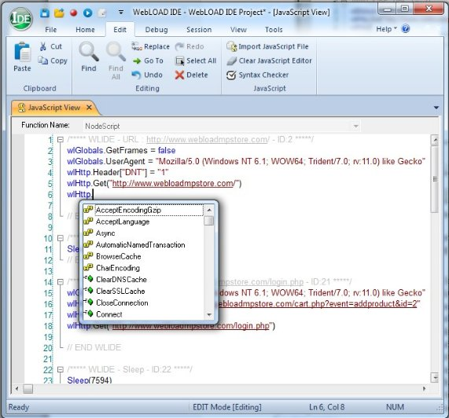
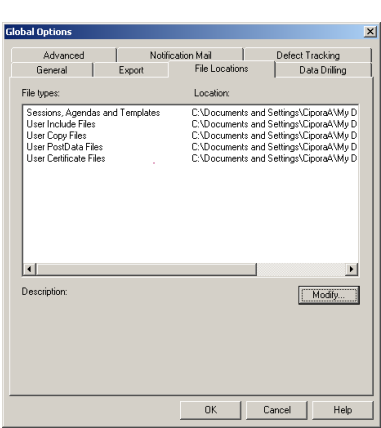
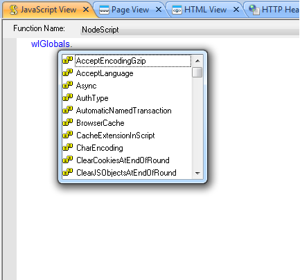

# Programming your JavaScript script

WebLOAD functions on many different levels. WebLOAD Recorder provides a wide range of testing tools and features, ranging from basic tools that are available through a simple graphic user interface, to features that require only a small amount of script ‘tweaking’, to complex functionality that assumes a sophisticated understanding of programming techniques. Beginning users may take advantage of the basic WebLOAD Recorder tool set without ever understanding exactly how these features are implemented. Most WebLOAD testing features and configuration settings are handled automatically by WebLOAD and never require any manual intervention. These GUI- only features are described in the *WebLOAD Recorder User Guide*.


## Understanding JavaScript scripts

This chapter focuses on the options available to users who wish to customize their recorded scripts and are comfortable looking at, and possibly giving a small ‘tweak’ to the JavaScript code within script files. Major programming skills are not required for the tools in this chapter. A basic understanding of programming logic, an introduction to the internals of script files, and careful reading of the examples provided are enough to get started using the tools documented here.

> **Note:** The topics presented in this chapter include fragments of JavaScript script code. To view the JavaScript code of a script, select JavaScript View from the toolbar or drop- down View menu. This opens a JavaScript View pane that automatically displays the JavaScript code corresponding to any item highlighted in the Script Tree.

The WebLOAD Recorder tools described in the rest of this manual involve some degree of intervention within the JavaScript code of a script. Users will have an easier time working with these tools if they have a basic understanding of JavaScript scripts. This chapter therefore begins with a description of the components, structure, and grammar of JavaScript scripts.

### What are JavaScript scripts?
WebLOAD tests applications by running JavaScript scripts that simulate the actions of real users. You don’t have to be familiar with the JavaScript language to work with


WebLOAD and WebLOAD Recorder, and test applications. JavaScript scripts are recorded through WebLOAD Recorder. As you execute a typical sequence of activities, WebLOAD Recorder records the HTTP protocol level traffic that is generated by the Web browser according to your accesses. By the conclusion of your recording session, a complete JavaScript script file is created.

The basic ‘Building Blocks’ of a recording session are HTTP requests, which are triggered by user actions. Each time a user navigates to a new URL or submits a form, the browser emits an HTTP method and the resulting HTTP request is recorded.

Externally, user activities (at the protocol level) are represented on the WebLOAD Recorder desktop by a set of clear, intuitive icons and visual devices arranged in a visual Script Tree. Internally, WebLOAD Recorder automatically creates JavaScript scripts that act as scripts, recreating the HTTP traffic created by the actions of the original user during later test sessions.

Most users begin application testing by simply recording and then running a series of basic scripts, without ever looking into a script’s internal Building Blocks to see the actual JavaScript code inside. As their understanding of the WebLOAD Recorder tool set grows, many users decide to expand or tailor their original set of scripts to meet a particular testing need, adding customized features that sometimes require some editing of the JavaScript code within the script itself. WebLOAD Recorder offers a wide range of features and options, for users who wish to add more functionality to their scripts, rather than simply replaying the same set of HTTP methods exactly as originally recorded. Many of these tools are available through the WebLOAD Recorder GUI and do not require any additional programming skills. These tools are documented in the *WebLOAD Recorder User Guide*. The more complex tools that require some familiarity with JavaScript programming are described in the remaining chapters of this guide, with detailed syntax specifications provided in the *WebLOAD JavaScript Reference Guide*.

Test session scripts are written in JavaScript. JavaScript is an object-oriented scripting language originally developed by Netscape Communications Corporation and is currently maintained by the Mozilla Foundation. JavaScript is best known for its use in conjunction with HTML to automate World Wide Web pages. However, JavaScript is actually a full-featured programming language that can be used for many purposes besides Web automation. WebLOAD and WebLOAD Recorder have chosen JavaScript as the scripting language for test session scripts. WebLOAD Recorder JavaScript scripts combine the ease and simplicity of WebLOAD’s visual, intuitive programming environment with the flexibility and power of JavaScript object-oriented programming.


### Script Tree Structure

#### Script Tree Nodes

JavaScript scripts are represented on the WebLOAD Recorder desktop by a script Tree. Each item that appears in the Script Tree is a script node. As you work in your application during a recording session, WebLOAD Recorder adds nodes to the Script Tree. Each node in the Script Tree represents a single user action at the HTTP protocol level, such as submitting a form or navigating to a new URL. Script Tree nodes provide an intuitive, graphic representation of the underlying JavaScript code that actually implements the user activities to be recreated at run time.

The following figure illustrates a typical Script Tree fragment:


Script Tree nodes are arranged sequentially. The sequential arrangement of icons in the Script Tree means that icons appear in the Script Tree in the order in which the user actions and HTTP methods occurred when originally recorded. URL nodes in a script Tree will appear in the order in which the browser requested each Web page over the course of a recording session. In cases where the browser emits asynchronous requests (for example, while using AJAX), the requests are recorded and appear in the Script Tree in the order that the browser emitted them.


> **Note:** WebLOAD Recorder offers users a wide range of tools and features that can add very powerful functionality to a testing script. While users are certainly encouraged to incorporate these tools in their Script Tree, users must also be careful when editing URL nodes in the Script Tree. Because the order of HTTP activities within a script is so significant, changing the sequence of URLs in the Script Tree in effect means changing the sequence of activities, and may destroy the functionality of the script.
>

### script Program Structure
After a user has finished recording a typical session with the system under test, WebLOAD Recorder saves a complete record of all user activities at the protocol level and converts the user activity information to a JavaScript script. This script can be run repeatedly, with a variety of testing configurations, until the user is satisfied that the system has been thoroughly tested. The script created by the WebLOAD Recorder JavaScript interpreter has the following underlying structure.

#### Main Script

The main script contains JavaScript code representing the user activities at the protocol level to be simulated during a test session. The main script is required. Without it, WebLOAD and WebLOAD Recorder cannot run a test.

The main script is constructed and based on an exact recording of the specific sequence of user activities, such as the following, which are completed during a recording session:

- Web page navigations
- Form submissions
- User think time (sleep)

In addition to the original recording session activities, users may also add other features to the script, such as messages or pause and sleep times. These features are usually added through WebLOAD Recorder. WebLOAD executes the main script repeatedly, presenting the results in a series of analysis reports produced at the end of testing sessions.

#### Initialization and Termination Functions

These are JavaScript functions that WebLOAD or WebLOAD Recorder executes once, in a fixed sequence, before or after the main script. These functions are used to prepare for or clean up from a testing session. The following functions are automatically included in the script when needed:

- `InitAgenda()`— Initialize global objects shared by all WebLOAD Recorder clients that run the script.
- `InitClient()`— Initialize local objects and variables for individual clients.
- `TerminateClient()`— Free resources of individual clients.
- `TerminateAgenda()`— Free global resources shared by all clients running the script.
- `OnScriptAbort()`— Executes user-defined code to free resources whenever the script stops the execution of a round (ErrorMessage), a session (SevereErrorMessage), or in the event of an error. In addition, OnScriptAbort() is called in the Console whenever the script stops abruptly. This occurs when the end of a scheduled session is in the middle of a round, or when a user manually stops the session.
- `OnErrorTerminateClient()`— Clean up and free resources after a runtime error (per client).
- `OnErrorTerminateAgenda()`— Clean up and free resources after a runtime error (per script).

The initialization and termination functions are not part of the WebLOAD performance test. WebLOAD does not include the operations of these functions in the performance statistics.

Use the initialization and termination functions to create or free objects or to set global variables. Besides these tasks, the functions may contain other JavaScript statements and may call other functions in your script. The termination functions are used both when a test session finishes successfully, and when it is terminated early by an error.

Initialization and termination functions may be added directly to the code in a script through the IntelliSense Editor, as described [*Editing the JavaScript Code*](#editing-the-javascript-code-in-a-script).

**To bring up a list of available functions:**

- While working in Java Editing mode, select the node in the Script Tree to which you want to add a function, right-click the JavaScript pane, and select **Insert** > **General** > **Init/Terminate Functions** from the pop-up menu.


WebLOAD Recorder automatically inserts the correct code for the selected function into the script file. You may then add any other necessary commands to the functions without any concerns about mistakes in the function syntax.

<a name = "function_insertion"></a>


#### Navigation Functions

When a URL node is selected in the Script Tree, the corresponding script code that appears in the JavaScript View pane will usually include basic navigation and validation functions such as `wlHTTP.Get()` and `wlHTTP.Post()`. The `wlHTTP.Get()` and `wlHTTP.Post()` methods store the HTML from the navigated page in the document.wlSource property. The code is refreshed when the script calls `wlHTTP.Get()` or `wlHTTP.Post()` again. The stored code includes any scripts or other data embedded in the HTML, which the script can retrieve and interpret in any desired way.

These functions are almost always visible at the start of the JavaScript code for every URL node in the Script Tree. While additional Tree nodes add their own additional corresponding JavaScript code to the script, these functions form the basis for all test session scripts.


### script Execution Sequence

#### Basic Execution Sequence

WebLOAD executes JavaScript scripts in a simple, fixed sequence. The normal sequence is as follows.

1. The optional InitAgenda() initialization function runs once for each Load Generator, initializing the global WebLOAD objects, or any other global data or resources, that are shared by all clients in a Load Generator process.

1. The script splits into a separate thread for each client. Load Generator processes may include any number of Virtual Clients, all running the same script. After WebLOAD runs `InitAgenda()`, it runs each client in a separate thread. Each thread can have its own local variables and objects. In essence, each client runs an independent instance or copy of the script.

    For example, suppose you want each WebLOAD client to connect to a different Web page. You can use a local object within each thread to store the Web address and perform the HTTP connection. Because the object is local, there is no confusion between the addresses. Each thread connects to the appropriate address, without any effect on the other threads of the same script.

1. The optional `InitClient()` initialization function runs once for each thread, initializing local WebLOAD objects, or any other variables or resources, which belong to an individual thread of the script. In this way, each thread of a script can work with different data and can operate independently of the other threads.

1. The main script runs repeatedly in a separate loop for each thread. When WebLOAD reaches the end of the main script, it starts again at the beginning. The main script continues to iterate until you stop the WebLOAD test. You can stop the test by issuing a Stop command in the WebLOAD Console, or you can tell the Console to stop the test automatically after a predefined time.

    WebLOAD collects performance statistics while the main script runs. The various statistics that WebLOAD displays (round time, average round time, etc.) apply only to the main script, not to operations in the initialization and termination functions.

1. The optional `TerminateClient()` termination function runs once for each thread. Strictly speaking, most scripts do not need a `TerminateClient()` function, because JavaScript automatically frees objects and releases most resources when the script terminates. In a complex script, however, it is good programming practice to free local objects and resources explicitly using `TerminateClient().`

1. The separate threads for each client terminate.

1. The optional `TerminateAgenda()` termination function runs once for each Load Generator process. Most simple scripts do not need a `TerminateAgenda()` function. In a complex script, including `TerminateAgenda()` is recommended to free global resources.

1. The `OnScriptAbort()`, `OnErrorTerminateClient()`, and `OnErrorTerminateAgenda()` functions clean up and free resources after a runtime error. For more information about handling errors during a test session, see [*Error Management* ](#error-management).

The following figure illustrates the steps in a normal script execution sequence:


#### EvaluateScript Function

The EvaluateScript() function is used to define JavaScript code to be executed at specific points during the execution of the script. The function allows testers to include scripts from an external library and specify the point during script execution at which the script should be executed. You can specify to execute the script at any of the following points within the script:

- WLBeforeInitClient
- WLAfterInitAgenda
- WLBeforeThreadActivation
- WLOnThreadActivation
- WLAfterTerminateClient
- WLBeforeRound
- WLAfterTerminateAgenda
- WLAfterRound

If the script run is successful, the value from the last executed expression statement processed in the script is saved and then parsed when the engine reaches the relevant point. The saved value includes the following information:

- The text of the script.
- The size of the script text, in bytes.
- The name of the file or URL containing the script text. 

If the script run is unsuccessful, the value is left undefined.

The following example is used to call a function that is defined in an external file:

`IncludeFile(filename.js)`

`EvaluateScript(“MyFunction()”,WLAfterRound)`

In this example, the `EvaluateScript` string is parsed, executed, and instructs the JavaScript engine to call the `MyFunction()` function right after each round is completed. At this point WebLOAD returns any syntax or runtime errors.

For more information on the EvaluateScript function, see the [*WebLOAD’s JavaScript Reference Guide*](../javascript/using_javascript_ref.md).

#### Cleanup at the End of Each Round

The main script retains its variables and objects from one round (iteration) to the next. For example, you can increment a variable in each round, or you can store data in an object in one round and access the data in the next.

There are three exceptions to this rule. At the end of each round:

- Any cookies that the script sets are deleted.
- The SSL Cache is cleared.
- Any open HTTP connections are closed.

#### Execution Sequence for Scheduled Clients

WebLOAD lets you schedule the number of clients running a single script in a single Load Generator. WebLOAD runs the initialization and termination functions of the script according to your schedule.

For example, suppose you configure a Load Generator to run a script according to the following schedule:

|**Number of Threads**|**Scheduled Time**|
| :- | :- |
|50 threads|For the first 30 minutes.|
|20 threads|From 30 to 60 minutes.|
|100 threads|For the remainder of the test.|


In this case:

- WebLOAD runs the `InitAgenda()` function when the Load Generator starts to run. WebLOAD then starts the first 50 threads, running `InitClient()` and the main script for each thread.

- After 30 minutes, 30 of the threads stop. WebLOAD runs `TerminateClient()` for these 30 threads. The main script of the other 20 threads continues running.

- At 60 minutes, 80 additional threads start. For each of these 80 threads, WebLOAD runs `InitClient()` and the main script.

- At the end of the test, WebLOAD runs `TerminateClient()` for each of the 100 threads currently running, and then runs `TerminateAgenda()`.

#### Execution Sequence for Mixed Clients

You can configure a single Load Generator to run more than one script. In that case, WebLOAD splits the time on each thread between the scripts. WebLOAD runs the initialization and termination functions of each script at the beginning and end of the threads, respectively. It does not run the functions each time the threads switch between scripts.

For example, suppose you configure a Load Generator to run 100 threads as follows:

|**Percentage of time**|**Selected script**|
| :- | :- |
|50% of the time|agenda1. wlp|
|50% of the time|agenda2. wlp|


In this case, WebLOAD runs:

- The `InitAgenda()` functions of both scripts when the Load Generator starts.

- The `InitClient()` functions of both scripts in each thread when the thread starts.
- The `TerminateClient()` functions of both scripts, in each thread at the end of the test.
- The `TerminateAgenda()` functions of both scripts when all the threads have stopped.


### Editing the JavaScript Code in a script
WebLOAD is a fully automated testing tool. WebLOAD users are able to record scripts, add testing tools, run test sessions, and analyze the results, without any programming skills whatsoever. Nevertheless, there are users who wish to manually edit the JavaScript code of a recorded script to add functionality to test session scripts created with WebLOAD Recorder, creating more complex, sophisticated test sessions.

For example, many users design test sessions around a set of basic scripts created through WebLOAD Recorder and then expand or tailor those scripts to meet a particular testing need. Some of the reasons for editing JavaScript scripts include:

- Recycling and updating a useful library of test scripts from earlier versions of WebLOAD.
- Testing websites that work with Java or COM components.
- Creating advanced, specialized verification functions.
- Adding global variables and messages.
- Debugging the system under test.
- Optimization capabilities, to maximize your application’s functionality at minimal cost.

This section describes the tools provided by WebLOAD Recorder to help you access and edit the JavaScript code within your script.


#### Accessing the JavaScript Code within the Script Tree

WebLOAD Recorder provides a complete graphic user interface for creating and editing script files. Additions or changes to a script are usually made through the WebLOAD Recorder GUI, working with intuitive icons representing user actions in a graphic Script Tree. For greater clarity, the JavaScript code that corresponds to each user action in a script is also visible in the JavaScript View pane on the WebLOAD Recorder desktop.

While most people never really work with the JavaScript code within their script, some users do wish to manually edit the JavaScript code underlying their Script Tree. For example, some test sessions may involve advanced WebLOAD testing features that cannot be completely implemented though the GUI, such as Java or XML objects. Editing the JavaScript code in a script does not necessarily mean editing a huge JavaScript file. Most of the time users only wish to add or edit a specific feature or a small section of the code. WebLOAD Recorder provides access to the JavaScript code in a script through JavaScript Object nodes, which are seen on the following levels:

- **JavaScript Object nodes**—individual nodes in the Script Tree. Empty JavaScript Object nodes may be dragged from the WebLOAD Recorder toolbar and dropped onto the Script Tree at any point selected by the user, as described in [*Adding JavaScript Object Nodes* ](#adding-javascript-object-nodes). Use the IntelliSense Editor, described in [*Using the IntelliSense JavaScript Editor* ](#using-the-intellisense-javascript-editor), to add lines of code or functions to the JavaScript Object.
- **Imported JavaScript File**—an external JavaScript file that should be incorporated within the body of the current script.
   - While working in JavaScript Editing mode, right-click the JavaScript pane and select **Import JavaScript File** from the WebLOAD Recorder menu.

    Often, testers work with a library of pre-existing library files from which they may choose functions that are relevant to the current test session. This modular approach to programming simplifies and speeds up the testing process, and is fully supported and endorsed by WebLOAD.

#### Using the IntelliSense JavaScript Editor

For those users who wish to manually edit their scripts, WebLOAD Recorder provides three levels of programming assistance:

- An IntelliSense Editor mode for the JavaScript View pane.

    Add new lines of code to your script or edit existing JavaScript functions through the IntelliSense Editor mode of the JavaScript View pane. The IntelliSense Editor helps programmers write the JavaScript code for a new function by formatting new code and prompting with suggestions and descriptions of appropriate code choices and syntax as programs are being written. For example, in the following figure the IntelliSense Editor displays a drop-down list of available properties and objects for the wlHttp object being added to the program, with a pop-up box describing the highlighted method in the list.





- A selection of the most commonly used programming constructs, can be accessed by right-clicking in the JavaScript Editing Pane, and selecting **Insert > Java Objects** from the pop-up menu.

    Users who choose to program their own JavaScript Object code within their script may take advantage of the WebLOAD Recorder GUI to simplify their programming efforts. Manually typing out the code for each command, risks making a mistake, even a trivial typo, and adding invalid code to the script file.

    Instead, users may bring up a list of available commands and functions for a specific item, by right-clicking in the JavaScript Editing Pane after selecting a specific node from the Script Tree, selecting **Insert** from the pop-up menu, and selecting an item illustrated in the following figure to display the item’s available commands. WebLOAD Recorder automatically inserts the correct code for the selected item into the JavaScript Object currently being edited. The user may then change specific parameter values without any worries about accidental mistakes in the function syntax.


   


 In addition to the Insert menu, you may select an item from the Insert Variable menu, to add system and user-defined parameters to the script. This eliminates the need for manual coding.

 <a name ="insert_variable_menu"></a>


- A Syntax Checker that checks the syntax of the code in your script file and catches simple syntax errors before you spend any time running a test session. Select **Tools**> **CheckSyntax** while standing in the JavaScript View pane of the WebLOAD Recorder desktop to check the syntax of the code in your script file.


Script code that you wish to write or edit must be part of a JavaScript Object in the Script Tree. Adding or converting JavaScript Objects in a script Tree is described in [*Accessing the JavaScript Code within the](#accessing-the-javascript-code-within-the-script-tree).

> **Notes:** If you do decide to edit the JavaScript code in a script, be careful not to damage the script structure by changing the sequence or integrity of the script navigation blocks. A test session script is constructed and based on a specific sequence of user activities at the protocol level, such as URL navigations, form submissions, and others. Changing the sequence of code blocks in effect means changing the sequence of user activities, and may destroy the functionality of the test session script. In addition, you should be careful not to change the automatically generated WebLOAD Recorder comments, since necessary information for running the script may become lost.

If you use an external text editor to modify the JavaScript code in a JavaScript script that was created through WebLOAD Recorder, the changes you made through the external editor will be lost if you open the script in WebLOAD Recorder again.

Therefore, be sure to do all JavaScript code editing through the IntelliSense Editor in WebLOAD Recorder only.

For detailed information about the JavaScript language, please refer to the *WebLOAD JavaScript Reference Guide*. This guide is supplied in Adobe Acrobat format with the WebLOAD software. You may also learn the elements of JavaScript programming from many books on Web publishing. Keep in mind that some specific JavaScript objects relating to Web publishing do not exist in the WebLOAD test environment.

## Adding JavaScript Object Nodes

WebLOAD Recorder stores user activities at the protocol level as they are completed during recording sessions. These activities are later recreated during subsequent testing sessions. However, the system being tested may also involve user activities that are significant to the system testers, yet cannot be entirely recorded through WebLOAD Recorder. Or testers may wish to add additional functionality to their tests that require inserting extra JavaScript functions into the body of their script code.

WebLOAD Recorder therefore provides a mechanism for including such items within a test session script.

For example, some of the steps involved in access to an external database are executed outside the control of WebLOAD Recorder and therefore cannot be completely recorded through WebLOAD Recorder alone. Users may add these activities to a test script by adding empty JavaScript Object Nodes to the Script Tree and then filling in the code to complete the desired activity. The specific code needed within the JavaScript Object Node will obviously vary from Node to Node depending on the activity, but adding the generic JavaScript Object Nodes themselves is a standard WebLOAD Recorder feature.


**To add JavaScript Object Nodes to your test script directly through the WebLOAD Recorder GUI:**

- Drag the **JavaScript Object** icon from the toolbox and drop it into the Script Tree at the preferred spot, as described in the *WebLOAD Recorder User Guide*.

  The following figure illustrates a typical JavaScript Object Node highlighted in the Script Tree.


The specific code needed within the JavaScript Object Node will obviously vary from Node to Node depending on the activity. Some of the activities that may require manual programming within a JavaScript Object Node include:

- Getting data from a database.
- Working with COM, XML, or Java objects.
- Calculating expressions.
- Working with global variables such as a user-defined value to include in messages.
- Working with other protocols.
- Doing specific custom made verifications.

JavaScript syntax specifications for some of these activities are documented in the *WebLOAD JavaScript Reference Guide*.


**To add or edit lines of code in a JavaScript Object:**

- Click the **JavaScript Object node** in the Script Tree.

   The JavaScript object’s code appears in the JavaScript View pane. You can edit the code directly in the JavaScript view or by selecting **Edit** > **Start Java Script Editing** which opens the full JavaScript view screen. This helps programmers write the JavaScript code for a new function by formatting new code and prompting with suggestions and descriptions of appropriate code choices and syntax as programs are written, as described in [*Using the IntelliSense JavaScript Editor* ](#using-the-intellisense-javascript-editor).


## File Management

JavaScript scripts work with many different types of files. Users may wish to add to their scripts programming elements that include the following file types:

- [*Including Files* ](#including-files)
- [*Copying Files* ](#copying-files)
- [*Output Files* ](#output-files)

### Including Files
WebLOAD Recorder allows you to include external files within your JavaScript program. This facilitates modular programming, where you may develop different recyclable modules of JavaScript source code to be reused by different test scripts. Rather than inserting the complete original source code text over and over again into the body of each script, use the `IncludeFile()` command to make all functions defined within the included file available to all including scripts.

#### Adding an IncludeFile() Function

`IncludeFile()` functions can be added directly to a JavaScript Object in a script through the IntelliSense Editor, as described in [Editing the JavaScript Code](#editing-the-javascript-code-in-a-script).

**To insert an IncludeFile function:**

- While working in JavaScript Editing mode, right-click the JavaScript Pane and select **Insert** > **JavaScript** > **Copy/Include Files** from the pop-up menu that appears. Select the `IncludeFile()` function from the sub-menu.


WebLOAD Recorder automatically inserts the correct code for the selected function into the script file. The user may then edit parameter values without any worries about mistakes in the function syntax.

<a name = "includefile_function_insertion"></a>


For example, to include the external file MyFunction.js, located on the Console during WebLOAD testing, your script file should begin with the following command included in a JavaScript Object node:

```javascript
function InitAgenda() {

...

IncludeFile(“MyFunction.js”)

}
```

See the *WebLOAD JavaScript Reference Guide* for a complete syntax specification.


#### Determining the Included File Location

WebLOAD assumes that the source file is located in the default directory specified in the File Locations tab in the **Tools > Global Options** dialog box in the WebLOAD Console desktop, illustrated in the following figure:


Included files by default should be in the User Include Files directory specified in the File Locations dialog box. You may reset the default directory location if necessary by selecting the User Include Files entry and clicking **Modify**. You can select a new file location from the pop-up Browse for Folder dialog box and click **OK**. In general, the system searches for the included file using the following search precedence:

- The load engine first looks for the included file in the default User Include Files directory. If the file is not there, the file request is handed over to WebLOAD, which searches for the file using the following search path order:
    1. If a full path name has been hardcoded into the IncludeFile command, the system searches the specified location. If the file is not found in an explicitly coded directory, the system returns an error code of File Not Found and will not search in any other locations.
  
       > **Note:** It is not recommended to hardcode a full path name, since the script will then not be portable between different systems. This is especially important for networks that use both UNIX and Windows systems.
  
    1. Assuming no hardcoded full path name in the script code, the system looks for the file in the default User Include Files directory.
  
    1. If the file is not found, the system looks for the file in the current working directory, the directory from which WebLOAD or WebLOAD Recorder was originally executed.
  
    1. Finally, if the file is still not found, the system searches for the file sequentially through all the directories listed in the File Locations tab.


#### Example: Working with an Included Function

Included files are files whose functions and other contents are included and accessible from the current script file without the file text actually appearing within the script.

Use included files to take advantage of an external library of modular functions without adding extra lines of code to your script, improving the clarity of your script code while saving both script space and development time. For example, in the following script fragment, the external file `myjs.js` is included within the `InitAgenda()` initialization function. One of the functions within that included file, `sayHello()`, is later accessed within the main body of the script. The text of the `sayHello()` is embedded in a nearby comment for easy reference.

```javascript
function InitAgenda()

{

IncludeFile("C:\\Documents and Settings\\uriw\\My Documents\\myjs.js")

}

wlGlobals.GetFrames = false

[wlHttp.Get("http://www.webloadmpstore.com/general_sample/include](http://www.webloadmpstore.com/general_sample/include)

/form.php") Sleep(4765)

wlHttp.Header["Referer"] = ["http://qa50/form.php"](http://qa50/form.php) wlHttp.ContentType = "application/x-www-form-urlencoded" wlHttp.FormData["item"] = "Brushes" wlHttp.FormData["quantity"] = "55"

var item = wlHttp.FormData["quantity"]

[wlHttp.Post("http://www.webloadmpstore.com/general_sample/includ](http://www.webloadmpstore.com/general_sample/includ) e/process.php")

// here the outside function is being called sayHello()


<a name ="" ></a>
The myjs.js file contains the following sayHello() function, which prints the checkout message to the customer:

function sayHello()

{

InfoMessage("you ordered	" +item + " items")

}
```


### Copying Files
WebLOAD enables text and binary data file copying from the Console to a Load Generator automatically during a test session. This is an important feature if your test uses a script that references auxiliary files, such as I/O files, that are found only on the Console. The WebLOAD send option in the Console only sends the script itself and will not send auxiliary files together with a script file to a Load Generator. Use the CopyFile command instead to copy any necessary files from a source file on the Console to a destination file on the Load Generator before the main body of the script is executed.

#### Adding a CopyFile() Function

`CopyFile()` functions can be added directly to a JavaScript Object in a script through the IntelliSense Editor, as described in [*Editing the JavaScript Code in Script*](#editing-the-javascript-code-in-a-script).

**To insert a CopyFile function:**

- While working in JavaScript Editing mode, right-click the JavaScript Pane and select **Insert** > **Copy/Include Files** from the pop-up menu that appears.

   Select the preferred CopyFile() function from the sub-menu (see [Figure](#includefile_function_insertion)).

WebLOAD Recorder automatically inserts the correct code for the selected function into the script file. The user may then edit parameter values without any worries about mistakes in the function syntax.

For example, to copy the auxiliary file `src.txt`, located on the Console, to the destination file `dest.txt` on the current Load Generator, your script file should include the following command:

```javascript
function InitAgenda() {

...

CopyFile(“src.txt”, “dest.txt”)

...

}
```

You may then access the file as usual in the main body of the script. For example:

`DataArr = GetLine(“dest.txt”)`

See the *JavaScript Reference Guide* for a complete syntax specification.

#### Determining the Copied File Location

WebLOAD assumes that the source file is located on the Console in the default directory identified in the **File Locations** tab of the **Tools > Global Options** dialog box in the Console desktop, illustrated in the following figure:




Files to be copied by default should be in the User Copy Files directory specified in the File Locations dialog box. You may reset the default directory location if necessary by selecting the User Copy Files entry and clicking **Modify**. You can select a new file location from the pop-up Browse for Folder dialog box and click **OK**. Remember that WebLOAD does not create new directories, so any directories specified as source or target directories must already exist. In general, the system searches for the file using the following search precedence:

- The load engine first looks for the file to be copied in the default User Copy Files directory. If the file is not there, the file request is handed over to WebLOAD, which searches for the file using the following search path order:

    1. If a full path name has been hardcoded into the CopyFile command, the system searches the specified location. If the file is not found in an explicitly coded directory, the system returns an error code of File Not Found and will not search in any other locations.

        > **Note:** It is not recommended to hardcode a full path name, since the script will then not be portable between different systems. This is especially important for networks that use both UNIX and Windows systems.

   

    1. Assuming no hardcoded full path name in the script code, the system looks for the file in the current working directory, the directory from which WebLOAD was originally executed.

    1. Finally, if the file is still not found, the system searches for the file sequentially through all the directories listed in the File Locations tab.

### Output Files

#### Writing script Output Messages to a File

Realistic testing requires multiple testing passes using a variety of realistic scenarios. The resulting output data should be stored in output files for later access, verification, study, and analysis. WebLOAD Recorder provides the `wlOutputFile` object to simplify saving script output. See the *WebLOAD JavaScript Reference Guide* for a complete syntax specification. This section will provide a brief introduction to the `wlOutputFile` object.

The `wlOutputFile` object lets you write script output messages to an output file. Declaring a new `wlOutputFile` object creates a new, empty output file. If a file of that name already exists, the file will be completely overwritten. Information will not be appended to the end of an existing file. Be sure to choose a unique filename for the new output file if you do not want to overwrite previous script data.

##### Adding the wlOutputFile Object

The `wlOutputFile` object can be added directly to a JavaScript Object in a script through the [IntelliSense Editor](#using-the-intellisense-javascript-editor). Users who are programming their own JavaScript Object code within their script may take advantage of the WebLOAD Recorder GUI to simplify their programming efforts. Manually typing out the code to create a `wlOutputFile` object, risks making a mistake, and adding invalid code to the script file. Instead, users may bring up a list of available constructor and methods for the `wlOutputFile` object, by right-clicking in the JavaScript Editing Pane, selecting **Insert > General** from the pop-up menu, and selecting one of the available items. WebLOAD Recorder automatically inserts the correct code for the selected command into the JavaScript Object currently being edited. The user may then change the parameters without any worries about mistakes in the object syntax.


The preceding figure highlights the standard JavaScript syntax to create and work with `wlOutputFile` objects.

 For example:

`MyFileObj = new wlOutputFile(“filename”)`

`...`

`MyFileObj.Write(“Happy Birthday”)`

`...`

`delete MyFileObj`

> **Note:** The `wlOutputFile` object saves script output messages. To save server response data, use the Outfile property described in [*Saving Server Output to a File* ](#saving-server-output-to-a-file).


##### wlOutputFile Object Scope Limitations

If you declare a new `wlOutputFile` object in the `InitAgenda()` function of a script, the output file will be shared by all the script threads. There is no way to specify a specific thread writing sequence—each thread will write to the output file in real time as it reaches that line in the script execution.

If you declare a new `wlOutputFile` object in the `InitClient()` function or main body of a script, use the thread number variable as part of the new filename to be sure that each thread will create a unique output file.

If you declare a new `wlOutputFile` object in the main body of a script, and then run your script for multiple iterations, use the RoundNum variable as part of the new filename to be sure that each new round will create a unique output file.

Generally, you should only create new `wlOutputFile` objects in the `InitAgenda() `or `InitClient()` functions of a script, not in the main script. If a statement in the main script creates an object, *a new object is created each time the statement is executed*. If WebLOAD repeats the main script many times, a large number of objects may be created and the system may run out of memory.

#### Saving Server Output to a File

It is often important to save server response data for later study and analysis. WebLOAD and WebLOAD Recorder provide the `Outfile` property for this purpose. Outfile is a property of the `wlGlobals`, `wlLocals`, and `wlHttp` objects. See the *WebLOAD JavaScript Reference Guide*, for a complete syntax specification.

The following script shows a typical entry to a server output file. The `ClientNum` and `RoundNum` global variables are used to distinguish between script instances in the server output file entries.

```javascript
// Main script actions go here

...

// Write the downloaded server output to a unique file

// for each script instance, identified by ClientNum

// and RoundNum. The output file is named

// <fullpath>\SessionOutput.<ClientNum.RoundNum>.html wlHttp.Outfile = "c:\\webld\\SessionOutput." ClientNum + "." + RoundNum + ".html"
```

The `Outfile` property can be added directly to a JavaScript Object in a script through the IntelliSense Editor.


## Security

Security is important for most Web users, whether the access is recreational, personal, or work related. Most Web applications work with some combination of user authentication together with SSL protocol use to ensure application security. Both these security features are handled automatically by WebLOAD. By default, test sessions use the settings that were in effect during the original recording session.

Specific security settings may be reset through the WebLOAD Recorder or Console GUI dialog boxes.

Security methods and properties can be edited directly within a JavaScript Object in a script through the [IntelliSense Editor](#using-the-intellisense-javascript-editor). This section provides a general introduction to the internal implementation of the user authentication and SSL security features. See the *WebLOAD JavaScript Reference Guide*, for a complete syntax specification of the security functions introduced here.

### Authentication
Users are authenticated through a system of usernames and passwords. Most servers use either a basic user authentication protocol or the Windows NT Challenge Response protocol. WebLOAD supports both protocols, as well as proxy servers that require user authorization. WebLOAD automatically selects the authentication protocol appropriate for the current test session. By default, WebLOAD navigates authorization protocols using the user data saved during the original recording session, but these values may be reset as needed.

For example, many Web applications involve logging in to a site. The original user name and password typed in during a recording session are saved for use during later test sessions.

Testers may reset user authentication values in one of the following ways:

- Through the Authentication tab.
- By manually editing the authentication property set. These options are described here.

#### Using the Authentication Tab

Access the Authentication tab by selecting the **Tools > Default Options** menu in the WebLOAD Recorder or Console. Select the Authentication tab in the dialog box that opens. You can simply type the relevant values into the input text fields, as illustrated in the following figure.

> **Note:** Passwords will not appear in readable form.


#### Setting User Authentication Values Manually

If you are editing the JavaScript code in your script, you may reset user authentication values manually using the wlGlobals, wlLocals, or wlHTTP property set.

There are three approaches to setting these properties, corresponding to the desired authentication scope:

- Set the authentication properties that correspond to the Authentication tab at the script level using wlGlobals.
- Set the authentication properties for a specific HTTP request using wlHTTP.
- Set the authentication properties that correspond to the Authentication tab at the Virtual Client level using wlLocals.

For example, set the user name and password using either of the following approaches:

```
wlGlobals.UserName = "Bill" 
wlGlobals.PassWord` = "TopSecret"
```


The authentication related properties include the following:

- NTUserName, NTPassWord
- PassWord
- Proxy, ProxyUserName, ProxyPassWord
- SSLClientCertificateFile, SSLClientCertificatePassWord
- UserName

See the *WebLOAD JavaScript Reference Guide*, for a complete syntax specification of the properties used for user authentication.

### Secure Data Transmission through SSL
Web and HTTP communications require a practical, reliable, universally recognized protocol to ensure the secrecy, integrity, and authentication of transmitted information. The Internet Engineering Task Force (IETF) has developed such a standard, commonly referred to as SSL/TLS 1.0.

For a basic introduction to SSL, see:

[http://www.cisco.com/en/US/netsol/ns340/ns394/ns50/ns140/networking_solutions_wh](http://www.cisco.com/en/US/netsol/ns340/ns394/ns50/ns140/networking_solutions_white_paper09186a0080136858.shtml) [ite_paper09186a0080136858.shtml](http://www.cisco.com/en/US/netsol/ns340/ns394/ns50/ns140/networking_solutions_white_paper09186a0080136858.shtml)

For more information on the new TLS Protocol Version 1.0, see: <http://www.ipa.go.jp/security/rfc/RFC2246-00EN.html>

WebLOAD fully supports the SSL/TLS 1.0 standard, including backward compatibility with earlier versions and standards. See *Appendix A* in the *WebLOAD JavaScript Reference Guide*, for a complete list of the supported SSL protocols and ciphers.

By default, WebLOAD enables use of all cipher versions at the maximum cryptographic strength possible, allowing participating clients and servers to determine the most appropriate connection to other clients and servers through negotiation at connect time. These setting may be changed or reset through dialog boxes on the Console.


For example, reset the SSL bit limit through the SSL tab of the **Tools > Default Options** dialog box on the WebLOAD Console, illustrated in the following figure:


By default, WebLOAD handles all SSL activities, setting the appropriate configuration settings automatically. WebLOAD also provides both Cipher Command Suite functions and a complete set of SSL wlGlobals properties that allow users to fine- tune their security settings within the script code, identifying, enabling, or disabling specific protocols or cryptography levels, depending on testing preferences.

> **Note:** Changes that are made within script code override anything that has been set through the Console.

These properties and functions work on two levels:

- Higher level functions used for browser emulation.
- Lower level functions for client- or server-specific cipher testing.

See the *WebLOAD JavaScript Reference Guide* for complete syntax specifications for the wlGlobals SSL property set and the Cipher Command Suite.

> **Note:** The SSL configuration for your test session is usually set through dialog boxes in the Console. You may change the default session settings within your script, using either the `wlGlobals` properties or the Cipher Command Suite functions. While the SSL property set is also defined for the wlHttp and `wlLocals` objects, RadView strongly recommends using these properties with the `wlGlobals` object *only*.

Any changes to a script’s SSL property configuration must be made in the script’s initialization functions. Configuration changes made in the `InitAgenda()` function will affect all client threads spawned during that script’s test session. Configuration changes made in the `InitClient()` function will affect only individual clients. Do not make changes to the SSL property configuration in a script’s main body. The results will be undefined for all subsequent transactions.


#### Browser Emulation

The browser emulation functions emphasize a high-level, categorical approach to cryptographic strength definition. For example, you may wish to test access to foreign browsers who use only earlier versions of SSL, or who are limited to export-only cryptographic strength. This ‘smarter’ approach of selecting appropriate categories is usually preferable to the low-level approach of enabling or disabling individual protocols.

Browser emulation functionality includes the ability to:

- Enable, disable, and list SSL protocols.
- Define the cryptographic categories to be used in the current test session.
- Limit the strength and complexity of the cipher set in current use by limiting the number of bits used by the cipher.
- Define the SSL version that WebLOAD should use for the current test session.


#### Server-Specific Cipher Testing

The server-specific cipher testing functions emphasize a low-level, bit-specific approach to cryptographic strength definition. For example, you may wish to enable or disable specific ciphers, to check the limits of certain client site abilities or server configurations.

SSL Cipher Command Suite provides the ability to:

- Enable and disable a specific cipher by name.
- Enable and disable a specific cipher by ID number.
- Obtain a specific cipher’s name or ID number.
- Get information about a specific cipher, identified by name or ID number.
- Learn the number of ciphers enabled during the current test session. The wlGlobals SSL property set provides the ability to:
- Support use of SSL client certificates by supplying the certificate filename and password to the SSL server.
- Enable caching of SSL decoding keys received from an SSL (HTTPS) server. Complete syntax specifications for the SSL Cipher Command Suite and the `wlGlobals` SSL property set are available in the *WebLOAD JavaScript Reference Guide*.


## Error Management

Scripts that encounter an error during runtime do not simply fail and die. This would not be helpful to testers who are trying to analyze when, where, and why an error in their application occurs. WebLOAD Recorder scripts incorporate a set of error management routines to provide a robust error logging and recovery mechanism whenever possible.

### Error Management Tools

#### Analyzing Possible Errors

Error management works on multiple levels that must be defined by the testers and tailored to the application being tested. For example, when first designing a test session, testers may wish to ask:

- What is considered an error for my application? How do I define an error? Are there different types of errors for this application that should possibly be handled in different ways?
- How serious a problem is this specific error, or a type of error? When is an error fatal?
- Depending on the source of the error, how do I want to handle this? Do I want to retry the command? Should I simply continue execution? Skip to the next command? Skip to the next navigation block? Stop execution completely?
- How many errors of a specific type are needed to trigger an error condition? Is even one error of this type considered intolerable and fatal to the application? Are up to 10 errors considered reasonable and will not cause damage to the application? Could too many warnings also be a reason to stop the test session?
- Does this application routinely experience a certain error rate that may safely be ignored? Perhaps a rate of up to 5% errors is considered reasonable? Perhaps the application takes a certain amount of time to get started and errors in the first 5 minutes of run time should be ignored?

The answers to these questions should be a part of your test session design. Once you have categorized the various types of errors possible, you should also analyze how you wish to handle these errors, should they occur.

Set the error configuration values through the Pass/Fail Definition and Error Handling tabs of the **Tools > Default or Global Project Options** dialog boxes.


#### Standard Message Functions

On the most basic level, you may simply insert message functions into your script and have them executed wherever anything unusual or problematic occurs. Insert a message function into your script through the WebLOAD Recorder GUI.

Choose from four possible message levels:

- `InfoMessage()`— prints a simple informative message to the Log window. Has no affect on script execution.
- `WarningMessage()`— prints a warning message to the Log window. Has no affect on script execution.
- `ErrorMessage()`— prints an error message to the Log window. Causes the current test round to abort, but the test session continues with the start of the next round.
- `SevereErrorMessage()`— prints an error message to the Log window and stops the current test session.
- `DebugMessage()`— prints a message to the WebLOAD Recorder Log window. Has no affect on script execution.


#### Standard Error Constants

You may also manage errors by checking function return codes, both for built-in and user-defined functions. WebLOAD Recorder provides a set of constants that define the error severity level, acting as a useful means for redirecting script behavior. Use the severity level to determine the execution path to be followed in case of error. Less severe errors may be noted and ignored. More severe failures may cause the whole test to be aborted. All failures are logged and displayed in the both the WebLOAD Recorder and Console Log Windows. Refer to Appendix A in the *WebLOAD Recorder User* Guide for more information on return codes and error levels.

WebLOAD and WebLOAD Recorder include the following error levels:

- `WLSuccess` — the activity terminated successfully.
- `WLMinorError` — this specific activity failed, but the test session may continue as usual. The script displays a warning message in the Log window and continues execution from the next statement.
- `WLError` — this specific activity failed and the current test round was aborted. The script displays an error message in the Log window and begins a new round.
- `WLSevereError` — this specific activity failed and the test session must be stopped completely. The script displays an error message in the Log window and the Load Generator on which the error occurred is stopped.


> **Note:** These built-in message functions and error levels provide a single, standard set of error management options. After an error occurs, testers may choose to continue with the current round, stop the current round, or stop the whole test session. But not every error falls into these three broad categories. Sometimes an error is serious enough to invalidate the current activity, yet the current round may still be able to continue execution. Very often the set of activities on a specific Web page is not successful, but that does not have any affect on the activities recorded on subsequent Web pages.


#### Variable Activity Blocks

WebLOAD Recorder offers an additional level of error management, which can be manually added to a script. This is done by the `try()/catch()` function pair. Users may add `try()/catch()` pairs around their own logical blocks of code, through the IntelliSense Editor.

The `try()/catch()` pair of error handling functions allows users to catch errors, skip a single set of corrupted activities, and still continue with the current round. Use these functions to delimit a specific logical activity unit and define an alternate error- handling routine to be executed in case an error occurs within that block of code. The `try()/catch()` functions limit the scope of an error to individual logical component branches of your script tree.

Limited scope for an error has two advantages:

- Pinpointing the source of the error, enabling easier debugging and recovery.
- Isolating the error to a specific script branch, in many cases allowing test execution to continue with the rest of the Script Tree despite the error.

Navigation blocks and other logical activity blocks are useful for error management, especially when running “hands-free” test sessions. For example, the user can define the default testing behavior to be that if a non-fatal error is encountered during a test session, WebLOAD Recorder should throw the error, skip to the next navigation block, and continue with the test session.

The **Pass/Fail Definition** tab of the **Tools > Default or Global Project Options** dialog box is used to define the default WebLOAD Recorder behavior in case of error.

> **Note:** At each testing level, WebLOAD Recorder provides a choice of error handling options. Depending on the context, you may choose to repeat the action, skip to the next line, skip to the next navigation block, or stop execution completely.


#### The wlException Object

Scripts that encounter an error during runtime do not simply fail and die. This would not be helpful to testers who are trying to analyze when, where, and why an error in their application occurs. WebLOAD scripts incorporate a set of error management routines to provide a robust error logging and recovery mechanism whenever possible. The wlException object is part of the WebLOAD error management protocol.

WebLOAD users have a variety of options for error recovery during a test session. The built-in error flags provide the simplest set of options; an informative message, a simple warning, stop the current round and skip to the beginning of the next round, or stop the test session completely. Users may also use `try()/catch()` commands to enclose logical blocks of code within a round. This provides the option of catching any minor errors that occur within the enclosed block and continuing with the next logical block of code within the current round, rather than skipping the rest of the round completely.

Users may add their own `try()/catch()` pairs to a script, delimiting their own logical code blocks and defining their own alternate set of activities to be executed in case an error occurs within that block. If an error is caught while the script is in the middle of executing the code within a protected logical code block (by `try()`), WebLOAD will detour to a user-defined error function (the `catch()` block) and then continue execution with the next navigation block in the script.

wlException objects store information about errors that have occurred, including informative message strings and error severity levels. Users writing error recovery functions to handle the errors caught within a `try()/catch()` pair may utilize the wlException object. Use the wlException methods to perhaps send error messages to the Log Window or trigger a system error of the specified severity level.

**Example**

The following code fragment illustrates a typical error-handling routine:

```javascript
try{

...

//do a lot of things

...

//error occurs here

...

}

catch(e){

myException = new wlException(e,“we have a problem”)

//things to do in case of error


<a name="_bookmark37"></a>if (myException.GetSeverity() == WLError) {

// Do one set of Error activities myException.ReportLog() throw myException

}

else {

// Do a different set of Severe Error activities throw myException

}

}
```


### Non-Standard script Execution Sequence
script Execution Sequence describes the sequence of activities during a normal, standard test session. However, many test sessions do not simply follow a normal execution sequence. Test sessions are designed to catch application errors, and these errors often interrupt the test session. This section describes what happens within your script if it is interrupted in mid-session.

#### Minor Error Management—Continue the Test Session as Usual

In the event of a minor error, WebLOAD and WebLOAD Recorder record the error in a log and continues processing. This occurs when you call an InfoMessage() or WarningMessage() function or use the WLMinorError constant.

For example, one of the most common runtime errors is the failure of an HTTP Get, Post, or Head command. This can occur, for example, if the HTTP server is temporarily unavailable. In most cases, an HTTP failure is a minor error and should not stop the test, although it can affect the performance statistics. You may optionally include additional error-handling functions in your script.


#### Standard Error Management—Stopping a Single Round

In the event of a standard error, WebLOAD records the error in a log and stops the current round. This may occur under the following circumstances:

- If you call an ErrorMessage() function or use the WLError constant.
- If the user issues a Stop or Pause command in the WebLOAD Console that happens to catch a thread in mid-round.
- If a thread encounters a non-severe error such as a failed HTTP connection. In these circumstances, WebLOAD does the following:
- Sends an error message to the Log window.

- Stops the main script in the current round.
- Runs the OnScriptAbort() function, if it exists in your script, in the thread where the error occurred, to free objects and resources.
- Continues with the next round of the thread, at the beginning of the main script.

Non-severe errors affect only the thread where the error occurred. They have no effect on other threads of the Load Generator, and they do not run the OnError... functions.


#### Severe Error Management—Stopping a Test Session

In the event of a severe runtime error, WebLOAD sends a severe error message to the Log window and stops the whole test session. This may occur under the following circumstances:

- If you call a SevereErrorMessage() function or use the WLSevereError

  constant.

- If a thread encounters a severe error such as an overflow or an illegal operation, or any other error that the user has specified should trigger a severe error condition.

When stopping an entire test session, WebLOAD uses the following execution sequence.

- In the thread where the error occurred, WebLOAD runs the OnScriptAbort() and OnErrorTerminateClient() functions. These functions are used for error handling that is specific to individual threads, such as freeing local objects and resources.
- In the other threads of the Load Generator, WebLOAD runs the OnScriptAbort() and TerminateClient() functions.

- The separate threads terminate.
- WebLOAD runs the OnErrorTerminateAgenda() function instead of TerminateAgenda(). This function is used to free global resources, or for other types of error handling at the global level.

Like the other initialization and termination functions, the error-handling functions are optional. Omit them from your script if they are not needed.

In the event of a severe runtime error, WebLOAD Recorder sends a severe error message to the Log window and stops the whole test session. This may occur under the following circumstances:

- If you call a SevereErrorMessage() function or use the WLSevereError constant.

- If the script encounters a severe error such as an overflow or an illegal operation, or any other error that the user has specified should trigger a severe error condition. A severe error is also triggered if WebLOAD Recorder cannot find a specified object on the Web page, for example if the object was deleted or the current Web page does not match the expected Web page accessed during the recording session.

When stopping an entire test session, WebLOAD Recorder uses the following execution sequence.

- First WebLOAD Recorder runs the OnScriptAbort() function, used for error handling such as freeing local objects and resources.
- Then WebLOAD Recorder runs the OnErrorTerminateAgenda() function instead of TerminateAgenda(). This function is used to free global resources, or for other types of error handling at the global level.

Like the other initialization and termination functions, the error-handling functions are optional. Omit them from your script if they are not needed.

#### Defining a Standard or Severe Error

By default, WebLOAD and WebLOAD Recorder only stop a script if a severe error occurs, such as an overflow or an illegal operation. However, users may redefine when exactly WebLOAD should halt a test session through the WebLOAD Recorder GUI through the Pass/Fail Definition tab of the **Tools > Default / Current Options** dialog box. Options include:

- Failing on the first severe error occurrence.
- Specifying an absolute error threshold of failure if more than a specified number of errors or warnings occur.
- Specifying a relative error threshold of failure if more than a specified percentage of errors or warnings occur.
- Tracking numbers of errors only after a certain amount of time has elapsed from the start of the test session. This slight delay allows the test session to establish and stabilize an initial Web connection that may have no connection to the actual application being tested, preventing premature (and meaningless) session failures.

#### Execution Sequence after Stop and Abort

Stop a script by issuing a Stop command through the Console or WebLOAD Recorder GUI. Abort a script during its debugging by issuing an Abort command through the WebLOAD Recorder. An Abort command cannot be issued through the Console. Stop and Abort commands halt the Load Generator.

After you issue the Stop command in the Console or WebLOAD Recorder, WebLOAD:

- Stops the main script in each thread.

- Runs the OnScriptAbort() function in any thread that you happen to stop in mid-round. OnScriptAbort() does not run in a thread that you happen to stop at the end of a round.
- Runs the TerminateClient() function in each thread.
- Stops the separate threads.
- ![ref10]Runs the TerminateAgenda() function of the script.

> **Note:** The script doesn’t necessarily stop immediately when you issue the Stop command in the Console. The script checks for the command at the end of each round and during certain operations that may take a long time, such as HTTP Get and Post commands. For this reason, it is recommended that you do not program a very long loop in a script. Depending on the operations in the loop, the WebLOAD Console may have no way to interrupt the loop.

After you issue the Abort command, WebLOAD Recorder:

- Stops the main script in each thread.
- Runs the OnScriptAbort() function in any thread that you happen to stop in mid-round. OnScriptAbort() does not run in a thread that you happen to stop at the end of a round.

See the *WebLOAD Recorder User Guide* for more information on using these commands.

> **Note:** If you stop or abort WebLOAD Recorder during execution, a message dialog appears, telling the user that WebLOAD Recorder is collecting data in preparation for stopping the test session. While the window pops up immediately, it may stay open for a while if there is extensive clean-up work necessary before the current session may be shut down.

The script doesn’t necessarily stop immediately when you issue a Stop or Abort command. The script only checks for the command at the end of each round and during certain operations that may take a long time, such as certain HTTP transactions. For this reason, it is recommended that you do not program a very long loop in a script. Depending on the operations in the loop, WebLOAD Recorder may have no way to interrupt the loop.

#### Execution Sequence after Stopping a Virtual Client

If an error condition occurs, you can stop a Virtual Client using StopClient() in your script. This function stops the execution of the Virtual Client running the script from which StopClient() was called. After StopClient() is called, this Virtual Client cannot be resumed. This function does not affect any other Virtual Client.

When using StopClient(), you can specify the error level to display and a reason why the Virtual Client was terminated. After you issue the StopClient() command, WebLOAD does the following on the current (calling) thread only:

- Stops the main script in the current thread.
- Runs the OnScriptAbort() function in case the current thread is stopped in mid-round. OnScriptAbort() does not run in a thread that you happen to stop at the end of a round.
- Runs the TerminateClient() function in the current thread.

See the *WebLOAD Recorder User Guide* for more information on using these commands.

See the *WebLOAD JavaScript Reference Guide* for more information on using the StopClient() function.


## Rules of Scope for Local and Global Variables

To maximize testing options, WebLOAD offers the ability to run multiple scripts, in multiple threads, often across multiple Load Generators and machines. This may involve setting variables or flags or accessing data across multiple threads, scripts, Load Generators, or machines. Such multiple accesses must be handled carefully.

This section describes the scope rules for all variables, both built-in configuration properties and user-defined shared variables, explaining how scripts can juggle multiple configuration settings and share data either locally or globally. This information supplements the usual JavaScript scope rules, which apply within a single thread.

To understand the scope rules for user-defined variables, we need to distinguish between the following testing contexts:

- [*Limited Context* ](#limited-context), limited to a specific browser action within a script
- [*Local Context* ](#local-context), local to a single thread of a single script
- [*Global Context* ](#global-context), which may be global to the following extent:
  - Shared by all threads of a single script running on a single Load Generator.
  - Shared by all threads of multiple scripts, including a mix of scripts, running on a single Load Generator.
  - Global to all threads of a single script, running on multiple Load Generators, potentially on multiple machines, system-wide.
  - Global to all threads of multiple scripts, including a mix of scripts, running on multiple Load Generators, potentially on multiple machines, system-wide.

Each of these testing contexts is described in the following sections.


> **Note:** The HTTP configuration properties documented in this section may be edited through the IntelliSense Editor, as described in Editing the Editing the JavaScript Code. However, remember that the majority of application tests rarely require anything more than perhaps a few user-defined global variables or configuration settings, which can be created and set through the WebLOAD Recorder or Console dialog boxes. Manual intervention in individual configuration values within the JavaScript code of a script is not usually recommended*.*

### Limited Context

Limited variables are only visible or accessible within the bounds of a specific function or code block. Users may also define configuration properties that are only applicable to a specific browser action, managed through the wlHttp object.

For example, to limit a variable LimitedX to a specific function only, use the IntelliSense Editor to create a function within a JavaScript Object and assign a value to a LimitedX variable within that function. The LimitedX variable will only be meaningful within the context of the function in which it appears.

This is illustrated in the following code fragment:

```javascript
//Context limited to specific function only function MyFavoriteFunction() {

var limitedX = 20	//Scope of limitedX is the

//current function only

}

//Main script Body

y = limitedX + 2	//Error, limitedX is undefined here
```


#### Working with the wlHttp Object

Configuration properties that are limited to a single transaction are managed through the wlHttp object, described in this section.

In WebLOAD scripts, HTTP transactions are performed using wlHttp objects. You do not need to declare or create a wlHttp object before using it in your script. WebLOAD automatically creates a single wlHttp object for each thread of a script.

wlHttp objects include a complete set of HTTP configuration properties. HTTP configuration properties are also included with the more general wlGlobals and wlLocals objects. However, the configuration values assigned in a wlHttp object are the definitive configuration values for the transaction immediately following the property value assignment, overriding both the local defaults assigned in wlLocals and the global defaults assigned in wlGlobals. WebLOAD uses the wlLocals or wlGlobals defaults only if you do not assign values to the corresponding properties in the wlHttp object.


For example, one of the properties of wlHttp is the FormData, which stores information that the user entered during the session. In the main body of the following script, the user defines FormData value and then completes the browser activity. For the specific command that immediately follows the wlHttp property assignment, the wlHttp FormData value will override any default local or global FormData value.

`//Main script Body wlHttp.FormData["login"] = "demo" wlHttp.FormData["password"] = "demo"`


#### Erasing and Preserving the HTTP Configuration

By default, wlHttp properties are cleared automatically after every HTTP transaction. This lets you assign different values for each connection (for example, a different URL, user name, or form data), without having to explicitly delete your previous connection data. In general it is better to assign special wlHttp properties at the specific point where they are needed, in the main script and not in InitClient(), so they will be reassigned as needed in every round.

The decision of whether or not to erase wlHttp values is based on the value of the wlHttp.Erase property, which by default is set to true. You may optionally set the Erase property value to false. If Erase is set to false, the wlHttp property data will not be deleted automatically. This may be convenient if you know you will always need the same information, and do not wish to reassign the same values over and over again for each transaction. However, it could also leave you with unexpected, unintended wlHttp property values. See the *WebLOAD JavaScript Reference Guide*, for a complete syntax specification.

A better way to preserve the HTTP configuration is to define it using the wlGlobals and wlLocals objects, rather than wlHttp. The properties of wlGlobals and wlLocals are not erased unless you change them yourself. However, the recommended way to set configuration values is through the Default or Current Project Options dialog boxes under the Tools menu in the WebLOAD Recorder or Console desktop.

### Local Context
The local script thread context is local to each individual thread of a script. Local objects may not be accessed in the global context. Different threads may not access or alter the value of the same local variable, since it is local to a single thread. Different threads may only share variable values through global variables.

Local configuration properties are managed through the wlLocals object. Local values for both user-defined variables and configuration properties are initialized in the InitClient() function of a script. Read or assign local values using JavaScript


Object nodes added to the main script, as described in Editing the Editing the JavaScript Code.

#### Working with the wlLocals Object

Configuration properties that are local to a single script thread are managed through the wlLocals object, described in this section. You do not need to declare or create a wlLocals object before using it in your script. WebLOAD automatically creates a single wlLocals object for each thread of a script.

wlLocals is a WebLOAD-supplied local object, which sets the local default configuration for HTTP commands (overriding any global defaults set in wlGlobals, but overridden in turn by any values set in wlHttp). For example, one of the properties of wlLocals is the URL to which the object connects. If you set a different value of wlLocals.Url in each thread of a script, then each thread can connect to a different URL, as the following script illustrates:

```javascript
function InitClient() {//Local context

//Set the URL for each thread if (ClientNum == 0)

wlLocals.Url = ["http://www.ABCDEF.com"](http://www.ABCDEF.com/)

else

}



wlLocals.Url = ["http://www.GHIJKL.com"](http://www.GHIJKL.com/)

//Thread 0 connects to [www.ABCDEF.com](http://www.ABCDEF.com/)

//All other threads connect to [www.GHIJKL.com](http://www.GHIJKL.com/) wlHttp.Get()
```


#### Working with User-Defined Variables (Local Context

Within the local context, you can define any variables that you wish. The variables are local to a single thread. By default, the scope of a local variable is the entire local thread context. For example, you can define a variable localX in the InitClient() function and use it in the main script to store different values depending on the script thread or round number.

The corresponding JavaScript code may look similar to this:

```javascript
//Local context function InitClient() {

//Assign a different value to the local copy

//of localX in thread 0 only if (ClientNum == 0)

{localX = 20}


<a name="_bookmark44"></a>else

}



{localX = 10}

//Main script Body

//Access the local values of localX & y

y = localX + 2	//y = 22 in thread 0

//y = 12 in all other threads
```

You can also limit the scope to a single function by defining the variable using a var statement.


### Global Context
Global variables are universally accessible and shared by all script components in all threads of a script, within the initialization and termination functions as well as the main script body. Global variables and configuration properties are defined within the InitAgenda() initialization function of a script. Once a global variable has been declared you may read and assign values to that variable at any subsequent point in your script.

For example, it may be convenient to define as a global variable a message text or a URL string that you expect to use and reuse frequently within your script. Or you may need a global counter that should be incremented each time any script thread reaches a certain point in the test session. You could increment the variable value using JavaScript Object nodes added to the main script, as described in [*Editing the JavaScript](#editing-the-javascript-code-in-a-script). Add an InfoMessage node to the Script Tree to check on how the global variable value changes over the course of a test session, as illustrated in the following figure:


In the preceding figure, the script contains nodes for a:

- JavaScript Object

- Short sleep period
- Message to the Log Window

The JavaScript View pane displays the corresponding JavaScript code, beginning with the navigation to the new Web page and a short sleep period. The code that corresponds to the InfoMessage node in the Script Tree is circled. This node is used to increment and then print the value of a user-defined global variable.


#### Working with the wlGlobals Object

Configuration properties that are global to all threads of a single script are managed through the wlGlobals object, described in this section. The global script context includes global variables and settings that are shared by all threads of a single script, running on a single Load Generator.

Globally shared values are managed through the following objects:

- wlGlobals
- wlGeneratorGlobal
- wlSystemGlobal

This section describes the wlGlobals object properties used for global HTTP configuration settings, and reviews HTTP command search-order precedence. wlGlobals object properties used for user-defined global variables are described in the *WebLOAD Recorder User Guide*.

WebLOAD provides a global object called wlGlobals. The wlGlobals object stores the default configuration properties for HTTP connections, such as:

- The URL
- user name and password
- proxy server
- HTML parsing behavior

WebLOAD creates exactly one wlGlobals object for each script. You can access wlGlobals properties and methods anywhere in a script, in both the global and local contexts.

Initialize and set the properties of wlGlobals in the InitAgenda() function of your script. The values are then set globally and shared by each script’s set of threads. For example, set a property such as wlGlobals.DisableSleep in InitAgenda() for it to automatically have the same value for all rounds. The value may be overridden by resetting the wlHttp.DisableSleep value, as illustrated in the following script:


> **Note:** Remember that HTTP configuration settings and sleep configuration preferences are usually set directly through a dialog box in the WebLOAD Recorder or Console desktop, as described in the *WebLOAD Recorder User Guide* and the *WebLOAD Console User Guide*. The JavaScript coding example here is only intended to illustrate the balance between global defaults and local overrides.

```
// Initialization function—wlGlobals context function InitAgenda() {

// By default, do not include ‘sleep pauses’ in this script wlGlobals.DisableSleep = true

}

// Main Script Body—wlHttp context if (RoundNum<20)

wlHttp.DisableSleep = false

...
```

WebLOAD executes the InitAgenda() method when test execution first starts, and decides by default to disable all sleep pauses over the course of script execution:

`wlGlobals.DisableSleep = true`

For rounds 0-19, the main script overrides the global default and allows pausing during script execution:

`wlHttp.DisableSleep = false`

After the first 20 rounds of execution are completed, there is no local value assigned, so the script will again, by default, no longer allow sleep pauses.

wlGlobals object commands may be added directly to the code in a JavaScript Object within a script through the IntelliSense Editor, as described in [*Editing the JavaScript](#editing-the-javascript-code-in-a-script). Users who are programming their own JavaScript Object code within their script may take advantage of the WebLOAD Recorder GUI to simplify their programming efforts. Manually typing out the code to create a wlGlobals object method or property, risks making a mistake, and adding invalid code to the script file. Instead, users may bring up a list of available objects for the wlGlobals object, by right-clicking in the JavaScript Editing Pane, selecting **Insert > General** from the pop- up menu, and selecting one of the available items.


Select wlGlobals from the list and WebLOAD Recorder automatically inserts the correct code for a wlGlobals object into the script code currently being edited. The IntelliSense Editor then helps programmers write the JavaScript code for wlGlobals properties and methods by bringing up a list of appropriate choices together with pop- up boxes that describe each item on the list, as illustrated in the following figure:





Working with the IntelliSense Editor is described in Editing the Editing the JavaScript Code. See the description of wlGlobals objects in the *WebLOAD JavaScript Reference Guide* for a complete syntax specification.

#### Variables Defined through the wlGeneratorGlobal Object with WLCurrentAgenda Flag

For users who are comfortable working inside the JavaScript code of their scripts, WebLOAD provides a global object called wlGeneratorGlobal. The wlGeneratorGlobal object, when used with the WLCurrentAgenda scope flag, stores variable values that you wish to share between all threads of a single script, running on a single Load Generator. WebLOAD creates exactly one wlGeneratorGlobal object for each script. You can access wlGeneratorGlobal properties and methods anywhere in the script, in both the global and local contexts.

wlGeneratorGlobal includes the following methods:

- Set(“SharedVarName”, value, WLCurrentAgenda)— assigns a number, Boolean, or string value to the specified shared variable. If the variable does not exist, WebLOAD will create a new variable.

- <a name="_bookmark47"></a>Get(“SharedVarName”, WLCurrentAgenda)— returns the current value for the specified shared variable. The calling script thread waits for the requested value to be returned before continuing execution.
- Add(“SharedIntVarName”, number, WLCurrentAgenda)— increments the specified shared number variable by the specified amount. If the variable has not been declared or Set previously, the Add function both declares and sets the variable to the specified value.

#### Variables Defined through the wlGeneratorGlobal Object with WLAllAgendas Flag

The shared multiple script context includes global variables and settings that are shared by all threads of a multiple scripts. The wlGeneratorGlobal object, when used with the WLAllAgendas scope flag, stores variable values that you wish to share between all threads of one or more scripts, including a mix of scripts, part of one or more spawned processes, running on a single Load Generator. You can access wlGeneratorGlobal properties and methods anywhere in the script, in both the global and local contexts.

wlGeneratorGlobal includes the methods with the WLAllAgendas scope flag instead of the WLCurrentAgenda flag:

- Set(“SharedVarName”, value, WLAllAgendas)
- Get(“SharedVarName”, WLAllAgendas)
- Add(“SharedIntVarName”, number, WLAllAgendas)

#### wlGeneratorGlobal Example

wlGeneratorGlobal properties and methods can be accessed from anywhere within a script. They do not have to be set or initialized in any special place, and are not limited in where they may appear. Simply use the variables as necessary within your script code.

For example:

```javascript
function InitAgenda() { B = new Number

B = 0

wlGeneratorGlobal.Set("B", 1, WLAllAgendas)

wlGeneratorGlobal.Set("C", 4, WLCurrentAgenda)

}

function InitClient() { wlGeneratorGlobal.Add("B", 2, WLAllAgendas)

wlGeneratorGlobal.Add("C", 5, WLCurrentAgenda)


<a name="_bookmark50"></a>InfoMessage("C—agenda1 = " + wlGeneratorGlobal.Get("C", WLCurrentAgenda))

}

// Main script Body

B = wlGeneratorGlobal.Get("B", WLAllAgendas) if (RoundNum==1){

InfoMessage("B—agenda1 = " + B)

}

Sleep(1000)

wlGeneratorGlobal.Add("B", 10 , WLAllAgendas) InfoMessage("B2—agenda2 = " +

wlGeneratorGlobal.Get("B", WLAllAgendas)) wlGeneratorGlobal.Add("C", 25, WLCurrentAgenda) InfoMessage("C—agenda1 = " +

wlGeneratorGlobal.Get("C", WLCurrentAgenda))
```


> **Note:** In the preceding example, the globally shared value of “B” is assigned to a local variable B. If you plan to use many InfoMessage commands, it is more efficient to assign the value to a local variable, rather than using a new wlGeneratorGlobal.Get call each time.

See Editing the Editing the JavaScript Code, for an introduction to editing your JavaScript code with the IntelliSense Editor. See the description of the wlGeneratorGlobal object in the *WebLOAD JavaScript Reference Guide* for a complete syntax specification.

#### Variables Defined through the wlSystemGlobal Object with WLCurrentAgenda Flag

The global script context includes global variables and settings that are shared by all threads of a single script, system-wide. The wlSystemGlobal object, when used with the WLCurrentAgenda scope flag, stores variable values that you wish to share between all threads of a single script, part of one or more spawned processes, potentially running on multiple Load Generators, and multiple machines. You can access wlSystemGlobal properties and methods anywhere in the script, in both the global and local contexts.

wlSystemGlobal includes essentially the same methods described in [*Variables Defined through the wlGeneratorGlobal Object with WLAllAgendas Flag* ](#variables-defined-through-the-wlgeneratorglobal-object-with-wlallagendas-flag), applied here to global variables:

- Set(“GlobalVarName”, value, WLCurrentAgenda)—assigns a number, Boolean, or string value to the specified global script variable. If the variable does not exist, WebLOAD will create a new variable.

- Get(“GlobalVarName”, WLCurrentAgenda)—returns the current value for the specified global variable. The calling script thread waits for the requested value to be returned before continuing execution.
- Add(“GlobalIntVarName”, number, WLCurrentAgenda)—increments the specified global number variable by the specified amount. If the variable has not been declared or Set previously, the Add function declares and sets the variable to the specified value.

#### Variables Defined through the wlSystemGlobal Object with WLAllAgendas Flag

The global multiple script context provides full, system wide global variables, shared by all elements of a test session. The wlSystemGlobal object, when used with the WLAllAgendas flag, stores variable values that you wish to share between all threads of all scripts, part of one or more spawned processes, on all Load Generators and machines, system-wide. You can access wlSystemGlobal properties and methods anywhere in the script, in both the global and local contexts.

wlSystemGlobal includes essentially the same methods described in [*Variables Defined through the wlSystemGlobal Object with WLCurrentAgenda Flag* ](#variables-defined-through-the-wlgeneratorglobal-object-with-wlcurrentagenda-flag), with the WLAllAgendas scope flag in stead of the WLCurrentAgenda flag:

- Set(“GlobalVarName”, value, WLAllAgendas)
- Get(“GlobalVarName”, WLAllAgendas)
- Add(“GlobalIntVarName”, number, WLAllAgendas)

#### wlSystemGlobal Example

wlSystemGlobal properties and methods can be accessed from anywhere within a script. They do not have to be set or initialized in any special place, and are not limited in where they may appear. Simply use the variables as necessary within your script code.

For example:

```javascript
function InitAgenda() {

<snip>

}

function InitClient() { wlSystemGlobal.Set("E", -2, WLCurrentscript)

wlSystemGlobal.Set("D", 0, WLAllAgendas) wlSystemGl[obal.Set("S","http://www.yahoo.com",WLAllAgendas)](http://www.yahoo.com/)

}

// Main script Body


wlSystemGlobal.Add("D", 100, WLAllAgendas) if (RoundNum==1){

InfoMessage("D—agenda4 = " + wlSystemGlobal.Get("D", WLAllAgendas))

wlSystemGlobal.Add("E", 0.5, WLCurrentAgenda) if (RoundNum==1){

InfoMessage("E—agenda3 = " + wlSystemGlobal.Get("E", WLCurrentAgenda))

}

Sleep(1000)
```

See Editing the Editing the JavaScript Code, for an introduction to editing your JavaScript code with the IntelliSense Editor. See the description of wlSystemGlobal objects in the *WebLOAD JavaScript Reference Guide* for a complete syntax specification.


#### Example: Using a Combination of Global Variables

The following sample script combines the different global variable options introduced in the previous sections:

```javascript
function InitAgenda() { wlGeneratorGlobal.Set("C", 4, WLCurrentAgenda)

wlGeneratorGlobal.Set("B", 1, WLAllAgendas)

<snip>

}

function InitClient() { wlGeneratorGlobal.Add("C", 5, WLCurrentAgenda) InfoMessage("C - agenda1 = " +

wlGeneratorGlobal.Get("C", WLCurrentAgenda)) wlGeneratorGlobal.Add("B", -2, WLAllAgendas)

wlSystemGlobal.Set("E", +1, WLCurrentAgenda)

wlSystemGlobal.Set("D", 0, WLAllAgendas) [wlSystemGlobal.Set("S","http://www.yahoo.com",WLAllAgendas)](http://www.yahoo.com/)

}

// Main script Body

B = wlGeneratorGlobal.Get( "B", WLAllAgendas) wlSystemGlobal.Add("E", -1, WLCurrentAgenda)

wlSystemGlobal.Add("D", 100, WLAllAgendas) if (RoundNum==1){

InfoMessage("B - agenda1 = " + B) InfoMessage("E - agenda1 = " +

wlSystemGlobal.Get( "E", WLCurrentAgenda)) InfoMessage("D - agenda1 = " +


wlSystemGlobal.Get( "D", WLAllAgendas))

}

wlHttp.Get(wlSystemGlobal.Get("S", WLAllAgendas)) Sleep(1000)
```


### Search Order Precedence
Before WebLOAD begins a browser action, it searches for configuration parameters in the following order of precedence:

1. wlHttp properties (configuration property values limited to a specific browser object)
1. wlLocals properties (configuration property values that are local to a specific script thread)
1. wlGlobals properties (configuration property values that are global defaults, set at script initialization)

For example:

1. WebLOAD decides whether or not it will use recorded sleep times based on the value of wlHttp.DisableSleep.
1. If wlHttp.DisableSleep is not set, WebLOAD then searches for a value in the local default wlLocals.DisableSleep.
1. Finally, if both wlHttp.DisableSleep and wlLocals.DisableSleep are both not set, WebLOAD will use the global default value found in wlGlobals.DisableSleep, set at script initialization.

![ref10]The same order of precedence applies to all the wlGlobals, wlLocals, and wlHttp properties. You can set global and local defaults for the UserName, Url, or other configuration properties. When WebLOAD executes a transaction, it uses any configuration property values that you have specified for that specific connection. If you have not assigned a value for the connection, WebLOAD searches for the local and global defaults, in that order.

**Note:** The recommended way to set configuration values is through the Default or Current Project Options dialog boxes under the Tools menu in the WebLOAD Recorder or Console desktop. Explicitly setting these values for a specific browser action, which is possible only if you set these properties within your script code, does give you a much more focused and sophisticated power, but it is also more risky, triggering unexpected side effects or complications. Configuration property settings within a script will *always* override the configuration property values set globally through the WebLOAD GUI. Keep these points in mind when deciding how to set your system configuration to get the most out of your script test session.


### Global Sharing Considerations
A WebLOAD test session measures an application’s performance. The testing tool, your script, must consume minimal system resources to have as small an impact as possible on the performance of the application being tested. To minimize system overhead when running your test script, WebLOAD recommends using the minimal level of global sharing required to run your test correctly.

Variables that are accessible within a single script only have the smallest impact on system performance, as noted in [*wlGeneratorGlobal Example* ](#wlgeneratorglobal-example). For maximum efficiency and simplicity, WebLOAD strongly recommends creating and managing user-defined variables through the WebLOAD Recorder GUI, as described in the *WebLOAD Recorder User Guide*.

Values shared between multiple scripts, but within a single Load Generator, are the next most efficient choice. Global values shared system wide should only be included in your script if it is truly necessary to check values or synchronize data shared across multiple Load Generators or machines.

To optimize performance times during a test, multiple access requests from multiple sources are accommodated sequentially. Script execution is not held for the Set() or Add() methods, which are queued and processed sequentially. Only the Get() method actually holds a script while waiting for the requested value to be returned.

Over the course of a typical test session, multiple script threads may all be accessing, and potentially changing, the values of the same global variables. For example, two threads may each get GlobalVarX, currently set to 10. The two threads may then wish to increment GlobalVarX by 1, setting it to a new value of 11. These two Get() and two Set() commands are processed sequentially, independent of each other. Since each script got an initial value of 10, each script will independently set the value to 11. The final value will be set to 11, even though the variable was actually incremented twice, and should now equal 12. To avoid this potential inconsistency, WebLOAD recommends using the Add() command, which gets, changes, and resets a global value in a single action, ensuring /that each thread always accesses the most current value for a global variable and avoiding potential conflicts between threads.


## Identification Variables and Functions

For performance statistics to be meaningful, testers must be able to identify the exact point being measured. WebLOAD therefore provides the following identification variables and functions:

- Two variables, ClientNum and RoundNum, identify the client and round number of the current script instance.

- The GeneratorName() function identifies the current Load Generator.
- The GetOperatingSystem() function identifies the operating system of the current Load Generator.
- The VCUniqueID() function identifies the current Virtual Client instance.

An example is provided at the end of this section to illustrate common use of these variables and functions. Use these variables and function to support the WebLOAD measurement features and obtain meaningful performance statistics.

These identification variables and functions are usually accessed and inserted into script files directly through the WebLOAD Recorder GUI.

**To open the Variables Window**

1. Start debugging. Click **Run ![ref17]**   or **Step Into ![\\Jordan\d$\work\RadView\Designs\11. [New]_16_Color_Icons\WL-IDE-toolbarIcons\png\Step Into.png]**.
1. Check the **Variables Window** checkbox in the **Debug** tab of the ribbon


The Variables window contains a grid with fields for the variable name and value. The debugger automatically fills in these fields. You cannot add variables or expressions to the Variables window (you must use the Watch window), but you can expand or collapse the variables shown. You can expand an array, object, or structure variable in the Variables window if it has a plus sign (+) box in the Name field. If an array, object, or structure variable has a minus sign (-) box in the Name field, the variable is already fully expanded.

The Variables window has a **Context** box that displays the current scope of the variables displayed. To view variables in a different scope, select the scope from the drop-down list box.

### Viewing the Value of a Variable

You can view the value of a variable in the Variables window.


**To view a variable in the Variables window:**

1. Start debugging. Click **Run ![ref17]**   or **Step Into ![\\Jordan\d$\work\RadView\Designs\11. [New]_16_Color_Icons\WL-IDE-toolbarIcons\png\Step Into.png]**.
1. Check the **Variables Window** checkbox in the **Debug** tab of the ribbon

### ClientNum
This is the serial number of the client in the WebLOAD test configuration. ClientNum is a read-only local variable. Each client in a Load Generator has a unique ClientNum. However, two clients in two different Load Generators may have the same ClientNum.

> **Note:** ClientNum is not unique system wide. Use [*VCUniqueID()* ](#vcuniqueid), to obtain an ID number which is unique system-wide.

Add RoundNum directly to the code in any JavaScript Object in your script. Work through the IntelliSense Editor, described in [*Using the IntelliSense JavaScript Editor* ](#using-the-intellisense-javascript-editor).

For example, if there are N clients in a Load Generator, the clients are numbered 0, 1, 2, ..., N-1. You can access ClientNum anywhere in the local context of the script (InitClient(), main script, TerminateClient(), etc.). ClientNum does not exist in the global context (InitAgenda(), TerminateAgenda(), etc.).

If you mix scripts within a single Load Generator, instances of two or more scripts may run simultaneously on each client. Instances on the same client have the same ClientNum value.

ClientNum reports only the main client number. It does not report any extra threads spawned by a client to download nested images and frames. See WebLOAD Actions, Objects, and Functions in the *WebLoad JavaScript Reference Guide* for more information about spawning threads.

> **Note:** Earlier versions of WebLOAD referred to this value as ClientNum. The variable name ClientNum will still be recognized for backward compatibility.

### RoundNum
The number of times that WebLOAD has executed the main script of a client during the WebLOAD test, including the current execution. RoundNum is a read-only local variable, reporting the number of rounds for the specific WebLOAD client, no matter how many other clients may be running the same script.

RoundNum does not exist in the global context of a script (InitAgenda(), etc.). In the local context:

- In InitClient(), RoundNum = 0.
- In the main script, RoundNum = 1, 2, 3, ....
- In TerminateClient(), OnScriptAbort(), or

  OnErrorTerminateClient(), RoundNum keeps its value from the final round.

The WebLOAD clients do not necessarily remain in synchronization. The RoundNum may differ for different clients running the same script. If a thread stops and restarts for any reason, the RoundNum continues from its value before the interruption. This can occur, for example, after you issue a Pause command from the WebLOAD Console.

If you mix scripts in a single Load Generator, WebLOAD maintains an independent round counter for each script. For example, if agenda1 has executed twice and agenda2 has executed three times on a particular thread, the RoundNum of agenda1 is 2 and the RoundNum of agenda2 is 3.

Add RoundNum directly to the code in a script through the IntelliSense Editor, described in Editing the Editing the JavaScript Code. Select a function by right- clicking the JavaScript Editing Pane, and selecting **Insert** > **General** from the pop-up menu. WebLOAD Recorder automatically inserts the correct code for the selected function into the script file. The user may then edit parameter values without any worries about mistakes in the function syntax.


### Example: identifying a client and round
For example, suppose your script submits data to a server on an HTML form. You want to label one of the form fields so you can tell which WebLOAD client submitted the data, and in which round of the main script.

You can do this using a combination of the ClientNum and RoundNum variables. Together, these variables uniquely identify the WebLOAD client and round. For example, you can submit a string such as the following in a form field:

`"C" + ClientNum.toString() + "R" + RoundNum.toString()`

### GeneratorName()
This returns a unique identification string for the current Load Generator. GeneratorName() provides a unique identification for the current Load Generator instance, even with multiple spawned processes running simultaneously. The identification string is composed of a combination of the current Load Generator name, computer name, and other internal markers.


### GetOperatingSystem()
This returns a string that identifies the operating system running on the current Load Generator. If an operating system is available in more than one version, returns the name of the operating system followed by an identifying version number.

For example:

- If the Load Generator is working with a Windows platform, possible return values include:
- Windows 95
- Windows 98
- Windows NT/2000
- Windows XP
- Windows OtherVersionNumber
- If the Load Generator is working with a Solaris platform, this function would return the string ‘Solaris’ followed by the version name and release number, such as SunOS2.
- If the Load Generator is working with a Linux platform, this function would return the string ‘Linux’ followed by the version name and release number, such as RedHat1.

### VCUniqueID()
This returns a unique identification string for the current Virtual Client instance.

VCUniqueID() provides an identification for the current Virtual Client instance which is unique system-wide, across multiple Load Generators, even with multiple spawned processes running simultaneously. Compare this to [*ClientNum* ](#clientnum), which provides an identification number that is only unique within a single Load Generator. The identification string is composed of a combination of the current thread number, round number, and other internal markers.

